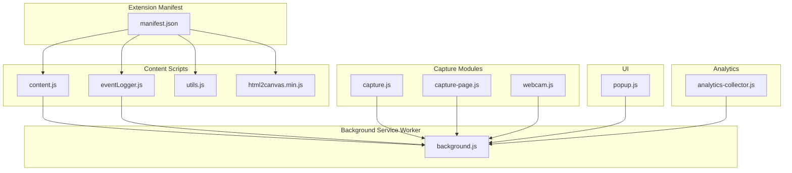
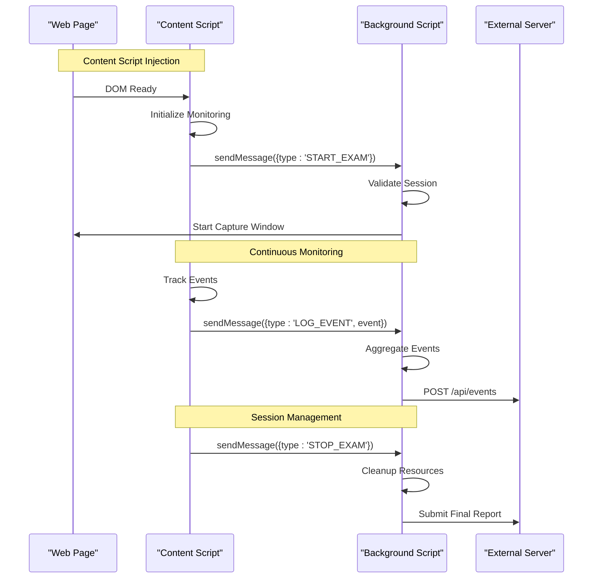
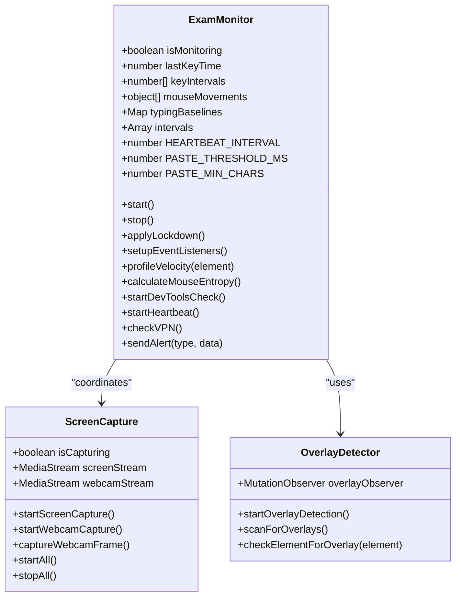
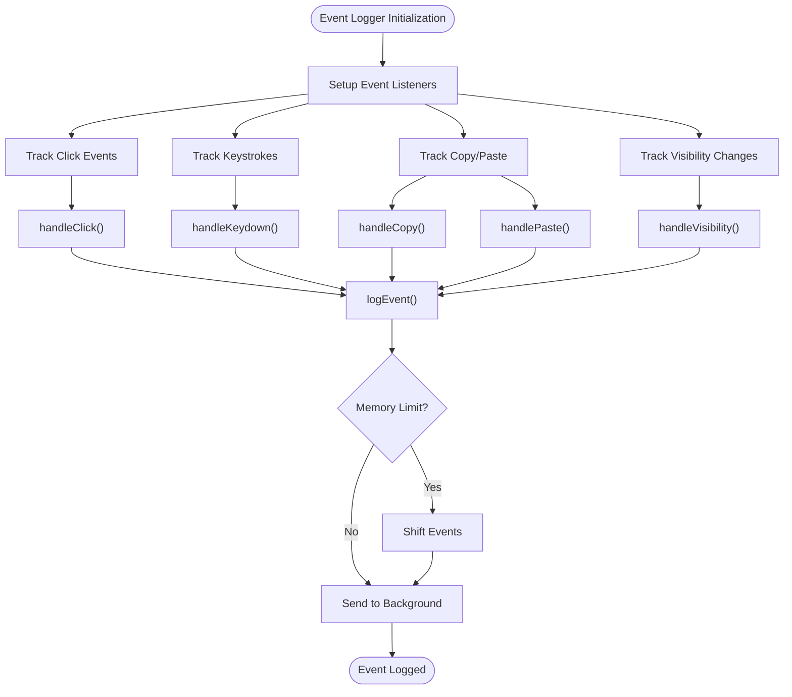
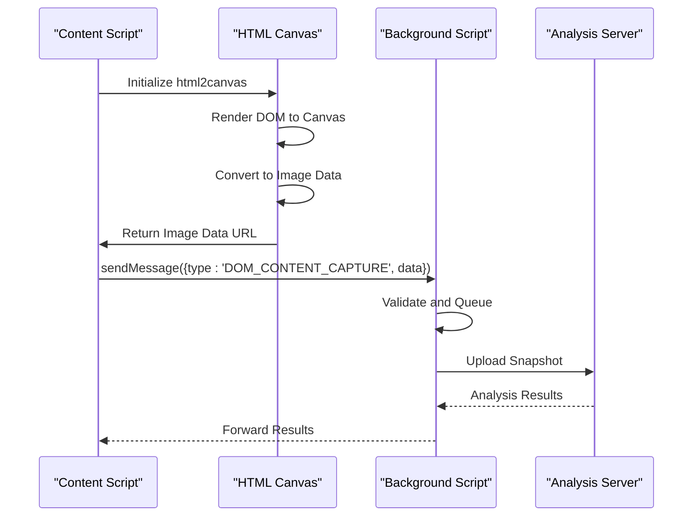
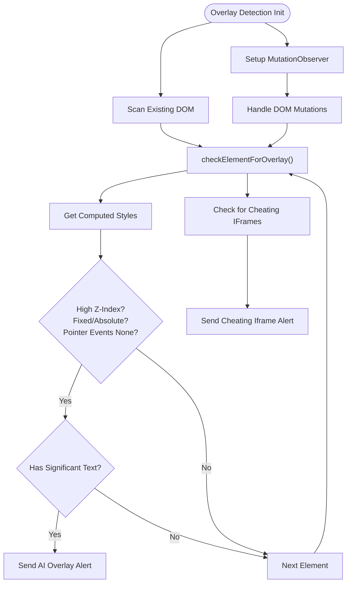
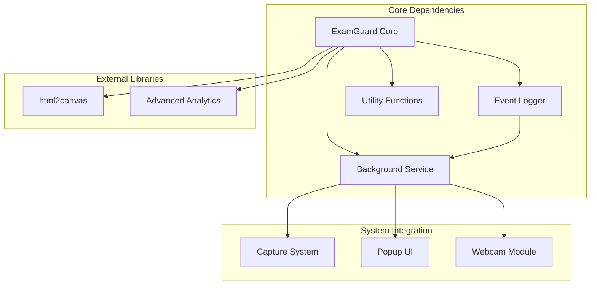

# Content Script Integration

<cite>
**Referenced Files in This Document**
- [content.js](file://extension/content.js)
- [eventLogger.js](file://extension/eventLogger.js)
- [background.js](file://extension/background.js)
- [utils.js](file://extension/utils.js)
- [capture.js](file://extension/capture.js)
- [capture-page.js](file://extension/capture-page.js)
- [webcam.js](file://extension/webcam.js)
- [manifest.json](file://extension/manifest.json)
- [popup.js](file://extension/popup/popup.js)
- [analytics-collector.js](file://extension/analytics-collector.js)
- [html2canvas.min.js](file://extension/html2canvas.min.js)
</cite>

## Table of Contents
1. [Introduction](#introduction)
2. [Project Structure](#project-structure)
3. [Core Components](#core-components)
4. [Architecture Overview](#architecture-overview)
5. [Detailed Component Analysis](#detailed-component-analysis)
6. [Dependency Analysis](#dependency-analysis)
7. [Performance Considerations](#performance-considerations)
8. [Troubleshooting Guide](#troubleshooting-guide)
9. [Conclusion](#conclusion)

## Introduction
This document provides comprehensive technical documentation for the content script integration and DOM manipulation capabilities within the ExamGuard Pro extension. It explains how content scripts inject into web pages, access page context, monitor user interactions, and communicate with the background script. The documentation covers the event logging system for keyboard events, mouse movements, copy/paste detection, and form submissions. It details HTML canvas integration for screenshot capture using html2canvas, DOM traversal techniques, page state monitoring, utility functions for data extraction, event filtering, and performance optimization. Security boundaries, cross-origin restrictions, and communication patterns are addressed along with examples of custom event handlers and integration with external libraries.

## Project Structure
The extension follows a modular architecture with distinct roles for content scripts, background service workers, and auxiliary modules:



**Diagram sources**
- [manifest.json:29-44](file://extension/manifest.json#L29-L44)
- [content.js:365-381](file://extension/content.js#L365-L381)
- [eventLogger.js:101-111](file://extension/eventLogger.js#L101-L111)
- [background.js:52-166](file://extension/background.js#L52-L166)

**Section sources**
- [manifest.json:1-73](file://extension/manifest.json#L1-L73)

## Core Components
The content script ecosystem consists of several specialized modules:

### ExamGuard Content Script
The primary content script (`content.js`) implements advanced monitoring capabilities including keystroke dynamics, mouse movement analysis, clipboard detection, overlay scanning, and behavioral alerts.

### Event Logger Module
The event logger (`eventLogger.js`) provides comprehensive event tracking for clicks, typing, copy/paste operations, and visibility changes with debouncing and memory management.

### Background Communication Hub
The background script (`background.js`) serves as the central coordinator for session management, event aggregation, and communication with external services.

### Capture and Analytics Modules
Additional modules handle screen capture, webcam streaming, and advanced analytics collection with privacy-preserving data processing.

**Section sources**
- [content.js:34-357](file://extension/content.js#L34-L357)
- [eventLogger.js:2-96](file://extension/eventLogger.js#L2-L96)
- [background.js:21-50](file://extension/background.js#L21-L50)

## Architecture Overview
The extension employs a multi-layered architecture with clear separation of concerns:



**Diagram sources**
- [content.js:367-381](file://extension/content.js#L367-L381)
- [background.js:52-166](file://extension/background.js#L52-L166)
- [popup.js:343-389](file://extension/popup/popup.js#L343-L389)

## Detailed Component Analysis

### Content Script Core Monitoring
The content script implements a sophisticated monitoring system through the `ExamMonitor` class:



**Diagram sources**
- [content.js:34-357](file://extension/content.js#L34-L357)
- [content.js:359-362](file://extension/content.js#L359-L362)
- [content.js:386-472](file://extension/content.js#L386-L472)

#### Event Detection Capabilities
The monitoring system implements multiple detection mechanisms:

**Keyboard Event Analysis**
- Inter-key interval tracking for keystroke dynamics
- Velocity profiling for detecting rapid text injection
- Keyboard paste detection via Ctrl+V/Cmd+V combinations
- Clipboard paste detection via inputType monitoring

**Mouse Movement Intelligence**
- Position tracking with temporal resolution
- Entropy calculation for erratic movement patterns
- Movement history management with sliding windows

**Security Boundary Enforcement**
- Right-click blocking with alerts
- Drag-and-drop prevention
- Input field hardening against browser assistance features

**Section sources**
- [content.js:169-277](file://extension/content.js#L169-L277)
- [content.js:126-167](file://extension/content.js#L126-L167)

### Event Logging System
The event logger provides comprehensive interaction tracking:



**Diagram sources**
- [eventLogger.js:10-96](file://extension/eventLogger.js#L10-L96)

#### Event Types and Processing
The system tracks multiple event categories with specific processing logic:

**Click Events**
- Captures target element and coordinates
- Provides spatial context for interaction analysis

**Keystroke Events**
- Implements debouncing to prevent event flooding
- Normalizes key identifiers for privacy
- Tracks typing patterns and cadence

**Clipboard Operations**
- Extracts selected text for copy operations
- Processes pasted content for similarity analysis
- Sends clipboard data to background for external processing

**Section sources**
- [eventLogger.js:41-76](file://extension/eventLogger.js#L41-L76)

### HTML Canvas Integration
The extension integrates html2canvas for screenshot capture and DOM content analysis:



**Diagram sources**
- [html2canvas.min.js:1-22](file://extension/html2canvas.min.js#L1-L22)
- [background.js:108-115](file://extension/background.js#L108-L115)

#### Canvas Capture Implementation
The capture process involves:
- DOM rendering to canvas with html2canvas
- Image compression and format conversion
- Binary data transmission via extension messaging
- Server-side analysis and response handling

**Section sources**
- [background.js:108-115](file://extension/background.js#L108-L115)

### Overlay and AI Detection
The system includes sophisticated detection mechanisms for AI assistance overlays:



**Diagram sources**
- [content.js:388-472](file://extension/content.js#L388-L472)

#### Detection Criteria
The overlay detection system identifies suspicious patterns:
- Elements with z-index > 9000
- Fixed or absolute positioning
- Pointer-events set to none
- Presence of substantial text content
- Specific iframe patterns for cheating tools

**Section sources**
- [content.js:419-472](file://extension/content.js#L419-L472)

### Communication Patterns
The extension uses structured messaging between components:

```mermaid
graph LR
subgraph "Content Scripts"
CS1["content.js"]
CS2["eventLogger.js"]
end
subgraph "Background"
BG["background.js"]
end
subgraph "Capture Modules"
CAP["capture.js"]
CAM["webcam.js"]
end
subgraph "UI"
POP["popup.js"]
end
CS1 < --> BG
CS2 < --> BG
CAP < --> BG
CAM < --> BG
POP < --> BG
BG --> |"sendMessage()"| CS1
BG --> |"sendMessage()"| CS2
BG --> |"sendMessage()"| CAP
BG --> |"sendMessage()"| CAM
BG --> |"sendMessage()"| POP
```

**Diagram sources**
- [content.js:367-381](file://extension/content.js#L367-L381)
- [eventLogger.js:101-111](file://extension/eventLogger.js#L101-L111)
- [background.js:52-166](file://extension/background.js#L52-L166)

#### Message Types and Handlers
The background script processes various message types:
- Session control messages (START_EXAM, STOP_EXAM)
- Event logging and alert forwarding
- Media capture coordination
- Status queries and updates

**Section sources**
- [background.js:52-166](file://extension/background.js#L52-L166)

## Dependency Analysis
The extension demonstrates clear separation of concerns with well-defined dependencies:



**Diagram sources**
- [manifest.json:29-44](file://extension/manifest.json#L29-L44)
- [content.js:365-381](file://extension/content.js#L365-L381)

### Security Boundaries and Cross-Origin Restrictions
The extension operates within strict security boundaries:

**Content Script Limitations**
- Cannot access cross-origin resources directly
- Limited DOM access to page context
- Must use extension messaging for cross-origin communication
- Subject to CSP restrictions

**Communication Security**
- All cross-origin requests routed through background script
- Message passing with explicit type validation
- Error handling for invalid contexts
- Automatic cleanup on extension reload

**Section sources**
- [content.js:469-472](file://extension/content.js#L469-L472)
- [content.js:5-26](file://extension/content.js#L5-L26)

## Performance Considerations
The extension implements several optimization strategies:

### Memory Management
- Event buffers with automatic trimming
- Sliding windows for mouse movement tracking
- Cleanup of intervals and observers on shutdown
- Efficient data structures for keystroke analysis

### Network Optimization
- Batched event sending with configurable intervals
- Conditional sending based on activity thresholds
- Retry logic with exponential backoff
- Compression of image data before transmission

### Resource Management
- Proper cleanup of media streams and canvases
- Interval management with centralized control
- Mutation observer cleanup on shutdown
- Memory-efficient event data structures

**Section sources**
- [eventLogger.js:88-95](file://extension/eventLogger.js#L88-L95)
- [content.js:345-356](file://extension/content.js#L345-L356)

## Troubleshooting Guide

### Common Issues and Solutions

**Content Script Not Injecting**
- Verify manifest permissions and content script configuration
- Check for CSP violations in browser console
- Ensure proper run_at timing (document_start)

**Event Detection Not Working**
- Confirm event listener registration
- Check for conflicting page JavaScript
- Verify event bubbling and capturing modes

**Media Access Issues**
- Validate getUserMedia permissions
- Check for HTTPS requirements
- Ensure proper stream cleanup

**Background Communication Failures**
- Monitor chrome.runtime.lastError
- Implement retry logic for transient failures
- Verify message handler registration

**Section sources**
- [content.js:5-26](file://extension/content.js#L5-L26)
- [webcam.js:24-27](file://extension/webcam.js#L24-L27)

### Debugging Tools
The extension provides built-in debugging capabilities:
- Console logging for major operations
- Error handling with graceful degradation
- Status indicators for component health
- Memory usage monitoring

**Section sources**
- [content.js:28-31](file://extension/content.js#L28-L31)
- [popup.js:87-115](file://extension/popup/popup.js#L87-L115)

## Conclusion
The ExamGuard Pro extension demonstrates sophisticated content script integration with comprehensive DOM manipulation capabilities. The modular architecture ensures maintainability while the robust monitoring system provides comprehensive behavioral analysis. Key strengths include advanced event detection, privacy-preserving data handling, efficient resource management, and secure communication patterns. The extension successfully balances functionality with security constraints while maintaining performance across diverse web environments.