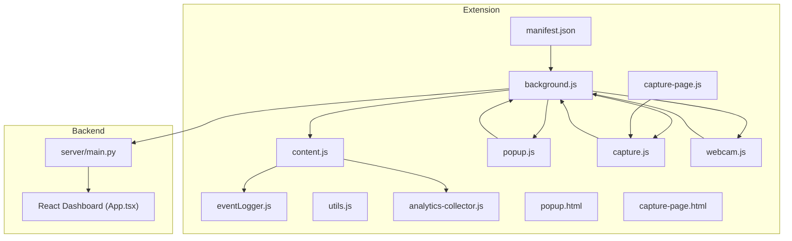
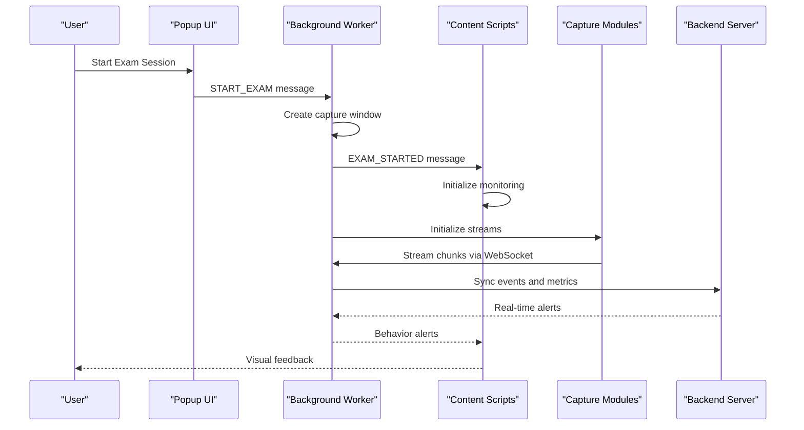
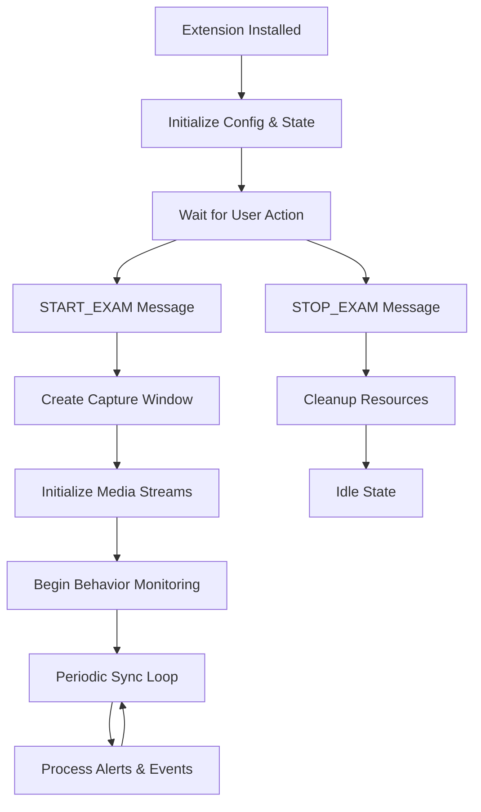
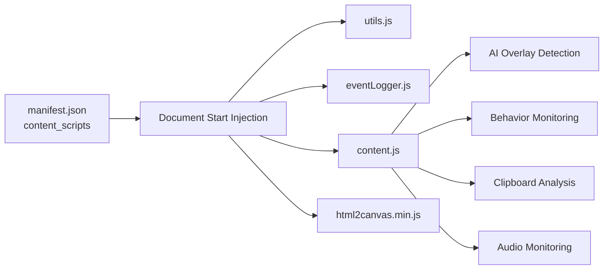
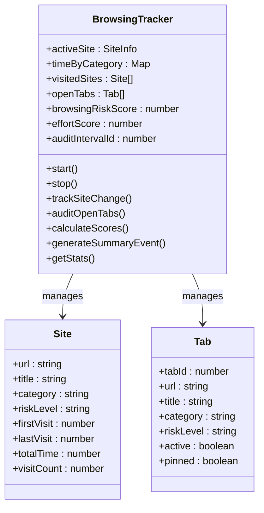
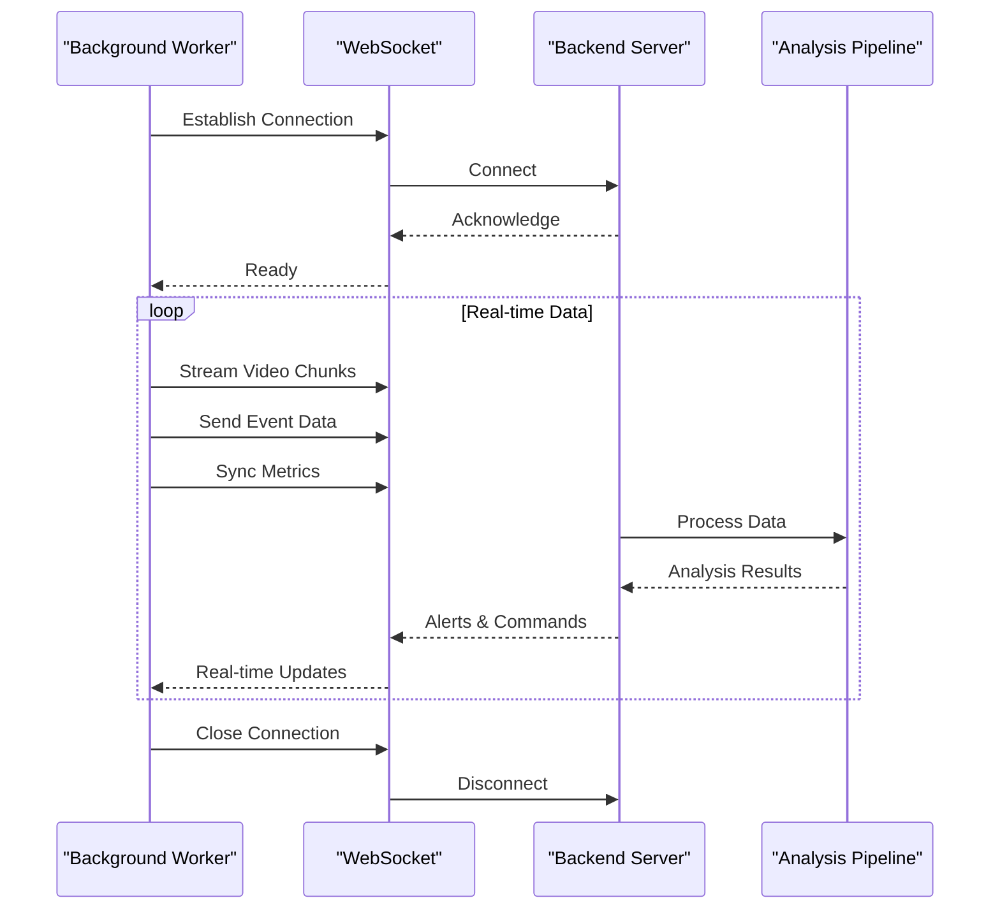
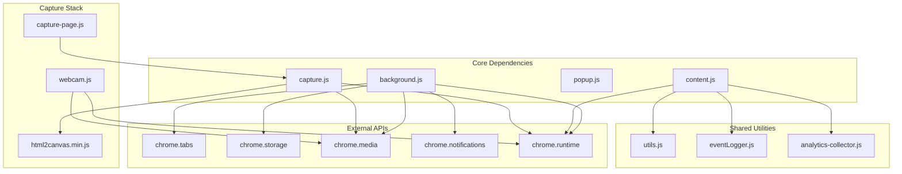
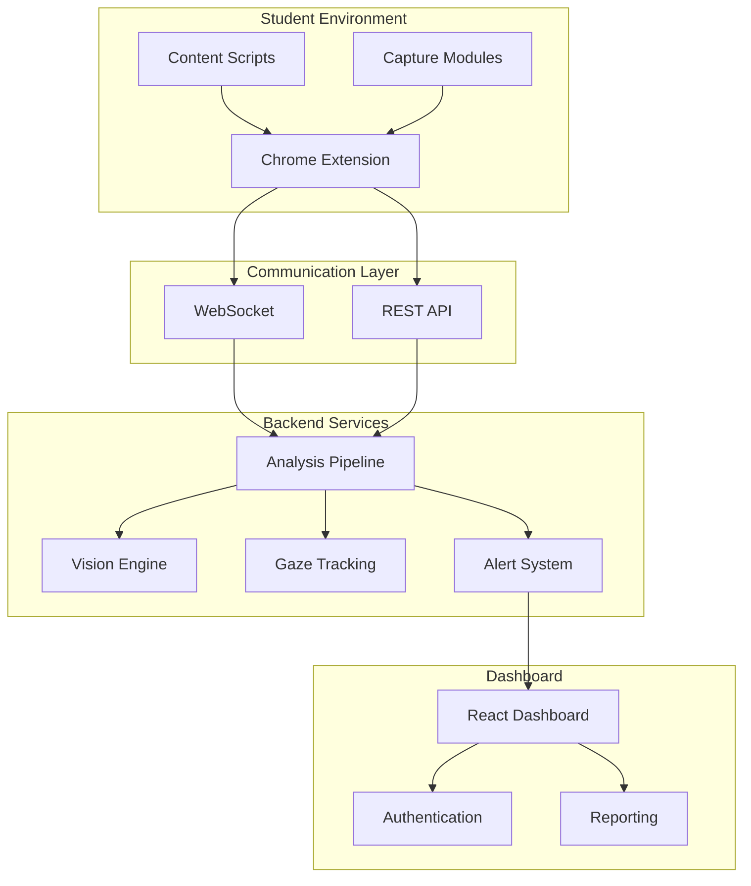

# Extension Architecture & Manifest

<cite>
**Referenced Files in This Document**
- [manifest.json](file://extension/manifest.json)
- [background.js](file://extension/background.js)
- [content.js](file://extension/content.js)
- [popup.js](file://extension/popup/popup.js)
- [capture.js](file://extension/capture.js)
- [capture-page.js](file://extension/capture-page.js)
- [webcam.js](file://extension/webcam.js)
- [utils.js](file://extension/utils.js)
- [eventLogger.js](file://extension/eventLogger.js)
- [analytics-collector.js](file://extension/analytics-collector.js)
- [popup.html](file://extension/popup/popup.html)
- [capture-page.html](file://extension/capture-page.html)
- [html2canvas.min.js](file://extension/html2canvas.min.js)
- [main.py](file://server/main.py)
- [App.tsx](file://examguard-pro/src/App.tsx)
</cite>

## Table of Contents
1. [Introduction](#introduction)
2. [Project Structure](#project-structure)
3. [Core Components](#core-components)
4. [Architecture Overview](#architecture-overview)
5. [Detailed Component Analysis](#detailed-component-analysis)
6. [Dependency Analysis](#dependency-analysis)
7. [Performance Considerations](#performance-considerations)
8. [Security Model & Permissions](#security-model--permissions)
9. [Manifest Configuration Best Practices](#manifest-configuration-best-practices)
10. [Browser Compatibility](#browser-compatibility)
11. [Integration with ExamGuard Pro Ecosystem](#integration-with-examguard-pro-ecosystem)
12. [Troubleshooting Guide](#troubleshooting-guide)
13. [Conclusion](#conclusion)

## Introduction
This document provides comprehensive technical documentation for the Chrome extension architecture and manifest configuration that powers ExamGuard Pro's secure exam proctoring solution. It covers the Manifest V3 structure, permissions model, background service worker lifecycle, content script injection, security considerations, and integration with the broader backend ecosystem including the React dashboard and real-time monitoring infrastructure.

## Project Structure
The extension is organized around a modular architecture with distinct roles:
- Manifest defines permissions, background service worker, content scripts, and web-accessible resources
- Background service worker coordinates session lifecycle, WebSocket connections, and periodic synchronization
- Content scripts monitor user behavior, inject overlays, and capture DOM events
- Popup UI provides session control and real-time status
- Capture modules manage screen/webcam streams and WebRTC signaling
- Analytics collector handles client-side behavioral and biometric data collection

**Diagram sources**
- [manifest.json:1-73](file://extension/manifest.json#L1-L73)
- [background.js:1-100](file://extension/background.js#L1-L100)
- [content.js:1-100](file://extension/content.js#L1-L100)
- [popup.js:1-100](file://extension/popup/popup.js#L1-L100)
- [capture.js:1-100](file://extension/capture.js#L1-L100)
- [capture-page.js:1-100](file://extension/capture-page.js#L1-L100)
- [webcam.js:1-100](file://extension/webcam.js#L1-L100)
- [eventLogger.js:1-100](file://extension/eventLogger.js#L1-L100)
- [analytics-collector.js:1-100](file://extension/analytics-collector.js#L1-L100)
- [popup.html:1-192](file://extension/popup/popup.html#L1-L192)
- [capture-page.html:1-53](file://extension/capture-page.html#L1-L53)
- [main.py:1-200](file://server/main.py#L1-L200)
- [App.tsx:1-92](file://examguard-pro/src/App.tsx#L1-L92)

**Section sources**
- [manifest.json:1-73](file://extension/manifest.json#L1-L73)
- [background.js:1-200](file://extension/background.js#L1-L200)
- [content.js:1-200](file://extension/content.js#L1-L200)
- [popup.js:1-200](file://extension/popup/popup.js#L1-L200)
- [capture.js:1-200](file://extension/capture.js#L1-L200)
- [capture-page.js:1-200](file://extension/capture-page.js#L1-L200)
- [webcam.js:1-200](file://extension/webcam.js#L1-L200)
- [eventLogger.js:1-200](file://extension/eventLogger.js#L1-L200)
- [analytics-collector.js:1-200](file://extension/analytics-collector.js#L1-L200)
- [popup.html:1-192](file://extension/popup/popup.html#L1-L192)
- [capture-page.html:1-53](file://extension/capture-page.html#L1-L53)
- [main.py:1-200](file://server/main.py#L1-L200)
- [App.tsx:1-92](file://examguard-pro/src/App.tsx#L1-L92)

## Core Components
This section examines the primary components and their responsibilities within the extension architecture.

### Manifest V3 Configuration
The manifest defines:
- Permissions: tabs, activeTab, storage, unlimitedStorage, notifications, clipboardRead, alarms, scripting, windows, system.display
- Host permissions: broad access to localhost, cloud deployment, and all URLs
- Background service worker: module type service worker
- Content scripts: document_start injection across http/https with multiple JS modules
- Action: popup UI with icons and title
- Web accessible resources: webcam, capture utilities, and capture page assets

Key security implications:
- Broad host permissions enable cross-origin communication with backend services
- Clipboard access enables text similarity analysis
- System display permission supports screen capture capabilities

**Section sources**
- [manifest.json:1-73](file://extension/manifest.json#L1-L73)

### Background Service Worker
The background service worker orchestrates:
- Session lifecycle management (start/stop)
- Periodic synchronization with backend
- WebSocket communication for real-time alerts
- Media stream coordination and WebRTC signaling
- Browsing behavior tracking and risk scoring
- Clipboard text analysis and DOM snapshots

Implementation highlights:
- Centralized message routing for all extension components
- Persistent timers for sync and analysis intervals
- Robust error handling and retry logic for backend communication
- Integration with chrome.tabs API for browsing monitoring

**Section sources**
- [background.js:1-200](file://extension/background.js#L1-L200)
- [background.js:658-707](file://extension/background.js#L658-L707)
- [background.js:749-847](file://extension/background.js#L749-L847)

### Content Scripts
Content scripts provide:
- Advanced behavior monitoring (keystroke dynamics, mouse movement, clipboard events)
- AI overlay detection and cheating tool identification
- Audio anomaly detection via microphone access
- Event logging and real-time alerting
- DOM interaction lockdown and input hardening

Security measures:
- Context invalidation handling for extension reloads
- Feature lockdown to prevent cheating attempts
- Privacy-preserving data collection with minimal footprint

**Section sources**
- [content.js:1-200](file://extension/content.js#L1-L200)
- [content.js:365-381](file://extension/content.js#L365-L381)
- [content.js:419-473](file://extension/content.js#L419-L473)

### Popup Interface
The popup provides:
- Session control (start/stop)
- Real-time statistics display (risk, effort, tab counts)
- Backend connectivity status
- Permission indicators
- Toast notifications for user feedback

User experience features:
- Animated stat updates
- Connection health checks
- Permission verification
- Responsive design with category-based risk visualization

**Section sources**
- [popup.js:1-200](file://extension/popup/popup.js#L1-L200)
- [popup.js:341-424](file://extension/popup/popup.js#L341-L424)
- [popup.html:1-192](file://extension/popup/popup.html#L1-L192)

### Capture Modules
The capture system manages:
- Screen capture via getDisplayMedia with adaptive quality
- Webcam capture with configurable resolution and frame rate
- MediaRecorder-based live streaming for WebRTC
- WebRTC peer connection establishment and signaling
- Frame extraction and transmission to background

Technical capabilities:
- Dual-stream WebRTC (camera + screen)
- Binary chunk transmission for real-time streaming
- Error recovery and stream end handling
- Privacy-conscious frame capture with compression

**Section sources**
- [capture.js:1-200](file://extension/capture.js#L1-L200)
- [capture.js:280-332](file://extension/capture.js#L280-L332)
- [capture-page.js:1-200](file://extension/capture-page.js#L1-L200)
- [webcam.js:1-200](file://extension/webcam.js#L1-L200)

### Analytics Collection
Client-side analytics framework:
- Behavioral biometrics (keystroke timing, mouse dynamics)
- Browser forensics (VM detection, WebGL fingerprinting)
- Audio analysis for anomaly detection
- Privacy-focused data processing with local-only analysis

Data handling:
- Batched collection with configurable intervals
- Local processing with selective server transmission
- Comprehensive browser environment analysis

**Section sources**
- [analytics-collector.js:1-200](file://extension/analytics-collector.js#L1-L200)
- [analytics-collector.js:488-511](file://extension/analytics-collector.js#L488-L511)

## Architecture Overview
The extension follows a distributed architecture with clear separation of concerns:

**Diagram sources**
- [popup.js:341-389](file://extension/popup/popup.js#L341-L389)
- [background.js:680-747](file://extension/background.js#L680-L747)
- [content.js:365-381](file://extension/content.js#L365-L381)
- [capture.js:205-246](file://extension/capture.js#L205-L246)
- [main.py:109-165](file://server/main.py#L109-L165)

The architecture emphasizes:
- Asynchronous communication via Chrome messaging
- Real-time data streaming through WebRTC/WebSocket
- Decentralized content script monitoring
- Centralized background orchestration
- Privacy-preserving client-side analytics

## Detailed Component Analysis

### Service Worker Lifecycle Management
The background service worker implements a robust lifecycle:

**Diagram sources**
- [background.js:658-678](file://extension/background.js#L658-L678)
- [background.js:680-747](file://extension/background.js#L680-L747)
- [background.js:749-847](file://extension/background.js#L749-L847)

Key lifecycle features:
- Automatic session restoration on extension restart
- Graceful cleanup of media streams and timers
- Retry logic for backend communication failures
- Memory management with event buffer limits

**Section sources**
- [background.js:658-847](file://extension/background.js#L658-L847)

### Content Script Injection Strategy
Content scripts are injected with strategic placement:

**Diagram sources**
- [manifest.json:29-44](file://extension/manifest.json#L29-L44)
- [content.js:1-100](file://extension/content.js#L1-L100)

Injection characteristics:
- All frames enabled for comprehensive coverage
- Early injection (document_start) for maximum effectiveness
- Modular loading order ensures dependencies are available
- Cross-origin capability through web_accessible_resources

**Section sources**
- [manifest.json:29-44](file://extension/manifest.json#L29-L44)
- [content.js:1-50](file://extension/content.js#L1-L50)

### Browsing Behavior Tracking System
The browsing tracker monitors user activity across tabs and websites:

**Diagram sources**
- [background.js:168-561](file://extension/background.js#L168-L561)

Tracking capabilities:
- Real-time tab switching detection
- Website categorization with risk assessment
- Time-based scoring for effort and risk
- Periodic audit of all open tabs
- Privacy-preserving URL sanitization

**Section sources**
- [background.js:168-561](file://extension/background.js#L168-L561)

### Real-Time Communication Architecture
The extension maintains bidirectional communication with the backend:

**Diagram sources**
- [background.js:128-151](file://extension/background.js#L128-L151)
- [main.py:109-165](file://server/main.py#L109-L165)

Communication features:
- Binary WebSocket streaming for media data
- JSON-based event synchronization
- Real-time alert distribution
- Heartbeat mechanisms for connection health
- Graceful connection recovery

**Section sources**
- [background.js:128-151](file://extension/background.js#L128-L151)
- [main.py:109-165](file://server/main.py#L109-L165)

## Dependency Analysis
The extension exhibits clear module boundaries and controlled dependencies:

**Diagram sources**
- [background.js:1-100](file://extension/background.js#L1-L100)
- [content.js:1-100](file://extension/content.js#L1-L100)
- [popup.js:1-100](file://extension/popup/popup.js#L1-L100)
- [capture.js:1-100](file://extension/capture.js#L1-L100)
- [capture-page.js:1-100](file://extension/capture-page.js#L1-L100)
- [webcam.js:1-100](file://extension/webcam.js#L1-L100)
- [utils.js:1-35](file://extension/utils.js#L1-L35)
- [eventLogger.js:1-100](file://extension/eventLogger.js#L1-L100)
- [analytics-collector.js:1-100](file://extension/analytics-collector.js#L1-L100)

Dependency management strengths:
- Loose coupling through Chrome messaging
- Clear separation of concerns across modules
- Minimal shared state between components
- Extensive use of browser APIs reduces external dependencies

**Section sources**
- [background.js:1-200](file://extension/background.js#L1-L200)
- [content.js:1-200](file://extension/content.js#L1-L200)
- [popup.js:1-200](file://extension/popup/popup.js#L1-L200)
- [capture.js:1-200](file://extension/capture.js#L1-L200)
- [capture-page.js:1-200](file://extension/capture-page.js#L1-L200)
- [webcam.js:1-200](file://extension/webcam.js#L1-L200)
- [utils.js:1-35](file://extension/utils.js#L1-L35)
- [eventLogger.js:1-200](file://extension/eventLogger.js#L1-L200)
- [analytics-collector.js:1-200](file://extension/analytics-collector.js#L1-L200)

## Performance Considerations
The extension implements several performance optimization strategies:

### Resource Management
- Media stream cleanup on tab/window close
- Adaptive quality settings for screen capture
- Compressed frame encoding for webcam streams
- Buffered event collection with automatic pruning

### Network Efficiency
- Batched synchronization with configurable intervals
- Binary WebSocket streaming for media data
- Selective data transmission based on change detection
- Connection pooling and reuse strategies

### Memory Optimization
- Event buffer limits (100 events maximum)
- Periodic garbage collection for large datasets
- Lazy initialization of expensive components
- Efficient data structures for tracking metrics

### Scalability Features
- Modular architecture allows selective feature loading
- Asynchronous processing prevents UI blocking
- Configurable intervals for different environments
- Graceful degradation when resources are constrained

## Security Model & Permissions
The extension employs a comprehensive security model:

### Permission Requirements
- **tabs**: Tab switching detection and browsing monitoring
- **activeTab**: Current tab context for behavior analysis
- **storage**: Session state persistence and configuration
- **unlimitedStorage**: Persistent event logging and analytics
- **notifications**: Proctoring status and alert notifications
- **clipboardRead**: Text similarity analysis and plagiarism detection
- **alarms**: Periodic maintenance and synchronization
- **scripting**: Dynamic content script injection
- **windows**: Capture window management
- **system.display**: Screen capture and display monitoring

### Security Measures
- Content script isolation prevents cross-scripting
- Message passing via Chrome runtime for controlled communication
- Privacy-preserving data collection with local processing
- Permission-based feature activation
- Context invalidation handling for extension reloads

### Data Protection
- Client-side analytics with selective server transmission
- Encrypted WebSocket communication
- Minimal data retention policies
- User consent for sensitive operations

**Section sources**
- [manifest.json:6-17](file://extension/manifest.json#L6-L17)
- [content.js:1-50](file://extension/content.js#L1-L50)
- [background.js:1-50](file://extension/background.js#L1-L50)

## Manifest Configuration Best Practices
Recommended manifest configuration patterns:

### Permissions Minimization
- Request only necessary permissions for core functionality
- Use dynamic permission requests for optional features
- Implement permission checking in UI components
- Provide clear user rationale for each permission

### Content Script Management
- Use document_start for maximum effectiveness
- Enable all_frames for comprehensive coverage
- Order script loading to ensure dependencies
- Implement selective injection based on URL patterns

### Background Service Worker Design
- Implement proper lifecycle management
- Use message passing for component communication
- Handle extension updates gracefully
- Implement robust error recovery mechanisms

### Security Hardening
- Validate all incoming messages and data
- Sanitize user inputs and external data
- Implement CSP policies for content security
- Regular security audits and updates

**Section sources**
- [manifest.json:1-73](file://extension/manifest.json#L1-L73)
- [background.js:1-100](file://extension/background.js#L1-L100)

## Browser Compatibility
The extension targets modern browsers with Manifest V3 support:

### Supported Browsers
- Chrome 114+
- Edge 114+
- Firefox 128+ (with MV2 limitations)
- Opera 100+

### Compatibility Features
- Manifest V3 compliance with service workers
- Modern JavaScript ES2020+ features
- WebRTC API for media streaming
- WebSocket for real-time communication
- Clipboard API for text analysis

### Progressive Enhancement
- Graceful degradation for missing APIs
- Feature detection for optional capabilities
- Polyfills for older browser support
- User-friendly error messaging

## Integration with ExamGuard Pro Ecosystem
The extension integrates seamlessly with the broader ExamGuard Pro system:

### Backend Integration
- Real-time WebSocket communication for alerts and commands
- RESTful API integration for session management
- Media streaming for live proctoring
- Analytics data synchronization

### Dashboard Integration
- React-based dashboard for monitoring and management
- Real-time alert distribution to authorized users
- Session reporting and analytics
- Student and instructor interfaces

### Data Flow Architecture

**Diagram sources**
- [background.js:128-151](file://extension/background.js#L128-L151)
- [main.py:109-165](file://server/main.py#L109-L165)
- [App.tsx:1-92](file://examguard-pro/src/App.tsx#L1-L92)

**Section sources**
- [background.js:128-151](file://extension/background.js#L128-L151)
- [main.py:109-165](file://server/main.py#L109-L165)
- [App.tsx:1-92](file://examguard-pro/src/App.tsx#L1-L92)

## Troubleshooting Guide
Common issues and solutions:

### Extension Installation Issues
- Verify Manifest V3 compatibility
- Check permission prompts acceptance
- Review console errors in extension pages
- Validate web accessible resource declarations

### Media Access Problems
- Ensure HTTPS context for media APIs
- Verify camera/microphone permissions
- Check browser-specific media restrictions
- Test with different browser versions

### WebSocket Connection Failures
- Verify backend server availability
- Check CORS configuration
- Review firewall and network restrictions
- Monitor WebSocket handshake errors

### Performance Issues
- Monitor memory usage in Task Manager
- Check for excessive event logging
- Validate capture stream quality settings
- Review background script performance

### Debugging Tools
- Chrome Extension Developer Tools
- Network panel for WebSocket monitoring
- Console for error messages
- Storage panel for session data

**Section sources**
- [background.js:1-100](file://extension/background.js#L1-L100)
- [popup.js:1-100](file://extension/popup/popup.js#L1-L100)

## Conclusion
The ExamGuard Pro Chrome extension demonstrates a sophisticated approach to secure exam proctoring through a well-architected Manifest V3 implementation. Its modular design, comprehensive security model, and seamless integration with the backend ecosystem provide a robust foundation for reliable online assessment monitoring. The extension's emphasis on privacy-preserving analytics, real-time communication, and user experience creates a comprehensive solution for maintaining academic integrity in digital assessment environments.

The architecture successfully balances functionality with security, performance with reliability, and user experience with institutional requirements. Future enhancements should focus on expanding cross-browser compatibility, optimizing resource usage, and strengthening privacy protections while maintaining the extension's core mission of supporting fair and secure examinations.