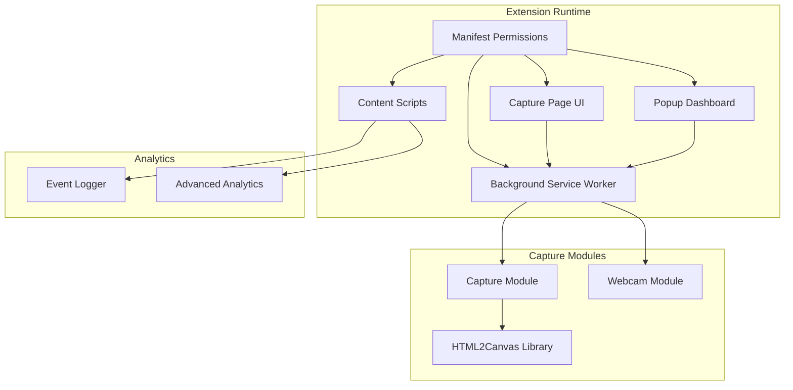
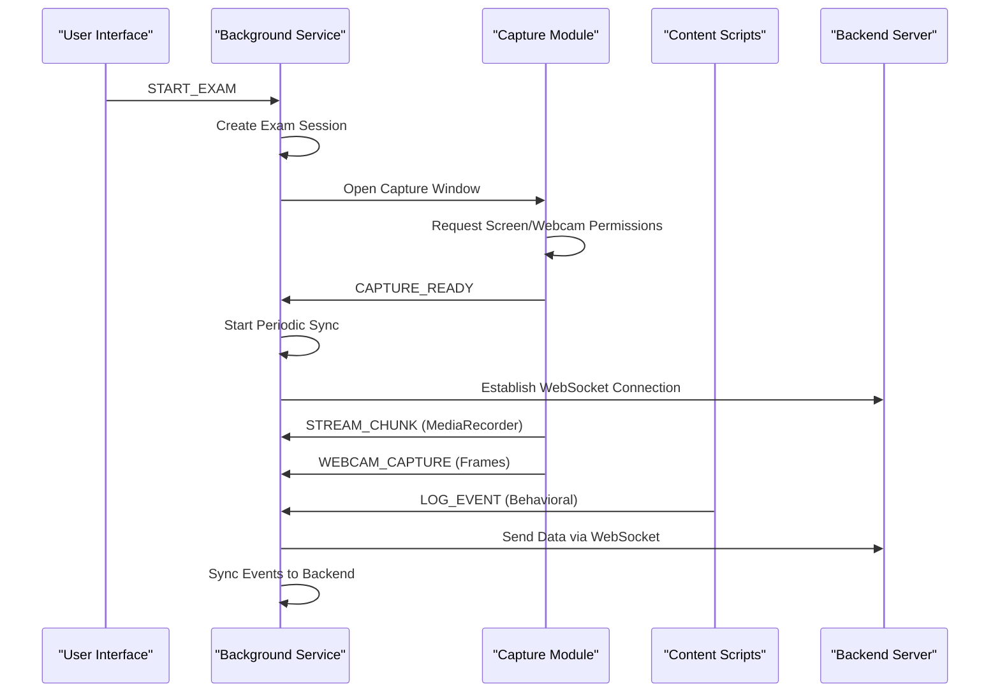
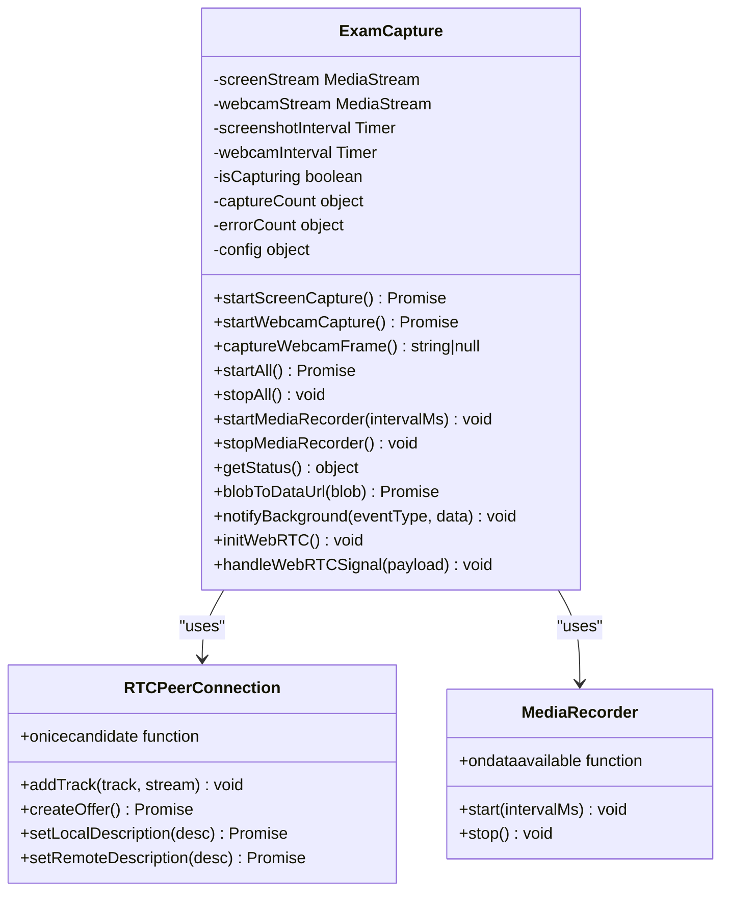
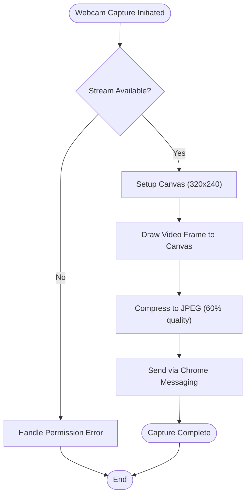
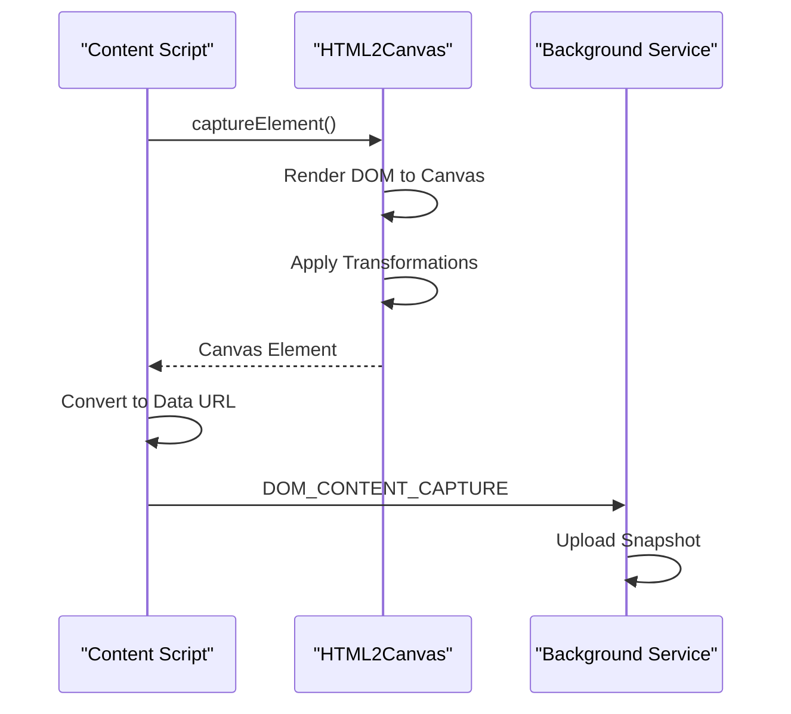
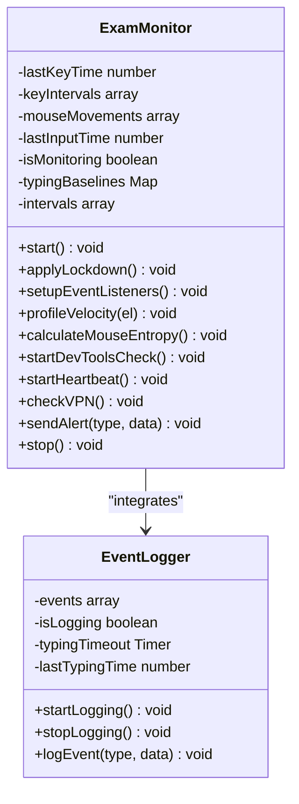
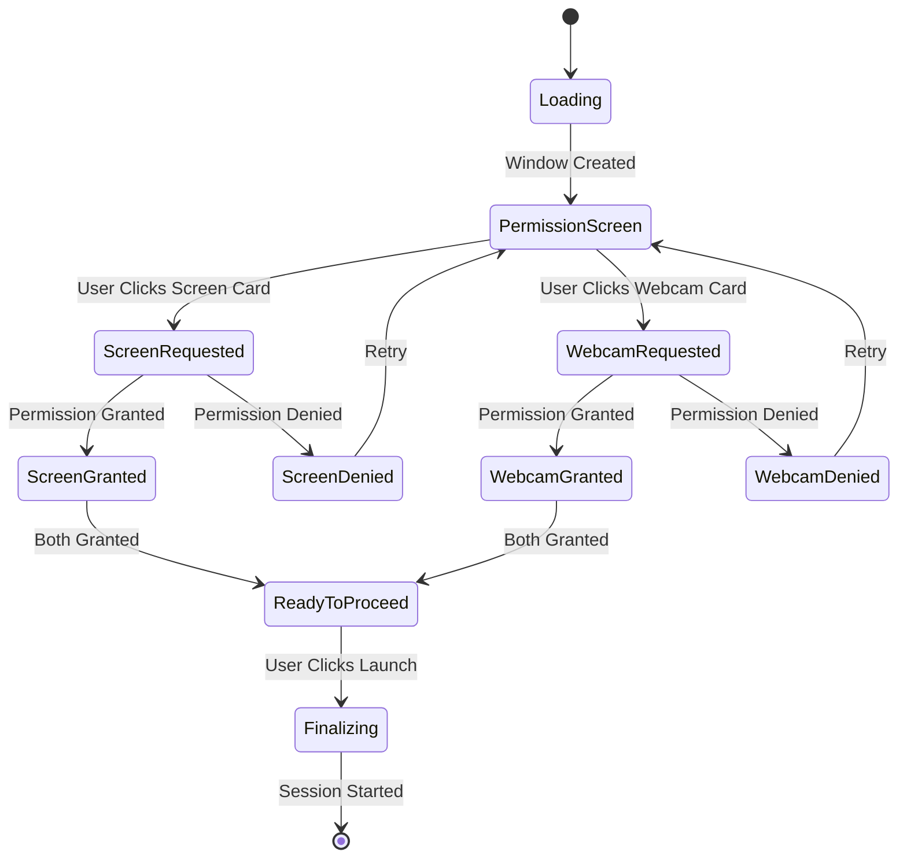
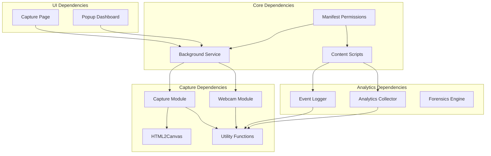

# Monitoring Capabilities

<cite>
**Referenced Files in This Document**
- [manifest.json](file://extension/manifest.json)
- [background.js](file://extension/background.js)
- [content.js](file://extension/content.js)
- [capture.js](file://extension/capture.js)
- [capture-page.js](file://extension/capture-page.js)
- [capture-page.html](file://extension/capture-page.html)
- [capture-page.css](file://extension/capture-page.css)
- [webcam.js](file://extension/webcam.js)
- [eventLogger.js](file://extension/eventLogger.js)
- [analytics-collector.js](file://extension/analytics-collector.js)
- [popup.js](file://extension/popup/popup.js)
- [utils.js](file://extension/utils.js)
- [html2canvas.min.js](file://extension/html2canvas.min.js)
</cite>

## Table of Contents
1. [Introduction](#introduction)
2. [Project Structure](#project-structure)
3. [Core Components](#core-components)
4. [Architecture Overview](#architecture-overview)
5. [Detailed Component Analysis](#detailed-component-analysis)
6. [Dependency Analysis](#dependency-analysis)
7. [Performance Considerations](#performance-considerations)
8. [Troubleshooting Guide](#troubleshooting-guide)
9. [Privacy Controls and Compliance](#privacy-controls-and-compliance)
10. [Conclusion](#conclusion)

## Introduction
This document provides comprehensive technical documentation for the extension's monitoring capabilities, focusing on screen capture, webcam functionality, and real-time data collection. It covers the implementation of html2canvas-based screen capture, image processing, and data compression techniques, along with webcam integration for video stream capture, face detection pre-processing, and privacy-preserving image handling. The document also details the capture page functionality for specialized monitoring scenarios, overlay rendering, and user interface elements. Technical specifications for image quality, frame rates, storage optimization, and bandwidth considerations are included, alongside privacy controls, user consent mechanisms, and data retention policies. Finally, troubleshooting guidance addresses camera access issues, permission problems, and performance optimization tips.

## Project Structure
The monitoring system spans multiple extension components:
- Manifest defines permissions and resource exposure
- Background service worker manages session lifecycle and WebSocket communication
- Content script handles behavioral monitoring and DOM interaction logging
- Capture modules implement screen and webcam capture with WebRTC signaling
- Capture page provides permission UI and session initiation
- Analytics collector performs client-side biometric and forensic analysis
- Popup provides real-time monitoring dashboard

**Diagram sources**
- [manifest.json:1-73](file://extension/manifest.json#L1-L73)
- [background.js:1-100](file://extension/background.js#L1-L100)
- [content.js:1-50](file://extension/content.js#L1-L50)
- [capture.js:1-50](file://extension/capture.js#L1-L50)
- [webcam.js:1-30](file://extension/webcam.js#L1-L30)

**Section sources**
- [manifest.json:1-73](file://extension/manifest.json#L1-L73)

## Core Components
The monitoring system comprises several interconnected components:

### Screen Capture Implementation
The primary screen capture functionality is implemented through the ExamCapture class, which provides:
- Screen sharing via MediaDevices.getDisplayMedia with cursor and display surface options
- Adaptive resolution configuration (max 854x480)
- Stream error handling and recovery mechanisms
- WebRTC signaling for peer-to-peer streaming
- MediaRecorder integration for live streaming with VP8 encoding

### Webcam Integration
Dual webcam capture approaches exist:
- Advanced ExamCapture webcam capture with canvas-based frame extraction and JPEG compression
- Simplified WebcamCapture module for periodic frame capture at configurable intervals
- Both implementations include error handling and stream lifecycle management

### Real-Time Data Collection
The system implements comprehensive real-time monitoring through:
- Behavioral monitoring (keystroke dynamics, mouse movements, copy/paste detection)
- Audio monitoring for anomaly detection
- Event logging with clipboard text analysis
- Browser forensics and anti-cheating measures

**Section sources**
- [capture.js:6-352](file://extension/capture.js#L6-L352)
- [webcam.js:1-90](file://extension/webcam.js#L1-L90)
- [content.js:34-357](file://extension/content.js#L34-L357)

## Architecture Overview
The monitoring architecture follows a multi-layered approach with clear separation of concerns:

**Diagram sources**
- [background.js:52-166](file://extension/background.js#L52-L166)
- [capture.js:175-203](file://extension/capture.js#L175-L203)
- [capture-page.js:76-102](file://extension/capture-page.js#L76-L102)

The architecture ensures:
- Decoupled capture and processing through message passing
- Robust error handling and recovery mechanisms
- Real-time data streaming via WebRTC/WebSocket
- Comprehensive behavioral monitoring integration

## Detailed Component Analysis

### Screen Capture Module (ExamCapture)
The ExamCapture class provides comprehensive screen and webcam capture functionality:

**Diagram sources**
- [capture.js:6-352](file://extension/capture.js#L6-L352)

Key features include:
- **Adaptive Quality Control**: Configurable resolution (854x480 for screens, 320x240 for webcam)
- **Error Recovery**: Automatic error counting and recovery mechanisms
- **WebRTC Integration**: Peer-to-peer streaming with STUN server connectivity
- **Live Streaming**: MediaRecorder with VP8 encoding and configurable bitrate (800 Kbps)

**Section sources**
- [capture.js:16-24](file://extension/capture.js#L16-L24)
- [capture.js:28-65](file://extension/capture.js#L28-L65)
- [capture.js:71-106](file://extension/capture.js#L71-L106)
- [capture.js:207-246](file://extension/capture.js#L207-L246)

### Webcam Capture Implementation
The webcam capture system offers two complementary approaches:

**Diagram sources**
- [capture.js:145-171](file://extension/capture.js#L145-L171)
- [webcam.js:30-57](file://extension/webcam.js#L30-L57)

Implementation details:
- **Canvas-Based Processing**: Uses HTML5 Canvas for frame extraction and manipulation
- **Compression Strategy**: JPEG compression at 60% quality for optimal balance between quality and bandwidth
- **Interval Management**: Configurable capture intervals (default 3 seconds)
- **Error Handling**: Comprehensive try-catch blocks and stream lifecycle management

**Section sources**
- [capture.js:145-171](file://extension/capture.js#L145-L171)
- [webcam.js:10-28](file://extension/webcam.js#L10-L28)
- [webcam.js:30-57](file://extension/webcam.js#L30-L57)

### Screen Capture with html2canvas
The system integrates html2canvas for DOM-based screen capture:

**Diagram sources**
- [content.js:388-473](file://extension/content.js#L388-L473)
- [eventLogger.js:78-95](file://extension/eventLogger.js#L78-L95)

The implementation includes:
- **Overlay Detection**: Scans DOM for suspicious transparent overlays
- **Iframe Monitoring**: Detects cheating tool iframes (localhost:5180, cluely)
- **Mutation Observers**: Watches for dynamic content injection
- **Privacy Protection**: Text sanitization and selective data extraction

**Section sources**
- [content.js:388-473](file://extension/content.js#L388-L473)
- [eventLogger.js:78-95](file://extension/eventLogger.js#L78-L95)

### Behavioral Monitoring System
The content script implements comprehensive behavioral monitoring:

**Diagram sources**
- [content.js:34-357](file://extension/content.js#L34-L357)
- [eventLogger.js:1-111](file://extension/eventLogger.js#L1-L111)

Key monitoring capabilities:
- **Keystroke Dynamics**: Inter-key intervals, dwell times, flight times
- **Mouse Behavior**: Velocity profiling, erratic movement detection
- **Copy/Paste Detection**: Keyboard shortcuts and programmatic injection
- **DevTools Detection**: Timing-based and resize-based detection
- **Input Idle Monitoring**: Activity-based session management

**Section sources**
- [content.js:34-357](file://extension/content.js#L34-L357)
- [eventLogger.js:1-111](file://extension/eventLogger.js#L1-L111)

### Advanced Analytics Collector
The analytics collector provides client-side processing capabilities:

```mermaid
flowchart TD
Start([Analytics Collector Start]) --> CheckEnabled{"Features Enabled?"}
CheckEnabled --> |Biometrics| StartBiometrics["Start Keystroke/Mouse Tracking"]
CheckEnabled --> |Forensics| CollectForensics["Collect Browser Forensics"]
CheckEnabled --> |Audio| StartAudio["Start Audio Monitoring"]
StartBiometrics --> BufferData["Buffer Events"]
CollectForensics --> BufferData
StartAudio --> BufferData
BufferData --> BatchSend["Send Batched Data"]
BatchSend --> CheckEnabled
```

**Diagram sources**
- [analytics-collector.js:63-111](file://extension/analytics-collector.js#L63-L111)
- [analytics-collector.js:488-511](file://extension/analytics-collector.js#L488-L511)

Features include:
- **Biometric Collection**: Keystroke dynamics, mouse tracking, scroll patterns
- **Browser Forensics**: WebGL fingerprints, canvas fingerprints, audio fingerprints
- **Audio Analysis**: Real-time RMS monitoring and anomaly detection
- **Privacy-Focused Design**: Client-side processing with minimal data transmission

**Section sources**
- [analytics-collector.js:13-53](file://extension/analytics-collector.js#L13-L53)
- [analytics-collector.js:256-310](file://extension/analytics-collector.js#L256-L310)
- [analytics-collector.js:433-482](file://extension/analytics-collector.js#L433-L482)

### Capture Page Interface
The capture page provides a user-friendly interface for permission management:

**Diagram sources**
- [capture-page.js:21-65](file://extension/capture-page.js#L21-L65)
- [capture-page.js:76-102](file://extension/capture-page.js#L76-L102)

The interface includes:
- **Visual Feedback**: Status indicators for permission states
- **Real-time Updates**: Dynamic button enabling based on permission status
- **Toast Notifications**: User feedback for success/error states
- **Animation Effects**: Smooth transitions and visual cues

**Section sources**
- [capture-page.html:1-53](file://extension/capture-page.html#L1-L53)
- [capture-page.css:1-202](file://extension/capture-page.css#L1-L202)
- [capture-page.js:14-169](file://extension/capture-page.js#L14-L169)

## Dependency Analysis
The monitoring system exhibits well-structured dependencies with clear separation of concerns:

**Diagram sources**
- [manifest.json:6-44](file://extension/manifest.json#L6-L44)
- [background.js:52-166](file://extension/background.js#L52-L166)
- [content.js:34-357](file://extension/content.js#L34-L357)

Key dependency characteristics:
- **Low Coupling**: Each module maintains independent functionality
- **Clear Interfaces**: Well-defined message passing between components
- **Resource Exposure**: Strategic web-accessible resources for capture modules
- **Permission Model**: Explicit permissions for sensitive APIs

**Section sources**
- [manifest.json:59-72](file://extension/manifest.json#L59-L72)
- [background.js:52-166](file://extension/background.js#L52-L166)

## Performance Considerations
The monitoring system implements several optimization strategies:

### Image Processing Optimizations
- **Resolution Control**: Adaptive resolution limiting (854x480 for screens, 320x240 for webcam)
- **Compression Strategy**: JPEG compression at 60% quality for optimal bandwidth efficiency
- **Canvas Optimization**: Efficient canvas drawing and memory management
- **Frame Rate Control**: Configurable capture intervals to balance quality and performance

### Network Optimization
- **WebRTC Streaming**: Peer-to-peer streaming reduces server bandwidth requirements
- **MediaRecorder**: Efficient VP8 encoding with configurable bitrate (800 Kbps)
- **Batch Processing**: Event batching reduces WebSocket overhead
- **Connection Management**: Persistent WebSocket connections with automatic reconnection

### Memory Management
- **Circular Buffers**: Event buffers with automatic trimming (max 100 events)
- **Stream Lifecycle**: Proper cleanup of media streams and timers
- **Interval Management**: Centralized interval handling prevents memory leaks
- **Resource Cleanup**: Comprehensive cleanup in stop methods

### Real-time Processing
- **Debouncing**: Typing events debounced to reduce event volume
- **Throttling**: Mouse movement throttling (20 events/second)
- **Selective Logging**: Privacy-focused data extraction and sanitization
- **Background Processing**: Heavy computations moved to background service worker

**Section sources**
- [capture.js:16-24](file://extension/capture.js#L16-L24)
- [capture.js:207-246](file://extension/capture.js#L207-L246)
- [content.js:45-48](file://extension/content.js#L45-L48)
- [eventLogger.js:50-56](file://extension/eventLogger.js#L50-L56)

## Troubleshooting Guide

### Camera Access Issues
Common camera-related problems and solutions:

**Permission Denial**
- Verify camera permissions in browser settings
- Check for camera conflicts with other applications
- Restart browser to clear permission cache
- Ensure HTTPS context for camera access

**Device Detection Problems**
- Verify camera availability via `navigator.mediaDevices.enumerateDevices()`
- Check for device driver issues
- Test camera with external applications
- Ensure proper USB connections for external cameras

**Performance Issues**
- Reduce resolution settings (320x240 recommended)
- Lower frame rate to 15 FPS maximum
- Close unnecessary applications using camera
- Check for hardware acceleration issues

**Section sources**
- [capture.js:71-106](file://extension/capture.js#L71-L106)
- [webcam.js:10-28](file://extension/webcam.js#L10-L28)

### Permission Problems
**Screen Sharing Issues**
- Verify screen sharing permissions in browser settings
- Check for extension conflicts with screen recording software
- Ensure proper display surface selection
- Test with different browsers if issues persist

**Background Service Worker Issues**
- Check service worker registration status
- Verify manifest permissions configuration
- Clear browser cache and extension data
- Restart browser to refresh service worker state

**Section sources**
- [capture-page.js:21-65](file://extension/capture-page.js#L21-L65)
- [manifest.json:6-17](file://extension/manifest.json#L6-L17)

### Performance Optimization Tips
**Memory Management**
- Monitor memory usage through browser developer tools
- Implement proper cleanup in stop methods
- Use circular buffers for event logging
- Avoid memory leaks in observers and intervals

**Network Optimization**
- Monitor bandwidth usage during sessions
- Adjust MediaRecorder bitrate based on network conditions
- Implement backpressure handling for high-volume data
- Use efficient data serialization (binary vs. text)

**Processing Efficiency**
- Profile CPU usage with browser profiler
- Optimize canvas operations and image processing
- Use requestAnimationFrame for smooth animations
- Implement lazy loading for heavy resources

**Section sources**
- [background.js:659-678](file://extension/background.js#L659-L678)
- [content.js:28-31](file://extension/content.js#L28-L31)

### Data Collection Issues
**Event Logging Problems**
- Verify event listener registration
- Check for cross-origin restrictions
- Monitor event buffer sizes
- Implement proper error handling for DOM access

**Analytics Collection**
- Validate biometric data collection
- Monitor audio context initialization
- Check WebGL capability detection
- Verify canvas fingerprint generation

**Section sources**
- [eventLogger.js:10-29](file://extension/eventLogger.js#L10-L29)
- [analytics-collector.js:63-88](file://extension/analytics-collector.js#L63-L88)

## Privacy Controls and Compliance

### Data Collection Policies
The system implements comprehensive privacy controls:

**Consent Mechanisms**
- Explicit permission dialogs for camera and screen access
- User-initiated session start process
- Transparent data collection notifications
- Clear opt-out procedures

**Data Minimization**
- Only essential data is collected and transmitted
- Sensitive content is processed locally when possible
- Data is anonymized through hashing and normalization
- Temporary data storage with automatic cleanup

**Security Measures**
- End-to-end encryption for data transmission
- Secure WebSocket connections (wss://)
- Client-side processing for sensitive data
- Encrypted local storage for session data

### Compliance Features
**GDPR Alignment**
- Right to erasure for collected data
- Data portability for user requests
- Consent withdrawal mechanisms
- Data retention period enforcement

**Educational Privacy Standards**
- FERPA compliance for educational environments
- Student data protection protocols
- Parental consent mechanisms
- Institutional policy alignment

### User Controls
**Session Management**
- Manual session termination
- Real-time monitoring toggle
- Data export capabilities
- Session history review

**Privacy Settings**
- Adjustable data collection scope
- Granular permission controls
- Data deletion procedures
- Transparency reporting

**Section sources**
- [background.js:12-19](file://extension/background.js#L12-L19)
- [analytics-collector.js:10-11](file://extension/analytics-collector.js#L10-L11)
- [content.js:126-160](file://extension/content.js#L126-L160)

## Conclusion
The ExamGuard Pro monitoring system demonstrates a sophisticated approach to secure exam proctoring through integrated screen capture, webcam functionality, and comprehensive behavioral monitoring. The implementation showcases several key strengths:

**Technical Excellence**
- Robust WebRTC integration for efficient real-time streaming
- Sophisticated image processing with adaptive quality control
- Comprehensive behavioral analysis with privacy-preserving techniques
- Modular architecture with clear separation of concerns

**Privacy and Security**
- Client-side processing for sensitive data
- Comprehensive consent mechanisms
- Data minimization and retention policies
- Secure transmission protocols

**Performance Optimization**
- Efficient resource management and memory handling
- Adaptive quality control for various network conditions
- Optimized data collection and transmission strategies
- Real-time processing with minimal system impact

The system successfully balances security requirements with user privacy, providing a comprehensive solution for online exam monitoring while maintaining transparency and user control over their data. The modular design facilitates future enhancements and ensures maintainability across different deployment scenarios.