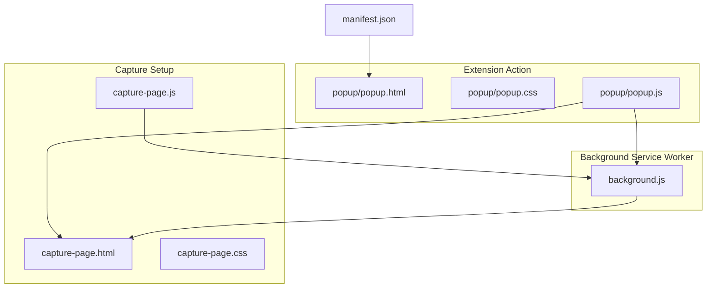
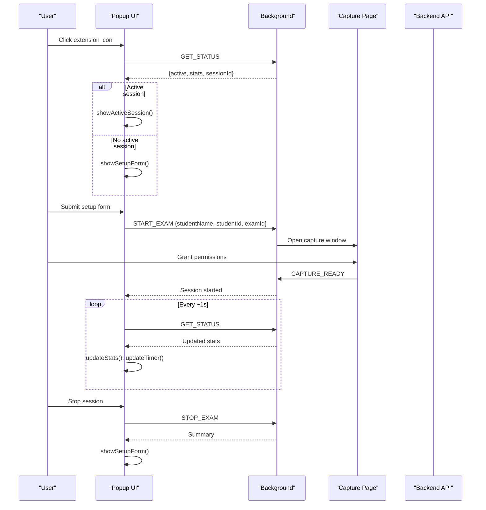
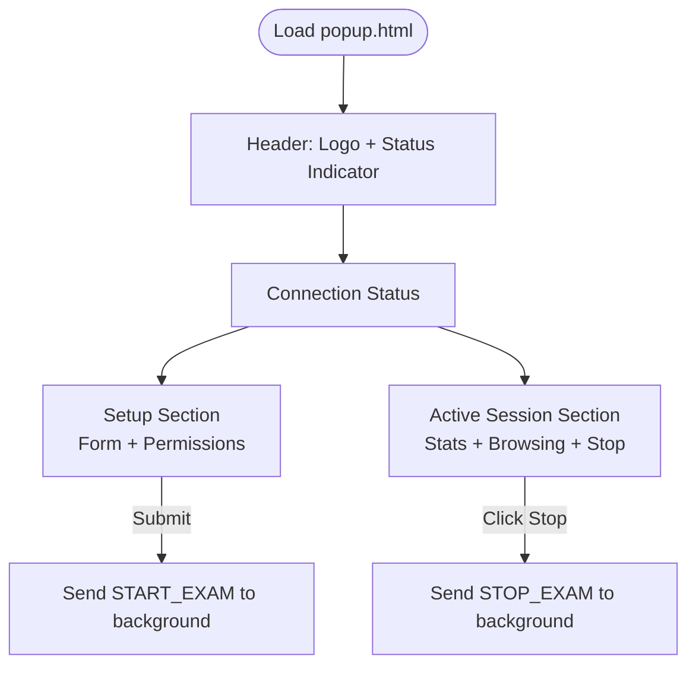
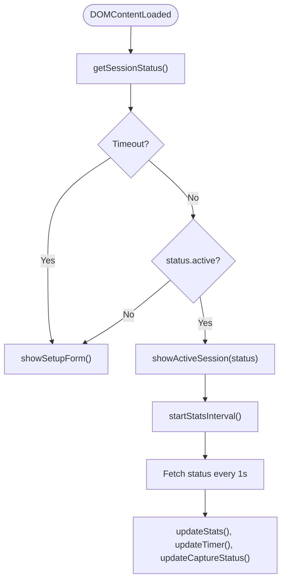
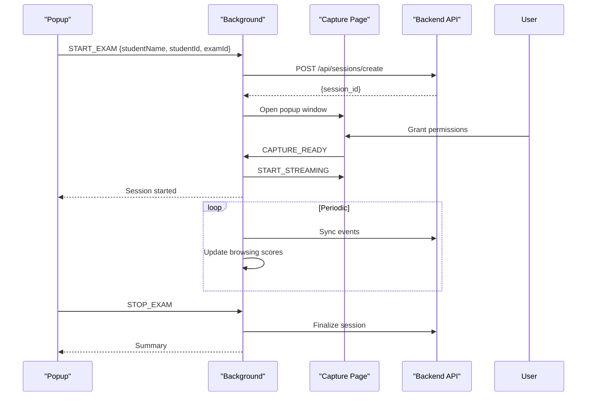
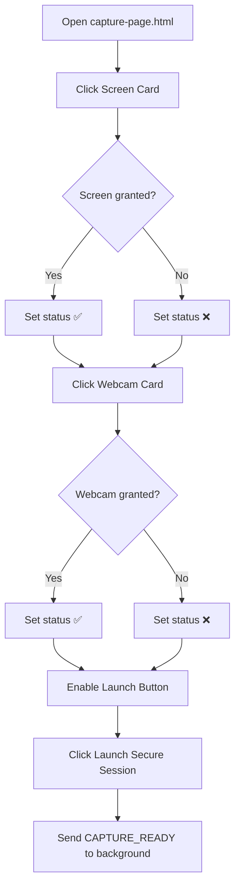
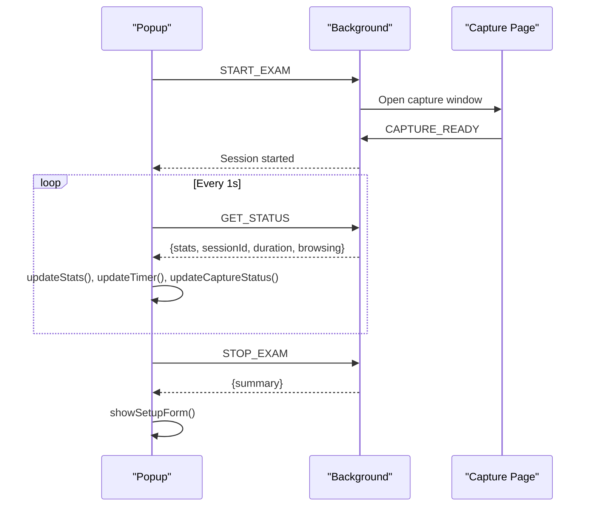
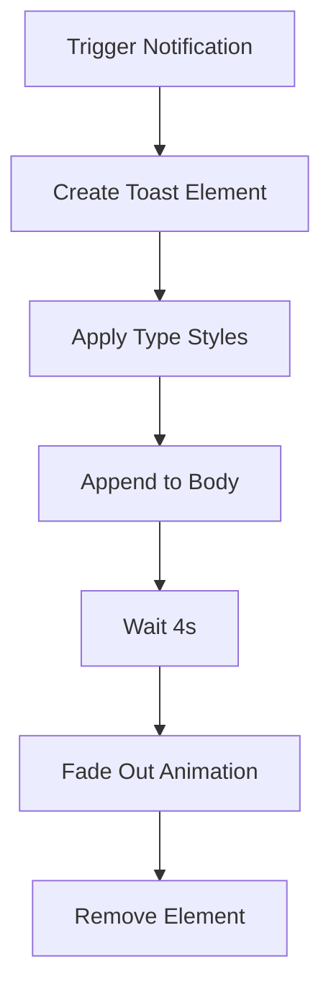
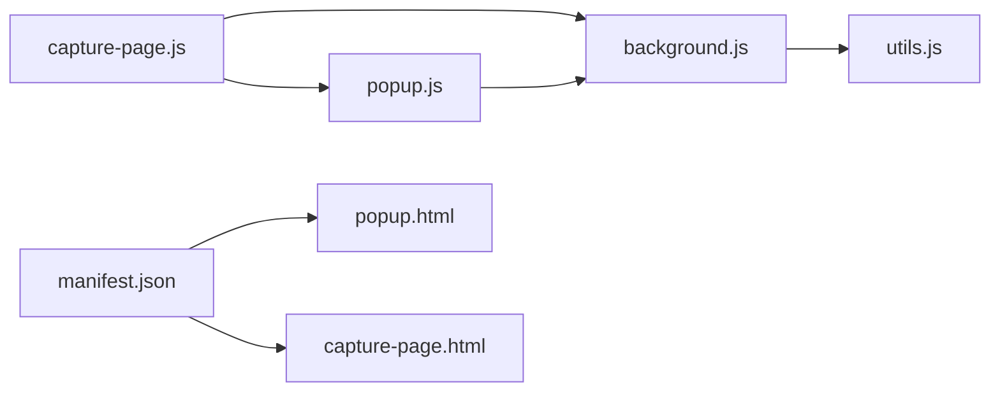

# Popup Interface & User Controls

<cite>
**Referenced Files in This Document**
- [popup.html](file://extension/popup/popup.html)
- [popup.css](file://extension/popup/popup.css)
- [popup.js](file://extension/popup/popup.js)
- [background.js](file://extension/background.js)
- [manifest.json](file://extension/manifest.json)
- [capture-page.html](file://extension/capture-page.html)
- [capture-page.css](file://extension/capture-page.css)
- [capture-page.js](file://extension/capture-page.js)
- [utils.js](file://extension/utils.js)
</cite>

## Table of Contents
1. [Introduction](#introduction)
2. [Project Structure](#project-structure)
3. [Core Components](#core-components)
4. [Architecture Overview](#architecture-overview)
5. [Detailed Component Analysis](#detailed-component-analysis)
6. [Dependency Analysis](#dependency-analysis)
7. [Performance Considerations](#performance-considerations)
8. [Troubleshooting Guide](#troubleshooting-guide)
9. [Conclusion](#conclusion)
10. [Appendices](#appendices)

## Introduction
This document describes the browser extension’s popup interface and user interaction controls. It explains the HTML structure, CSS styling, and JavaScript functionality that power the exam session initiation, status monitoring, and user notifications. It also covers the popup’s integration with the background script, real-time status updates, and user preference management. Guidance is included for responsive design, accessibility, cross-browser compatibility, customization, branding, and user experience optimization.

## Project Structure
The popup is part of the extension’s action UI and works alongside the background service worker and a secondary capture page for permission handling. The manifest defines the popup entry point and permissions.

**Diagram sources**
- [popup.html](file://extension/popup/popup.html)
- [popup.css](file://extension/popup/popup.css)
- [popup.js](file://extension/popup/popup.js)
- [background.js](file://extension/background.js)
- [capture-page.html](file://extension/capture-page.html)
- [capture-page.css](file://extension/capture-page.css)
- [capture-page.js](file://extension/capture-page.js)
- [manifest.json](file://extension/manifest.json)

**Section sources**
- [manifest.json](file://extension/manifest.json)
- [popup.html](file://extension/popup/popup.html)
- [popup.css](file://extension/popup/popup.css)
- [popup.js](file://extension/popup/popup.js)
- [background.js](file://extension/background.js)
- [capture-page.html](file://extension/capture-page.html)
- [capture-page.css](file://extension/capture-page.css)
- [capture-page.js](file://extension/capture-page.js)

## Core Components
- Popup UI: Provides session setup, live monitoring, and controls.
- Background service worker: Manages session lifecycle, event logging, and real-time stats.
- Capture page: Handles media permissions and finalizes session launch.
- Utilities: Shared helpers for URL sanitization and delays.

Key responsibilities:
- Popup initializes, checks backend connectivity, renders setup or active session views, and handles user actions.
- Background maintains session state, tracks browsing metrics, and responds to popup requests.
- Capture page mediates permissions and signals readiness to background.

**Section sources**
- [popup.js](file://extension/popup/popup.js)
- [background.js](file://extension/background.js)
- [capture-page.js](file://extension/capture-page.js)
- [utils.js](file://extension/utils.js)

## Architecture Overview
The popup communicates with the background via runtime messaging to start/stop sessions, retrieve status, and receive periodic updates. The capture page is opened for permission handling and signals readiness back to the background.

**Diagram sources**
- [popup.js](file://extension/popup/popup.js)
- [background.js](file://extension/background.js)
- [capture-page.js](file://extension/capture-page.js)

## Detailed Component Analysis

### Popup HTML Structure
The popup defines:
- Header with logo and status indicator
- Connection status panel
- Setup section with form fields and permission indicators
- Active session panel with stats cards, capture status, browsing tracker, and stop button

**Diagram sources**
- [popup.html](file://extension/popup/popup.html)

**Section sources**
- [popup.html](file://extension/popup/popup.html)

### Popup CSS Styling
The stylesheet uses a dark theme with gradient accents and glass-morphism effects. It defines:
- Color palette and CSS variables for primary/accent/danger/success
- Layout sizing (width/height) and responsive container
- Animations for pulsing dots, glowing buttons, and sliding sections
- Stat cards, permission badges, and browsing tracker bars
- Category badges for browsing categories

Responsive and accessibility considerations:
- Fixed viewport and font stack for readability
- High contrast and sufficient color contrast for status indicators
- Animations are reduced-motion friendly via transitions and controlled timing

**Section sources**
- [popup.css](file://extension/popup/popup.css)

### Popup JavaScript Functionality
Responsibilities:
- Initialize UI, check backend health, and decide between setup or active session view
- Poll session status and update stats/timer/capture indicators
- Handle form submission to start a session
- Handle stop session and summarize results
- Show toast notifications for user feedback

Key flows:
- Initialization: race a status check against a timeout to avoid blank UI
- Backend health: periodic GET /api/health-check with a 30s timeout
- Stats polling: every 1s, update timers and counters
- Notifications: dynamic toasts with type-specific styling

**Diagram sources**
- [popup.js](file://extension/popup/popup.js)

**Section sources**
- [popup.js](file://extension/popup/popup.js)

### Background Script Integration
The background script:
- Exposes message handlers for START_EXAM, STOP_EXAM, GET_STATUS, CAPTURE_READY, and others
- Maintains session state and event buffers
- Starts and stops periodic sync and analysis intervals
- Opens the capture window and minimizes it after readiness
- Implements a browsing tracker that audits tabs, classifies URLs, and computes risk/effort scores

**Diagram sources**
- [background.js](file://extension/background.js)
- [popup.js](file://extension/popup/popup.js)
- [capture-page.js](file://extension/capture-page.js)

**Section sources**
- [background.js](file://extension/background.js)

### Capture Page Interaction
The capture page:
- Requests screen and webcam permissions
- Enables a “Launch Secure Session” button only when both are granted
- Sends CAPTURE_READY to the background upon completion
- Uses toast notifications for user feedback

**Diagram sources**
- [capture-page.html](file://extension/capture-page.html)
- [capture-page.css](file://extension/capture-page.css)
- [capture-page.js](file://extension/capture-page.js)

**Section sources**
- [capture-page.html](file://extension/capture-page.html)
- [capture-page.css](file://extension/capture-page.css)
- [capture-page.js](file://extension/capture-page.js)

### Session Management and User Controls
- Start exam: Validates backend connectivity and form fields, sends START_EXAM, and opens the capture window.
- Stop exam: Confirms termination, sends STOP_EXAM, clears intervals, and shows a summary notification.
- Status monitoring: GET_STATUS returns counts, durations, last captures, and browsing metrics.
- Real-time updates: Stats poll every second; timers update live; capture indicators reflect recent activity.

**Diagram sources**
- [popup.js](file://extension/popup/popup.js)
- [background.js](file://extension/background.js)
- [capture-page.js](file://extension/capture-page.js)

**Section sources**
- [popup.js](file://extension/popup/popup.js)
- [background.js](file://extension/background.js)

### User Feedback and Notifications
- Toast notifications: Dynamically created divs with type-specific colors and animations.
- Types: error, success, warning, info.
- Placement: Fixed at bottom center with slide/fade animations.

**Diagram sources**
- [popup.js](file://extension/popup/popup.js)

**Section sources**
- [popup.js](file://extension/popup/popup.js)

## Dependency Analysis
- Popup depends on background messages for session state and control.
- Background depends on chrome APIs for tabs, windows, storage, and notifications.
- Capture page depends on popup.js for permission handling and signaling readiness.
- Utils provide shared helpers for URL sanitation.

**Diagram sources**
- [popup.js](file://extension/popup/popup.js)
- [background.js](file://extension/background.js)
- [capture-page.js](file://extension/capture-page.js)
- [utils.js](file://extension/utils.js)
- [manifest.json](file://extension/manifest.json)
- [popup.html](file://extension/popup/popup.html)
- [capture-page.html](file://extension/capture-page.html)

**Section sources**
- [popup.js](file://extension/popup/popup.js)
- [background.js](file://extension/background.js)
- [capture-page.js](file://extension/capture-page.js)
- [utils.js](file://extension/utils.js)
- [manifest.json](file://extension/manifest.json)

## Performance Considerations
- Stats polling interval: 1s is frequent but lightweight; adjust based on device performance.
- Backend health check: 8s interval prevents excessive load while keeping UI responsive.
- Animations: CSS transitions and transforms are GPU-friendly; keep durations reasonable.
- Image updates: Only update DOM when values change to reduce repaints.
- Network timeouts: 30s for health checks accommodate cold starts.

[No sources needed since this section provides general guidance]

## Troubleshooting Guide
Common issues and resolutions:
- Backend offline: Connection status shows offline; ensure backend is reachable and healthy.
- Permission denials: Capture page marks denied; re-grant permissions and retry.
- Blank popup: Initialization races a status check; if timeout occurs, UI falls back to setup.
- Session not starting: Verify exam code and backend availability; check notifications for errors.
- Stats not updating: Confirm GET_STATUS responses and that intervals are running.

**Section sources**
- [popup.js](file://extension/popup/popup.js)
- [background.js](file://extension/background.js)
- [capture-page.js](file://extension/capture-page.js)

## Conclusion
The popup provides a modern, responsive, and accessible interface for initiating and monitoring exam sessions. Its integration with the background service worker ensures real-time updates and robust session management. The capture page streamlines permission handling, and the notification system delivers timely feedback. With careful attention to performance and user experience, the interface supports secure and fair exam proctoring.

[No sources needed since this section summarizes without analyzing specific files]

## Appendices

### Responsive Design Considerations
- Fixed layout sizes (width/height) ensure consistent rendering across devices.
- Flexible grid for stats and permission items adapts to smaller screens.
- Font scaling and spacing maintain readability on various DPIs.

**Section sources**
- [popup.css](file://extension/popup/popup.css)
- [popup.html](file://extension/popup/popup.html)

### Accessibility Features
- Sufficient color contrast for status indicators and text.
- Focusable elements and keyboard-accessible forms.
- Reduced motion: Transitions and animations are moderate and not excessive.

**Section sources**
- [popup.css](file://extension/popup/popup.css)
- [popup.html](file://extension/popup/popup.html)

### Cross-Browser Compatibility
- Uses standard web APIs and manifest v3 features compatible with Chromium-based browsers.
- Avoids deprecated APIs; relies on chrome.* and fetch for network calls.

**Section sources**
- [manifest.json](file://extension/manifest.json)
- [popup.js](file://extension/popup/popup.js)
- [background.js](file://extension/background.js)

### Customization and Branding Options
- Modify CSS variables for brand colors and gradients.
- Replace logo and icons in the popup header.
- Adjust toast styles and animations to match brand guidelines.
- Update category thresholds and labels in the browsing tracker for domain-specific policies.

**Section sources**
- [popup.css](file://extension/popup/popup.css)
- [background.js](file://extension/background.js)

### User Experience Optimization
- Provide clear permission indicators and actionable feedback.
- Use concise labels and tooltips for complex metrics.
- Offer a graceful fallback when backend is unreachable.
- Keep animations smooth but not distracting during focus-sensitive tasks.

**Section sources**
- [popup.js](file://extension/popup/popup.js)
- [popup.css](file://extension/popup/popup.css)
- [background.js](file://extension/background.js)