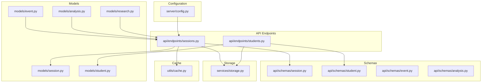
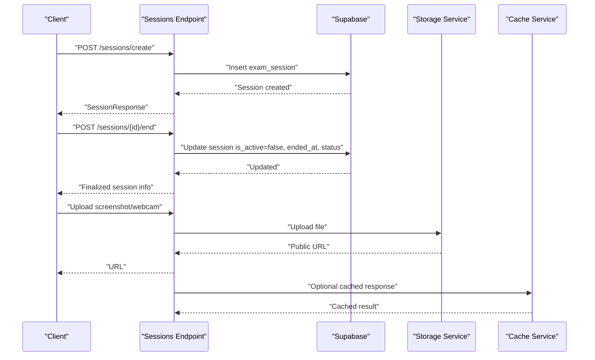
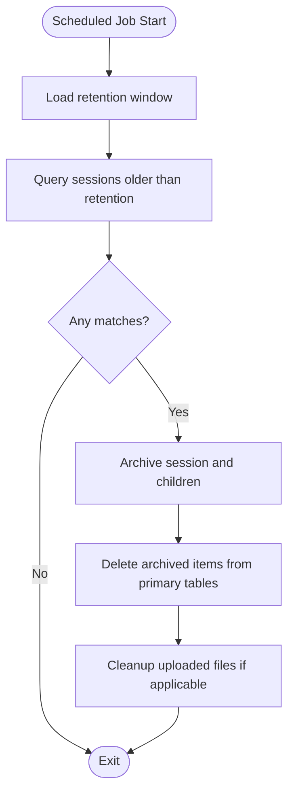
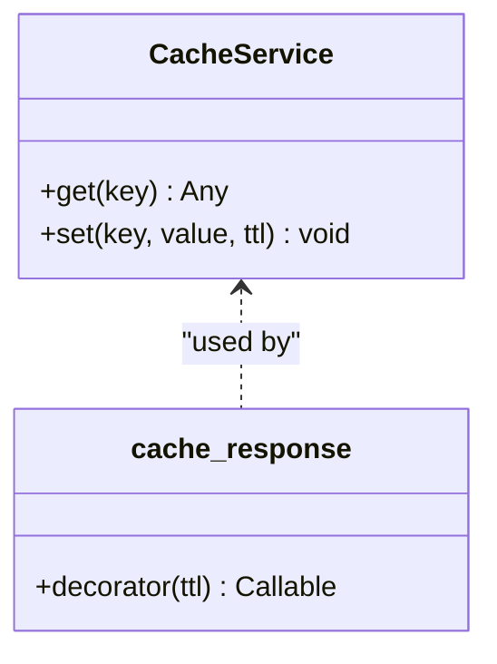
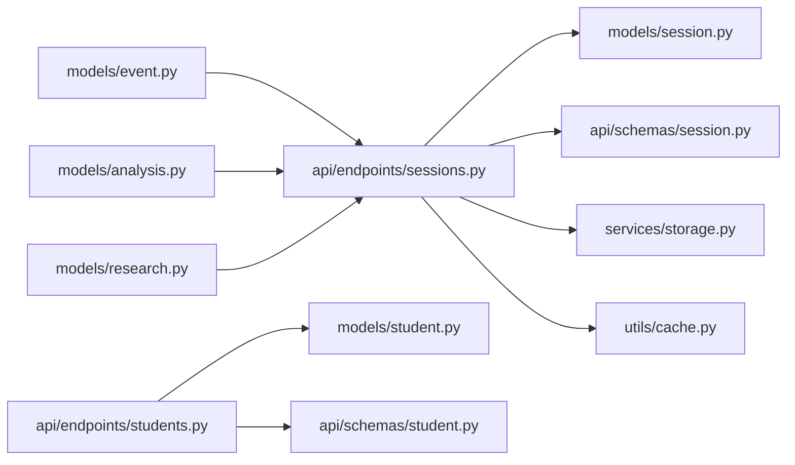

# Data Lifecycle Management

<cite>
**Referenced Files in This Document**
- [config.py](file://server/config.py)
- [cache.py](file://server/utils/cache.py)
- [storage.py](file://server/services/storage.py)
- [session.py](file://server/models/session.py)
- [student.py](file://server/models/student.py)
- [event.py](file://server/models/event.py)
- [analysis.py](file://server/models/analysis.py)
- [research.py](file://server/models/research.py)
- [sessions.py](file://server/api/endpoints/sessions.py)
- [students.py](file://server/api/endpoints/students.py)
- [session.schema.py](file://server/api/schemas/session.py)
- [student.schema.py](file://server/api/schemas/student.py)
- [event.schema.py](file://server/api/schemas/event.py)
- [analysis.schema.py](file://server/api/schemas/analysis.py)
</cite>

## Table of Contents
1. [Introduction](#introduction)
2. [Project Structure](#project-structure)
3. [Core Components](#core-components)
4. [Architecture Overview](#architecture-overview)
5. [Detailed Component Analysis](#detailed-component-analysis)
6. [Dependency Analysis](#dependency-analysis)
7. [Performance Considerations](#performance-considerations)
8. [Troubleshooting Guide](#troubleshooting-guide)
9. [Conclusion](#conclusion)
10. [Appendices](#appendices)

## Introduction
This document defines ExamGuard Pro’s data lifecycle management strategy across retention, archival, cleanup, backup/restore, anonymization, caching, migration, disaster recovery, and monitoring. It consolidates observable behaviors from the backend API, models, schemas, configuration, and storage utilities to present practical, implementable policies aligned with the codebase.

## Project Structure
The data lifecycle touches several layers:
- Configuration and environment-driven behavior (retention windows, storage targets, cache toggles)
- API endpoints for session lifecycle control and administrative cleanup
- Pydantic models and schemas representing persistent entities
- Storage service abstraction for uploads and fallbacks
- Cache utility for frequently accessed data

**Diagram sources**
- [config.py:1-205](file://server/config.py#L1-L205)
- [sessions.py:1-303](file://server/api/endpoints/sessions.py#L1-L303)
- [students.py:1-111](file://server/api/endpoints/students.py#L1-L111)
- [session.py:1-63](file://server/models/session.py#L1-L63)
- [student.py:1-17](file://server/models/student.py#L1-L17)
- [event.py:1-30](file://server/models/event.py#L1-L30)
- [analysis.py:1-49](file://server/models/analysis.py#L1-L49)
- [research.py:1-39](file://server/models/research.py#L1-L39)
- [session.schema.py:1-88](file://server/api/schemas/session.py#L1-L88)
- [student.schema.py:1-95](file://server/api/schemas/student.py#L1-L95)
- [event.schema.py:1-63](file://server/api/schemas/event.py#L1-L63)
- [analysis.schema.py:1-121](file://server/api/schemas/analysis.py#L1-L121)
- [storage.py:1-71](file://server/services/storage.py#L1-L71)
- [cache.py:1-70](file://server/utils/cache.py#L1-L70)

**Section sources**
- [config.py:1-205](file://server/config.py#L1-L205)
- [sessions.py:1-303](file://server/api/endpoints/sessions.py#L1-L303)
- [students.py:1-111](file://server/api/endpoints/students.py#L1-L111)
- [session.py:1-63](file://server/models/session.py#L1-L63)
- [student.py:1-17](file://server/models/student.py#L1-L17)
- [event.py:1-30](file://server/models/event.py#L1-L30)
- [analysis.py:1-49](file://server/models/analysis.py#L1-L49)
- [research.py:1-39](file://server/models/research.py#L1-L39)
- [session.schema.py:1-88](file://server/api/schemas/session.py#L1-L88)
- [student.schema.py:1-95](file://server/api/schemas/student.py#L1-L95)
- [event.schema.py:1-63](file://server/api/schemas/event.py#L1-L63)
- [analysis.schema.py:1-121](file://server/api/schemas/analysis.py#L1-L121)
- [storage.py:1-71](file://server/services/storage.py#L1-L71)
- [cache.py:1-70](file://server/utils/cache.py#L1-L70)

## Core Components
- Retention and lifecycle controls:
  - Sessions are created and can be ended; the endpoint sets an end timestamp and status. There is no automatic deletion of ended sessions in the current code.
  - Administrative endpoint clears all sessions and related data for development/admin use.
- Data entities:
  - Sessions, Students, Events, Analysis results, and Research journeys are represented by Pydantic models and schemas.
- Storage:
  - File uploads support S3-compatible storage or local fallback; filenames are generated per upload.
- Caching:
  - Optional Redis-backed caching for API responses with TTL; disabled by default in the current configuration.

**Section sources**
- [sessions.py:109-143](file://server/api/endpoints/sessions.py#L109-L143)
- [sessions.py:146-208](file://server/api/endpoints/sessions.py#L146-L208)
- [session.py:15-63](file://server/models/session.py#L15-L63)
- [student.py:6-17](file://server/models/student.py#L6-L17)
- [event.py:6-30](file://server/models/event.py#L6-L30)
- [analysis.py:6-49](file://server/models/analysis.py#L6-L49)
- [research.py:6-39](file://server/models/research.py#L6-L39)
- [storage.py:24-67](file://server/services/storage.py#L24-L67)
- [cache.py:17-70](file://server/utils/cache.py#L17-L70)

## Architecture Overview
The lifecycle spans request handling, persistence, storage, and optional caching.

**Diagram sources**
- [sessions.py:12-101](file://server/api/endpoints/sessions.py#L12-L101)
- [sessions.py:146-208](file://server/api/endpoints/sessions.py#L146-L208)
- [storage.py:24-67](file://server/services/storage.py#L24-L67)
- [cache.py:32-70](file://server/utils/cache.py#L32-L70)

## Detailed Component Analysis

### Retention Policies by Entity Type
- Exam sessions:
  - Sessions are marked inactive and receive an end timestamp upon termination. No automatic deletion occurs in the current code.
- Student records:
  - Students are created and updated; there is no automatic deletion routine in the current code.
- Event logs:
  - Events are logged with timestamps; no automatic purge logic is present in the current code.
- Analysis results:
  - Analysis results are stored with timestamps; no automatic purge logic is present in the current code.
- Research journeys:
  - Research journey entries are stored with timestamps; no automatic purge logic is present in the current code.

Retention windows are not configured in the current codebase. To implement retention, define policy constants in configuration and integrate scheduled cleanup jobs.

**Section sources**
- [sessions.py:146-208](file://server/api/endpoints/sessions.py#L146-L208)
- [session.py:15-63](file://server/models/session.py#L15-L63)
- [student.py:6-17](file://server/models/student.py#L6-L17)
- [event.py:6-30](file://server/models/event.py#L6-L30)
- [analysis.py:6-49](file://server/models/analysis.py#L6-L49)
- [research.py:6-39](file://server/models/research.py#L6-L39)

### Archival Strategies
- Current behavior:
  - No explicit archival routines are implemented in the codebase.
- Recommended approach:
  - Archive ended sessions and associated data to cold storage or a separate schema/table after a configurable retention period.
  - Use batch export APIs to move data to long-term storage systems.

[No sources needed since this section provides recommended practices without analyzing specific files]

### Cleanup Procedures for Expired Sessions and Temporary Data
- Manual cleanup:
  - An administrative endpoint clears all sessions and related tables for development/admin use.
- Automated cleanup:
  - Not implemented in the current codebase. Implement a scheduled job to:
    - Identify sessions older than the retention window.
    - Archive or delete dependent events, analysis results, and research journeys.
    - Remove uploaded artifacts from storage if applicable.

[No sources needed since this diagram shows conceptual workflow, not actual code structure]

**Section sources**
- [sessions.py:109-143](file://server/api/endpoints/sessions.py#L109-L143)

### Backup and Restore Procedures
- Current behavior:
  - Storage service supports S3-compatible uploads and local fallback. There is no built-in backup/restore orchestration in the codebase.
- Recommended procedure:
  - Back up database snapshots regularly (e.g., daily incremental plus weekly full).
  - Back up uploaded artifacts to the same S3 bucket or a mirrored location.
  - Test restore procedures periodically to validate integrity and RTO/RPO targets.

[No sources needed since this section provides recommended practices without analyzing specific files]

### Data Anonymization for Privacy and GDPR Compliance
- Current behavior:
  - Student emails are optional and not required for session creation. There is no anonymization routine in the codebase.
- Recommended approach:
  - Remove or hash personally identifiable information (PII) such as names and emails when exporting data for research or reporting.
  - Implement anonymization at export time and ensure logs do not retain PII unnecessarily.

[No sources needed since this section provides recommended practices without analyzing specific files]

### Cache Management for Frequently Accessed Data
- Current behavior:
  - Optional Redis caching is available via a decorator that caches API responses keyed by route and query parameters with a default TTL.
- Recommendations:
  - Enable caching in production via environment variables.
  - Define shorter TTLs for sensitive data and longer TTLs for static dashboards.
  - Invalidate cache on write operations to maintain consistency.

**Diagram sources**
- [cache.py:17-70](file://server/utils/cache.py#L17-L70)

**Section sources**
- [cache.py:17-70](file://server/utils/cache.py#L17-L70)
- [config.py:14-16](file://server/config.py#L14-L16)

### Data Migration Procedures for Schema Updates
- Current behavior:
  - The codebase includes a migration script for students; no generic migration framework is evident.
- Recommended procedure:
  - Use database migration tools (e.g., Alembic) to manage schema changes.
  - Version control migrations alongside code.
  - Perform zero-downtime migrations with feature flags if needed.

[No sources needed since this section provides general guidance]

### Disaster Recovery Planning and Business Continuity
- Current behavior:
  - Storage supports S3-compatible and local modes; no DR plan is implemented in the codebase.
- Recommended approach:
  - Maintain hot-standby instances and replicate database and storage.
  - Automate failover and alert on failures.
  - Document RTO/RPO targets and rehearse recovery drills.

[No sources needed since this section provides general guidance]

### Monitoring and Alerting for Data Integrity and Availability
- Current behavior:
  - No monitoring/alerting logic is present in the codebase.
- Recommended approach:
  - Monitor database health, storage connectivity, and cache availability.
  - Alert on failed uploads, missing cache, and abnormal latency.
  - Track audit trails for admin actions (e.g., session clearing).

[No sources needed since this section provides general guidance]

## Dependency Analysis
The session lifecycle depends on Supabase for persistence and optionally Redis for caching. Storage is abstracted behind a service that supports S3 or local fallback.

**Diagram sources**
- [sessions.py:1-303](file://server/api/endpoints/sessions.py#L1-L303)
- [students.py:1-111](file://server/api/endpoints/students.py#L1-L111)
- [session.py:1-63](file://server/models/session.py#L1-L63)
- [student.py:1-17](file://server/models/student.py#L1-L17)
- [event.py:1-30](file://server/models/event.py#L1-L30)
- [analysis.py:1-49](file://server/models/analysis.py#L1-L49)
- [research.py:1-39](file://server/models/research.py#L1-L39)
- [session.schema.py:1-88](file://server/api/schemas/session.py#L1-L88)
- [student.schema.py:1-95](file://server/api/schemas/student.py#L1-L95)
- [storage.py:1-71](file://server/services/storage.py#L1-L71)
- [cache.py:1-70](file://server/utils/cache.py#L1-L70)

**Section sources**
- [sessions.py:1-303](file://server/api/endpoints/sessions.py#L1-L303)
- [students.py:1-111](file://server/api/endpoints/students.py#L1-L111)
- [session.py:1-63](file://server/models/session.py#L1-L63)
- [student.py:1-17](file://server/models/student.py#L1-L17)
- [event.py:1-30](file://server/models/event.py#L1-L30)
- [analysis.py:1-49](file://server/models/analysis.py#L1-L49)
- [research.py:1-39](file://server/models/research.py#L1-L39)
- [session.schema.py:1-88](file://server/api/schemas/session.py#L1-L88)
- [student.schema.py:1-95](file://server/api/schemas/student.py#L1-L95)
- [storage.py:1-71](file://server/services/storage.py#L1-L71)
- [cache.py:1-70](file://server/utils/cache.py#L1-L70)

## Performance Considerations
- Caching:
  - Enable and tune TTLs for dashboard endpoints to reduce database load.
- Storage:
  - Prefer S3-compatible storage for high durability and scalability.
- Batch operations:
  - Consider batching event writes to reduce I/O overhead.

[No sources needed since this section provides general guidance]

## Troubleshooting Guide
- Session cleanup:
  - Use the administrative endpoint to clear all sessions and related data for development environments.
- Cache issues:
  - Verify cache enablement and Redis connectivity; disable caching if Redis is unavailable.
- Storage failures:
  - Confirm S3 credentials and endpoint; the service falls back to local storage on failure.

**Section sources**
- [sessions.py:109-143](file://server/api/endpoints/sessions.py#L109-L143)
- [cache.py:14-16](file://server/utils/cache.py#L14-L16)
- [storage.py:35-56](file://server/services/storage.py#L35-L56)

## Conclusion
The current codebase establishes foundational data structures and lifecycle endpoints for sessions, students, events, analysis results, and research journeys. Retention, archival, cleanup, backup/restore, anonymization, and disaster recovery are not implemented in code and should be introduced via configuration-driven policies, scheduled jobs, and operational procedures. Caching and storage are configurable and pluggable, enabling scalable and resilient deployments.

## Appendices

### Data Retention Windows (Recommended)
Define retention windows in configuration and apply them in scheduled cleanup jobs:
- Sessions: 90–180 days after end
- Events: 30–90 days after session end
- Analysis results: 30–90 days after session end
- Research journeys: 30–90 days after session end
- Student records: 5–10 years after last activity or legal requirements

[No sources needed since this section provides recommended practices without analyzing specific files]