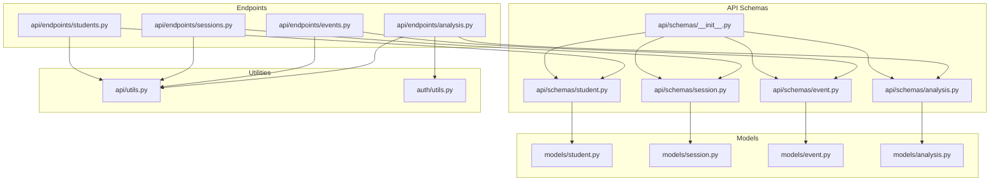
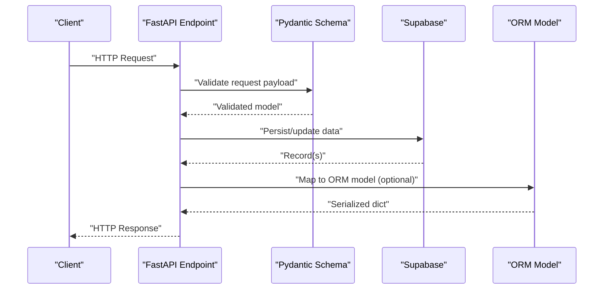
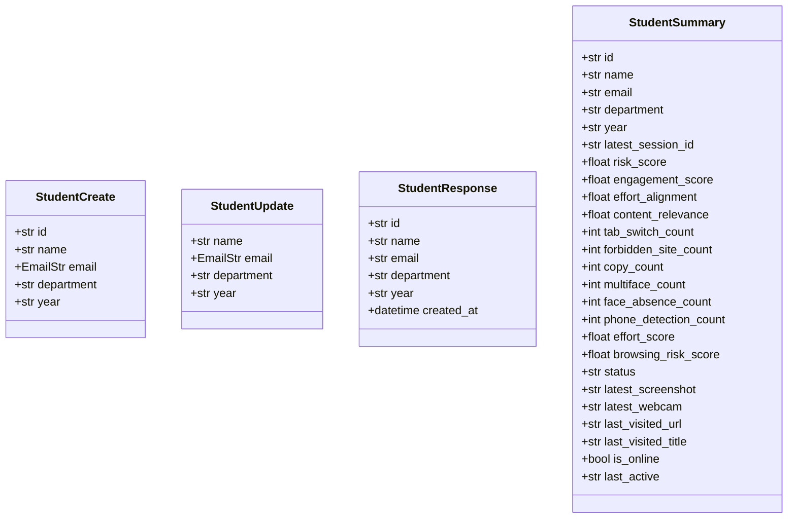
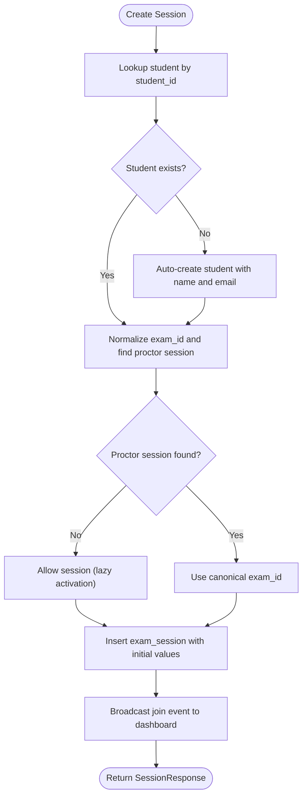
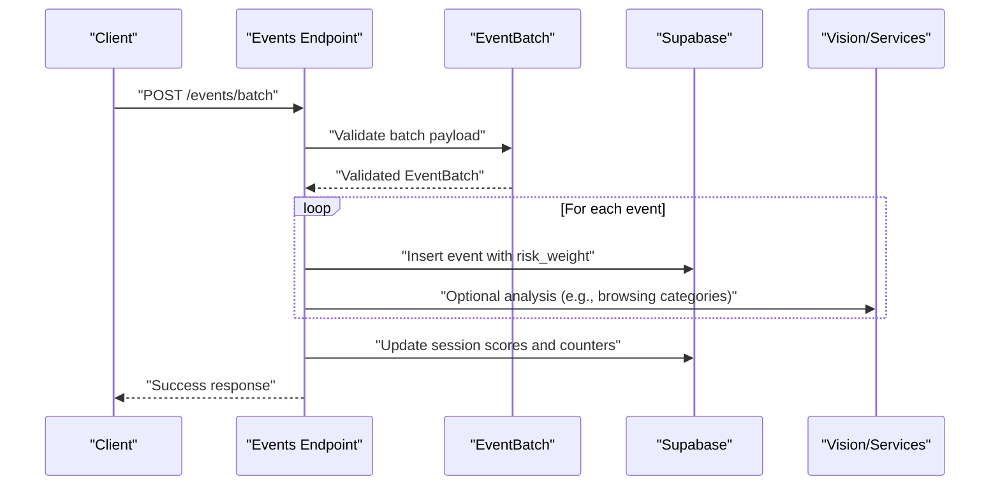
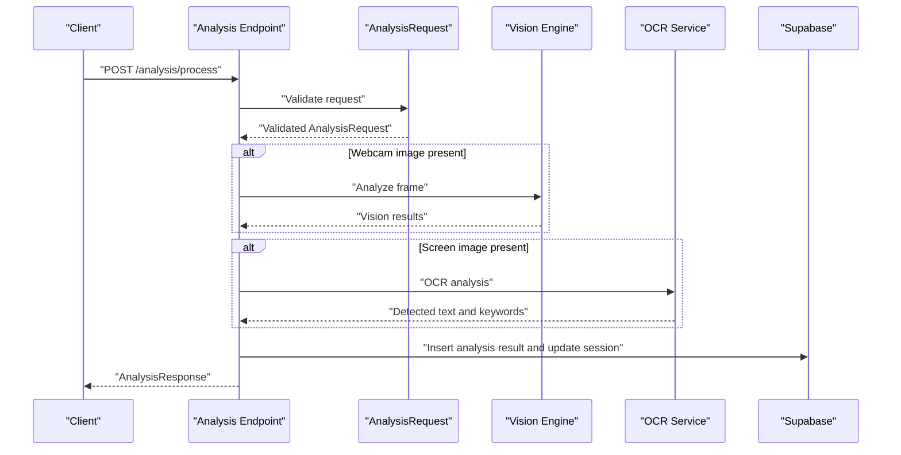
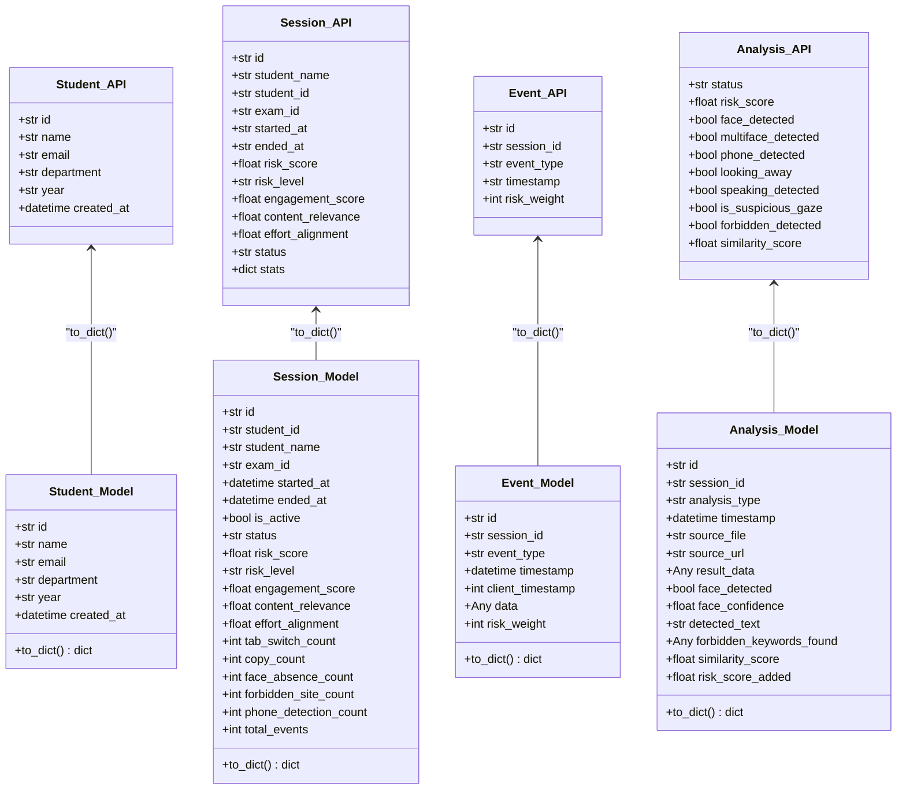
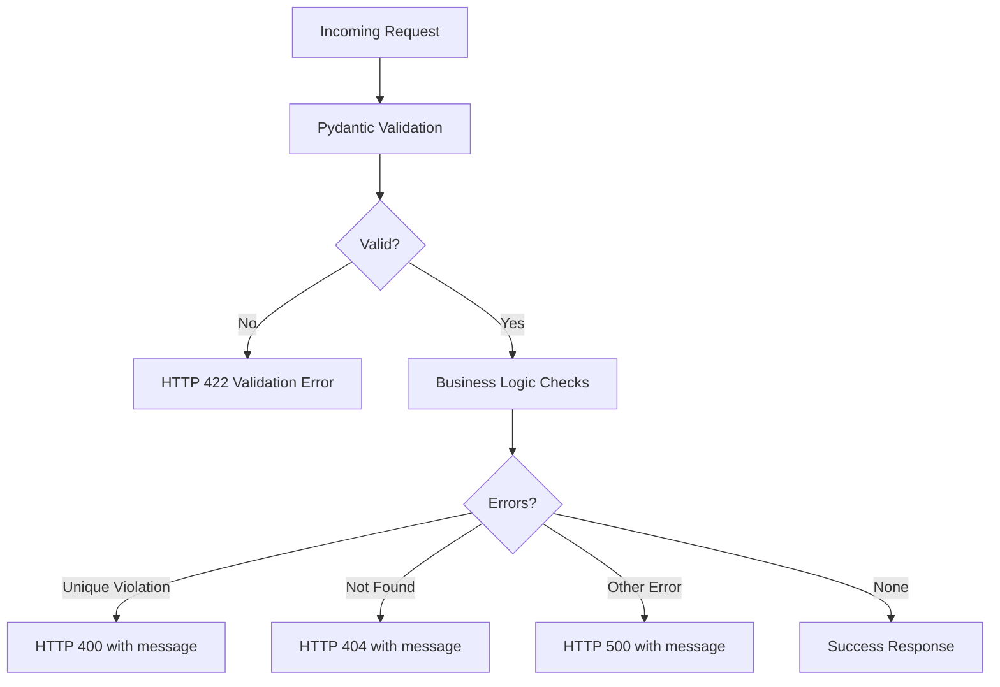
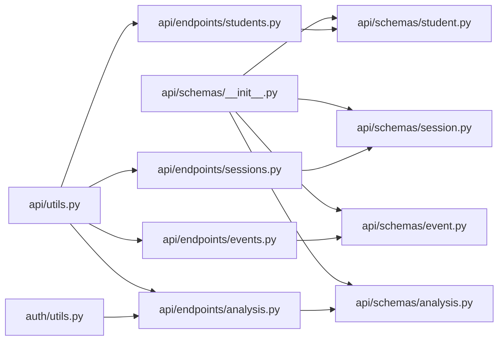

# Data Schemas and Validation

<cite>
**Referenced Files in This Document**
- [schemas.py](file://server/schemas.py)
- [__init__.py](file://server/api/schemas/__init__.py)
- [session.py](file://server/api/schemas/session.py)
- [student.py](file://server/api/schemas/student.py)
- [event.py](file://server/api/schemas/event.py)
- [analysis.py](file://server/api/schemas/analysis.py)
- [session.py](file://server/models/session.py)
- [student.py](file://server/models/student.py)
- [event.py](file://server/models/event.py)
- [analysis.py](file://server/models/analysis.py)
- [api/utils.py](file://server/api/utils.py)
- [auth/utils.py](file://server/auth/utils.py)
- [students.py](file://server/api/endpoints/students.py)
- [sessions.py](file://server/api/endpoints/sessions.py)
- [events.py](file://server/api/endpoints/events.py)
- [analysis.py](file://server/api/endpoints/analysis.py)
</cite>

## Table of Contents
1. [Introduction](#introduction)
2. [Project Structure](#project-structure)
3. [Core Components](#core-components)
4. [Architecture Overview](#architecture-overview)
5. [Detailed Component Analysis](#detailed-component-analysis)
6. [Dependency Analysis](#dependency-analysis)
7. [Performance Considerations](#performance-considerations)
8. [Troubleshooting Guide](#troubleshooting-guide)
9. [Conclusion](#conclusion)

## Introduction
This document explains ExamGuard Pro’s data validation and schema enforcement mechanisms. It focuses on Pydantic models used for request and response validation across Students, Sessions, Events, and Analysis, detailing field-level validation rules, data type constraints, business logic validations, serialization/deserialization, input sanitization, output filtering, and error handling strategies. It also documents transformations between database models and API schemas and outlines reusable validation components.

## Project Structure
The validation layer is primarily implemented in the server/api/schemas package with supporting utilities and model definitions in server/models. Endpoints orchestrate validation, persistence, and real-time updates.

**Diagram sources**
- [__init__.py:1-73](file://server/api/schemas/__init__.py#L1-L73)
- [student.py:1-95](file://server/api/schemas/student.py#L1-L95)
- [session.py:1-88](file://server/api/schemas/session.py#L1-L88)
- [event.py:1-63](file://server/api/schemas/event.py#L1-L63)
- [analysis.py:1-121](file://server/api/schemas/analysis.py#L1-L121)
- [student.py:1-17](file://server/models/student.py#L1-L17)
- [session.py:1-63](file://server/models/session.py#L1-L63)
- [event.py:1-30](file://server/models/event.py#L1-L30)
- [analysis.py:1-49](file://server/models/analysis.py#L1-L49)
- [students.py:1-111](file://server/api/endpoints/students.py#L1-L111)
- [sessions.py:1-303](file://server/api/endpoints/sessions.py#L1-L303)
- [events.py:1-362](file://server/api/endpoints/events.py#L1-L362)
- [analysis.py:1-453](file://server/api/endpoints/analysis.py#L1-L453)
- [api/utils.py:1-199](file://server/api/utils.py#L1-L199)
- [auth/utils.py:1-200](file://server/auth/utils.py#L1-L200)

**Section sources**
- [__init__.py:1-73](file://server/api/schemas/__init__.py#L1-L73)
- [student.py:1-95](file://server/api/schemas/student.py#L1-L95)
- [session.py:1-88](file://server/api/schemas/session.py#L1-L88)
- [event.py:1-63](file://server/api/schemas/event.py#L1-L63)
- [analysis.py:1-121](file://server/api/schemas/analysis.py#L1-L121)
- [student.py:1-17](file://server/models/student.py#L1-L17)
- [session.py:1-63](file://server/models/session.py#L1-L63)
- [event.py:1-30](file://server/models/event.py#L1-L30)
- [analysis.py:1-49](file://server/models/analysis.py#L1-L49)
- [students.py:1-111](file://server/api/endpoints/students.py#L1-L111)
- [sessions.py:1-303](file://server/api/endpoints/sessions.py#L1-L303)
- [events.py:1-362](file://server/api/endpoints/events.py#L1-L362)
- [analysis.py:1-453](file://server/api/endpoints/analysis.py#L1-L453)
- [api/utils.py:1-199](file://server/api/utils.py#L1-L199)
- [auth/utils.py:1-200](file://server/auth/utils.py#L1-L200)

## Core Components
This section documents the primary Pydantic schemas used for validation and their constraints.

- StudentCreate and StudentUpdate
  - Fields: id (optional), name (required), email (optional), department (optional), year (optional)
  - Constraints: name length bounds; optional email; optional id for pre-assigned identifiers
  - Serialization: from_attributes enabled for responses
  - Business logic: uniqueness checks enforced at endpoint level (see Students endpoints)

- SessionCreate and SessionUpdate
  - SessionCreate: student_id (required), student_name (required, length bounds), student_email (optional), exam_id (required)
  - SessionUpdate: optional toggles and score fields for risk and engagement
  - Business logic: auto-creation of student if missing; exam code normalization and proctor validation; session lifecycle updates

- EventCreate and EventBatch
  - EventCreate: session_id (required), event_type (required), data (dict), timestamp (optional)
  - EventBatch: session_id (required), events (list of EventData)
  - EventData: type, timestamp, data, id
  - Business logic: risk weight mapping; effort alignment adjustments; research journey enrichment

- AnalysisRequest and AnalysisResponse
  - AnalysisRequest: session_id (required), webcam_image (optional base64), screen_image (optional base64), clipboard_text (optional), timestamp (required)
  - AnalysisResponse: status, risk_score, optional flags and scores
  - Business logic: multi-modal processing, risk accumulation, live frame broadcasting

- Reusable validation components
  - Field-level constraints via Pydantic Field(min_length, max_length, ge, le)
  - JSON schema examples for OpenAPI documentation
  - Utility helpers for base64 decode/encode, filename sanitization, risk level calculation

**Section sources**
- [student.py:11-37](file://server/api/schemas/student.py#L11-L37)
- [session.py:11-46](file://server/api/schemas/session.py#L11-L46)
- [event.py:10-39](file://server/api/schemas/event.py#L10-L39)
- [analysis.py:10-42](file://server/api/schemas/analysis.py#L10-L42)
- [api/utils.py:25-66](file://server/api/utils.py#L25-L66)
- [api/utils.py:146-151](file://server/api/utils.py#L146-L151)
- [api/utils.py:113-128](file://server/api/utils.py#L113-L128)

## Architecture Overview
The validation pipeline integrates Pydantic schemas at the API boundary, with endpoints orchestrating business logic and persistence. Models encapsulate database records and provide controlled serialization.

**Diagram sources**
- [students.py:10-46](file://server/api/endpoints/students.py#L10-L46)
- [sessions.py:12-106](file://server/api/endpoints/sessions.py#L12-L106)
- [events.py:30-126](file://server/api/endpoints/events.py#L30-L126)
- [analysis.py:57-271](file://server/api/endpoints/analysis.py#L57-L271)
- [student.py:15-17](file://server/models/student.py#L15-L17)
- [session.py:45-62](file://server/models/session.py#L45-L62)
- [event.py:24-29](file://server/models/event.py#L24-L29)
- [analysis.py:40-48](file://server/models/analysis.py#L40-L48)

## Detailed Component Analysis

### Student Schemas
- StudentCreate
  - Purpose: Accept new student registration with optional pre-assigned id and email
  - Validation: name length bounds; optional email; optional id
  - Uniqueness: enforced at endpoint level (id/email uniqueness checks)
- StudentUpdate
  - Purpose: Partial updates to student profile
  - Validation: optional fields with length constraints
- StudentResponse and StudentSummary
  - Purpose: Controlled response shapes; StudentSummary includes aggregated metrics
  - Serialization: from_attributes for SQLAlchemy-like mapping

**Diagram sources**
- [student.py:11-95](file://server/api/schemas/student.py#L11-L95)
- [student.py:6-17](file://server/models/student.py#L6-L17)

**Section sources**
- [student.py:11-95](file://server/api/schemas/student.py#L11-L95)
- [student.py:6-17](file://server/models/student.py#L6-L17)
- [students.py:10-111](file://server/api/endpoints/students.py#L10-L111)

### Session Schemas
- SessionCreate
  - Purpose: Initialize an exam session; auto-creates student if absent; validates exam code via proctor session
  - Validation: name length bounds; required fields; optional student_email defaults internally
  - Business logic: exam code normalization; proctor presence check; session creation with initial scores
- SessionUpdate
  - Purpose: Update session status and metrics
- SessionResponse and SessionSummary
  - Purpose: Response and summary views with computed stats and risk levels

**Diagram sources**
- [session.py:11-46](file://server/api/schemas/session.py#L11-L46)
- [sessions.py:12-106](file://server/api/endpoints/sessions.py#L12-L106)

**Section sources**
- [session.py:11-46](file://server/api/schemas/session.py#L11-L46)
- [sessions.py:12-106](file://server/api/endpoints/sessions.py#L12-L106)
- [session.py:15-62](file://server/models/session.py#L15-L62)

### Event Schemas
- EventCreate and EventBatch
  - Purpose: Log single or batch events with risk weights and optional client timestamps
  - Validation: event lists must be non-empty for batch; optional data payloads
- EventData
  - Purpose: Structured event item for batch submissions
- Business logic: risk weight mapping; effort impact adjustments; research journey enrichment; session score updates

**Diagram sources**
- [event.py:10-50](file://server/api/schemas/event.py#L10-L50)
- [events.py:129-284](file://server/api/endpoints/events.py#L129-L284)

**Section sources**
- [event.py:10-63](file://server/api/schemas/event.py#L10-L63)
- [events.py:129-284](file://server/api/endpoints/events.py#L129-L284)
- [event.py:6-30](file://server/models/event.py#L6-L30)

### Analysis Schemas
- AnalysisRequest
  - Purpose: Multi-modal analysis input (webcam, screenshot, clipboard)
  - Validation: optional images (base64), required timestamp, required session_id
- AnalysisResponse
  - Purpose: Aggregated analysis outcome with risk score and flags
- Business logic: image decode/save; vision engine integration; OCR; object detection; LLM behavior analysis; session risk updates; live frame broadcasting

**Diagram sources**
- [analysis.py:10-42](file://server/api/schemas/analysis.py#L10-L42)
- [analysis.py:57-271](file://server/api/endpoints/analysis.py#L57-L271)
- [analysis.py:6-49](file://server/models/analysis.py#L6-L49)

**Section sources**
- [analysis.py:10-121](file://server/api/schemas/analysis.py#L10-L121)
- [analysis.py:57-271](file://server/api/endpoints/analysis.py#L57-L271)
- [analysis.py:6-49](file://server/models/analysis.py#L6-L49)
- [api/utils.py:25-66](file://server/api/utils.py#L25-L66)

### Data Transformation Between Database Models and API Schemas
- Student
  - API: StudentResponse/StudentSummary (fields tailored for presentation)
  - Model: Student (internal ORM shape)
  - Transformation: model_dump() plus optional field mapping
- Session
  - API: SessionSummary (aggregated stats and scores)
  - Model: ExamSession (internal ORM shape)
  - Transformation: to_dict() adds legacy stats and serializes timestamps
- Event
  - API: EventResponse (response shape)
  - Model: Event (internal ORM shape)
  - Transformation: to_dict() serializes timestamp
- AnalysisResult
  - API: AnalysisResponse (subset of analysis fields)
  - Model: AnalysisResult (internal ORM shape)
  - Transformation: to_dict() truncates detected_text for summary responses

**Diagram sources**
- [student.py:39-95](file://server/api/schemas/student.py#L39-L95)
- [student.py:6-17](file://server/models/student.py#L6-L17)
- [session.py:48-88](file://server/api/schemas/session.py#L48-L88)
- [session.py:15-62](file://server/models/session.py#L15-L62)
- [event.py:53-63](file://server/api/schemas/event.py#L53-L63)
- [event.py:6-30](file://server/models/event.py#L6-L30)
- [analysis.py:30-42](file://server/api/schemas/analysis.py#L30-L42)
- [analysis.py:6-49](file://server/models/analysis.py#L6-L49)

**Section sources**
- [student.py:39-95](file://server/api/schemas/student.py#L39-L95)
- [student.py:15-17](file://server/models/student.py#L15-L17)
- [session.py:48-88](file://server/api/schemas/session.py#L48-L88)
- [session.py:45-62](file://server/models/session.py#L45-L62)
- [event.py:53-63](file://server/api/schemas/event.py#L53-L63)
- [event.py:24-29](file://server/models/event.py#L24-L29)
- [analysis.py:30-42](file://server/api/schemas/analysis.py#L30-L42)
- [analysis.py:40-48](file://server/models/analysis.py#L40-L48)

### Validation Error Handling and User-Friendly Messaging
- Pydantic validation failures
  - Trigger FastAPI HTTP 422 responses with structured error details
  - Clients receive field-specific validation messages
- Business logic errors
  - Unique constraint violations: HTTP 400 with descriptive messages (e.g., “Student ID already registered”, “Email already registered”)
  - Not found errors: HTTP 404 with “not found”
  - Internal errors: HTTP 500 with sanitized messages
- ResponseBuilder utility
  - Provides consistent success/error wrappers for uniform client handling
- Security utilities
  - Password hashing and token handling in auth/utils.py support secure operations

**Diagram sources**
- [students.py:14-46](file://server/api/endpoints/students.py#L14-L46)
- [sessions.py:16-106](file://server/api/endpoints/sessions.py#L16-L106)
- [events.py:38-126](file://server/api/endpoints/events.py#L38-L126)
- [analysis.py:65-271](file://server/api/endpoints/analysis.py#L65-L271)
- [api/utils.py:161-199](file://server/api/utils.py#L161-L199)
- [auth/utils.py:29-49](file://server/auth/utils.py#L29-L49)

**Section sources**
- [students.py:14-46](file://server/api/endpoints/students.py#L14-L46)
- [sessions.py:16-106](file://server/api/endpoints/sessions.py#L16-L106)
- [events.py:38-126](file://server/api/endpoints/events.py#L38-L126)
- [analysis.py:65-271](file://server/api/endpoints/analysis.py#L65-L271)
- [api/utils.py:161-199](file://server/api/utils.py#L161-L199)
- [auth/utils.py:29-49](file://server/auth/utils.py#L29-L49)

## Dependency Analysis
- Schemas package exports
  - Centralized re-export of all request/response models for consistent imports across endpoints
- Endpoint-to-schema coupling
  - Endpoints accept validated Pydantic models as typed parameters
- Model-to-schema relationship
  - API schemas define surface-level contracts; models encapsulate persistence and serialization
- Utilities
  - api/utils.py provides shared helpers for base64 handling, filename sanitization, risk calculations, and response builders
  - auth/utils.py provides security utilities for tokens and passwords

**Diagram sources**
- [__init__.py:6-72](file://server/api/schemas/__init__.py#L6-L72)
- [students.py:5-6](file://server/api/endpoints/students.py#L5-L6)
- [sessions.py:7-7](file://server/api/endpoints/sessions.py#L7-L7)
- [events.py:8-8](file://server/api/endpoints/events.py#L8-L8)
- [analysis.py:12-17](file://server/api/endpoints/analysis.py#L12-L17)
- [api/utils.py:1-199](file://server/api/utils.py#L1-L199)
- [auth/utils.py:1-200](file://server/auth/utils.py#L1-L200)

**Section sources**
- [__init__.py:6-72](file://server/api/schemas/__init__.py#L6-L72)
- [students.py:5-6](file://server/api/endpoints/students.py#L5-L6)
- [sessions.py:7-7](file://server/api/endpoints/sessions.py#L7-L7)
- [events.py:8-8](file://server/api/endpoints/events.py#L8-L8)
- [analysis.py:12-17](file://server/api/endpoints/analysis.py#L12-L17)
- [api/utils.py:1-199](file://server/api/utils.py#L1-L199)
- [auth/utils.py:1-200](file://server/auth/utils.py#L1-L200)

## Performance Considerations
- Batch event logging reduces database round-trips and minimizes session update overhead
- In-memory caches (e.g., latest feed paths) reduce repeated lookups
- Efficient aggregation queries for dashboard statistics minimize latency
- Base64 decode/encode and image I/O are performed only when images are present

[No sources needed since this section provides general guidance]

## Troubleshooting Guide
Common validation and runtime issues:
- Validation errors (HTTP 422)
  - Cause: Missing required fields or out-of-range values
  - Resolution: Ensure all required fields are present and meet length/range constraints
- Unique constraint errors (HTTP 400)
  - StudentCreate: “Student ID already registered” or “Email already registered”
  - StudentUpdate: “Email already in use”
  - Resolution: Use unique identifiers and verify uniqueness before updates
- Not found errors (HTTP 404)
  - Session not found or student not found
  - Resolution: Confirm identifiers and existence prior to operations
- Internal errors (HTTP 500)
  - Vision engine or OCR failures
  - Resolution: Check service availability and logs; endpoint handles and logs exceptions gracefully

Security and sanitization tips:
- Input sanitization
  - Filename sanitization for saved assets
  - Base64 decoding with robust error handling
- Output filtering
  - Detected text truncated for summary responses
  - Optional fields defaulted to prevent schema mismatches

**Section sources**
- [students.py:14-46](file://server/api/endpoints/students.py#L14-L46)
- [sessions.py:16-106](file://server/api/endpoints/sessions.py#L16-L106)
- [events.py:38-126](file://server/api/endpoints/events.py#L38-L126)
- [analysis.py:65-271](file://server/api/endpoints/analysis.py#L65-L271)
- [api/utils.py:146-151](file://server/api/utils.py#L146-L151)
- [api/utils.py:25-66](file://server/api/utils.py#L25-L66)
- [analysis.py:46-48](file://server/models/analysis.py#L46-L48)

## Conclusion
ExamGuard Pro enforces robust data validation through Pydantic schemas, with clear field-level constraints and business logic validations at the API endpoints. The system leverages reusable utilities for sanitization and response formatting, transforms between database models and API schemas consistently, and provides structured error handling with user-friendly messages. Together, these mechanisms ensure reliable, secure, and maintainable data flows across Students, Sessions, Events, and Analysis.