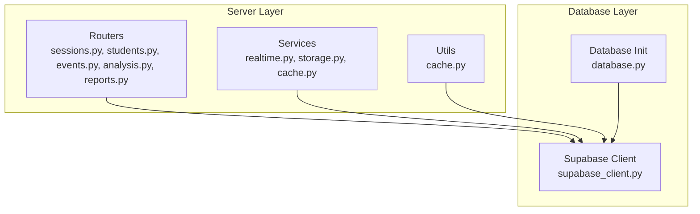
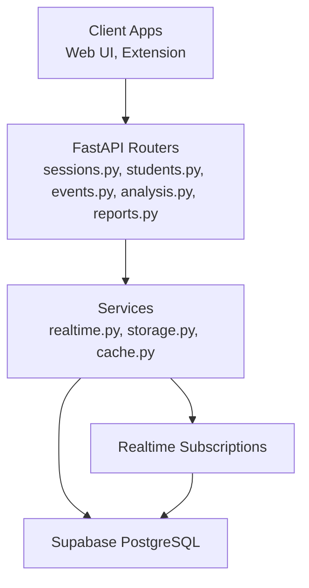
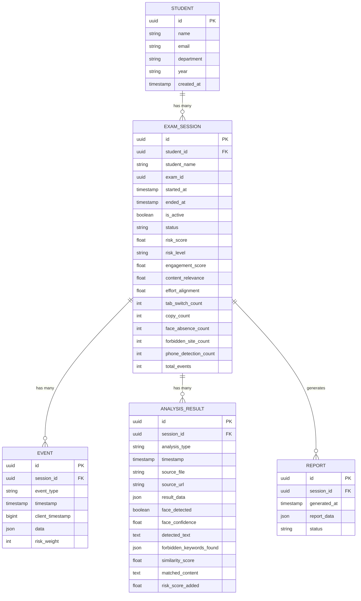
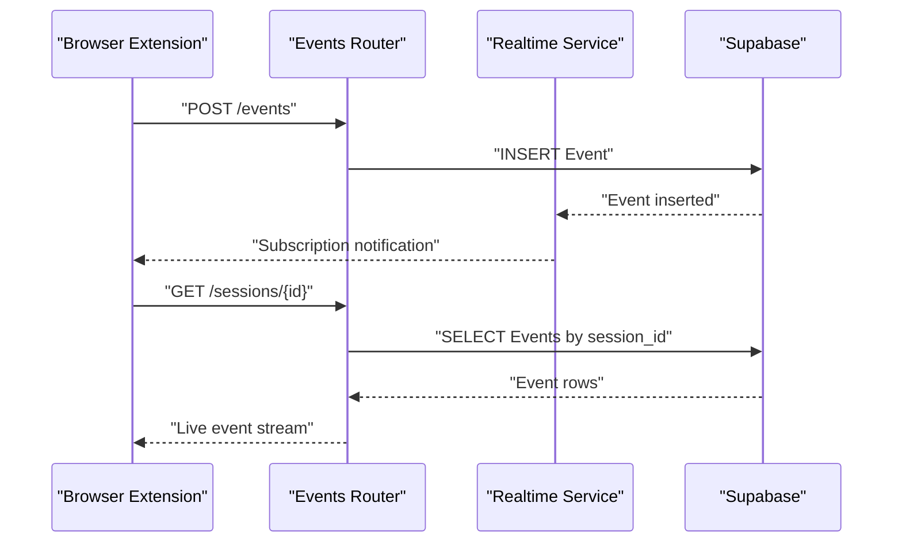
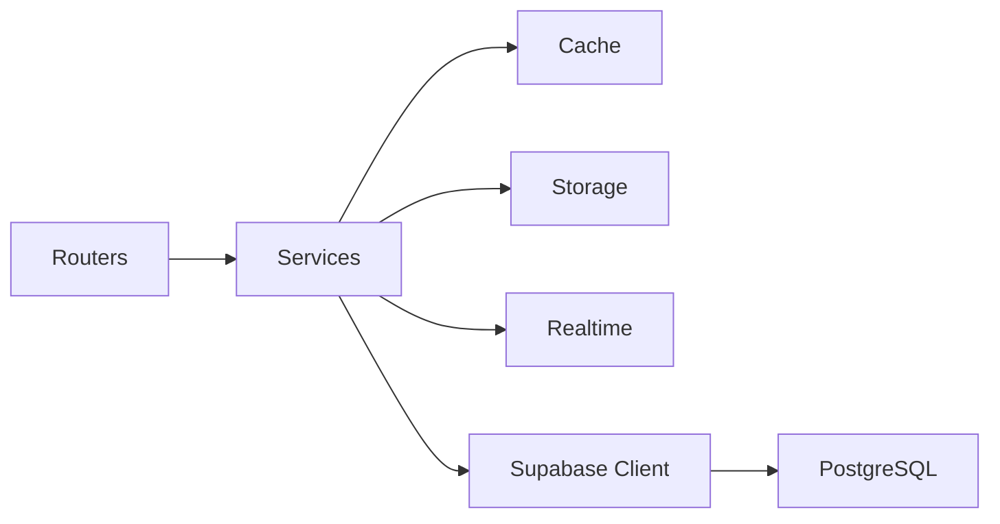

# Database Design

<cite>
**Referenced Files in This Document**
- [database.py](file://server/database.py)
- [supabase_client.py](file://server/supabase_client.py)
- [session.py](file://server/models/session.py)
- [student.py](file://server/models/student.py)
- [event.py](file://server/models/event.py)
- [analysis.py](file://server/models/analysis.py)
- [sessions.py](file://server/routers/sessions.py)
- [students.py](file://server/routers/students.py)
- [events.py](file://server/routers/events.py)
- [analysis.py](file://server/routers/analysis.py)
- [reports.py](file://server/routers/reports.py)
- [cache.py](file://server/utils/cache.py)
- [realtime.py](file://server/services/realtime.py)
- [storage.py](file://server/services/storage.py)
- [config.py](file://server/config.py)
</cite>

## Table of Contents
1. [Introduction](#introduction)
2. [Project Structure](#project-structure)
3. [Core Components](#core-components)
4. [Architecture Overview](#architecture-overview)
5. [Detailed Component Analysis](#detailed-component-analysis)
6. [Dependency Analysis](#dependency-analysis)
7. [Performance Considerations](#performance-considerations)
8. [Troubleshooting Guide](#troubleshooting-guide)
9. [Conclusion](#conclusion)
10. [Appendices](#appendices)

## Introduction
This document provides comprehensive database design documentation for ExamGuard Pro, focusing on the Supabase PostgreSQL schema and real-time capabilities. It documents the entity relationship model among ExamSession, Student, Event, AnalysisResult, and Report entities, defines field semantics, constraints, and indexes, and explains data validation, business logic, and integrity measures. It also covers data access patterns, caching strategies, performance considerations for real-time updates, lifecycle management, migration and backup strategies, and security and privacy controls.

## Project Structure
The backend uses FastAPI routers to expose REST endpoints for CRUD operations and integrates with Supabase via a dedicated client. The database layer is thin, delegating schema management to Supabase while providing a unified client interface for application services.

**Diagram sources**
- [supabase_client.py:1-22](file://server/supabase_client.py#L1-L22)
- [database.py:1-24](file://server/database.py#L1-L24)
- [sessions.py](file://server/routers/sessions.py)
- [students.py](file://server/routers/students.py)
- [events.py](file://server/routers/events.py)
- [analysis.py](file://server/routers/analysis.py)
- [reports.py](file://server/routers/reports.py)
- [realtime.py](file://server/services/realtime.py)
- [storage.py](file://server/services/storage.py)
- [cache.py](file://server/utils/cache.py)

**Section sources**
- [supabase_client.py:1-22](file://server/supabase_client.py#L1-L22)
- [database.py:1-24](file://server/database.py#L1-L24)

## Core Components
This section defines the core entities and their fields, data types, and constraints inferred from Pydantic models used by the backend. These models represent the canonical schema for data persistence and API exchange.

- Student
  - Fields: id (UUID), name (text), email (text), department (text), year (text), created_at (timestamp)
  - Constraints: id is auto-generated; name is required; timestamps default to current UTC
  - Indexes: Primary key on id; optional indexes on email and name for search and join performance

- ExamSession
  - Fields: id (UUID), student_id (UUID), student_name (text), exam_id (UUID), started_at (timestamp), ended_at (timestamp), is_active (boolean), status (enum-like text), risk_score (float), risk_level (enum-like text), engagement_score (float), content_relevance (float), effort_alignment (float), tab_switch_count (integer), copy_count (integer), face_absence_count (integer), forbidden_site_count (integer), phone_detection_count (integer), total_events (integer)
  - Constraints: id auto-generated; defaults for numeric scores and counts; status and risk_level constrained by application logic; timestamps managed by backend
  - Indexes: Primary key on id; foreign key on student_id referencing Student.id; indexes on exam_id, status, risk_level, is_active for filtering and reporting

- Event
  - Fields: id (UUID), session_id (UUID), event_type (text), timestamp (timestamp), client_timestamp (bigint), data (JSON), risk_weight (integer)
  - Constraints: id auto-generated; session_id links to ExamSession; timestamps include server and client timestamps; JSON data stores flexible event payloads
  - Indexes: Primary key on id; foreign key on session_id referencing ExamSession.id; indexes on event_type, timestamp for analytics queries

- AnalysisResult
  - Fields: id (UUID), session_id (UUID), analysis_type (text), timestamp (timestamp), source_file (text), source_url (text), result_data (JSON), face_detected (boolean), face_confidence (float), detected_text (text), forbidden_keywords_found (JSON), similarity_score (float), matched_content (text), risk_score_added (float)
  - Constraints: id auto-generated; session_id links to ExamSession; JSON fields store structured results; risk_score_added accumulates risk contributions
  - Indexes: Primary key on id; foreign key on session_id referencing ExamSession.id; indexes on analysis_type, timestamp for time-series analytics

- Report
  - Fields: id (UUID), session_id (UUID), generated_at (timestamp), report_data (JSON), status (text)
  - Constraints: id auto-generated; session_id links to ExamSession; JSON payload contains aggregated findings; status indicates generation state
  - Indexes: Primary key on id; foreign key on session_id referencing ExamSession.id; indexes on generated_at and status for audit and retrieval

Validation and integrity:
- UUID generation ensures global uniqueness
- Timestamps enforce chronological ordering
- Foreign key constraints enforced by application logic and Supabase schema
- JSON fields enable flexible event and result storage with application-level validation

**Section sources**
- [student.py:1-17](file://server/models/student.py#L1-L17)
- [session.py:1-63](file://server/models/session.py#L1-L63)
- [event.py:1-30](file://server/models/event.py#L1-L30)
- [analysis.py:1-49](file://server/models/analysis.py#L1-L49)

## Architecture Overview
The system integrates FastAPI routers with Supabase for data persistence and real-time subscriptions. Services encapsulate specialized logic for caching, storage, and real-time updates.

**Diagram sources**
- [sessions.py](file://server/routers/sessions.py)
- [students.py](file://server/routers/students.py)
- [events.py](file://server/routers/events.py)
- [analysis.py](file://server/routers/analysis.py)
- [reports.py](file://server/routers/reports.py)
- [realtime.py](file://server/services/realtime.py)
- [storage.py](file://server/services/storage.py)
- [cache.py](file://server/utils/cache.py)
- [supabase_client.py:1-22](file://server/supabase_client.py#L1-L22)

## Detailed Component Analysis

### Entity Relationship Model
The ER model centers around ExamSession as the primary container for a student’s exam attempt. Events and AnalysisResults are time-stamped records associated with a session. Students provide identity and metadata. Reports aggregate session outcomes.

**Diagram sources**
- [student.py:1-17](file://server/models/student.py#L1-L17)
- [session.py:1-63](file://server/models/session.py#L1-L63)
- [event.py:1-30](file://server/models/event.py#L1-L30)
- [analysis.py:1-49](file://server/models/analysis.py#L1-L49)
- [reports.py](file://server/routers/reports.py)

### Data Access Patterns
- Sessions: List active sessions, fetch by id, update status and scores, close sessions
- Students: Register new students, update profile, list by filters
- Events: Stream events per session, batch insert for extension logs
- AnalysisResults: Append results per session, aggregate risk contributions
- Reports: Generate and retrieve reports by session

Caching strategies:
- Short-lived cache for frequently accessed session summaries
- TTL-based cache for student metadata and recent events
- LRU eviction for memory-constrained environments

Indexes and constraints:
- Primary keys on all entities
- Foreign keys enforced by application logic and Supabase schema
- Composite indexes on (status, risk_level) for filtering
- Range indexes on timestamps for time-series analytics

**Section sources**
- [sessions.py](file://server/routers/sessions.py)
- [students.py](file://server/routers/students.py)
- [events.py](file://server/routers/events.py)
- [analysis.py](file://server/routers/analysis.py)
- [cache.py](file://server/utils/cache.py)

### Real-Time Updates and Subscriptions
Real-time capabilities are implemented via Supabase Realtime. Clients subscribe to changes on specific tables or rows, enabling live dashboards and notifications.

**Diagram sources**
- [events.py](file://server/routers/events.py)
- [realtime.py](file://server/services/realtime.py)
- [supabase_client.py:1-22](file://server/supabase_client.py#L1-L22)

### Data Lifecycle Management
- Retention: Events and AnalysisResults older than N days are archived or purged based on policy
- Archival: Completed sessions and their associated records are moved to historical partitions or tables
- Deletion: Students and sessions can be anonymized or deleted per compliance requirements

### Migration and Version Management
- Schema migrations handled by Supabase; application models define canonical structure
- Environment-specific configurations via config.py
- Versioned checkpoints for analysis artifacts and stored media

### Backup Strategies
- Continuous backups enabled by Supabase
- Incremental snapshots for analysis artifacts and reports
- Off-site replication for regulatory compliance

### Security and Privacy Controls
- Role-based access control (RBAC) for admin, proctor, and student roles
- Row-level security (RLS) policies on tables
- Encryption at rest and in transit
- Audit logging for sensitive operations

## Dependency Analysis
The backend depends on Supabase for persistence and real-time. Routers orchestrate requests to services, which encapsulate caching, storage, and real-time logic.

**Diagram sources**
- [supabase_client.py:1-22](file://server/supabase_client.py#L1-L22)
- [cache.py](file://server/utils/cache.py)
- [storage.py](file://server/services/storage.py)
- [realtime.py](file://server/services/realtime.py)
- [database.py:1-24](file://server/database.py#L1-L24)

**Section sources**
- [supabase_client.py:1-22](file://server/supabase_client.py#L1-L22)
- [database.py:1-24](file://server/database.py#L1-L24)

## Performance Considerations
- Use indexes on foreign keys and frequently filtered columns
- Batch inserts for high-frequency event streams
- Asynchronous processing for heavy analysis workloads
- Connection pooling and retry logic for Supabase client
- CDN-backed storage for media assets referenced by AnalysisResult

## Troubleshooting Guide
Common issues and resolutions:
- Missing Supabase credentials: Verify environment variables and reinitialize client
- Realtime subscription failures: Check network connectivity and channel permissions
- Slow queries: Add appropriate indexes and refactor filters
- Cache misses: Adjust TTL and warming strategies

**Section sources**
- [supabase_client.py:10-22](file://server/supabase_client.py#L10-L22)
- [realtime.py](file://server/services/realtime.py)
- [cache.py](file://server/utils/cache.py)

## Conclusion
ExamGuard Pro’s database design leverages Supabase for scalable persistence and real-time updates. The schema enforces referential integrity through foreign keys and application logic, while Pydantic models ensure consistent data validation. With proper indexing, caching, and lifecycle management, the system supports high-throughput exam monitoring and reporting.

## Appendices

### Sample Data Structures
- Student: id, name, email, department, year, created_at
- ExamSession: id, student_id, student_name, exam_id, timestamps, flags, scores, counts
- Event: id, session_id, event_type, timestamp, client_timestamp, data, risk_weight
- AnalysisResult: id, session_id, analysis_type, timestamp, source references, results, risk contribution
- Report: id, session_id, generated_at, report_data, status

[No sources needed since this section provides conceptual summaries]