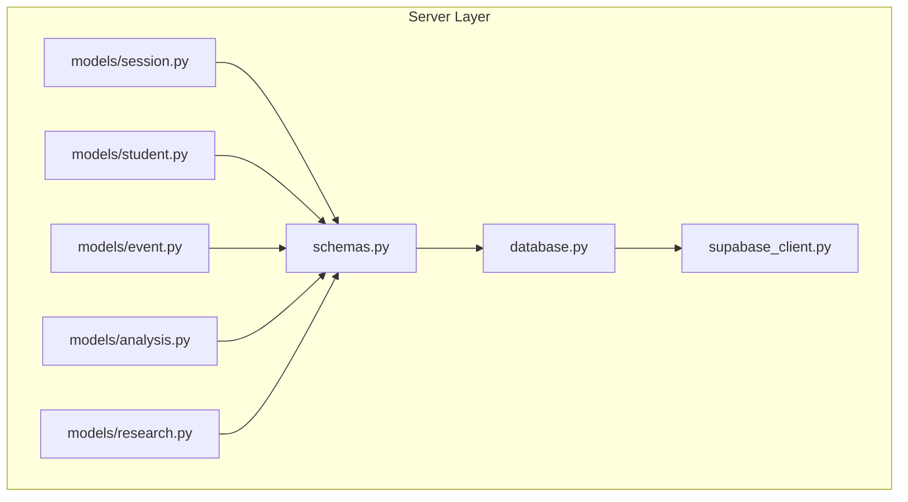
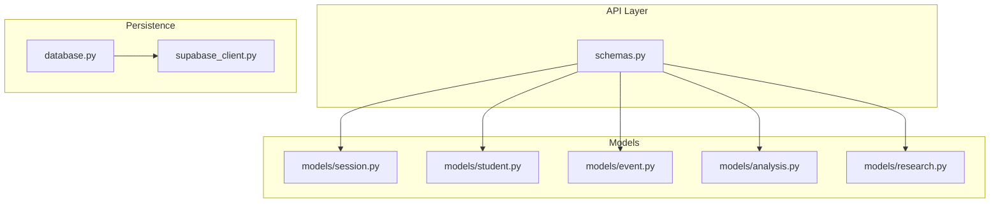
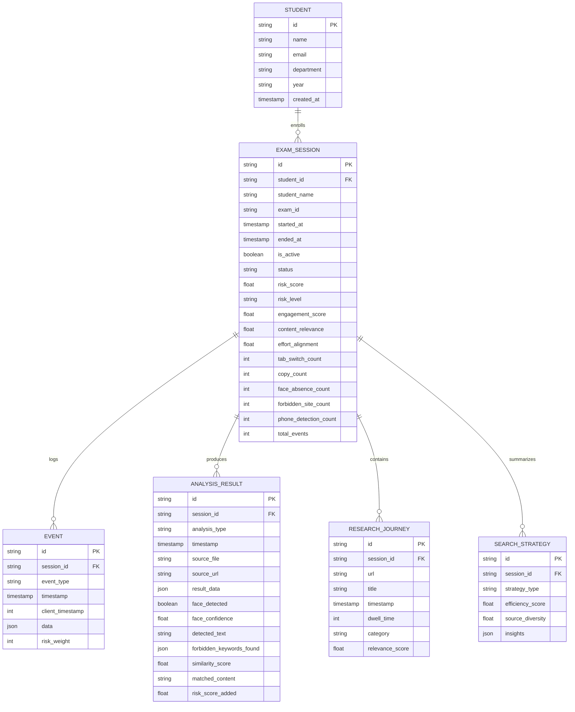
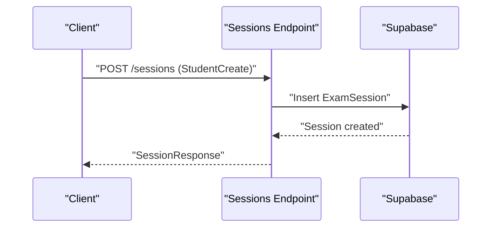
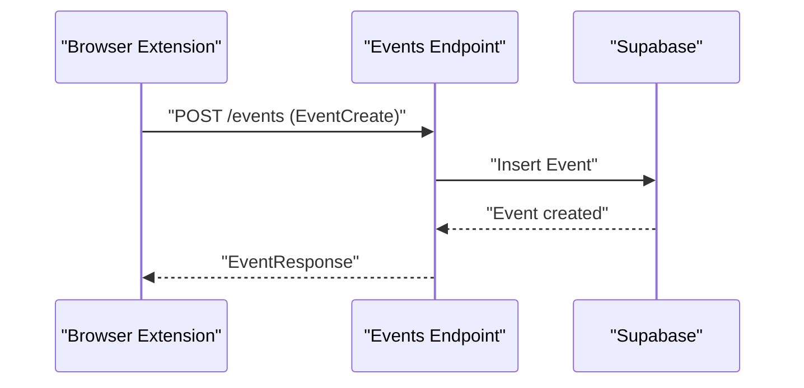
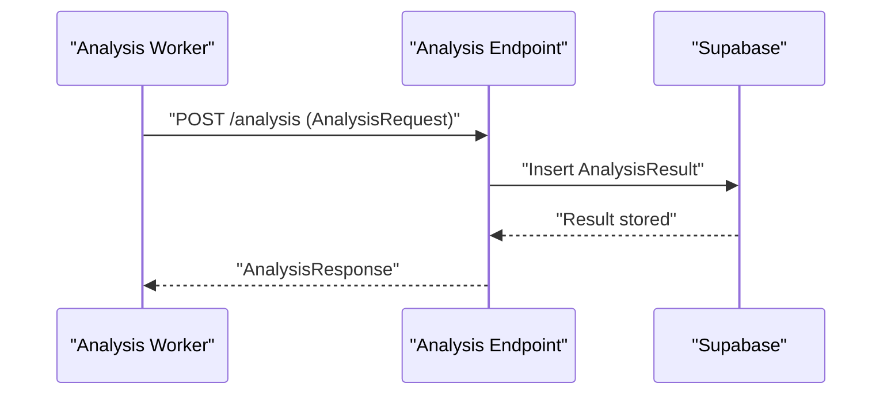
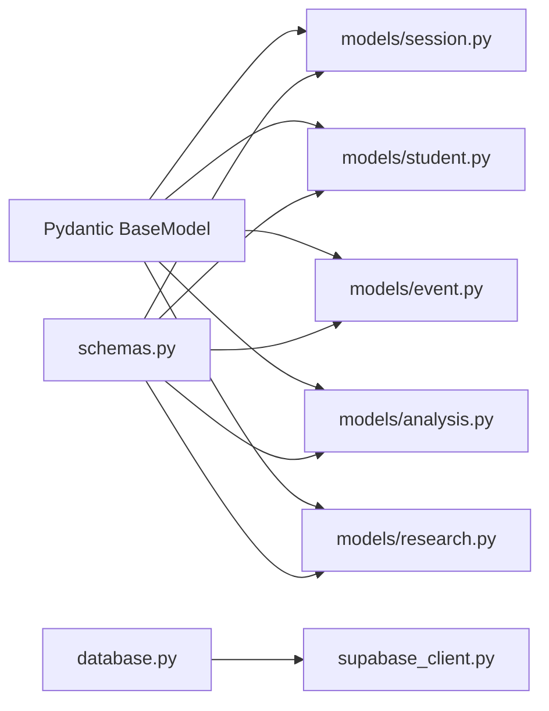

# Entity Relationship Models

<cite>
**Referenced Files in This Document**
- [session.py](file://server/models/session.py)
- [student.py](file://server/models/student.py)
- [event.py](file://server/models/event.py)
- [analysis.py](file://server/models/analysis.py)
- [research.py](file://server/models/research.py)
- [schemas.py](file://server/schemas.py)
- [database.py](file://server/database.py)
- [supabase_client.py](file://server/supabase_client.py)
</cite>

## Table of Contents
1. [Introduction](#introduction)
2. [Project Structure](#project-structure)
3. [Core Components](#core-components)
4. [Architecture Overview](#architecture-overview)
5. [Detailed Component Analysis](#detailed-component-analysis)
6. [Dependency Analysis](#dependency-analysis)
7. [Performance Considerations](#performance-considerations)
8. [Troubleshooting Guide](#troubleshooting-guide)
9. [Conclusion](#conclusion)

## Introduction
This document defines the core entity relationship models for ExamGuard Pro’s backend data layer. It focuses on four primary entities: ExamSession, Student, Event, and AnalysisResult, and two related research-focused entities: ResearchJourney and SearchStrategy. The document outlines each entity’s fields, primary keys, foreign key relationships, indexing strategies, business rules, validation constraints, and referential integrity requirements. It also includes ER diagrams and sequence diagrams to illustrate how sessions connect to students, events, and analysis results.

## Project Structure
The data models are implemented as Pydantic models under server/models and mirrored in server/schemas for API request/response validation. The backend connects to Supabase via a dedicated client and exposes database access through dependency injection.

**Diagram sources**
- [session.py:1-63](file://server/models/session.py#L1-L63)
- [student.py:1-17](file://server/models/student.py#L1-L17)
- [event.py:1-30](file://server/models/event.py#L1-L30)
- [analysis.py:1-49](file://server/models/analysis.py#L1-L49)
- [research.py:1-39](file://server/models/research.py#L1-L39)
- [schemas.py:1-135](file://server/schemas.py#L1-L135)
- [database.py:1-24](file://server/database.py#L1-L24)
- [supabase_client.py:1-22](file://server/supabase_client.py#L1-L22)

**Section sources**
- [database.py:1-24](file://server/database.py#L1-L24)
- [supabase_client.py:1-22](file://server/supabase_client.py#L1-L22)
- [schemas.py:1-135](file://server/schemas.py#L1-L135)

## Core Components
This section documents each entity with its fields, primary keys, and constraints. It also describes how entities relate to each other and the business rules governing their usage.

- ExamSession
  - Purpose: Represents a single exam session for a student.
  - Primary Key: id
  - Fields:
    - id: Unique identifier for the session
    - student_id: Identifier of the associated student
    - student_name: Name of the student
    - exam_id: Identifier of the exam being taken
    - started_at: UTC timestamp when the session started
    - ended_at: Optional UTC timestamp when the session ended
    - is_active: Boolean flag indicating if the session is currently active
    - status: Enumerated value among recording, processing, completed, flagged
    - risk_score: Numeric risk score accumulated during the session
    - risk_level: Enumerated value among safe, review, suspicious
    - engagement_score: AI-derived engagement score (0–100)
    - content_relevance: AI-derived content relevance score (0–100)
    - effort_alignment: AI-derived effort alignment score (0–100)
    - tab_switch_count, copy_count, face_absence_count, forbidden_site_count, phone_detection_count, total_events: Counters derived from events
  - Business Rules:
    - started_at defaults to current UTC time
    - ended_at must be greater than or equal to started_at if set
    - risk_level is derived from risk_score thresholds
    - is_active implies status is recording or processing
    - engagement_score, content_relevance, effort_alignment are normalized to 0–100
  - Validation Constraints:
    - student_id must reference an existing Student
    - exam_id identifies the exam context
    - status and risk_level are constrained enumerations
  - Referential Integrity:
    - ExamSession.student_id → Student.id

- Student
  - Purpose: Stores student profile information.
  - Primary Key: id
  - Fields:
    - id: Unique identifier for the student
    - name: Full name of the student
    - email: Optional email address
    - department: Optional department
    - year: Optional academic year
    - created_at: UTC timestamp when the record was created
  - Business Rules:
    - created_at defaults to current UTC time
  - Validation Constraints:
    - name is required
    - email conforms to email format if present
  - Referential Integrity:
    - No incoming foreign keys; acts as a parent entity

- Event
  - Purpose: Captures activity events emitted by the browser extension during a session.
  - Primary Key: id
  - Fields:
    - id: Unique identifier for the event
    - session_id: Identifier linking the event to a session
    - event_type: Type of event (e.g., tab switch, copy, forbidden site visit)
    - timestamp: UTC timestamp when the event occurred
    - client_timestamp: Optional integer timestamp from the client
    - data: JSON payload containing event-specific details
    - risk_weight: Integer weight applied to contribute to risk score
  - Business Rules:
    - timestamp defaults to current UTC time
    - risk_weight is non-negative
  - Validation Constraints:
    - session_id must reference an existing ExamSession
    - event_type is constrained to documented types
  - Referential Integrity:
    - Event.session_id → ExamSession.id

- AnalysisResult
  - Purpose: Stores AI analysis outcomes for frames/screenshots captured during a session.
  - Primary Key: id
  - Fields:
    - id: Unique identifier for the analysis result
    - session_id: Identifier linking the result to a session
    - analysis_type: Type of analysis performed (e.g., FACE_DETECTION, OCR, TEXT_SIMILARITY, ANOMALY)
    - timestamp: UTC timestamp when the analysis was produced
    - source_file: Optional path to the source media file
    - source_url: Optional URL of the viewed page
    - result_data: Optional JSON payload with raw results
    - face_detected: Optional boolean indicating face presence
    - face_confidence: Optional confidence score for face detection
    - detected_text: Optional extracted text (OCR)
    - forbidden_keywords_found: Optional collection of keywords found
    - similarity_score: Optional similarity score (text matching)
    - matched_content: Optional matched content snippet
    - risk_score_added: Numeric risk contribution from this analysis
  - Business Rules:
    - risk_score_added is non-negative
    - timestamp defaults to current UTC time
  - Validation Constraints:
    - session_id must reference an existing ExamSession
    - analysis_type is constrained to documented types
  - Referential Integrity:
    - AnalysisResult.session_id → ExamSession.id

- ResearchJourney
  - Purpose: Tracks URLs visited by a student during a session with categorization and metrics.
  - Primary Key: id
  - Fields:
    - id: Unique identifier for the journey entry
    - session_id: Identifier linking the entry to a session
    - url: Visited URL
    - title: Optional page title
    - timestamp: UTC timestamp when the visit occurred
    - dwell_time: Seconds spent on the site
    - category: Category of the site (Documentation, Tutorial, Community, Search, Forbidden)
    - relevance_score: Relevance score (0–1)
  - Business Rules:
    - dwell_time is non-negative
    - relevance_score is bounded to 0–1
  - Validation Constraints:
    - session_id must reference an existing ExamSession
  - Referential Integrity:
    - ResearchJourney.session_id → ExamSession.id

- SearchStrategy
  - Purpose: Aggregates insights about how a student searched for information during a session.
  - Primary Key: id
  - Fields:
    - id: Unique identifier for the strategy record
    - session_id: Identifier linking the strategy to a session
    - strategy_type: Optional descriptor (e.g., Documentation-first)
    - efficiency_score: Efficiency metric (0–100)
    - source_diversity: Diversity metric (0–100)
    - insights: Optional JSON payload with aggregated insights
  - Business Rules:
    - efficiency_score and source_diversity are bounded to 0–100
  - Validation Constraints:
    - session_id must reference an existing ExamSession
  - Referential Integrity:
    - SearchStrategy.session_id → ExamSession.id

**Section sources**
- [session.py:15-63](file://server/models/session.py#L15-L63)
- [student.py:6-17](file://server/models/student.py#L6-L17)
- [event.py:6-30](file://server/models/event.py#L6-L30)
- [analysis.py:6-49](file://server/models/analysis.py#L6-L49)
- [research.py:6-39](file://server/models/research.py#L6-L39)

## Architecture Overview
The backend uses Supabase as the persistence layer. Pydantic models define the internal representation of entities, while schemas define API request/response contracts. Dependencies inject the Supabase client for database operations.

**Diagram sources**
- [schemas.py:1-135](file://server/schemas.py#L1-L135)
- [session.py:1-63](file://server/models/session.py#L1-L63)
- [student.py:1-17](file://server/models/student.py#L1-L17)
- [event.py:1-30](file://server/models/event.py#L1-L30)
- [analysis.py:1-49](file://server/models/analysis.py#L1-L49)
- [research.py:1-39](file://server/models/research.py#L1-L39)
- [database.py:1-24](file://server/database.py#L1-L24)
- [supabase_client.py:1-22](file://server/supabase_client.py#L1-L22)

## Detailed Component Analysis

### Entity Relationship Diagram
This diagram shows primary keys, foreign keys, and relationships among entities.

**Diagram sources**
- [session.py:15-63](file://server/models/session.py#L15-L63)
- [student.py:6-17](file://server/models/student.py#L6-L17)
- [event.py:6-30](file://server/models/event.py#L6-L30)
- [analysis.py:6-49](file://server/models/analysis.py#L6-L49)
- [research.py:6-39](file://server/models/research.py#L6-L39)

### Indexing Strategies
- Primary Keys:
  - All entities use string UUIDs as primary keys; ensure indexing on id for fast lookups.
- Foreign Keys:
  - student_id in ExamSession
  - session_id in Event, AnalysisResult, ResearchJourney, SearchStrategy
  - Create secondary indexes on session_id for efficient joins and filtering.
- Timestamps:
  - started_at, ended_at, timestamp fields should be indexed for range queries and sorting.
- Categories and Types:
  - event_type, analysis_type, risk_level, status, category should be indexed if frequently filtered.

### Business Rules and Validation Constraints
- Session lifecycle:
  - started_at must precede or equal ended_at if set
  - is_active implies status is recording or processing
  - risk_level derived from risk_score thresholds
- Events:
  - risk_weight non-negative; event_type constrained to documented values
- Analysis:
  - risk_score_added non-negative; analysis_type constrained to documented values
- Research:
  - dwell_time non-negative; relevance_score in [0, 1]; efficiency_score and source_diversity in [0, 100]
- Referential Integrity:
  - All foreign keys must reference existing parent records

### API Interaction Flows

#### Create Session and Link Student

**Diagram sources**
- [schemas.py:30-44](file://server/schemas.py#L30-L44)
- [session.py:15-63](file://server/models/session.py#L15-L63)

#### Log Events During a Session

**Diagram sources**
- [schemas.py:63-84](file://server/schemas.py#L63-L84)
- [event.py:6-30](file://server/models/event.py#L6-L30)

#### Submit Analysis Results for a Session

**Diagram sources**
- [schemas.py:88-102](file://server/schemas.py#L88-L102)
- [analysis.py:6-49](file://server/models/analysis.py#L6-L49)

## Dependency Analysis
- Models depend on Pydantic for validation and serialization.
- Schemas define request/response contracts and mirror model fields for API safety.
- database.py provides a dependency that yields the Supabase client initialized in supabase_client.py.
- Entities are loosely coupled via foreign keys; maintain referential integrity at the application level.

**Diagram sources**
- [session.py:1-63](file://server/models/session.py#L1-L63)
- [student.py:1-17](file://server/models/student.py#L1-L17)
- [event.py:1-30](file://server/models/event.py#L1-L30)
- [analysis.py:1-49](file://server/models/analysis.py#L1-L49)
- [research.py:1-39](file://server/models/research.py#L1-L39)
- [schemas.py:1-135](file://server/schemas.py#L1-L135)
- [database.py:1-24](file://server/database.py#L1-L24)
- [supabase_client.py:1-22](file://server/supabase_client.py#L1-L22)

**Section sources**
- [schemas.py:1-135](file://server/schemas.py#L1-L135)
- [database.py:1-24](file://server/database.py#L1-L24)
- [supabase_client.py:1-22](file://server/supabase_client.py#L1-L22)

## Performance Considerations
- Use batch inserts for events and analysis results to reduce round trips.
- Index foreign keys (session_id, student_id) and timestamps for efficient filtering and sorting.
- Normalize risk-related counters and scores to avoid redundant calculations.
- Cache frequent queries (e.g., latest session per student) to minimize database load.

## Troubleshooting Guide
- Missing Supabase credentials:
  - Symptom: Warning printed and client initialization fails.
  - Action: Set SUPABASE_URL and SUPABASE_KEY environment variables.
- Validation errors:
  - Symptom: Request rejected due to schema mismatch.
  - Action: Ensure fields match schemas.py definitions and constraints.
- Referential integrity violations:
  - Symptom: Insertion fails due to missing parent record.
  - Action: Verify that student_id and session_id correspond to existing entities.

**Section sources**
- [supabase_client.py:12-17](file://server/supabase_client.py#L12-L17)
- [schemas.py:13-26](file://server/schemas.py#L13-L26)
- [schemas.py:30-44](file://server/schemas.py#L30-L44)
- [schemas.py:63-84](file://server/schemas.py#L63-L84)
- [schemas.py:88-102](file://server/schemas.py#L88-L102)

## Conclusion
The entity model for ExamGuard Pro centers on ExamSession as the core hub connecting Students, Events, AnalysisResults, and ResearchJourney/SearchStrategy. Pydantic models and schemas enforce validation and serialization, while Supabase provides persistence. Proper indexing and referential integrity are essential for performance and data correctness. The ER and sequence diagrams clarify relationships and operational flows, supporting robust system maintenance and future enhancements.