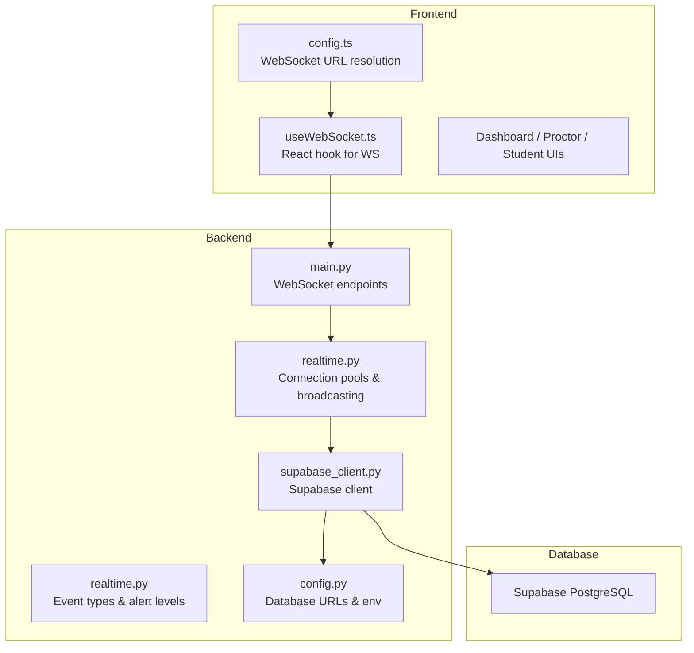
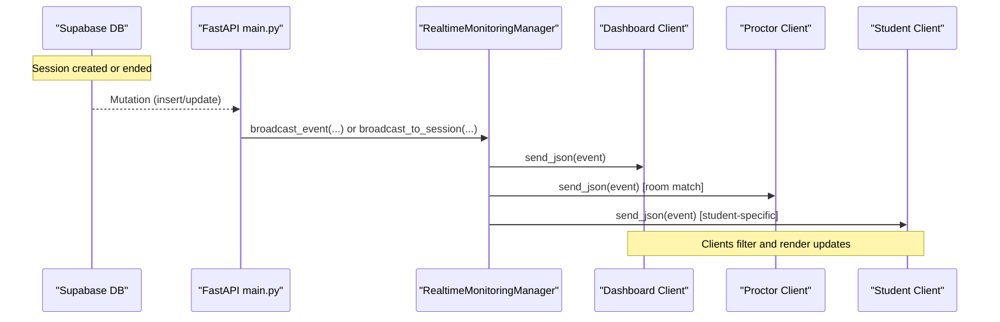
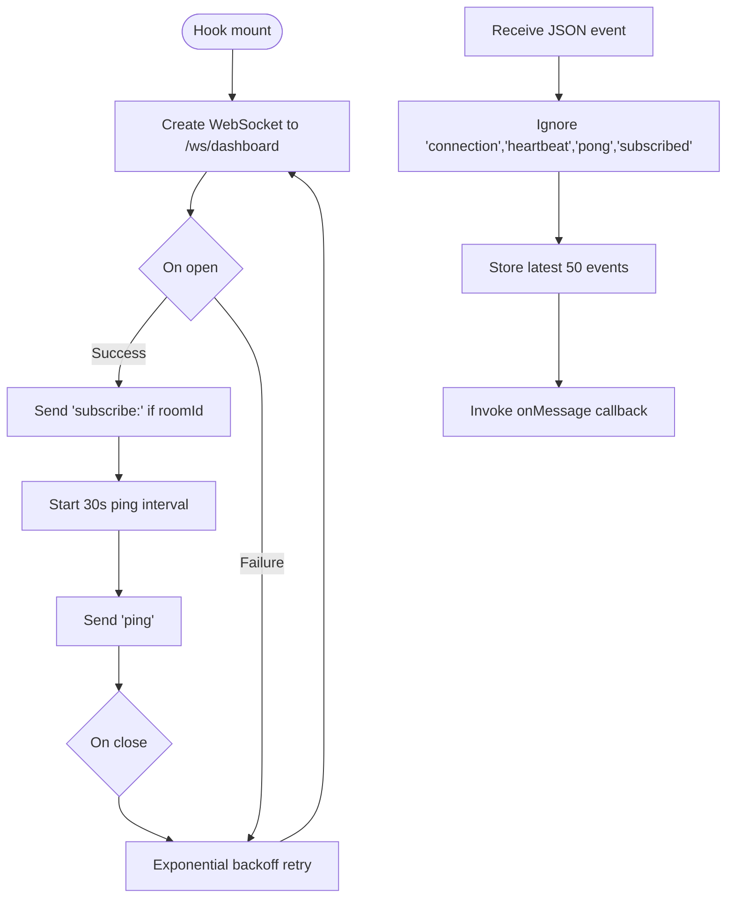
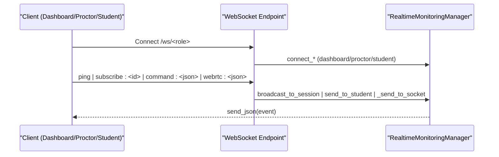
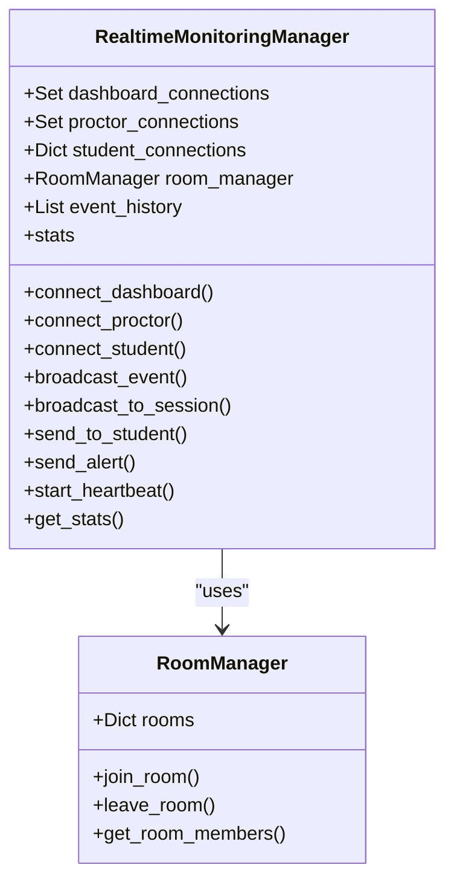
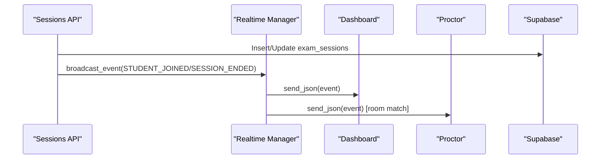
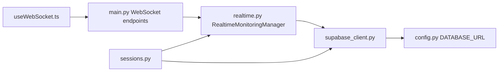

# Real-Time Data Synchronization

<cite>
**Referenced Files in This Document**
- [supabase_client.py](file://server/supabase_client.py)
- [config.py](file://server/config.py)
- [main.py](file://server/main.py)
- [realtime.py](file://server/services/realtime.py)
- [useWebSocket.ts](file://examguard-pro/src/hooks/useWebSocket.ts)
- [config.ts](file://examguard-pro/src/config.ts)
- [sessions.py](file://server/api/endpoints/sessions.py)
- [logger.py](file://server/utils/logger.py)
</cite>

## Table of Contents
1. [Introduction](#introduction)
2. [Project Structure](#project-structure)
3. [Core Components](#core-components)
4. [Architecture Overview](#architecture-overview)
5. [Detailed Component Analysis](#detailed-component-analysis)
6. [Dependency Analysis](#dependency-analysis)
7. [Performance Considerations](#performance-considerations)
8. [Troubleshooting Guide](#troubleshooting-guide)
9. [Conclusion](#conclusion)

## Introduction
This document explains ExamGuard Pro’s real-time data synchronization powered by WebSocket connections and Supabase-managed infrastructure. It covers how database changes (e.g., session creation and termination) trigger real-time updates to dashboard, proctor, and student interfaces. It documents the channel management system for session-based communication, the event propagation pipeline from database mutations to WebSocket broadcasts, and client-side connection management with reconnection strategies. Security considerations and performance optimizations for high-frequency updates and concurrent connections are also addressed.

## Project Structure
The real-time system spans three layers:
- Frontend (React): WebSocket client hook and configuration
- Backend (FastAPI): WebSocket endpoints, connection management, and event broadcasting
- Database (Supabase): Data persistence and mutation triggers that initiate real-time updates

**Diagram sources**
- [config.ts:1-13](file://examguard-pro/src/config.ts#L1-L13)
- [useWebSocket.ts:1-110](file://examguard-pro/src/hooks/useWebSocket.ts#L1-L110)
- [main.py:274-501](file://server/main.py#L274-L501)
- [realtime.py:102-138](file://server/services/realtime.py#L102-L138)
- [supabase_client.py:1-22](file://server/supabase_client.py#L1-L22)
- [config.py:16-42](file://server/config.py#L16-L42)

**Section sources**
- [config.ts:1-13](file://examguard-pro/src/config.ts#L1-L13)
- [useWebSocket.ts:1-110](file://examguard-pro/src/hooks/useWebSocket.ts#L1-L110)
- [main.py:274-501](file://server/main.py#L274-L501)
- [realtime.py:102-138](file://server/services/realtime.py#L102-L138)
- [supabase_client.py:1-22](file://server/supabase_client.py#L1-L22)
- [config.py:16-42](file://server/config.py#L16-L42)

## Core Components
- WebSocket client hook: Establishes connections, manages reconnection, and filters incoming messages.
- WebSocket server endpoints: Provide dashboard, proctor, and student channels with per-session rooms.
- Real-time manager: Maintains connection pools, rooms, event history, and broadcasts to appropriate subscribers.
- Supabase client: Provides database connectivity for session lifecycle operations and status updates.
- Event taxonomy: Defines event types and alert levels for consistent real-time messaging.

Key responsibilities:
- Connection lifecycle: Accept, maintain, and gracefully remove WebSocket connections.
- Channel routing: Route messages to dashboards, proctors, students, and session rooms.
- Event history: Buffer recent events for late-joining clients.
- Heartbeat: Keep connections alive and expose stats.
- Binary streaming: Forward live webcam/video chunks to dashboards and proctors.

**Section sources**
- [useWebSocket.ts:1-110](file://examguard-pro/src/hooks/useWebSocket.ts#L1-L110)
- [main.py:274-501](file://server/main.py#L274-L501)
- [realtime.py:102-138](file://server/services/realtime.py#L102-L138)
- [supabase_client.py:1-22](file://server/supabase_client.py#L1-L22)

## Architecture Overview
The real-time architecture integrates database-driven triggers with WebSocket broadcasting:

**Diagram sources**
- [sessions.py:72-93](file://server/api/endpoints/sessions.py#L72-L93)
- [realtime.py:334-377](file://server/services/realtime.py#L334-L377)
- [main.py:274-501](file://server/main.py#L274-L501)

## Detailed Component Analysis

### WebSocket Client Hook (Frontend)
The React hook manages:
- Connection establishment to the dashboard endpoint
- Room subscription via a subscribe command
- Heartbeat ping/pong
- Exponential backoff reconnection
- Message filtering and buffering

**Diagram sources**
- [useWebSocket.ts:18-109](file://examguard-pro/src/hooks/useWebSocket.ts#L18-L109)

**Section sources**
- [useWebSocket.ts:1-110](file://examguard-pro/src/hooks/useWebSocket.ts#L1-L110)
- [config.ts:1-13](file://examguard-pro/src/config.ts#L1-L13)

### WebSocket Server Endpoints (Backend)
Endpoints provide role-specific channels:
- Dashboard: receives all events across sessions
- Proctor: receives only session-specific events
- Student: receives targeted alerts and instructions

Commands supported:
- ping/pong for liveness
- subscribe:<session_id> for room joining
- stats for runtime metrics
- command:<json> for dashboard-to-student routing
- webrtc:<json> for signaling routing

**Diagram sources**
- [main.py:274-501](file://server/main.py#L274-L501)
- [realtime.py:213-274](file://server/services/realtime.py#L213-L274)

**Section sources**
- [main.py:274-501](file://server/main.py#L274-L501)
- [realtime.py:81-138](file://server/services/realtime.py#L81-L138)

### Real-Time Manager and Channel Management
The manager maintains:
- Connection pools: dashboards, proctors, student-to-connection map
- Room manager: per-session membership for targeted broadcasting
- Event history: recent events for late-joiners
- Stats: counts and counters for monitoring

Broadcasting logic:
- All dashboards receive every event
- Session-specific proctors receive events for their room
- Students receive targeted messages or session-wide broadcasts

**Diagram sources**
- [realtime.py:102-138](file://server/services/realtime.py#L102-L138)
- [realtime.py:81-100](file://server/services/realtime.py#L81-L100)

**Section sources**
- [realtime.py:102-138](file://server/services/realtime.py#L102-L138)
- [realtime.py:334-416](file://server/services/realtime.py#L334-L416)

### Event Propagation Pipeline
Database mutations trigger real-time updates:
- Session creation: broadcast student_joined to the exam-level room
- Session termination: broadcast session_ended
- Student disconnect: broadcast student_left and update DB status

**Diagram sources**
- [sessions.py:72-93](file://server/api/endpoints/sessions.py#L72-L93)
- [sessions.py:184-195](file://server/api/endpoints/sessions.py#L184-L195)
- [realtime.py:334-377](file://server/services/realtime.py#L334-L377)

**Section sources**
- [sessions.py:12-106](file://server/api/endpoints/sessions.py#L12-L106)
- [sessions.py:146-208](file://server/api/endpoints/sessions.py#L146-L208)

### Examples of Real-Time Updates
- New event: A student triggers a tab switch; the client sends event:{"type":"tab_switch"}, which the server maps to an event and broadcasts to the session room.
- Session status change: Creating a session emits STUDENT_JOINED; ending a session emits SESSION_ENDED.
- Analysis result: AI detectors can emit anomaly alerts that are broadcast to dashboards and proctors.

**Section sources**
- [main.py:427-451](file://server/main.py#L427-L451)
- [realtime.py:421-505](file://server/services/realtime.py#L421-L505)

## Dependency Analysis
- Frontend depends on backend WebSocket endpoints and configuration.
- Backend depends on the real-time manager for connection and broadcasting logic.
- Database connectivity is provided by the Supabase client, used by API endpoints to persist session state and by the student endpoint to mark sessions as ended on disconnect.

**Diagram sources**
- [useWebSocket.ts:1-110](file://examguard-pro/src/hooks/useWebSocket.ts#L1-L110)
- [main.py:274-501](file://server/main.py#L274-L501)
- [realtime.py:102-138](file://server/services/realtime.py#L102-L138)
- [supabase_client.py:1-22](file://server/supabase_client.py#L1-L22)
- [config.py:16-42](file://server/config.py#L16-L42)
- [sessions.py:12-106](file://server/api/endpoints/sessions.py#L12-L106)

**Section sources**
- [main.py:274-501](file://server/main.py#L274-L501)
- [realtime.py:102-138](file://server/services/realtime.py#L102-L138)
- [supabase_client.py:1-22](file://server/supabase_client.py#L1-L22)
- [config.py:16-42](file://server/config.py#L16-L42)
- [sessions.py:12-106](file://server/api/endpoints/sessions.py#L12-L106)

## Performance Considerations
- Connection pooling and room-based routing minimize unnecessary fan-out.
- Heartbeat messages keep connections alive and enable quick detection of failures.
- Event history buffers recent events for late-joiners without re-querying the database.
- Binary streaming for webcam/video chunks is forwarded directly to dashboards and proctors to reduce latency.
- Exponential backoff limits reconnection storms on transient failures.
- Stats expose connection counts, event volume, and alert totals for capacity planning.

[No sources needed since this section provides general guidance]

## Troubleshooting Guide
Common issues and remedies:
- No real-time updates on dashboard: Verify the client is subscribed to the correct room and that the backend is broadcasting to dashboards and the session room.
- Frequent reconnections: Check network stability and client-side heartbeat intervals; review exponential backoff behavior.
- Missing late-joiner events: Confirm the event history buffer is enabled and recent events are being sent on connect.
- Session status not updating: Ensure the student endpoint updates the database on disconnect and that the API endpoint broadcasts session_ended.

Operational logging:
- Use centralized logging utilities to capture event and analysis logs for debugging.

**Section sources**
- [logger.py:51-64](file://server/utils/logger.py#L51-L64)
- [useWebSocket.ts:60-78](file://examguard-pro/src/hooks/useWebSocket.ts#L60-L78)
- [main.py:471-501](file://server/main.py#L471-L501)

## Security Considerations
- Authentication and authorization: While the WebSocket endpoints accept connections, the frontend should enforce role-based access and secure tokens before connecting to proctor or student channels.
- CORS: Configure allowed origins appropriately; wildcard is used for development and extension support.
- Data exposure: Limit sensitive fields in event payloads; avoid leaking internal identifiers.
- Token revocation: Ensure user sessions and tokens are invalidated on logout to prevent unauthorized access to real-time channels.

[No sources needed since this section provides general guidance]

## Conclusion
ExamGuard Pro’s real-time system combines Supabase-backed database operations with FastAPI WebSocket endpoints and a robust real-time manager. Database mutations trigger targeted broadcasts to dashboards, proctors, and students, with session-based room management ensuring precise routing. The frontend client hook provides resilient connections with heartbeat and reconnection strategies. Together, these components deliver responsive, scalable real-time monitoring for exam environments.