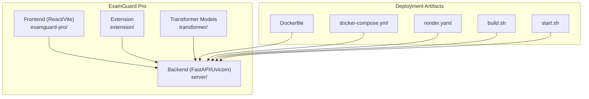
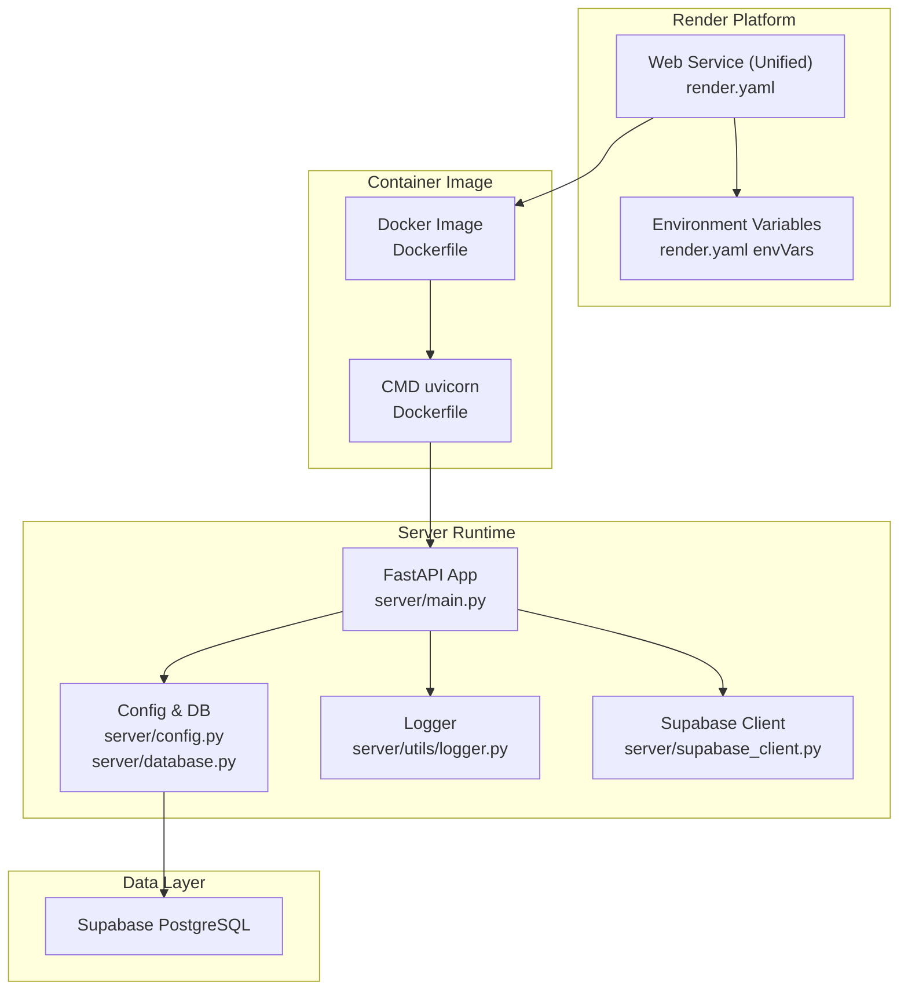
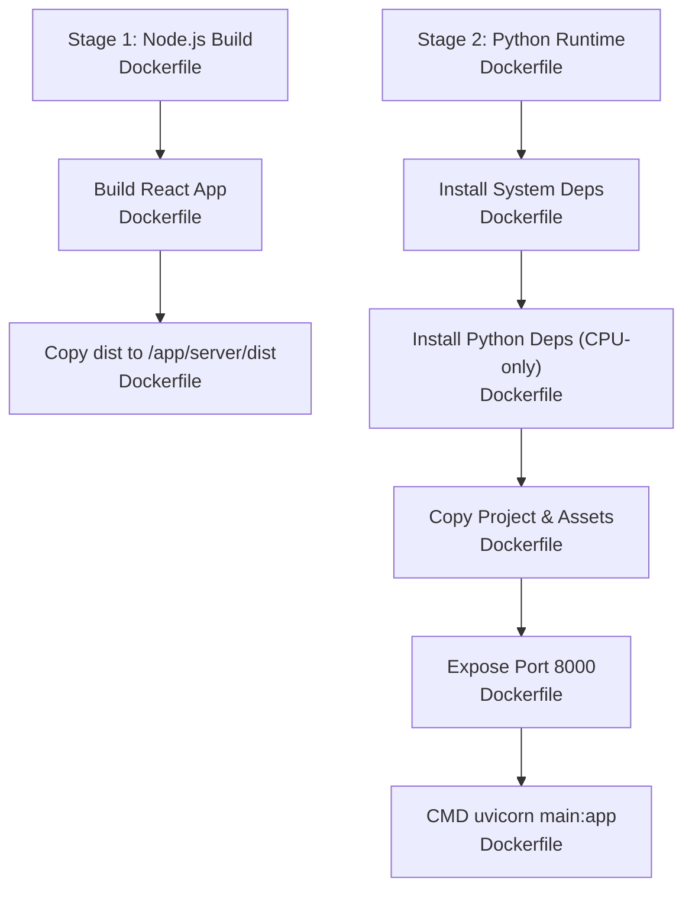
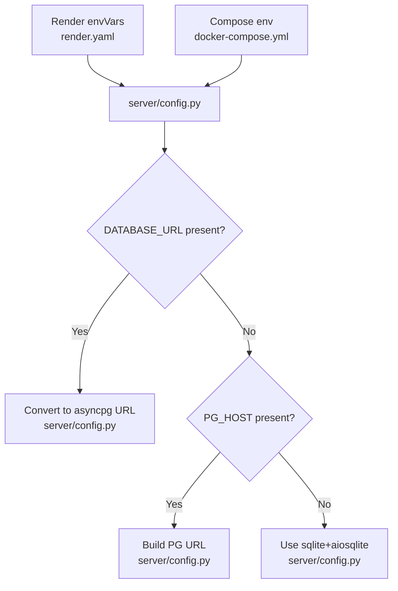
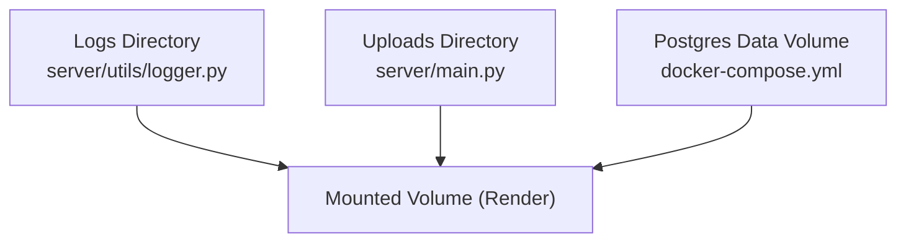
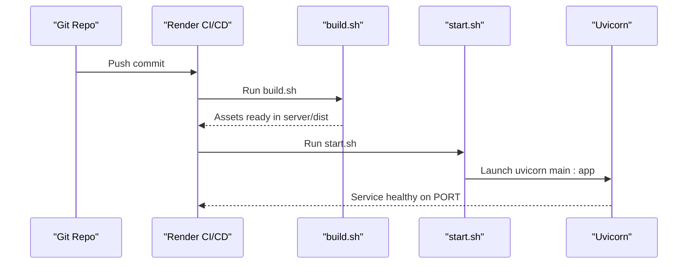
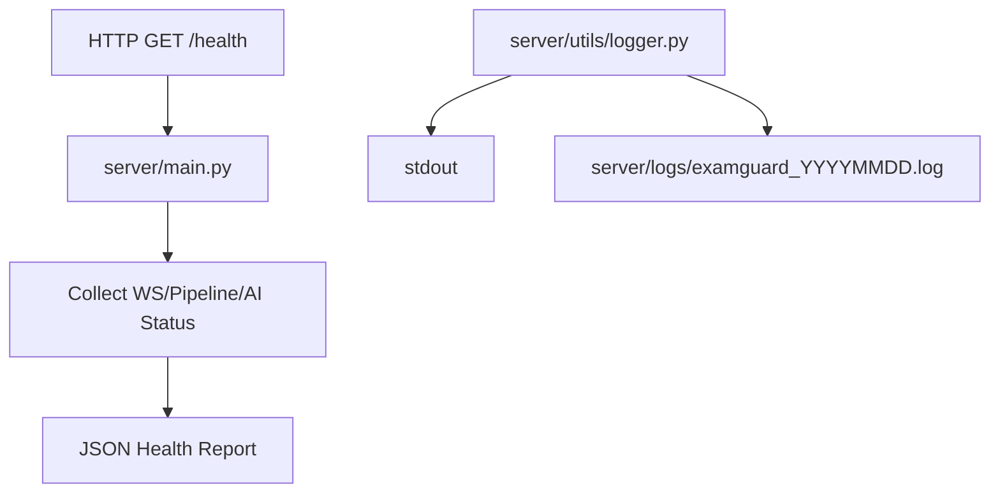
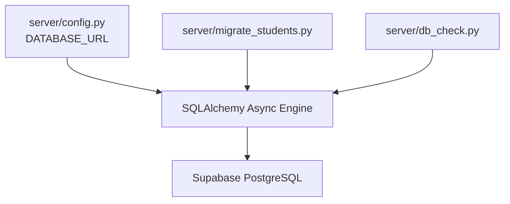
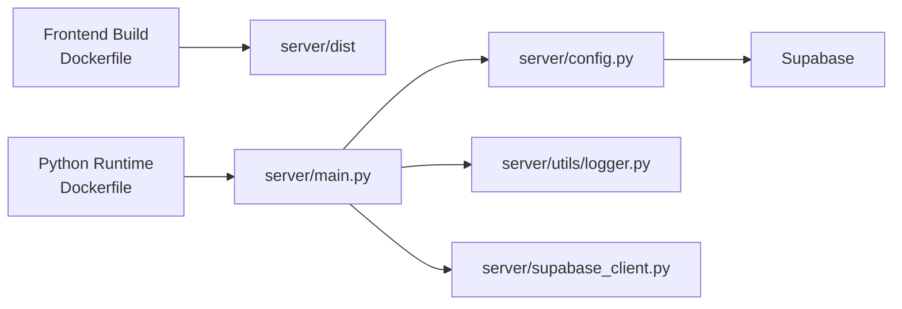

# Deployment & Operations

<cite>
**Referenced Files in This Document**
- [Dockerfile](file://Dockerfile)
- [render.yaml](file://render.yaml)
- [docker-compose.yml](file://docker-compose.yml)
- [build.sh](file://build.sh)
- [start.sh](file://start.sh)
- [server/main.py](file://server/main.py)
- [server/config.py](file://server/config.py)
- [server/utils/logger.py](file://server/utils/logger.py)
- [server/database.py](file://server/database.py)
- [server/supabase_client.py](file://server/supabase_client.py)
- [server/auth/config.py](file://server/auth/config.py)
- [server/migrate_students.py](file://server/migrate_students.py)
- [server/db_check.py](file://server/db_check.py)
- [deployment/docker-compose.yml](file://deployment/docker-compose.yml)
</cite>

## Table of Contents
1. [Introduction](#introduction)
2. [Project Structure](#project-structure)
3. [Core Components](#core-components)
4. [Architecture Overview](#architecture-overview)
5. [Detailed Component Analysis](#detailed-component-analysis)
6. [Dependency Analysis](#dependency-analysis)
7. [Performance Considerations](#performance-considerations)
8. [Troubleshooting Guide](#troubleshooting-guide)
9. [Conclusion](#conclusion)
10. [Appendices](#appendices)

## Introduction
This document provides comprehensive deployment and operations guidance for ExamGuard Pro in production. It covers containerization with a multi-stage Docker build, environment configuration, and persistent data handling. It explains deployment topology using the Render platform, including environment variables, build commands, and startup scripts. Monitoring and logging strategies leverage built-in utilities and external tools. Scaling, load balancing, and high availability considerations are addressed alongside security best practices for SSL/TLS, secret management, and network security. Operational procedures include troubleshooting, performance optimization, maintenance, backup and disaster recovery, database migrations, and upgrade protocols tailored for production environments.

## Project Structure
The repository is organized into:
- Frontend dashboard under examguard-pro (React/Vite build)
- Backend server under server (FastAPI/Uvicorn)
- Extension under extension (browser extension assets)
- Transformer models under transformer (training/inference assets)
- Deployment artifacts: Dockerfile, docker-compose.yml, build/start scripts, and Render configuration

**Diagram sources**
- [Dockerfile:1-55](file://Dockerfile#L1-L55)
- [docker-compose.yml:1-50](file://docker-compose.yml#L1-L50)
- [render.yaml:1-36](file://render.yaml#L1-L36)
- [build.sh:1-45](file://build.sh#L1-L45)
- [start.sh:1-24](file://start.sh#L1-L24)

**Section sources**
- [Dockerfile:1-55](file://Dockerfile#L1-L55)
- [docker-compose.yml:1-50](file://docker-compose.yml#L1-L50)
- [render.yaml:1-36](file://render.yaml#L1-L36)
- [build.sh:1-45](file://build.sh#L1-L45)
- [start.sh:1-24](file://start.sh#L1-L24)

## Core Components
- Containerization: Multi-stage Docker build with Node.js stage for frontend and Python stage for backend, exposing port 8000 and running Uvicorn.
- Platform deployment: Render configuration defines a unified web service with build and start commands, environment variables for Supabase and PostgreSQL, and optional secret generation.
- Health checks: Compose-based health check for readiness probes; Render service exposes a health endpoint.
- Logging: Centralized logger utility writing to stdout and daily log files.
- Database: Supabase-managed PostgreSQL with environment-driven configuration and optional fallback to SQLite.
- Authentication: JWT configuration with configurable secret key, token lifetimes, and roles.

**Section sources**
- [Dockerfile:1-55](file://Dockerfile#L1-L55)
- [render.yaml:1-36](file://render.yaml#L1-L36)
- [docker-compose.yml:28-32](file://docker-compose.yml#L28-L32)
- [server/utils/logger.py:1-64](file://server/utils/logger.py#L1-L64)
- [server/config.py:16-42](file://server/config.py#L16-L42)
- [server/auth/config.py:13-26](file://server/auth/config.py#L13-L26)

## Architecture Overview
The production architecture integrates a monolithic backend and embedded frontend distribution. The backend serves both API endpoints and static assets from the built React app. Real-time monitoring leverages WebSockets and a centralized realtime manager. Data persistence is managed by Supabase, with optional local Postgres for isolated testing.

**Diagram sources**
- [render.yaml:1-36](file://render.yaml#L1-L36)
- [Dockerfile:53-55](file://Dockerfile#L53-L55)
- [server/main.py:170-186](file://server/main.py#L170-L186)
- [server/config.py:16-42](file://server/config.py#L16-L42)
- [server/utils/logger.py:20-41](file://server/utils/logger.py#L20-L41)
- [server/supabase_client.py:6-22](file://server/supabase_client.py#L6-L22)

## Detailed Component Analysis

### Containerization and Multi-Stage Build
- Node.js stage builds the React dashboard and outputs to a shared directory.
- Python stage installs system dependencies (OpenCV, Tesseract, FFmpeg), Python dependencies (CPU-only Torch), and copies the built frontend assets.
- The container exposes port 8000 and runs Uvicorn pointing to the application factory.

**Diagram sources**
- [Dockerfile:2-16](file://Dockerfile#L2-L16)
- [Dockerfile:20-46](file://Dockerfile#L20-L46)
- [Dockerfile:48-55](file://Dockerfile#L48-L55)

**Section sources**
- [Dockerfile:1-55](file://Dockerfile#L1-L55)

### Environment Configuration and Secrets
- Render platform sets environment variables for Supabase, PostgreSQL pooler, and security keys. A SECRET_KEY is generated automatically.
- Local compose supports DATABASE_URL, USE_SQLITE flag, and explicit SECRET_KEY/CORS_ORIGINS overrides.
- Backend reads Supabase credentials and constructs DATABASE_URL dynamically, with fallback to SQLite when no database is configured.

**Diagram sources**
- [render.yaml:10-35](file://render.yaml#L10-L35)
- [docker-compose.yml:10-26](file://docker-compose.yml#L10-L26)
- [server/config.py:29-42](file://server/config.py#L29-L42)

**Section sources**
- [render.yaml:10-35](file://render.yaml#L10-L35)
- [docker-compose.yml:10-26](file://docker-compose.yml#L10-L26)
- [server/config.py:16-42](file://server/config.py#L16-L42)

### Persistent Data and Volume Mounting
- The container writes logs to a logs directory and stores uploads (screenshots, webcam, reports) under server/uploads.
- For local deployments, a named volume persists Postgres data.
- On Render, data is stored in Supabase; local compose demonstrates optional dedicated Postgres service.

**Diagram sources**
- [server/utils/logger.py:11-13](file://server/utils/logger.py#L11-L13)
- [server/main.py:513-523](file://server/main.py#L513-L523)
- [docker-compose.yml:42-49](file://docker-compose.yml#L42-L49)

**Section sources**
- [server/utils/logger.py:11-13](file://server/utils/logger.py#L11-L13)
- [server/main.py:513-523](file://server/main.py#L513-L523)
- [docker-compose.yml:42-49](file://docker-compose.yml#L42-L49)

### Render Deployment Topology
- Service type is web with Python runtime and explicit Python version.
- Build command executes build.sh to install dependencies, pre-download model weights, build the React app, and copy assets.
- Start command executes start.sh to initialize environment variables for Matplotlib, ensure upload directories exist, and launch Uvicorn.

**Diagram sources**
- [render.yaml:8-9](file://render.yaml#L8-L9)
- [build.sh:10-44](file://build.sh#L10-L44)
- [start.sh:15-23](file://start.sh#L15-L23)

**Section sources**
- [render.yaml:1-36](file://render.yaml#L1-36)
- [build.sh:1-45](file://build.sh#L1-L45)
- [start.sh:1-24](file://start.sh#L1-L24)

### Monitoring and Logging
- Built-in logger writes to stdout and a daily log file under server/logs.
- Health endpoint (/health) provides system status including WebSocket connections, pipeline stats, and AI module readiness.
- Render’s health check probes the /health endpoint for readiness.

**Diagram sources**
- [server/main.py:548-584](file://server/main.py#L548-L584)
- [server/utils/logger.py:20-41](file://server/utils/logger.py#L20-L41)
- [docker-compose.yml:28-32](file://docker-compose.yml#L28-L32)

**Section sources**
- [server/utils/logger.py:1-64](file://server/utils/logger.py#L1-L64)
- [server/main.py:548-584](file://server/main.py#L548-L584)
- [docker-compose.yml:28-32](file://docker-compose.yml#L28-L32)

### Scaling, Load Balancing, and High Availability
- Horizontal scaling: Deploy multiple replicas behind a load balancer; ensure stateless session handling and shared data via Supabase.
- Health checks: Use /health for readiness and liveness probes.
- Real-time connections: Maintain WebSocket connections; consider heartbeat intervals and connection pooling for stability.
- Storage: Persist uploads and logs to mounted volumes or object storage; ensure consistent access across instances.

[No sources needed since this section provides general guidance]

### Security Best Practices
- TLS/SSL: Serve behind a CDN or ingress with TLS termination; enforce HTTPS in production.
- Secrets management: Use Render secrets for SECRET_KEY, JWT_SECRET_KEY, and database credentials; rotate regularly.
- Network security: Restrict inbound traffic to necessary ports, enable WAF/CDN protection, and segment networks.
- CORS: Configure CORS_ORIGINS appropriately; avoid wildcard in production.
- Authentication: Enforce strong SECRET_KEY and JWT settings; limit token lifetimes and enforce refresh policies.

**Section sources**
- [render.yaml:32-35](file://render.yaml#L32-L35)
- [server/auth/config.py:13-26](file://server/auth/config.py#L13-L26)
- [server/config.py:48-50](file://server/config.py#L48-L50)

### Database Management and Migrations
- Supabase is the primary managed database; configuration derives DATABASE_URL from environment or Supabase settings.
- Migration script ensures required columns exist on the students table.
- Diagnostic script validates connectivity and lists tables.

**Diagram sources**
- [server/config.py:29-42](file://server/config.py#L29-L42)
- [server/migrate_students.py:14-54](file://server/migrate_students.py#L14-L54)
- [server/db_check.py:18-48](file://server/db_check.py#L18-L48)

**Section sources**
- [server/config.py:16-42](file://server/config.py#L16-L42)
- [server/migrate_students.py:14-54](file://server/migrate_students.py#L14-L54)
- [server/db_check.py:18-48](file://server/db_check.py#L18-L48)

### Backup and Disaster Recovery
- Supabase backups: Enable automated backups and point-in-time recovery; maintain offsite snapshots.
- Local deployments: Back up Postgres data volume and application logs; automate periodic snapshots.
- Configuration drift: Store environment variables in a secret vault; version-control non-sensitive configs.

[No sources needed since this section provides general guidance]

### Upgrade Protocols
- Build and deploy new images via Render; perform zero-downtime deployments by ensuring health checks pass.
- For database changes, run migration scripts before deploying new backend versions.
- Validate WebSocket and AI module readiness post-upgrade using the /health endpoint.

[No sources needed since this section provides general guidance]

## Dependency Analysis
The backend depends on Supabase for data, FastAPI for routing, Uvicorn for ASGI serving, and various computer vision/ML libraries. The frontend build is integrated into the backend image. Compose and Render orchestrate runtime configuration and health checking.

**Diagram sources**
- [Dockerfile:42-46](file://Dockerfile#L42-L46)
- [server/main.py:170-186](file://server/main.py#L170-L186)
- [server/config.py:16-42](file://server/config.py#L16-L42)
- [server/utils/logger.py:20-41](file://server/utils/logger.py#L20-L41)
- [server/supabase_client.py:6-22](file://server/supabase_client.py#L6-L22)

**Section sources**
- [Dockerfile:42-46](file://Dockerfile#L42-L46)
- [server/main.py:170-186](file://server/main.py#L170-L186)
- [server/config.py:16-42](file://server/config.py#L16-L42)
- [server/utils/logger.py:20-41](file://server/utils/logger.py#L20-L41)
- [server/supabase_client.py:6-22](file://server/supabase_client.py#L6-L22)

## Performance Considerations
- Optimize image sizes: Use slim base images and multi-stage builds; prune caches after installation.
- Reduce cold starts: Pre-download model weights during build; keep upload directories warm.
- Asynchronous I/O: Leverage async database drivers and event loops for throughput.
- WebSocket efficiency: Tune heartbeat intervals and binary streaming chunk sizes.
- Compute resources: Provision adequate CPU/memory for OpenCV, Tesseract, and PyTorch inference.

[No sources needed since this section provides general guidance]

## Troubleshooting Guide
Common issues and resolutions:
- Build failures on Render: Verify build.sh completes successfully; confirm Python dependencies install and model weights download.
- Startup errors: Ensure MPLBACKEND and cache directories are set in start.sh; confirm PORT is exported.
- Database connectivity: Use db_check.py to validate connection; verify DATABASE_URL or Supabase credentials.
- Health probe failures: Confirm /health endpoint responds; check WebSocket and pipeline initialization logs.
- Missing dashboard assets: Re-run build.sh to populate server/dist; verify SPA fallback route resolution.

**Section sources**
- [build.sh:10-44](file://build.sh#L10-L44)
- [start.sh:9-23](file://start.sh#L9-L23)
- [server/db_check.py:18-48](file://server/db_check.py#L18-L48)
- [server/main.py:548-584](file://server/main.py#L548-L584)

## Conclusion
ExamGuard Pro is designed for production deployment using a unified container image with a built-in React dashboard, hosted on Render with Supabase-managed PostgreSQL. Robust logging, health checks, and environment-driven configuration support reliable operations. By following the outlined security, scaling, monitoring, backup, migration, and upgrade practices, teams can operate ExamGuard Pro with confidence in production.

[No sources needed since this section summarizes without analyzing specific files]

## Appendices

### Appendix A: Environment Variables Reference
- Supabase: SUPABASE_URL, SUPABASE_KEY, SUPABASE_DB_PASSWORD
- PostgreSQL: PG_HOST, PG_PORT, PG_USER, PG_DB, PG_PASSWORD
- Application: SECRET_KEY, CORS_ORIGINS, API_HOST, API_PORT, DATABASE_URL, USE_SQLITE
- Matplotlib: MPLBACKEND, MPLCONFIGDIR, HOME

**Section sources**
- [render.yaml:10-35](file://render.yaml#L10-L35)
- [docker-compose.yml:10-26](file://docker-compose.yml#L10-L26)
- [server/config.py:16-46](file://server/config.py#L16-L46)
- [start.sh:9-13](file://start.sh#L9-L13)

### Appendix B: Local Docker Compose (Optional)
- Builds the image from the root Dockerfile.
- Exposes backend on 8000 and Postgres on 5432.
- Uses a named volume for Postgres data persistence.
- Health checks ensure readiness before starting dependent services.

**Section sources**
- [docker-compose.yml:1-50](file://docker-compose.yml#L1-L50)
- [deployment/docker-compose.yml:1-38](file://deployment/docker-compose.yml#L1-L38)