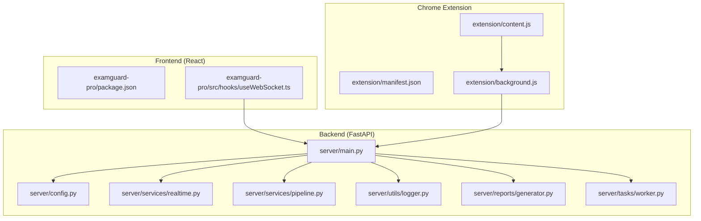
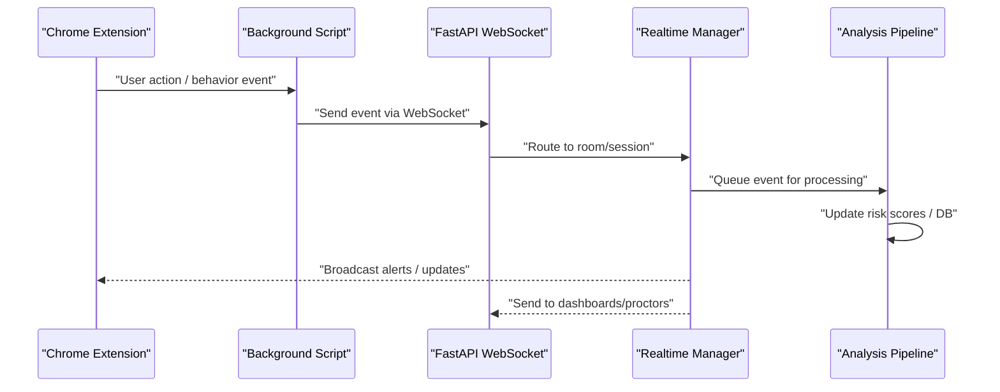
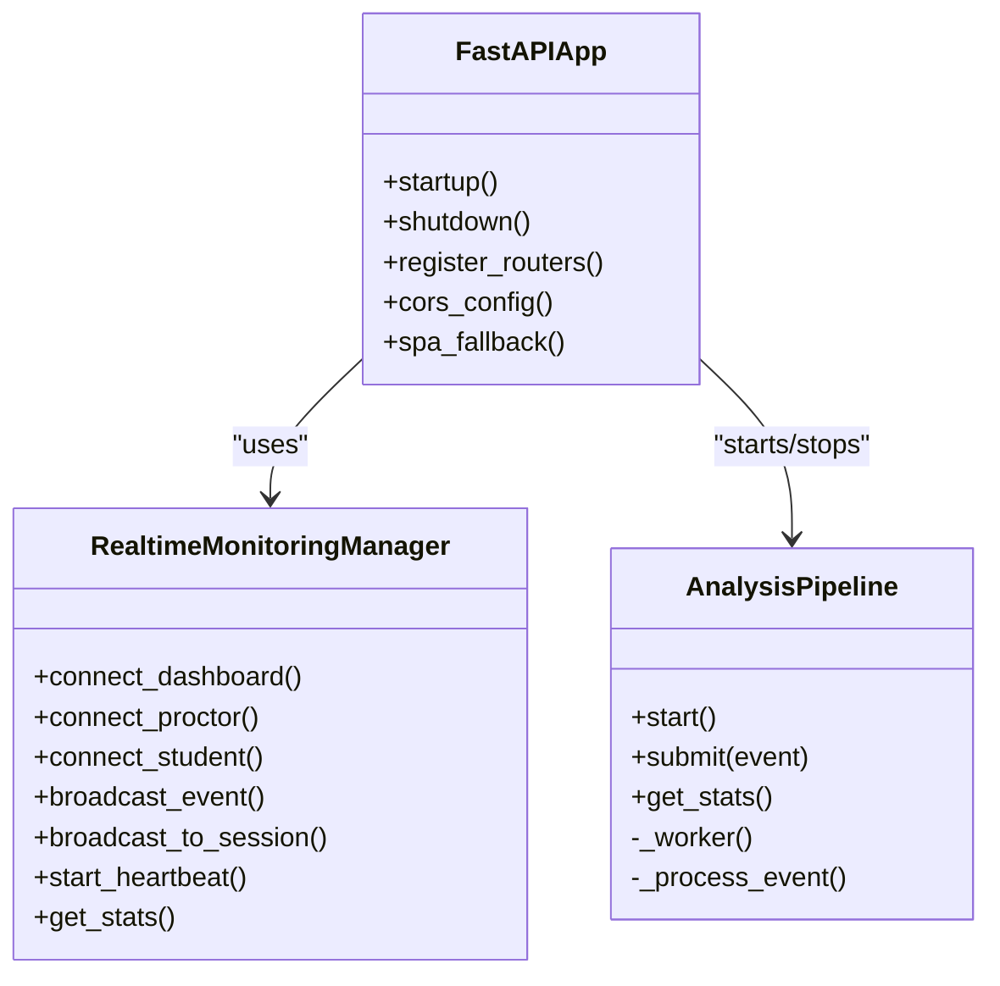
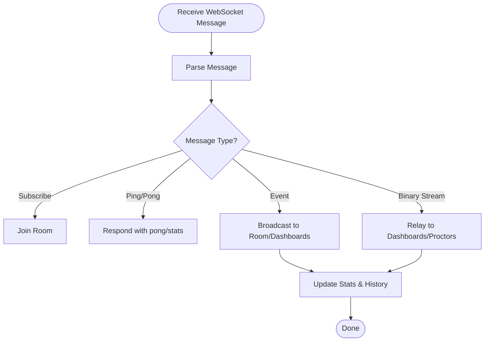
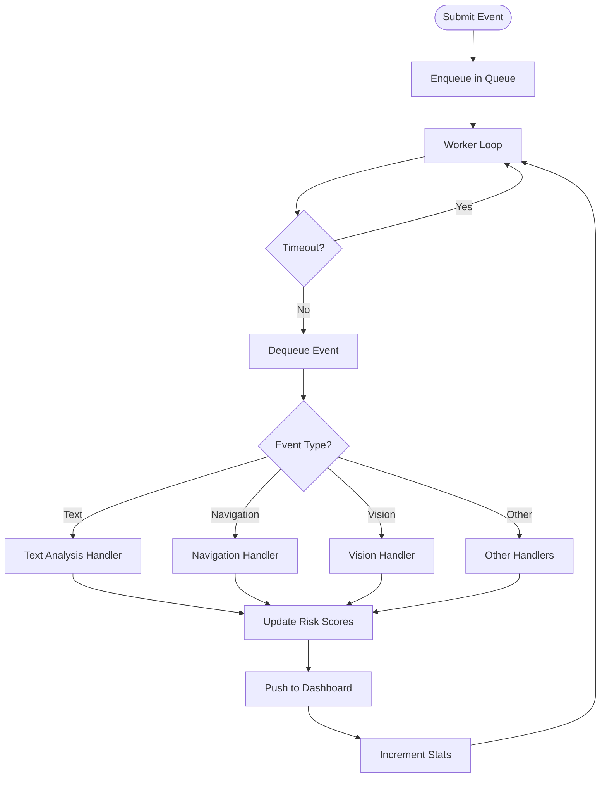
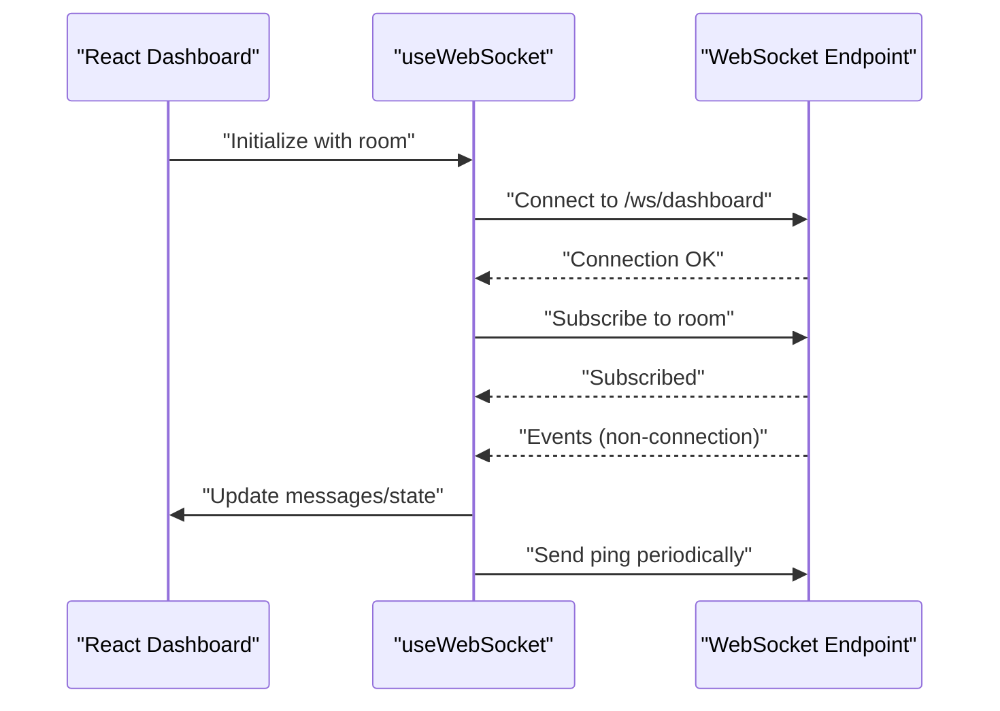
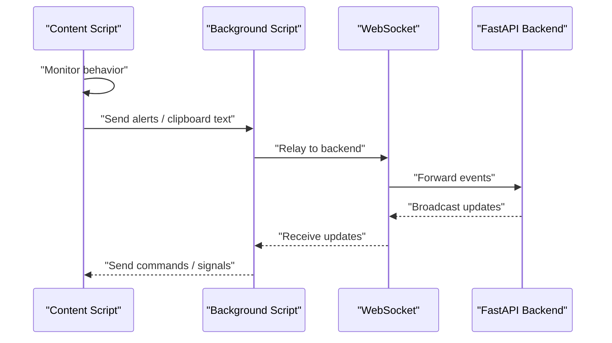
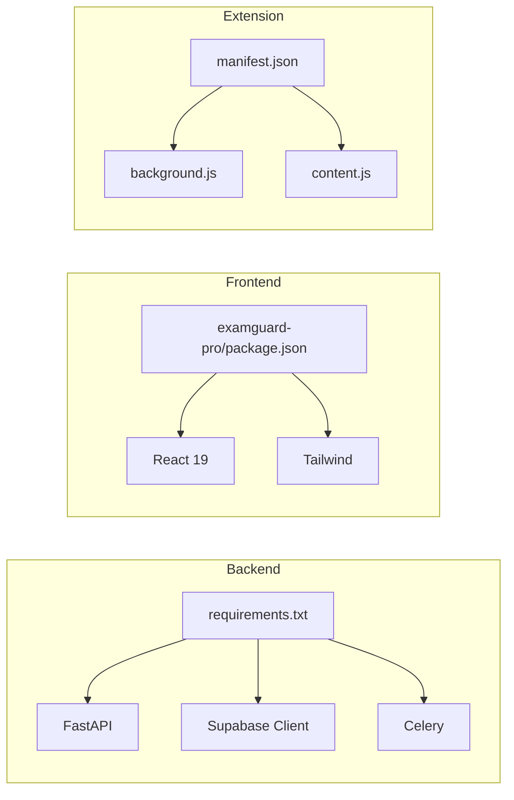

# Development Guidelines

<cite>
**Referenced Files in This Document**
- [README.md](file://README.md)
- [requirements.txt](file://requirements.txt)
- [package.json](file://package.json)
- [server/main.py](file://server/main.py)
- [server/config.py](file://server/config.py)
- [server/utils/logger.py](file://server/utils/logger.py)
- [server/services/realtime.py](file://server/services/realtime.py)
- [server/services/pipeline.py](file://server/services/pipeline.py)
- [server/reports/generator.py](file://server/reports/generator.py)
- [server/tasks/worker.py](file://server/tasks/worker.py)
- [examguard-pro/package.json](file://examguard-pro/package.json)
- [examguard-pro/src/hooks/useWebSocket.ts](file://examguard-pro/src/hooks/useWebSocket.ts)
- [extension/manifest.json](file://extension/manifest.json)
- [extension/background.js](file://extension/background.js)
- [extension/content.js](file://extension/content.js)
</cite>

## Table of Contents
1. [Introduction](#introduction)
2. [Project Structure](#project-structure)
3. [Core Components](#core-components)
4. [Architecture Overview](#architecture-overview)
5. [Detailed Component Analysis](#detailed-component-analysis)
6. [Dependency Analysis](#dependency-analysis)
7. [Performance Considerations](#performance-considerations)
8. [Testing Strategies](#testing-strategies)
9. [Debugging Techniques](#debugging-techniques)
10. [Git Workflow and Contribution Procedures](#git-workflow-and-contribution-procedures)
11. [Code Review Guidelines](#code-review-guidelines)
12. [Troubleshooting Guide](#troubleshooting-guide)
13. [Conclusion](#conclusion)

## Introduction
This document defines development guidelines for ExamGuard Pro, covering code standards, testing strategies, and contribution workflows across the Python FastAPI backend, React frontend, and JavaScript Chrome extension. It also explains multi-modal AI service debugging, WebSocket communication, real-time synchronization, performance profiling, optimization techniques, and troubleshooting for common development issues such as dependency conflicts, environment setup, and cross-platform compatibility.

## Project Structure
The repository is organized into four primary areas:
- server/: FastAPI backend with AI services, WebSocket real-time monitoring, and reporting
- examguard-pro/: React 19 dashboard built with Vite and Tailwind
- extension/: Chrome Extension Manifest V3 with background, content scripts, and UI
- transformer/: Transformer-based NLP models and training utilities

**Diagram sources**
- [server/main.py:1-647](file://server/main.py#L1-L647)
- [server/config.py:1-205](file://server/config.py#L1-L205)
- [server/services/realtime.py:1-642](file://server/services/realtime.py#L1-L642)
- [server/services/pipeline.py:1-342](file://server/services/pipeline.py#L1-L342)
- [server/utils/logger.py:1-64](file://server/utils/logger.py#L1-L64)
- [server/reports/generator.py:1-564](file://server/reports/generator.py#L1-L564)
- [server/tasks/worker.py:1-35](file://server/tasks/worker.py#L1-L35)
- [examguard-pro/package.json:1-40](file://examguard-pro/package.json#L1-L40)
- [examguard-pro/src/hooks/useWebSocket.ts:1-110](file://examguard-pro/src/hooks/useWebSocket.ts#L1-L110)
- [extension/manifest.json:1-73](file://extension/manifest.json#L1-L73)
- [extension/background.js:1-800](file://extension/background.js#L1-L800)
- [extension/content.js:1-473](file://extension/content.js#L1-L473)

**Section sources**
- [README.md:1-92](file://README.md#L1-L92)
- [requirements.txt:1-2](file://requirements.txt#L1-L2)
- [package.json:1-6](file://package.json#L1-L6)

## Core Components
- FastAPI backend: Application lifecycle, middleware, CORS, WebSocket endpoints, SPA fallback, health checks, and static asset serving
- Real-time monitoring: WebSocket connection management, room-based broadcasting, event history, and heartbeat
- Analysis pipeline: Queue-based processing of events, risk scoring updates, and dashboard notifications
- Logging: Centralized logging with structured event and analysis records
- Reports: PDF report generation with branding and KPIs
- Tasks: Celery worker for background jobs
- React dashboard: WebSocket hook for real-time updates and SPA routing
- Chrome extension: Background service worker, content script monitoring, and UI popup

**Section sources**
- [server/main.py:170-634](file://server/main.py#L170-L634)
- [server/services/realtime.py:102-642](file://server/services/realtime.py#L102-L642)
- [server/services/pipeline.py:9-342](file://server/services/pipeline.py#L9-L342)
- [server/utils/logger.py:20-64](file://server/utils/logger.py#L20-L64)
- [server/reports/generator.py:422-564](file://server/reports/generator.py#L422-L564)
- [server/tasks/worker.py:6-35](file://server/tasks/worker.py#L6-L35)
- [examguard-pro/src/hooks/useWebSocket.ts:1-110](file://examguard-pro/src/hooks/useWebSocket.ts#L1-L110)
- [extension/manifest.json:1-73](file://extension/manifest.json#L1-L73)
- [extension/background.js:1-800](file://extension/background.js#L1-L800)
- [extension/content.js:1-473](file://extension/content.js#L1-L473)

## Architecture Overview
The system integrates three layers:
- Backend: FastAPI exposes REST APIs and WebSocket endpoints, orchestrates AI services, and manages real-time events
- Frontend: React dashboard connects to WebSocket endpoints for live updates and SPA routing
- Extension: Chrome extension monitors user behavior, captures screenshots/webcam frames, and relays events to the backend

**Diagram sources**
- [extension/background.js:52-166](file://extension/background.js#L52-L166)
- [server/main.py:248-501](file://server/main.py#L248-L501)
- [server/services/realtime.py:334-416](file://server/services/realtime.py#L334-L416)
- [server/services/pipeline.py:74-333](file://server/services/pipeline.py#L74-L333)

## Detailed Component Analysis

### Backend (FastAPI)
- Application lifecycle: Initializes AI engines, gaze service, realtime manager, and analysis pipeline; starts heartbeat task
- Middleware: Configures CORS for development and extension connectivity
- Endpoints: Health checks, SPA fallback, static asset mounting, and WebSocket endpoints for dashboard, proctor, and student
- Real-time: Legacy and modern WebSocket managers; room-based broadcasting; event history; heartbeat monitoring

**Diagram sources**
- [server/main.py:109-167](file://server/main.py#L109-L167)
- [server/services/realtime.py:102-642](file://server/services/realtime.py#L102-L642)
- [server/services/pipeline.py:9-342](file://server/services/pipeline.py#L9-L342)

**Section sources**
- [server/main.py:109-634](file://server/main.py#L109-L634)
- [server/services/realtime.py:102-642](file://server/services/realtime.py#L102-L642)
- [server/services/pipeline.py:9-342](file://server/services/pipeline.py#L9-L342)

### Real-Time Monitoring Service
- Manages connections for dashboards, proctors, and students
- Supports room-based subscriptions and session-scoped broadcasts
- Provides event history, alert levels, and heartbeat statistics
- Integrates AI callbacks for live stream analysis

**Diagram sources**
- [server/main.py:274-473](file://server/main.py#L274-L473)
- [server/services/realtime.py:334-416](file://server/services/realtime.py#L334-L416)

**Section sources**
- [server/main.py:248-501](file://server/main.py#L248-L501)
- [server/services/realtime.py:213-416](file://server/services/realtime.py#L213-L416)

### Analysis Pipeline
- Asynchronous queue-based processing of events
- Routes events to specialized handlers (navigation, text, vision, anomalies)
- Updates session risk scores and pushes updates to dashboards
- Tracks processing stats and errors

**Diagram sources**
- [server/services/pipeline.py:44-333](file://server/services/pipeline.py#L44-L333)

**Section sources**
- [server/services/pipeline.py:44-333](file://server/services/pipeline.py#L44-L333)

### React Dashboard
- WebSocket hook for real-time updates, subscription to rooms, ping/heartbeat, and reconnect logic
- SPA routing with fallback to index.html for unknown paths

**Diagram sources**
- [examguard-pro/src/hooks/useWebSocket.ts:18-108](file://examguard-pro/src/hooks/useWebSocket.ts#L18-L108)

**Section sources**
- [examguard-pro/src/hooks/useWebSocket.ts:1-110](file://examguard-pro/src/hooks/useWebSocket.ts#L1-L110)

### Chrome Extension
- Background script: Session lifecycle, retries, periodic sync, transformer analysis, and WebSocket relay
- Content script: Behavior monitoring, overlay detection, audio monitoring, and DevTools detection
- Manifest permissions and host permissions for broad coverage

**Diagram sources**
- [extension/content.js:33-357](file://extension/content.js#L33-L357)
- [extension/background.js:52-166](file://extension/background.js#L52-L166)
- [server/main.py:393-473](file://server/main.py#L393-L473)

**Section sources**
- [extension/manifest.json:1-73](file://extension/manifest.json#L1-L73)
- [extension/background.js:1-800](file://extension/background.js#L1-L800)
- [extension/content.js:1-473](file://extension/content.js#L1-L473)

## Dependency Analysis
- Backend dependencies: FastAPI, Uvicorn, Supabase client, logging, and optional ReportLab for PDF generation
- Frontend dependencies: React 19, Vite, Tailwind, and charting libraries
- Extension dependencies: Manifest V3, background/service worker, content scripts, and web-accessible resources

**Diagram sources**
- [requirements.txt:1-2](file://requirements.txt#L1-L2)
- [package.json:1-6](file://package.json#L1-L6)
- [examguard-pro/package.json:1-40](file://examguard-pro/package.json#L1-L40)
- [extension/manifest.json:1-73](file://extension/manifest.json#L1-L73)

**Section sources**
- [requirements.txt:1-2](file://requirements.txt#L1-L2)
- [package.json:1-6](file://package.json#L1-L6)
- [examguard-pro/package.json:1-40](file://examguard-pro/package.json#L1-L40)
- [extension/manifest.json:1-73](file://extension/manifest.json#L1-L73)

## Performance Considerations
- Real-time processing: Use queue-based pipeline to decouple event ingestion from analysis; monitor queue size and processing throughput
- WebSocket broadcasting: Limit event payload sizes; batch updates where possible; maintain room membership efficiently
- AI inference: Offload heavy computations to background tasks or workers; cache frequently used models; cap image resolution and quality
- Frontend rendering: Debounce frequent updates; limit event history size; virtualize long lists
- Database writes: Batch updates to reduce round-trips; use efficient queries and indexes

[No sources needed since this section provides general guidance]

## Testing Strategies
- Unit tests: Validate individual functions and services (e.g., event routing, risk calculation, URL classification)
- Integration tests: Verify end-to-end flows between extension, backend, and database (e.g., session creation, event propagation, WebSocket updates)
- End-to-end tests: Simulate full user journeys (start exam, monitor behavior, receive alerts, generate report)
- Mock external services: Replace AI engines and third-party APIs with deterministic mocks during tests
- Test data: Use fixtures for sessions, events, and analysis results; ensure test isolation and cleanup

[No sources needed since this section provides general guidance]

## Debugging Techniques
- Multi-modal AI services:
  - Inspect AI module initialization and availability; verify model loading and tokenizer readiness
  - Log intermediate results from frame extraction and object detection
  - Validate OCR and NLP thresholds and categories
- WebSocket communication:
  - Confirm connection states and room subscriptions; verify ping/pong and heartbeat messages
  - Check for disconnections and reconnection attempts; inspect message routing and filtering
- Real-time data synchronization:
  - Compare timestamps and sequence numbers; detect gaps or duplicates
  - Validate event types and alert levels; ensure consistent broadcasting across rooms

**Section sources**
- [server/utils/logger.py:20-64](file://server/utils/logger.py#L20-L64)
- [server/services/realtime.py:538-576](file://server/services/realtime.py#L538-L576)
- [server/services/pipeline.py:44-96](file://server/services/pipeline.py#L44-L96)

## Git Workflow and Contribution Procedures
- Branching model:
  - main: protected, requires reviews and CI checks
  - develop: integration branch for features
  - feature/<issue>: feature branches prefixed with issue numbers
  - hotfix/<issue>: quick fixes for production
- Commit hygiene:
  - Use imperative mood; concise subject lines; detailed descriptions for complex changes
  - Reference issues in commit messages (e.g., Fixes #123)
- Pull requests:
  - Target appropriate base branch; include description and testing notes
  - Request reviewers; address comments promptly; keep PRs focused and small
- Release management:
  - Tag releases with semantic versioning; update changelog entries
  - Verify environment variables and deployment artifacts before promotion

[No sources needed since this section provides general guidance]

## Code Review Guidelines
- Security:
  - Validate CORS origins and host permissions; avoid hardcoded secrets
  - Sanitize user inputs and URLs; enforce permissions in extension manifests
- Reliability:
  - Handle exceptions gracefully; implement timeouts and retries
  - Ensure graceful shutdown and resource cleanup
- Performance:
  - Avoid blocking operations; use async patterns and queues
  - Optimize image sizes and reduce unnecessary WebSocket traffic
- Maintainability:
  - Write clear docstrings and comments; modularize logic
  - Prefer configuration over magic constants; centralize shared logic

[No sources needed since this section provides general guidance]

## Troubleshooting Guide
- Dependency conflicts:
  - Align Python and Node versions with project requirements; lock dependency versions
  - Resolve conflicting packages by updating pip and npm/yarn
- Environment setup:
  - Ensure Supabase credentials and keys are configured; verify database connectivity
  - Install Tesseract OCR locally for development if required
- Cross-platform compatibility:
  - Use platform-agnostic paths and environment variables
  - Test Chrome extension on multiple browsers and OS versions
- WebSocket issues:
  - Verify backend WebSocket endpoints and CORS settings
  - Check heartbeat intervals and reconnection logic in the frontend and extension
- Real-time synchronization:
  - Confirm room subscriptions and session IDs
  - Validate event ordering and deduplication

**Section sources**
- [README.md:48-92](file://README.md#L48-L92)
- [server/main.py:192-222](file://server/main.py#L192-L222)
- [server/config.py:16-42](file://server/config.py#L16-L42)
- [extension/manifest.json:18-24](file://extension/manifest.json#L18-L24)

## Conclusion
These guidelines establish a consistent approach to developing, testing, and operating ExamGuard Pro across its backend, frontend, and extension components. By adhering to the outlined standards, workflows, and debugging practices, contributors can ensure reliable, performant, and secure multi-modal proctoring capabilities.