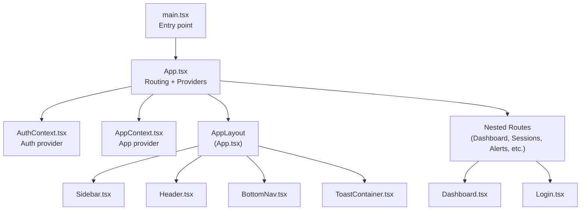
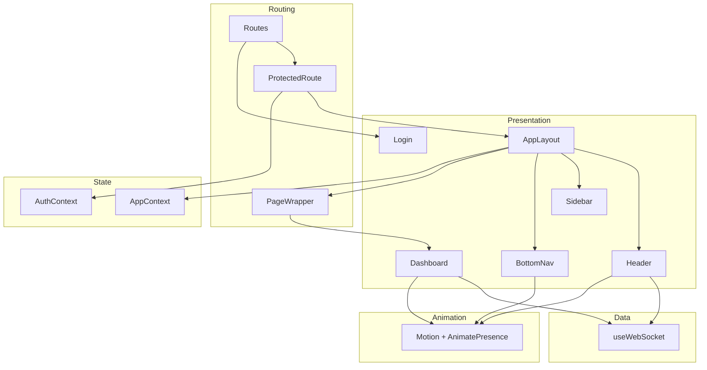
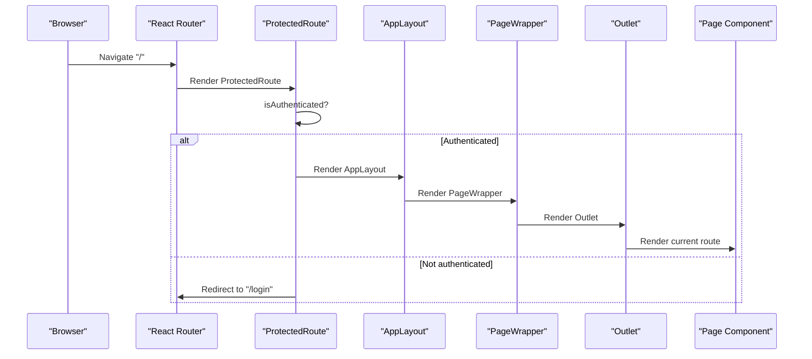
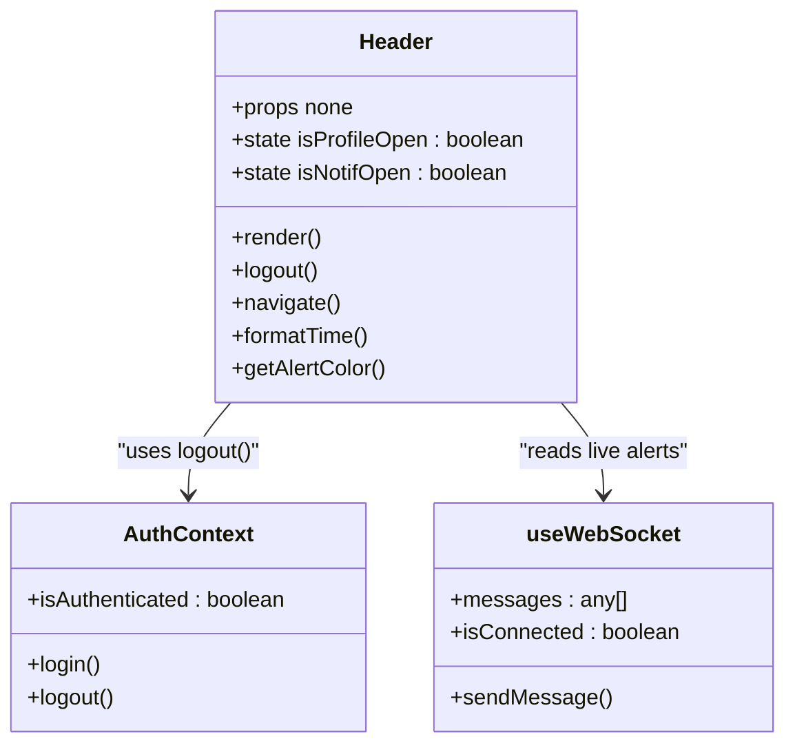
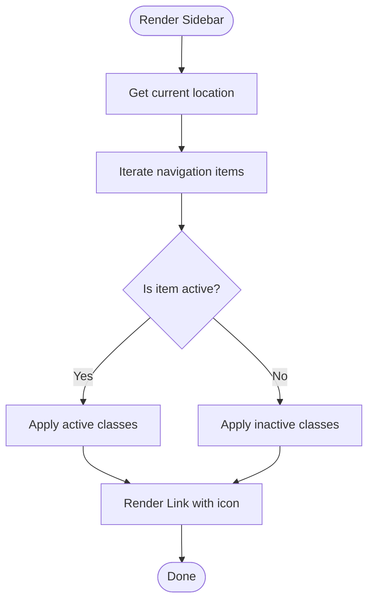
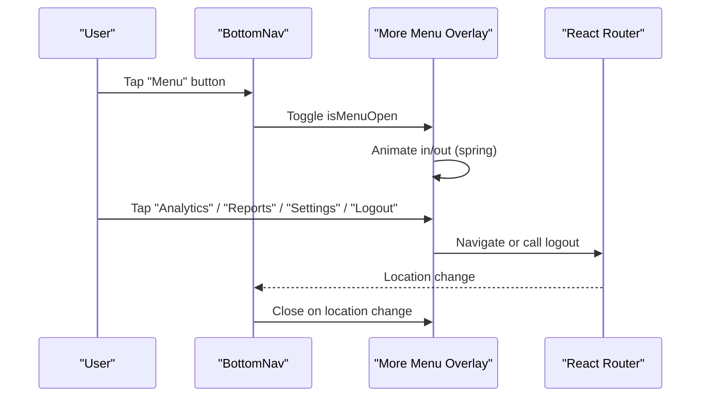
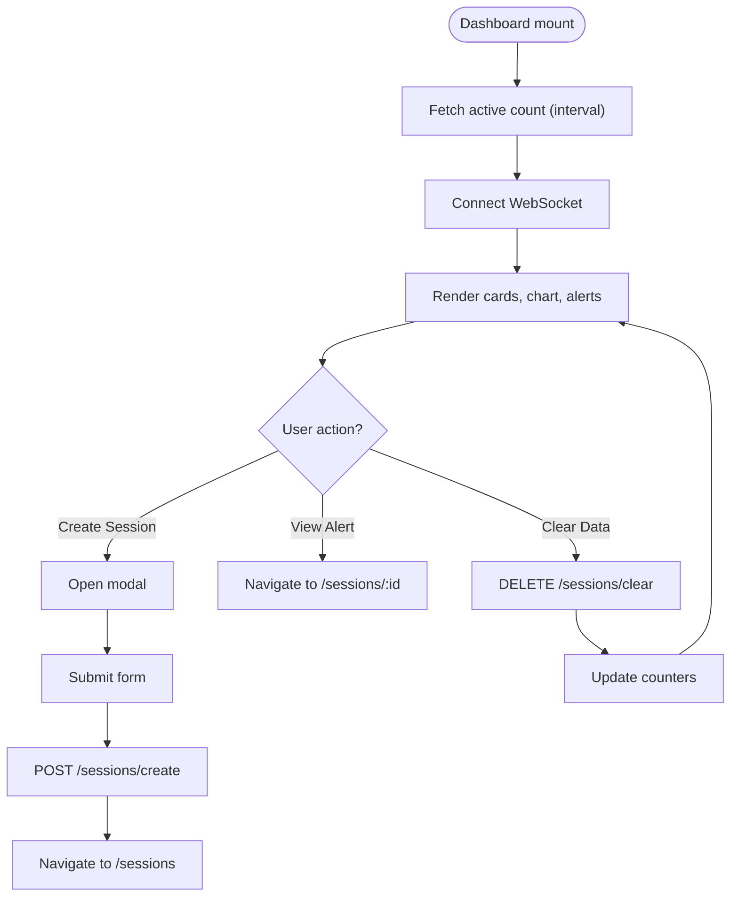
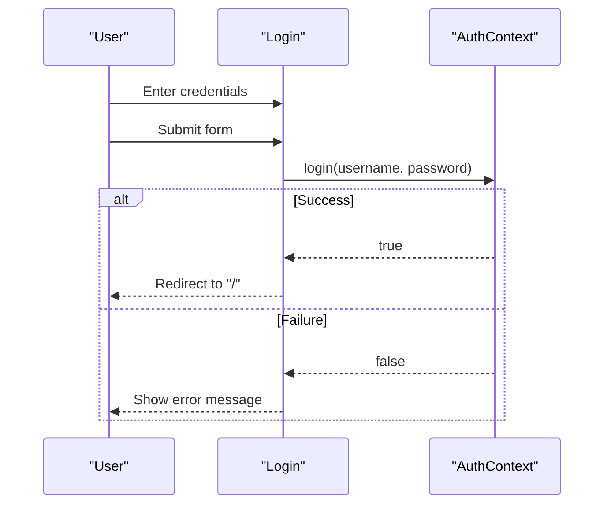
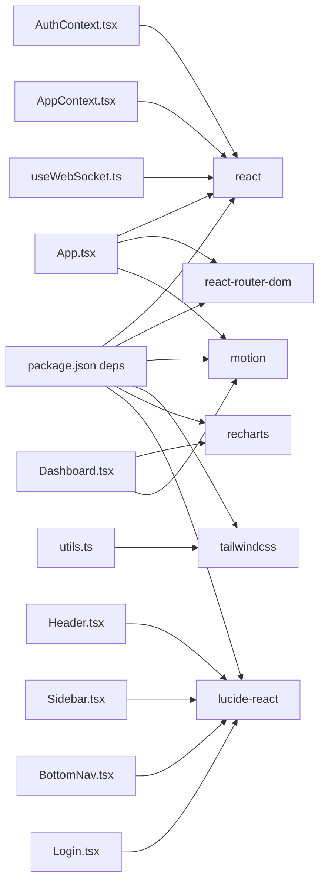

# Component Architecture

<cite>
**Referenced Files in This Document**
- [App.tsx](file://examguard-pro/src/App.tsx)
- [main.tsx](file://examguard-pro/src/main.tsx)
- [Header.tsx](file://examguard-pro/src/components/Header.tsx)
- [Sidebar.tsx](file://examguard-pro/src/components/Sidebar.tsx)
- [BottomNav.tsx](file://examguard-pro/src/components/BottomNav.tsx)
- [Dashboard.tsx](file://examguard-pro/src/components/Dashboard.tsx)
- [Login.tsx](file://examguard-pro/src/components/Login.tsx)
- [AuthContext.tsx](file://examguard-pro/src/context/AuthContext.tsx)
- [AppContext.tsx](file://examguard-pro/src/context/AppContext.tsx)
- [useWebSocket.ts](file://examguard-pro/src/hooks/useWebSocket.ts)
- [utils.ts](file://examguard-pro/src/utils.ts)
- [App.css](file://examguard-pro/src/App.css)
- [index.css](file://examguard-pro/src/index.css)
- [package.json](file://examguard-pro/package.json)
- [tsconfig.json](file://examguard-pro/tsconfig.json)
</cite>

## Table of Contents
1. [Introduction](#introduction)
2. [Project Structure](#project-structure)
3. [Core Components](#core-components)
4. [Architecture Overview](#architecture-overview)
5. [Detailed Component Analysis](#detailed-component-analysis)
6. [Dependency Analysis](#dependency-analysis)
7. [Performance Considerations](#performance-considerations)
8. [Troubleshooting Guide](#troubleshooting-guide)
9. [Conclusion](#conclusion)
10. [Appendices](#appendices)

## Introduction
This document describes the component architecture of the ExamGuard Pro React dashboard. It focuses on the main layout structure (AppLayout, Header, Sidebar, BottomNav), routing with protected routes and page transitions, responsive design and cross-device compatibility, component lifecycle management, error handling, and performance optimization. It also provides guidelines for component reusability, prop interfaces, and TypeScript integration patterns.

## Project Structure
The dashboard is a Vite-powered React application with TypeScript. The entry point renders the root App component inside StrictMode. Routing is handled via React Router DOM, with a central AppLayout that composes Header, Sidebar, BottomNav, and the main content area. Context providers supply authentication and app-wide settings. Motion animations are used for page transitions and interactive elements. Tailwind v4 styles define responsive layouts and theming.

**Diagram sources**
- [main.tsx:1-11](file://examguard-pro/src/main.tsx#L1-L11)
- [App.tsx:67-91](file://examguard-pro/src/App.tsx#L67-L91)
- [AuthContext.tsx:13-50](file://examguard-pro/src/context/AuthContext.tsx#L13-L50)
- [AppContext.tsx:10-17](file://examguard-pro/src/context/AppContext.tsx#L10-L17)
- [Sidebar.tsx:25-93](file://examguard-pro/src/components/Sidebar.tsx#L25-L93)
- [Header.tsx:7-203](file://examguard-pro/src/components/Header.tsx#L7-L203)
- [BottomNav.tsx:20-123](file://examguard-pro/src/components/BottomNav.tsx#L20-L123)
- [Dashboard.tsx:30-426](file://examguard-pro/src/components/Dashboard.tsx#L30-L426)
- [Login.tsx:6-133](file://examguard-pro/src/components/Login.tsx#L6-L133)

**Section sources**
- [main.tsx:1-11](file://examguard-pro/src/main.tsx#L1-L11)
- [App.tsx:67-91](file://examguard-pro/src/App.tsx#L67-L91)
- [index.css:1-34](file://examguard-pro/src/index.css#L1-L34)
- [package.json:13-28](file://examguard-pro/package.json#L13-L28)
- [tsconfig.json:1-27](file://examguard-pro/tsconfig.json#L1-L27)

## Core Components
- AppLayout: Central container that orchestrates Sidebar, Header, main content area, BottomNav, and ToastContainer. Uses Tailwind for responsive layout and a CSS class to constrain the viewport.
- Header: Top bar with search, live notifications, profile dropdown, and logout. Integrates WebSocket alerts and navigation.
- Sidebar: Desktop navigation drawer with active state highlighting and logout action.
- BottomNav: Mobile-first bottom navigation with a collapsible “More” menu and animated overlay.
- Dashboard: Home page with live stats, charts, recent alerts, and a modal to create new sessions.
- Login: Authentication form with error feedback and submission handling.
- Context Providers: AuthContext for authentication state and tokens; AppContext for global settings.
- Hooks: useWebSocket for real-time alerts and resilient connection management.
- Utilities: cn helper for Tailwind class merging.

**Section sources**
- [App.tsx:51-65](file://examguard-pro/src/App.tsx#L51-L65)
- [Header.tsx:7-203](file://examguard-pro/src/components/Header.tsx#L7-L203)
- [Sidebar.tsx:25-93](file://examguard-pro/src/components/Sidebar.tsx#L25-L93)
- [BottomNav.tsx:20-123](file://examguard-pro/src/components/BottomNav.tsx#L20-L123)
- [Dashboard.tsx:30-426](file://examguard-pro/src/components/Dashboard.tsx#L30-L426)
- [Login.tsx:6-133](file://examguard-pro/src/components/Login.tsx#L6-L133)
- [AuthContext.tsx:13-50](file://examguard-pro/src/context/AuthContext.tsx#L13-L50)
- [AppContext.tsx:10-17](file://examguard-pro/src/context/AppContext.tsx#L10-L17)
- [useWebSocket.ts:4-109](file://examguard-pro/src/hooks/useWebSocket.ts#L4-L109)
- [utils.ts:4-6](file://examguard-pro/src/utils.ts#L4-L6)

## Architecture Overview
The architecture follows a layered pattern:
- Presentation Layer: AppLayout, Header, Sidebar, BottomNav, and page components (Dashboard, Login).
- Routing Layer: React Router DOM with nested routes and a ProtectedRoute wrapper.
- State Management: Context providers for authentication and app settings.
- Data Layer: useWebSocket hook for live updates and direct fetch calls for static data.
- Animation Layer: Motion for page transitions and interactive micro-interactions.

**Diagram sources**
- [App.tsx:28-49](file://examguard-pro/src/App.tsx#L28-L49)
- [App.tsx:51-65](file://examguard-pro/src/App.tsx#L51-L65)
- [Header.tsx:12](file://examguard-pro/src/components/Header.tsx#L12)
- [Dashboard.tsx:33](file://examguard-pro/src/components/Dashboard.tsx#L33)
- [useWebSocket.ts:4-109](file://examguard-pro/src/hooks/useWebSocket.ts#L4-L109)
- [AuthContext.tsx:13-50](file://examguard-pro/src/context/AuthContext.tsx#L13-L50)
- [AppContext.tsx:10-17](file://examguard-pro/src/context/AppContext.tsx#L10-L17)

## Detailed Component Analysis

### AppLayout and Routing
AppLayout composes Sidebar, Header, main content area, BottomNav, and ToastContainer. The routing tree defines public pages (Login, Register) and a protected root that renders AppLayout. Nested routes include Dashboard, Sessions, Students, Alerts, Analytics, Reports, and Settings. Page transitions are animated using Motion with AnimatePresence and a PageWrapper that wraps Outlet.

**Diagram sources**
- [App.tsx:28-31](file://examguard-pro/src/App.tsx#L28-L31)
- [App.tsx:33-49](file://examguard-pro/src/App.tsx#L33-L49)
- [App.tsx:51-65](file://examguard-pro/src/App.tsx#L51-L65)
- [App.tsx:72-85](file://examguard-pro/src/App.tsx#L72-L85)

**Section sources**
- [App.tsx:28-31](file://examguard-pro/src/App.tsx#L28-L31)
- [App.tsx:33-49](file://examguard-pro/src/App.tsx#L33-L49)
- [App.tsx:51-65](file://examguard-pro/src/App.tsx#L51-L65)
- [App.tsx:72-85](file://examguard-pro/src/App.tsx#L72-L85)

### Header Component
Header displays a secure status badge, a desktop search bar, live notifications, and a profile dropdown. It filters and renders real-time alerts from WebSocket, supports quick navigation to sessions, and exposes logout via AuthContext. It uses cn for class merging and integrates Lucide icons.

**Diagram sources**
- [Header.tsx:7-203](file://examguard-pro/src/components/Header.tsx#L7-L203)
- [AuthContext.tsx:53-57](file://examguard-pro/src/context/AuthContext.tsx#L53-L57)
- [useWebSocket.ts:4-109](file://examguard-pro/src/hooks/useWebSocket.ts#L4-L109)

**Section sources**
- [Header.tsx:7-203](file://examguard-pro/src/components/Header.tsx#L7-L203)
- [utils.ts:4-6](file://examguard-pro/src/utils.ts#L4-L6)

### Sidebar Component
Sidebar provides desktop navigation links for Dashboard, Sessions, Students, Alerts, Analytics, Reports, and Settings. It highlights active routes and includes a Logout action. It uses cn for conditional classes and integrates Lucide icons.

**Diagram sources**
- [Sidebar.tsx:25-93](file://examguard-pro/src/components/Sidebar.tsx#L25-L93)

**Section sources**
- [Sidebar.tsx:25-93](file://examguard-pro/src/components/Sidebar.tsx#L25-L93)
- [utils.ts:4-6](file://examguard-pro/src/utils.ts#L4-L6)

### BottomNav Component
BottomNav implements a mobile-first navigation with five primary items and a “More” menu. It toggles a spring-animated overlay for additional routes and handles logout. It auto-closes the menu on route changes and applies safe-area insets for modern devices.

**Diagram sources**
- [BottomNav.tsx:20-123](file://examguard-pro/src/components/BottomNav.tsx#L20-L123)

**Section sources**
- [BottomNav.tsx:20-123](file://examguard-pro/src/components/BottomNav.tsx#L20-L123)

### Dashboard Component
Dashboard aggregates live stats, charts, and recent alerts. It fetches active session counts periodically, generates exam codes, and manages a modal to create new sessions. It uses Recharts for visualization and Motion for staggered animations.

**Diagram sources**
- [Dashboard.tsx:30-426](file://examguard-pro/src/components/Dashboard.tsx#L30-L426)
- [useWebSocket.ts:4-109](file://examguard-pro/src/hooks/useWebSocket.ts#L4-L109)

**Section sources**
- [Dashboard.tsx:30-426](file://examguard-pro/src/components/Dashboard.tsx#L30-L426)

### Login Component
Login provides a form with username/password, error messaging, and submission handling via AuthContext. It uses Motion for entrance animations and a clean card layout.

**Diagram sources**
- [Login.tsx:6-133](file://examguard-pro/src/components/Login.tsx#L6-L133)
- [AuthContext.tsx:17-38](file://examguard-pro/src/context/AuthContext.tsx#L17-L38)

**Section sources**
- [Login.tsx:6-133](file://examguard-pro/src/components/Login.tsx#L6-L133)
- [AuthContext.tsx:17-38](file://examguard-pro/src/context/AuthContext.tsx#L17-L38)

## Dependency Analysis
The application relies on:
- React and React Router DOM for rendering and routing.
- Motion for animations and AnimatePresence.
- Tailwind v4 for responsive styling and theme tokens.
- Recharts for data visualization.
- Lucide React for icons.
- LocalStorage for token persistence.

**Diagram sources**
- [package.json:13-28](file://examguard-pro/package.json#L13-L28)
- [App.tsx:6-26](file://examguard-pro/src/App.tsx#L6-L26)
- [Header.tsx:1](file://examguard-pro/src/components/Header.tsx#L1)
- [Sidebar.tsx:1](file://examguard-pro/src/components/Sidebar.tsx#L1)
- [BottomNav.tsx:2](file://examguard-pro/src/components/BottomNav.tsx#L2)
- [Dashboard.tsx:12-25](file://examguard-pro/src/components/Dashboard.tsx#L12-L25)
- [Login.tsx:3](file://examguard-pro/src/components/Login.tsx#L3)
- [AuthContext.tsx:1-3](file://examguard-pro/src/context/AuthContext.tsx#L1-L3)
- [AppContext.tsx:1](file://examguard-pro/src/context/AppContext.tsx#L1)
- [useWebSocket.ts:1-2](file://examguard-pro/src/hooks/useWebSocket.ts#L1-L2)
- [utils.ts:1-2](file://examguard-pro/src/utils.ts#L1-L2)

**Section sources**
- [package.json:13-28](file://examguard-pro/package.json#L13-L28)
- [tsconfig.json:18-22](file://examguard-pro/tsconfig.json#L18-L22)

## Performance Considerations
- Lazy loading: Consider lazy-loading heavy page components (e.g., Analytics, Reports) to reduce initial bundle size.
- Memoization: Wrap frequently rendered lists (e.g., alerts) with memoization to avoid unnecessary re-renders.
- Virtualization: For long lists, use a virtualized list library to limit DOM nodes.
- Debounced search: Debounce the search input in Header to reduce network requests.
- WebSocket backoff: useWebSocket already implements exponential backoff; ensure UI reflects connection state.
- Animations: Keep animation complexity minimal on lower-end devices; disable or throttle where appropriate.
- Image optimization: Preload or lazy-load images if any are introduced later.
- CSS: Prefer Tailwind utilities over custom CSS to leverage purging; ensure purge safelist for dynamic classes.

[No sources needed since this section provides general guidance]

## Troubleshooting Guide
- Authentication failures: Verify token storage and redirect behavior in AuthContext. Confirm API endpoint and payload shape.
- WebSocket disconnections: Check reconnection logic and heartbeat; surface connection status to users.
- Navigation issues: Ensure ProtectedRoute wraps AppLayout and that nested routes are declared under the protected parent.
- Animation glitches: Validate Motion versions and ensure AnimatePresence keys are stable (pathname is used).
- Responsive layout problems: Inspect Tailwind breakpoints and safe-area insets in BottomNav and App.css.

**Section sources**
- [AuthContext.tsx:17-43](file://examguard-pro/src/context/AuthContext.tsx#L17-L43)
- [useWebSocket.ts:18-100](file://examguard-pro/src/hooks/useWebSocket.ts#L18-L100)
- [App.tsx:28-31](file://examguard-pro/src/App.tsx#L28-L31)
- [BottomNav.tsx:25-28](file://examguard-pro/src/components/BottomNav.tsx#L25-L28)

## Conclusion
The ExamGuard Pro dashboard employs a clear separation of concerns with a central AppLayout, robust routing, and context-driven state. Motion animations enhance UX while maintaining responsiveness across devices. The architecture supports scalability through modular components, reusable hooks, and a consistent TypeScript and Tailwind integration.

[No sources needed since this section summarizes without analyzing specific files]

## Appendices

### Responsive Design and Cross-Device Compatibility
- Mobile-first: BottomNav is visible only on small screens; Sidebar is hidden on small screens and appears on medium+.
- Safe areas: BottomNav accounts for device safe areas on mobile.
- Breakpoints: Tailwind utilities drive responsive layouts; ensure content adapts at sm, md, lg breakpoints.
- Gestures: BottomNav’s “More” menu uses spring animations for tactile feedback.

**Section sources**
- [BottomNav.tsx:32-34](file://examguard-pro/src/components/BottomNav.tsx#L32-L34)
- [Sidebar.tsx:30](file://examguard-pro/src/components/Sidebar.tsx#L30)
- [index.css:1-34](file://examguard-pro/src/index.css#L1-L34)

### Component Composition Strategies
- Composition over inheritance: Use props and children to compose UI (e.g., PageWrapper wraps Outlet).
- Context propagation: AuthContext and AppContext wrap the app to avoid prop drilling.
- Utility helpers: cn consolidates Tailwind class logic; reuse across components.
- Hook encapsulation: useWebSocket centralizes WebSocket logic and state.

**Section sources**
- [App.tsx:33-49](file://examguard-pro/src/App.tsx#L33-L49)
- [AuthContext.tsx:13-50](file://examguard-pro/src/context/AuthContext.tsx#L13-L50)
- [AppContext.tsx:10-17](file://examguard-pro/src/context/AppContext.tsx#L10-L17)
- [utils.ts:4-6](file://examguard-pro/src/utils.ts#L4-L6)
- [useWebSocket.ts:4-109](file://examguard-pro/src/hooks/useWebSocket.ts#L4-L109)

### Prop Interfaces and TypeScript Integration
- Define explicit interfaces for props passed to components (e.g., alert items, navigation items).
- Use React.FC with explicit props for functional components.
- Leverage tsconfig path aliases (@/*) to simplify imports.
- Keep JSX typing strict; enable noImplicitAny if desired.

**Section sources**
- [tsconfig.json:18-22](file://examguard-pro/tsconfig.json#L18-L22)
- [package.json:13-28](file://examguard-pro/package.json#L13-L28)

### Error Boundaries and Lifecycle Management
- No explicit error boundaries are present; consider adding a boundary around page components for graceful degradation.
- Lifecycle: useWebSocket manages connection lifecycle with cleanup; Dashboard mounts intervals for periodic stats; Login component manages local state.

**Section sources**
- [useWebSocket.ts:80-100](file://examguard-pro/src/hooks/useWebSocket.ts#L80-L100)
- [Dashboard.tsx:40-55](file://examguard-pro/src/components/Dashboard.tsx#L40-L55)
- [Login.tsx:12-19](file://examguard-pro/src/components/Login.tsx#L12-L19)