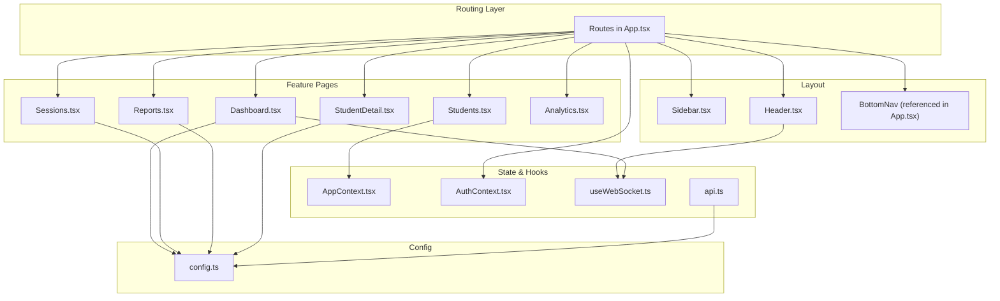
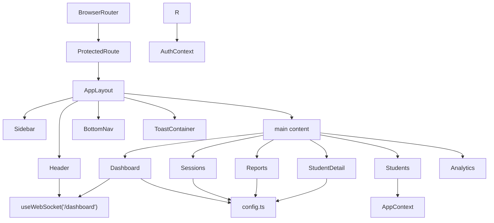
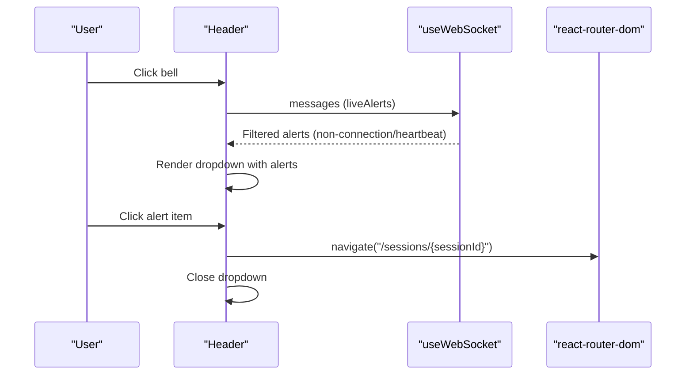
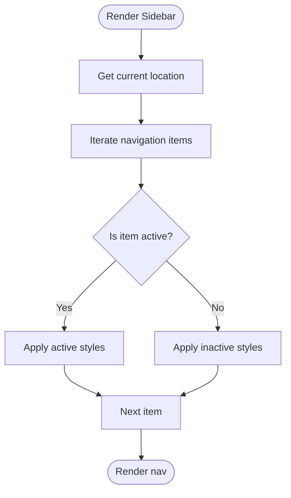
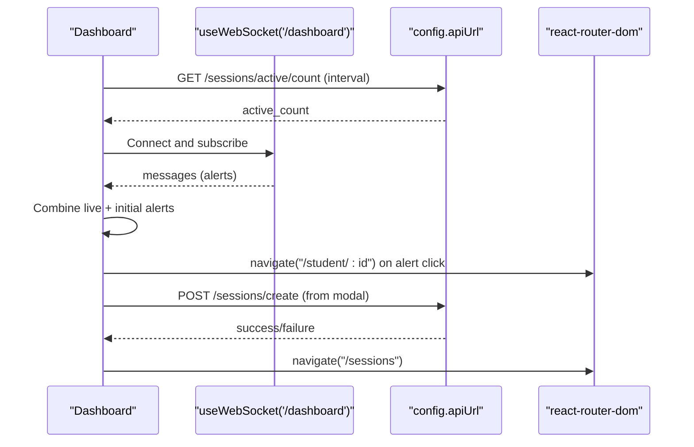
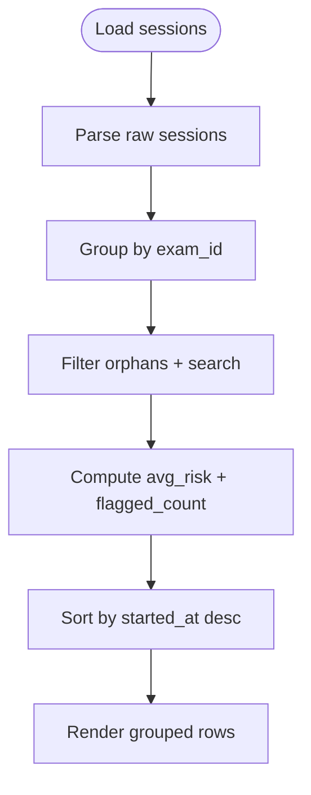
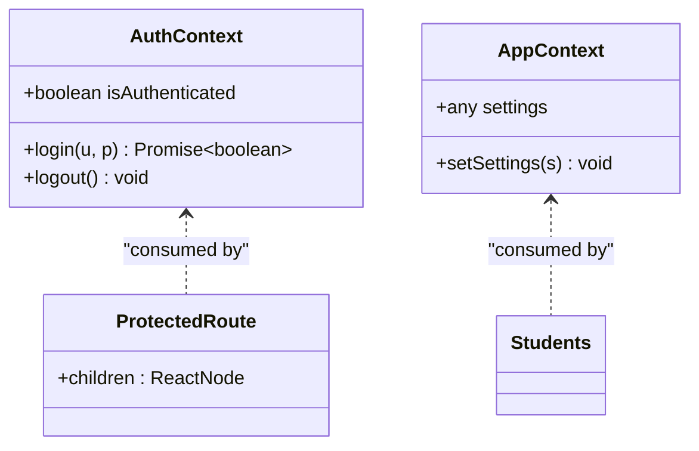
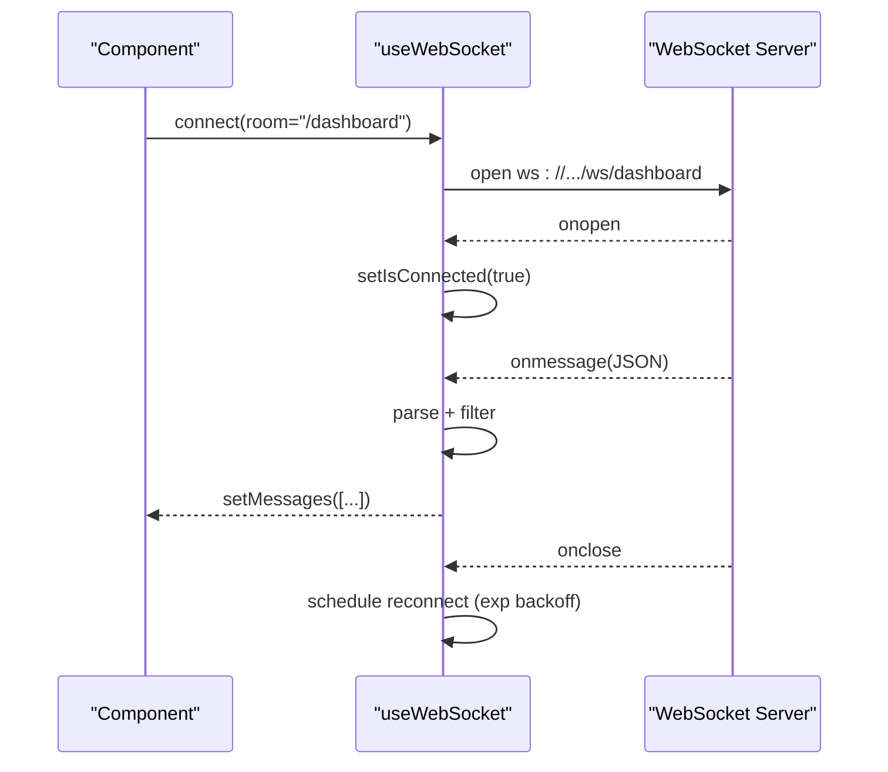
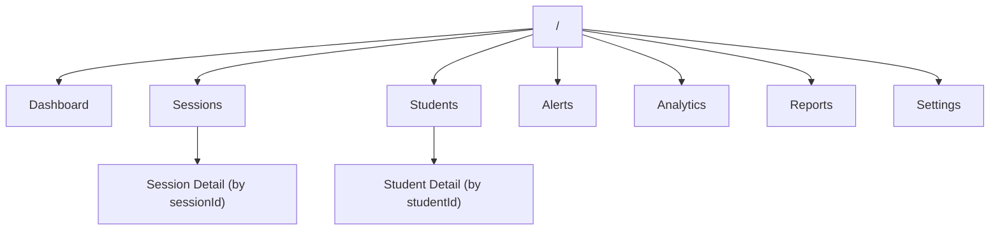
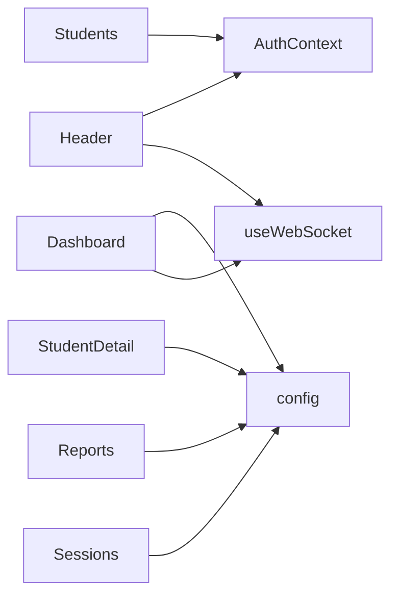

# Frontend Dashboard

<cite>
**Referenced Files in This Document**
- [App.tsx](file://examguard-pro/src/App.tsx)
- [main.tsx](file://examguard-pro/src/main.tsx)
- [Header.tsx](file://examguard-pro/src/components/Header.tsx)
- [Sidebar.tsx](file://examguard-pro/src/components/Sidebar.tsx)
- [Dashboard.tsx](file://examguard-pro/src/components/Dashboard.tsx)
- [Sessions.tsx](file://examguard-pro/src/components/Sessions.tsx)
- [Reports.tsx](file://examguard-pro/src/components/Reports.tsx)
- [Students.tsx](file://examguard-pro/src/components/Students.tsx)
- [StudentDetail.tsx](file://examguard-pro/src/components/StudentDetail.tsx)
- [Analytics.tsx](file://examguard-pro/src/components/Analytics.tsx)
- [AppContext.tsx](file://examguard-pro/src/context/AppContext.tsx)
- [AuthContext.tsx](file://examguard-pro/src/context/AuthContext.tsx)
- [useWebSocket.ts](file://examguard-pro/src/hooks/useWebSocket.ts)
- [api.ts](file://examguard-pro/src/hooks/api.ts)
- [config.ts](file://examguard-pro/src/config.ts)
</cite>

## Table of Contents
1. [Introduction](#introduction)
2. [Project Structure](#project-structure)
3. [Core Components](#core-components)
4. [Architecture Overview](#architecture-overview)
5. [Detailed Component Analysis](#detailed-component-analysis)
6. [Dependency Analysis](#dependency-analysis)
7. [Performance Considerations](#performance-considerations)
8. [Troubleshooting Guide](#troubleshooting-guide)
9. [Conclusion](#conclusion)
10. [Appendices](#appendices)

## Introduction
This document describes the frontend dashboard for the ExamGuard Pro React application. It focuses on the interactive monitoring interface and real-time data visualization, covering the React component architecture, routing and navigation, role-based access control, state management via Context API, WebSocket integration, and performance optimization for smooth real-time updates. It also provides guidance for responsive design, accessibility, and cross-browser compatibility.

## Project Structure
The frontend is organized around a routed layout with a persistent header, sidebar, and bottom navigation. Components are grouped by feature (Dashboard, Sessions, Reports, Students, Analytics). Global state is managed via two contexts: AuthContext for authentication and AppContext for application-wide settings. Real-time updates are handled via a reusable WebSocket hook.

**Diagram sources**
- [App.tsx:67-91](file://examguard-pro/src/App.tsx#L67-L91)
- [Sidebar.tsx:25-94](file://examguard-pro/src/components/Sidebar.tsx#L25-L94)
- [Header.tsx:7-204](file://examguard-pro/src/components/Header.tsx#L7-L204)
- [Dashboard.tsx:30-427](file://examguard-pro/src/components/Dashboard.tsx#L30-L427)
- [Sessions.tsx:29-271](file://examguard-pro/src/components/Sessions.tsx#L29-L271)
- [Students.tsx:10-192](file://examguard-pro/src/components/Students.tsx#L10-L192)
- [StudentDetail.tsx:16-187](file://examguard-pro/src/components/StudentDetail.tsx#L16-L187)
- [Reports.tsx:16-229](file://examguard-pro/src/components/Reports.tsx#L16-L229)
- [Analytics.tsx:6-72](file://examguard-pro/src/components/Analytics.tsx#L6-L72)
- [AppContext.tsx:10-24](file://examguard-pro/src/context/AppContext.tsx#L10-L24)
- [AuthContext.tsx:13-58](file://examguard-pro/src/context/AuthContext.tsx#L13-L58)
- [useWebSocket.ts:4-110](file://examguard-pro/src/hooks/useWebSocket.ts#L4-L110)
- [api.ts:3-18](file://examguard-pro/src/hooks/api.ts#L3-L18)
- [config.ts:1-13](file://examguard-pro/src/config.ts#L1-L13)

**Section sources**
- [App.tsx:67-91](file://examguard-pro/src/App.tsx#L67-L91)
- [main.tsx:1-11](file://examguard-pro/src/main.tsx#L1-L11)

## Core Components
- Header: Provides notification bell, live alerts feed, profile menu, and logout. Integrates WebSocket for live alerts and filters non-alert messages.
- Sidebar: Navigation drawer with active-state highlighting and logout action.
- Dashboard: Real-time overview cards, activity timeline chart, recent alerts, and “New Session” modal with exam code generation.
- Sessions: List of exam sessions grouped by exam_id, with risk indicators, search, and navigation to session detail.
- Reports: Session listing with PDF/JSON report generation and search.
- Students: Student directory with sorting, filtering, and modal detail.
- StudentDetail: Per-student profile and session history.
- Analytics: Charts for alert distribution and risk score distribution.
- AppContext: Application settings provider.
- AuthContext: Authentication provider with login/logout and protected routes.
- useWebSocket: Hook for real-time messaging with reconnection and heartbeat.
- api.ts: Helper for authenticated API requests.
- config.ts: Centralized API and WebSocket URLs.

**Section sources**
- [Header.tsx:7-204](file://examguard-pro/src/components/Header.tsx#L7-L204)
- [Sidebar.tsx:25-94](file://examguard-pro/src/components/Sidebar.tsx#L25-L94)
- [Dashboard.tsx:30-427](file://examguard-pro/src/components/Dashboard.tsx#L30-L427)
- [Sessions.tsx:29-271](file://examguard-pro/src/components/Sessions.tsx#L29-L271)
- [Reports.tsx:16-229](file://examguard-pro/src/components/Reports.tsx#L16-L229)
- [Students.tsx:10-192](file://examguard-pro/src/components/Students.tsx#L10-L192)
- [StudentDetail.tsx:16-187](file://examguard-pro/src/components/StudentDetail.tsx#L16-L187)
- [Analytics.tsx:6-72](file://examguard-pro/src/components/Analytics.tsx#L6-L72)
- [AppContext.tsx:10-24](file://examguard-pro/src/context/AppContext.tsx#L10-L24)
- [AuthContext.tsx:13-58](file://examguard-pro/src/context/AuthContext.tsx#L13-L58)
- [useWebSocket.ts:4-110](file://examguard-pro/src/hooks/useWebSocket.ts#L4-L110)
- [api.ts:3-18](file://examguard-pro/src/hooks/api.ts#L3-L18)
- [config.ts:1-13](file://examguard-pro/src/config.ts#L1-L13)

## Architecture Overview
The app uses React Router for client-side routing with a protected layout. Authentication guards redirect unauthenticated users to the login route. The layout composes Sidebar, Header, main content area, BottomNav, and ToastContainer. Real-time updates are delivered via WebSocket and surfaced to components through a shared hook. Backend integration is centralized in config.ts and consumed by components and hooks.

**Diagram sources**
- [App.tsx:28-91](file://examguard-pro/src/App.tsx#L28-L91)
- [Header.tsx:12](file://examguard-pro/src/components/Header.tsx#L12)
- [Dashboard.tsx:25](file://examguard-pro/src/components/Dashboard.tsx#L25)
- [config.ts:9-12](file://examguard-pro/src/config.ts#L9-L12)
- [AuthContext.tsx:13-58](file://examguard-pro/src/context/AuthContext.tsx#L13-L58)
- [AppContext.tsx:10-24](file://examguard-pro/src/context/AppContext.tsx#L10-L24)

## Detailed Component Analysis

### Header Component
- Responsibilities:
  - Renders notification bell with badge count based on live alerts.
  - Opens a dropdown panel listing recent alerts with navigation to session detail.
  - Provides profile menu with account settings and logout.
  - Integrates WebSocket to receive live messages and filters non-alert events.
- Props/events:
  - No incoming props.
  - Uses navigation hooks for programmatic routing.
- Customization options:
  - Notification list limit and alert severity coloring are configurable.
  - Search input exists but is currently non-functional; can be wired to backend.
- Accessibility:
  - Proper focus order and keyboard navigation within dropdowns.
  - ARIA roles and labels present on interactive elements.

**Diagram sources**
- [Header.tsx:12-19](file://examguard-pro/src/components/Header.tsx#L12-L19)
- [Header.tsx:113-138](file://examguard-pro/src/components/Header.tsx#L113-L138)
- [Header.tsx:117](file://examguard-pro/src/components/Header.tsx#L117)

**Section sources**
- [Header.tsx:7-204](file://examguard-pro/src/components/Header.tsx#L7-L204)

### Sidebar Component
- Responsibilities:
  - Navigation drawer with links to Dashboard, Sessions, Students, Alerts, Analytics, Reports, and Settings.
  - Highlights active route and supports logout.
- Props/events:
  - Uses react-router-dom Link and useLocation for active state.
- Customization options:
  - Add/remove items in navigation array.
  - Adjust styling classes for branding.

**Diagram sources**
- [Sidebar.tsx:25-65](file://examguard-pro/src/components/Sidebar.tsx#L25-L65)

**Section sources**
- [Sidebar.tsx:25-94](file://examguard-pro/src/components/Sidebar.tsx#L25-L94)

### Dashboard Component
- Responsibilities:
  - Displays overview cards (active students, live alerts, safety status, average progress).
  - Renders an AreaChart with live activity and alerts timelines.
  - Shows recent alerts with navigation to student detail.
  - Provides “New Session” modal with exam code generation and copy actions.
  - Periodically fetches active student counts from backend.
- Props/events:
  - Uses navigation hooks for routing.
  - WebSocket messages drive live updates.
- Customization options:
  - Chart colors and gradients are inline; can be externalized.
  - Card animations and delays are customizable.

**Diagram sources**
- [Dashboard.tsx:33-55](file://examguard-pro/src/components/Dashboard.tsx#L33-L55)
- [Dashboard.tsx:103-112](file://examguard-pro/src/components/Dashboard.tsx#L103-L112)
- [Dashboard.tsx:298](file://examguard-pro/src/components/Dashboard.tsx#L298)
- [Dashboard.tsx:83-101](file://examguard-pro/src/components/Dashboard.tsx#L83-L101)

**Section sources**
- [Dashboard.tsx:30-427](file://examguard-pro/src/components/Dashboard.tsx#L30-L427)
- [config.ts:9-12](file://examguard-pro/src/config.ts#L9-L12)

### Sessions Component
- Responsibilities:
  - Fetches sessions from backend and groups them by exam_id.
  - Filters groups to exclude orphans and applies search queries.
  - Displays risk statistics and student avatars per exam group.
  - Navigates to proctor session or first student session on selection.
- Props/events:
  - Uses react-router-dom for navigation.
- Customization options:
  - Sorting and grouping logic can be extended.
  - Search scope can be expanded.

**Diagram sources**
- [Sessions.tsx:53-105](file://examguard-pro/src/components/Sessions.tsx#L53-L105)

**Section sources**
- [Sessions.tsx:29-271](file://examguard-pro/src/components/Sessions.tsx#L29-L271)

### Reports Component
- Responsibilities:
  - Loads sessions and allows refreshing.
  - Generates and downloads PDF and JSON reports per session.
  - Supports search across student, exam ID, and session ID.
- Props/events:
  - Uses local storage for token retrieval.
- Customization options:
  - Add pagination or export filters.

**Section sources**
- [Reports.tsx:16-229](file://examguard-pro/src/components/Reports.tsx#L16-L229)

### Students Component
- Responsibilities:
  - Displays a sortable, searchable student directory.
  - Opens a modal with detailed student information.
- Props/events:
  - Sort keys and order are state-managed.
- Customization options:
  - Extend sorters and add filters.

**Section sources**
- [Students.tsx:10-192](file://examguard-pro/src/components/Students.tsx#L10-L192)

### StudentDetail Component
- Responsibilities:
  - Shows aggregated stats for a selected student.
  - Lists session history with risk level badges and navigation to session detail.
- Props/events:
  - Uses params and navigation hooks.
- Customization options:
  - Add more derived metrics or charts.

**Section sources**
- [StudentDetail.tsx:16-187](file://examguard-pro/src/components/StudentDetail.tsx#L16-L187)

### Analytics Component
- Responsibilities:
  - Renders bar and pie charts for alert types and risk distribution.
- Props/events:
  - Uses Recharts components with responsive containers.
- Customization options:
  - Bind to real datasets from backend.

**Section sources**
- [Analytics.tsx:6-72](file://examguard-pro/src/components/Analytics.tsx#L6-L72)

### State Management and Context
- AuthContext:
  - Provides login, logout, and isAuthenticated state.
  - Stores token in localStorage and redirects on logout.
- AppContext:
  - Provides settings state for application-wide preferences.

**Diagram sources**
- [AuthContext.tsx:5-58](file://examguard-pro/src/context/AuthContext.tsx#L5-L58)
- [AppContext.tsx:3-24](file://examguard-pro/src/context/AppContext.tsx#L3-L24)
- [App.tsx:28-31](file://examguard-pro/src/App.tsx#L28-L31)

**Section sources**
- [AuthContext.tsx:13-58](file://examguard-pro/src/context/AuthContext.tsx#L13-L58)
- [AppContext.tsx:10-24](file://examguard-pro/src/context/AppContext.tsx#L10-L24)
- [App.tsx:28-31](file://examguard-pro/src/App.tsx#L28-L31)

### Real-Time WebSocket Integration
- useWebSocket:
  - Establishes WebSocket connection to the dashboard room.
  - Handles open/close/error with exponential backoff reconnection.
  - Sends periodic heartbeat and ignores non-alert messages.
  - Exposes messages, isConnected, and sendMessage.
- Message filtering:
  - Ignores connection, heartbeat, pong, and subscribed messages.
  - Header filters out connection, heartbeat, risk updates, and session lifecycle events.

**Diagram sources**
- [useWebSocket.ts:18-78](file://examguard-pro/src/hooks/useWebSocket.ts#L18-L78)
- [Header.tsx:14-19](file://examguard-pro/src/components/Header.tsx#L14-L19)
- [Dashboard.tsx:103-112](file://examguard-pro/src/components/Dashboard.tsx#L103-L112)

**Section sources**
- [useWebSocket.ts:4-110](file://examguard-pro/src/hooks/useWebSocket.ts#L4-L110)
- [Header.tsx:12-19](file://examguard-pro/src/components/Header.tsx#L12-L19)
- [Dashboard.tsx:33](file://examguard-pro/src/components/Dashboard.tsx#L33)

### Routing Patterns and Navigation
- Protected routes:
  - AppLayout is wrapped by a ProtectedRoute that checks authentication.
- Nested routes:
  - Dashboard, Sessions, Reports, Students, Alerts, Analytics, Settings, and session detail pages are nested under the layout.
- Navigation flows:
  - Sidebar and Header provide primary navigation.
  - Components navigate programmatically using react-router-dom.

**Diagram sources**
- [App.tsx:72-86](file://examguard-pro/src/App.tsx#L72-L86)

**Section sources**
- [App.tsx:28-91](file://examguard-pro/src/App.tsx#L28-L91)

### Backend Integration
- API base URL and WebSocket URL are resolved from environment variables and runtime host detection.
- Components call endpoints for sessions, reports, and session creation.
- Token is retrieved from localStorage for protected endpoints.

**Section sources**
- [config.ts:1-13](file://examguard-pro/src/config.ts#L1-L13)
- [Dashboard.tsx:83-101](file://examguard-pro/src/components/Dashboard.tsx#L83-L101)
- [Sessions.tsx:38-50](file://examguard-pro/src/components/Sessions.tsx#L38-L50)
- [Reports.tsx:27-39](file://examguard-pro/src/components/Reports.tsx#L27-L39)
- [StudentDetail.tsx:27-45](file://examguard-pro/src/components/StudentDetail.tsx#L27-L45)

## Dependency Analysis
- Component dependencies:
  - Header depends on AuthContext for logout and useWebSocket for live alerts.
  - Dashboard depends on useWebSocket and config for real-time data and API base URL.
  - Sessions, Reports, and StudentDetail depend on config for API endpoints.
  - Students depends on AppContext for settings and internal state.
- External libraries:
  - react-router-dom for routing and navigation.
  - lucide-react for icons.
  - Recharts for analytics visualization.
  - motion/react for animations.

**Diagram sources**
- [Header.tsx:8-12](file://examguard-pro/src/components/Header.tsx#L8-L12)
- [Dashboard.tsx:25](file://examguard-pro/src/components/Dashboard.tsx#L25)
- [Sessions.tsx:5](file://examguard-pro/src/components/Sessions.tsx#L5)
- [Reports.tsx:3](file://examguard-pro/src/components/Reports.tsx#L3)
- [StudentDetail.tsx:4](file://examguard-pro/src/components/StudentDetail.tsx#L4)
- [Students.tsx:4](file://examguard-pro/src/components/Students.tsx#L4)

**Section sources**
- [Header.tsx:7-204](file://examguard-pro/src/components/Header.tsx#L7-L204)
- [Dashboard.tsx:30-427](file://examguard-pro/src/components/Dashboard.tsx#L30-L427)
- [Sessions.tsx:29-271](file://examguard-pro/src/components/Sessions.tsx#L29-L271)
- [Reports.tsx:16-229](file://examguard-pro/src/components/Reports.tsx#L16-L229)
- [Students.tsx:10-192](file://examguard-pro/src/components/Students.tsx#L10-L192)
- [StudentDetail.tsx:16-187](file://examguard-pro/src/components/StudentDetail.tsx#L16-L187)

## Performance Considerations
- Real-time updates:
  - useWebSocket implements exponential backoff and heartbeat to maintain connection stability.
  - Filtering reduces unnecessary renders by ignoring non-alert messages.
- Rendering:
  - Dashboard uses motion for staggered card animations and AnimatePresence for modal transitions.
  - Sessions and Students apply memoization and controlled rendering to avoid heavy re-renders.
- Network:
  - Dashboard fetches active student counts on an interval; consider debouncing or throttling if needed.
  - Reports and Students use controlled loading states to prevent redundant requests.

[No sources needed since this section provides general guidance]

## Troubleshooting Guide
- Authentication:
  - Ensure tokens are persisted and retrieved correctly; AuthContext stores tokens in localStorage.
- WebSocket:
  - Confirm wsUrl resolves to a reachable backend endpoint; use config.ts to verify protocol and host.
  - Check reconnection attempts and console logs for connection errors.
- Routing:
  - ProtectedRoute redirects unauthenticated users to /login; verify AuthContext state.
- API:
  - api.ts helper sets Content-Type and throws on non-ok responses; wrap calls with try/catch.
- Notifications:
  - Header filters out non-alert messages; verify backend emits correct event types.

**Section sources**
- [AuthContext.tsx:17-43](file://examguard-pro/src/context/AuthContext.tsx#L17-L43)
- [useWebSocket.ts:18-78](file://examguard-pro/src/hooks/useWebSocket.ts#L18-L78)
- [config.ts:9-12](file://examguard-pro/src/config.ts#L9-L12)
- [api.ts:4-16](file://examguard-pro/src/hooks/api.ts#L4-L16)
- [Header.tsx:14-19](file://examguard-pro/src/components/Header.tsx#L14-L19)

## Conclusion
The ExamGuard Pro frontend provides a robust, real-time monitoring dashboard with clear separation of concerns via Context API, reusable hooks, and modular components. The routing and navigation are straightforward, while the WebSocket integration ensures timely updates. With minor enhancements to backend-bound datasets and improved accessibility attributes, the interface can be further refined for production use.

[No sources needed since this section summarizes without analyzing specific files]

## Appendices

### Responsive Design Guidelines
- Use Tailwind’s responsive utilities (sm:, md:, lg:) consistently across components.
- Prefer mobile-first layouts with appropriate spacing and typography scaling.
- Test charts with ResponsiveContainer to ensure proper scaling on small screens.

[No sources needed since this section provides general guidance]

### Accessibility Compliance
- Ensure focus management within modals and dropdowns.
- Provide ARIA labels for interactive icons and buttons.
- Maintain sufficient color contrast for severity indicators and badges.

[No sources needed since this section provides general guidance]

### Cross-Browser Compatibility
- Verify WebSocket support and fallback behavior on older browsers.
- Test animations and CSS Grid/Flexbox on target browsers.
- Validate icon rendering and SVG support across browsers.

[No sources needed since this section provides general guidance]