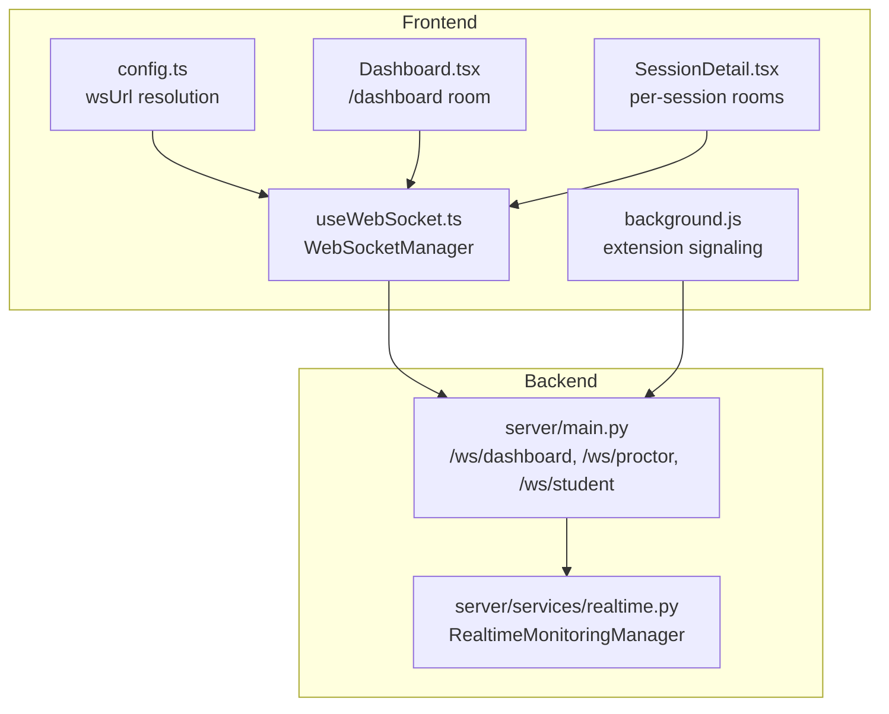
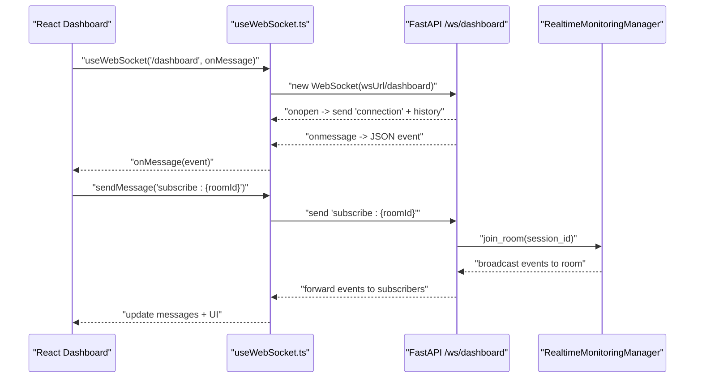
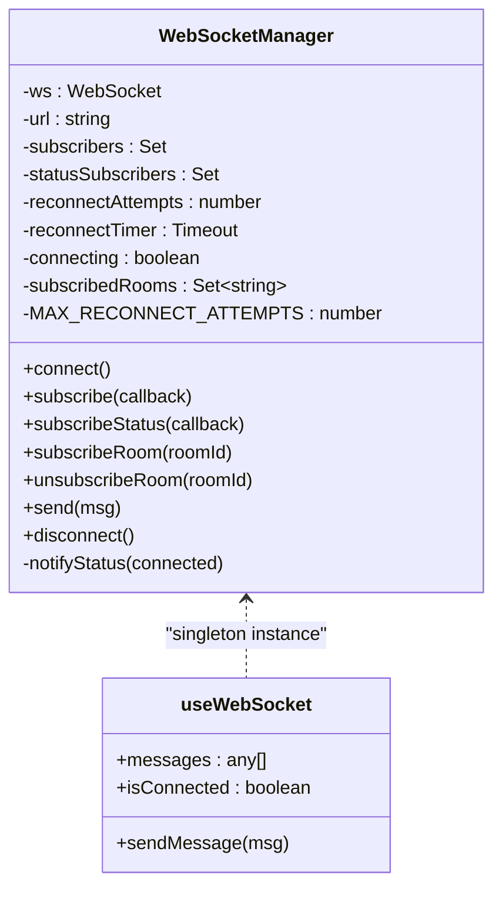
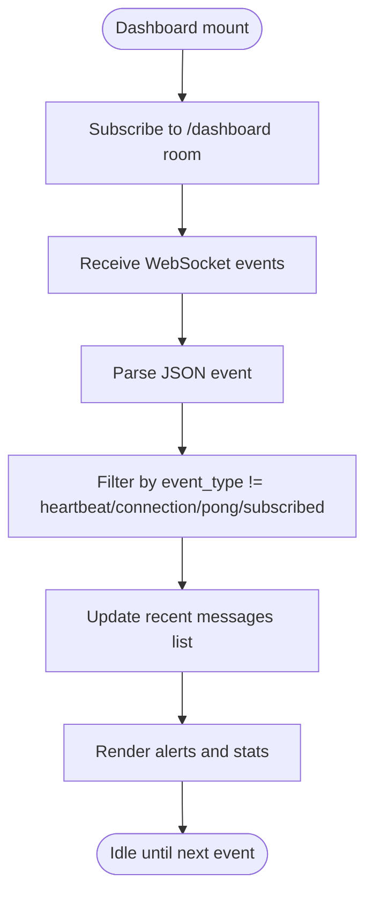
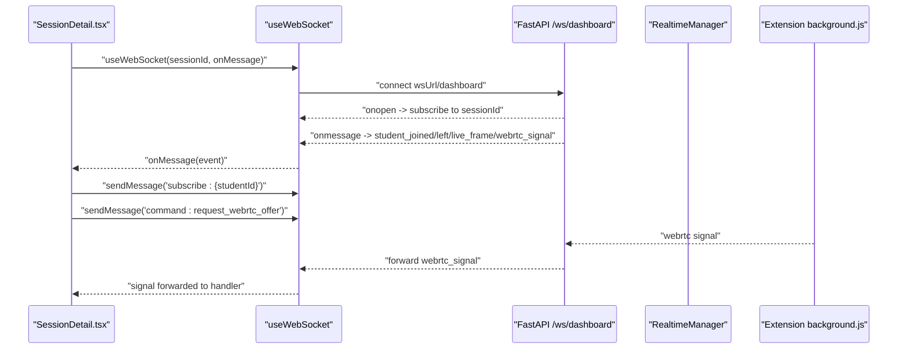
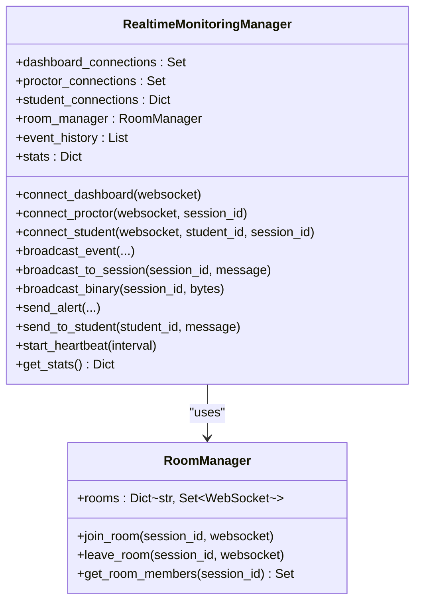
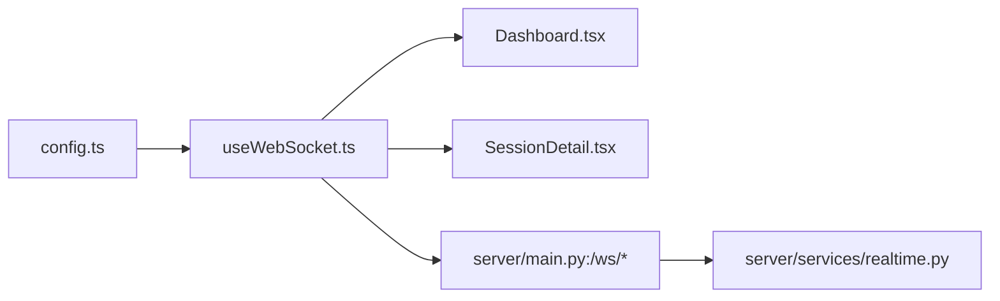

# Real-Time Integration

<cite>
**Referenced Files in This Document**
- [useWebSocket.ts](file://examguard-pro/src/hooks/useWebSocket.ts)
- [config.ts](file://examguard-pro/src/config.ts)
- [Dashboard.tsx](file://examguard-pro/src/components/Dashboard.tsx)
- [SessionDetail.tsx](file://examguard-pro/src/components/SessionDetail.tsx)
- [main.py](file://server/main.py)
- [realtime.py](file://server/services/realtime.py)
- [background.js](file://extension/background.js)
</cite>

## Table of Contents
1. [Introduction](#introduction)
2. [Project Structure](#project-structure)
3. [Core Components](#core-components)
4. [Architecture Overview](#architecture-overview)
5. [Detailed Component Analysis](#detailed-component-analysis)
6. [Dependency Analysis](#dependency-analysis)
7. [Performance Considerations](#performance-considerations)
8. [Troubleshooting Guide](#troubleshooting-guide)
9. [Conclusion](#conclusion)

## Introduction
This document explains the real-time integration for the ExamGuard Pro React dashboard. It covers WebSocket connection establishment, message handling, room-based subscriptions, and real-time data synchronization patterns. It documents the useWebSocket custom hook, connection lifecycle management, error recovery strategies, event-driven UI updates, optimistic updates, and debugging techniques. It also describes the server-side real-time broadcasting and room management.

## Project Structure
The real-time system spans three layers:
- Frontend React hooks and components that establish WebSocket connections and render live data.
- A shared WebSocket manager that centralizes connection state, subscriptions, and reconnection logic.
- Backend FastAPI WebSocket endpoints and a real-time manager that broadcast events to dashboards, proctors, and students.

**Diagram sources**
- [useWebSocket.ts:1-175](file://examguard-pro/src/hooks/useWebSocket.ts#L1-L175)
- [config.ts:1-12](file://examguard-pro/src/config.ts#L1-L12)
- [Dashboard.tsx:30-35](file://examguard-pro/src/components/Dashboard.tsx#L30-L35)
- [SessionDetail.tsx:22-35](file://examguard-pro/src/components/SessionDetail.tsx#L22-L35)
- [main.py:275-474](file://server/main.py#L275-L474)
- [realtime.py:102-643](file://server/services/realtime.py#L102-L643)
- [background.js:114-152](file://extension/background.js#L114-L152)

**Section sources**
- [useWebSocket.ts:1-175](file://examguard-pro/src/hooks/useWebSocket.ts#L1-L175)
- [config.ts:1-12](file://examguard-pro/src/config.ts#L1-L12)
- [Dashboard.tsx:30-35](file://examguard-pro/src/components/Dashboard.tsx#L30-L35)
- [SessionDetail.tsx:22-35](file://examguard-pro/src/components/SessionDetail.tsx#L22-L35)
- [main.py:275-474](file://server/main.py#L275-L474)
- [realtime.py:102-643](file://server/services/realtime.py#L102-L643)
- [background.js:114-152](file://extension/background.js#L114-L152)

## Core Components
- useWebSocket custom hook and WebSocketManager
  - Provides a singleton WebSocket connection to the dashboard endpoint.
  - Manages message subscriptions, connection status, room subscriptions, and reconnection.
  - Exposes messages, connection status, and a sendMessage function.
- Configuration
  - Resolves wsUrl based on protocol and host, supporting dev and prod environments.
- Dashboard and SessionDetail components
  - Subscribe to the dashboard room for global alerts and events.
  - Subscribe to per-session rooms for targeted WebRTC and live frames.
- Server-side real-time manager
  - Manages connections for dashboards, proctors, and students.
  - Implements room-based broadcasting and event history.
  - Handles ping/pong, stats, and binary video streaming.

**Section sources**
- [useWebSocket.ts:1-175](file://examguard-pro/src/hooks/useWebSocket.ts#L1-L175)
- [config.ts:1-12](file://examguard-pro/src/config.ts#L1-L12)
- [Dashboard.tsx:30-35](file://examguard-pro/src/components/Dashboard.tsx#L30-L35)
- [SessionDetail.tsx:22-35](file://examguard-pro/src/components/SessionDetail.tsx#L22-L35)
- [realtime.py:102-643](file://server/services/realtime.py#L102-L643)

## Architecture Overview
The real-time architecture uses a publish/subscribe pattern:
- Clients connect to FastAPI WebSocket endpoints.
- The server maintains connection pools and rooms.
- Events are broadcast to dashboards, proctors, and students.
- The frontend hook manages subscriptions and UI updates.

**Diagram sources**
- [useWebSocket.ts:21-74](file://examguard-pro/src/hooks/useWebSocket.ts#L21-L74)
- [main.py:275-343](file://server/main.py#L275-L343)
- [realtime.py:213-274](file://server/services/realtime.py#L213-L274)

## Detailed Component Analysis

### useWebSocket Hook and WebSocketManager
- Responsibilities
  - Singleton WebSocket connection with exponential backoff reconnection.
  - Message routing: filters heartbeat/connection messages; forwards parsed JSON to subscribers.
  - Room subscriptions: supports subscribing/unsubscribing to session rooms.
  - Connection status notifications to UI.
  - Send helper for low-level text messages.
- Lifecycle
  - connect(): creates WebSocket if not already connecting/open.
  - onopen: resets reconnect attempts, notifies status, re-subscribes to rooms.
  - onmessage: parses JSON, ignores heartbeat/connection/subscribed; forwards others.
  - onclose/onerror: updates status; schedules reconnect until max attempts.
  - disconnect(): cancels timers and closes connection cleanly.
- Room management
  - subscribeRoom()/unsubscribeRoom() maintain a set of subscribed rooms.
  - On reconnect, re-sends subscribe commands for all rooms.
- UI integration
  - useWebSocket returns messages array (recent N), isConnected flag, and sendMessage.

**Diagram sources**
- [useWebSocket.ts:5-126](file://examguard-pro/src/hooks/useWebSocket.ts#L5-L126)

**Section sources**
- [useWebSocket.ts:1-175](file://examguard-pro/src/hooks/useWebSocket.ts#L1-L175)

### Dashboard Component Real-Time Updates
- Subscribes to the dashboard room to receive global alerts and events.
- Aggregates live alerts with local initial data and limits the visible list.
- Uses connection status to reflect connectivity.

**Diagram sources**
- [Dashboard.tsx:30-113](file://examguard-pro/src/components/Dashboard.tsx#L30-L113)
- [useWebSocket.ts:43-54](file://examguard-pro/src/hooks/useWebSocket.ts#L43-L54)

**Section sources**
- [Dashboard.tsx:30-113](file://examguard-pro/src/components/Dashboard.tsx#L30-L113)
- [useWebSocket.ts:43-54](file://examguard-pro/src/hooks/useWebSocket.ts#L43-L54)

### SessionDetail Component: Room-Based Communication and WebRTC
- Subscribes to the session’s room to receive per-session events.
- Dynamically subscribes to each student’s room when they join.
- Handles WebRTC signaling via the hook’s sendMessage and a dedicated signal handler.
- Maintains live frames and MediaStreams for camera/screen feeds.

**Diagram sources**
- [SessionDetail.tsx:47-117](file://examguard-pro/src/components/SessionDetail.tsx#L47-L117)
- [main.py:304-339](file://server/main.py#L304-L339)
- [background.js:133-141](file://extension/background.js#L133-L141)

**Section sources**
- [SessionDetail.tsx:47-117](file://examguard-pro/src/components/SessionDetail.tsx#L47-L117)
- [main.py:304-339](file://server/main.py#L304-L339)
- [background.js:133-141](file://extension/background.js#L133-L141)

### Server-Side Real-Time Manager
- Connection pools
  - Dashboard connections, proctor connections, and student connections.
- Room management
  - RoomManager organizes WebSocket connections by session_id.
- Broadcasting
  - broadcast_to_session(session_id, message) routes to room members.
  - broadcast_binary(session_id, bytes) relays live video chunks.
- Commands and signals
  - Handles subscribe commands, ping/pong, and WebRTC signaling.
- Heartbeat and stats
  - Periodic heartbeat with connection counts and event stats.

**Diagram sources**
- [realtime.py:102-643](file://server/services/realtime.py#L102-L643)

**Section sources**
- [realtime.py:102-643](file://server/services/realtime.py#L102-L643)
- [main.py:275-474](file://server/main.py#L275-L474)

## Dependency Analysis
- Frontend
  - useWebSocket.ts depends on config.ts for wsUrl resolution.
  - Dashboard.tsx and SessionDetail.tsx depend on useWebSocket.ts.
- Backend
  - main.py registers WebSocket endpoints and delegates to RealtimeMonitoringManager.
  - RealtimeMonitoringManager orchestrates broadcasting and room management.

**Diagram sources**
- [config.ts:1-12](file://examguard-pro/src/config.ts#L1-L12)
- [useWebSocket.ts:1-175](file://examguard-pro/src/hooks/useWebSocket.ts#L1-L175)
- [Dashboard.tsx:30-35](file://examguard-pro/src/components/Dashboard.tsx#L30-L35)
- [SessionDetail.tsx:22-35](file://examguard-pro/src/components/SessionDetail.tsx#L22-L35)
- [main.py:275-474](file://server/main.py#L275-L474)
- [realtime.py:102-643](file://server/services/realtime.py#L102-L643)

**Section sources**
- [config.ts:1-12](file://examguard-pro/src/config.ts#L1-L12)
- [useWebSocket.ts:1-175](file://examguard-pro/src/hooks/useWebSocket.ts#L1-L175)
- [Dashboard.tsx:30-35](file://examguard-pro/src/components/Dashboard.tsx#L30-L35)
- [SessionDetail.tsx:22-35](file://examguard-pro/src/components/SessionDetail.tsx#L22-L35)
- [main.py:275-474](file://server/main.py#L275-L474)
- [realtime.py:102-643](file://server/services/realtime.py#L102-L643)

## Performance Considerations
- Connection reuse
  - The singleton WebSocketManager avoids redundant connections and consolidates subscriptions.
- Backpressure and buffering
  - The server broadcasts binary video chunks to dashboards and proctors; ensure clients can process frames efficiently.
- Message filtering
  - Ignoring heartbeat/connection messages reduces UI churn.
- Room granularity
  - Per-session rooms minimize unnecessary fan-out and improve scalability.
- History and stats
  - Recent event history helps late-joining clients catch up without reprocessing full streams.

[No sources needed since this section provides general guidance]

## Troubleshooting Guide
- Connection does not establish
  - Verify wsUrl resolution in config.ts for the current protocol/host.
  - Check backend WebSocket endpoints are reachable and accepting connections.
- Frequent reconnections
  - Inspect onclose conditions and reconnect attempts; ensure network stability.
  - Confirm the server does not abruptly close connections.
- Messages not received
  - Ensure the client sent subscribe commands for rooms.
  - Verify message parsing ignores heartbeat/connection/subscribed types.
- WebRTC signaling failures
  - Confirm the extension sends webrtc signals and the server routes them to the correct student.
  - Validate that the client’s signal handler is wired to the hook’s onMessage callback.
- Debugging techniques
  - Enable console logs for connection, room subscription, and message parsing in the hook.
  - Use browser DevTools Network tab to inspect WebSocket frames and timing.
  - Monitor server logs for connection, room joins, and broadcasting actions.
  - Use server stats endpoints or logs to track connection counts and event rates.

**Section sources**
- [useWebSocket.ts:31-74](file://examguard-pro/src/hooks/useWebSocket.ts#L31-L74)
- [main.py:282-342](file://server/main.py#L282-L342)
- [background.js:133-141](file://extension/background.js#L133-L141)

## Conclusion
The ExamGuard Pro real-time integration leverages a robust WebSocket architecture with a centralized manager on the frontend and a scalable room-based broadcasting system on the backend. The useWebSocket hook encapsulates connection lifecycle, reconnection, and room subscriptions, enabling event-driven UI updates across the dashboard and session views. Room-based communication and careful message filtering ensure efficient, client-consistent real-time experiences, while server-side stats and heartbeats provide operational visibility.