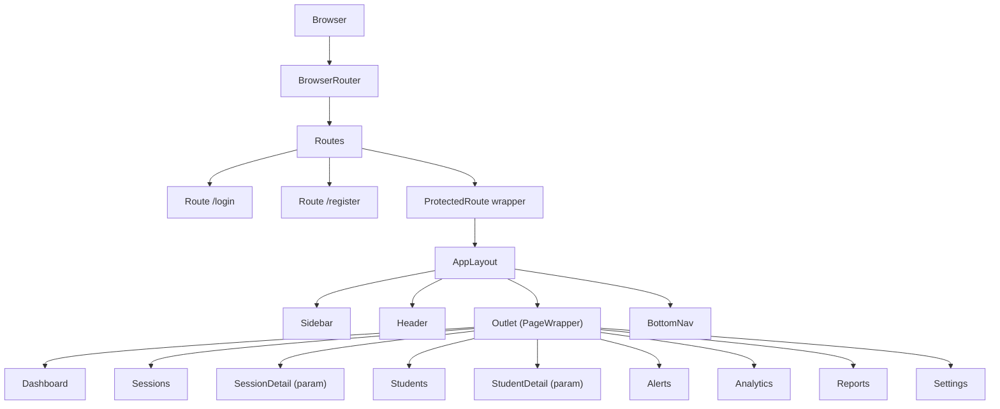
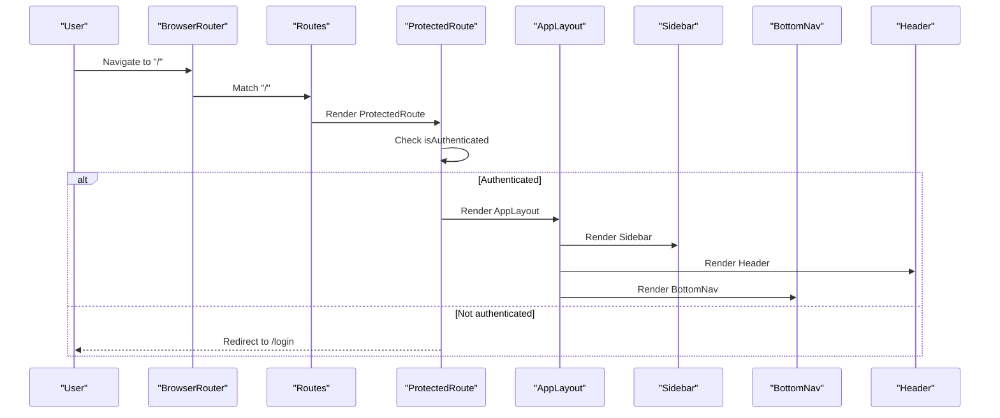
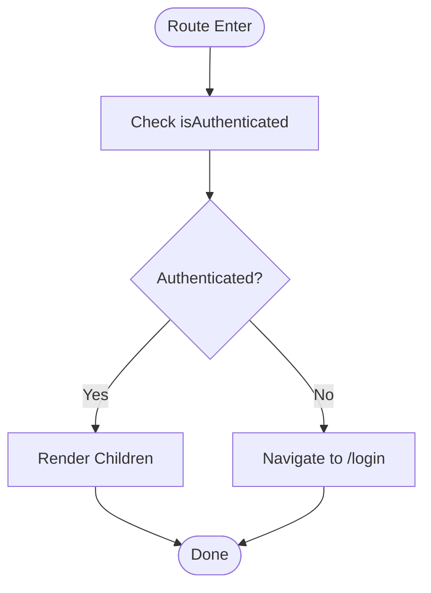
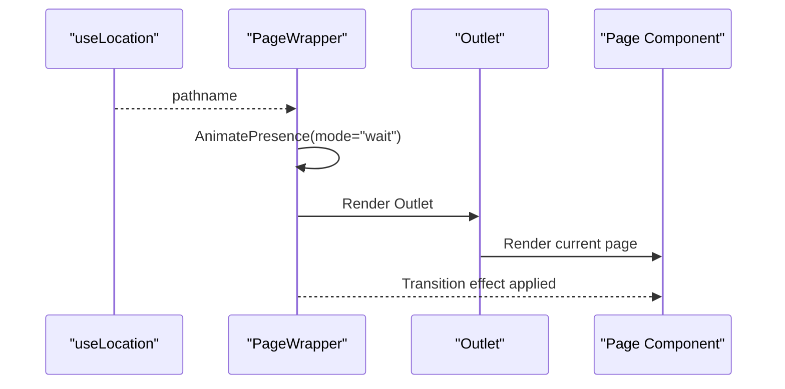
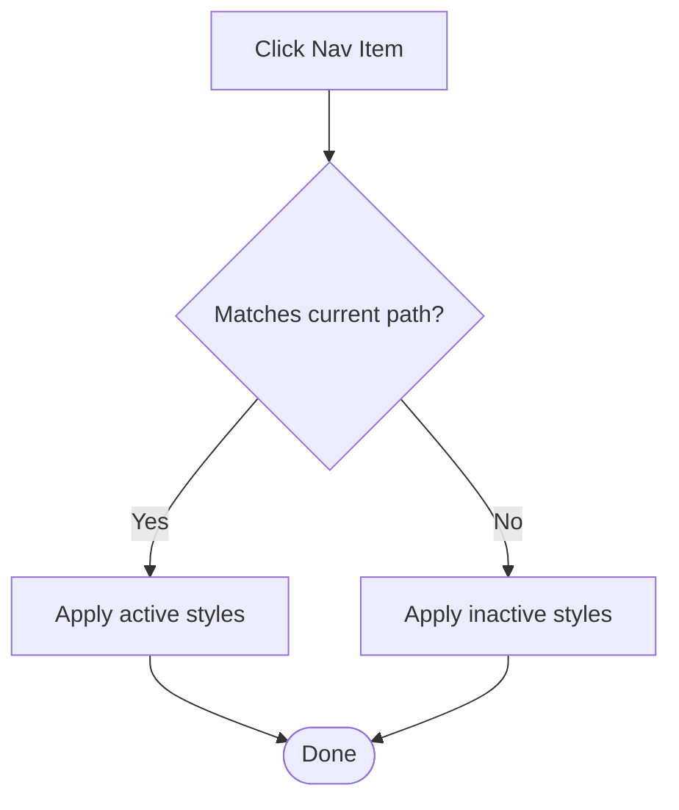
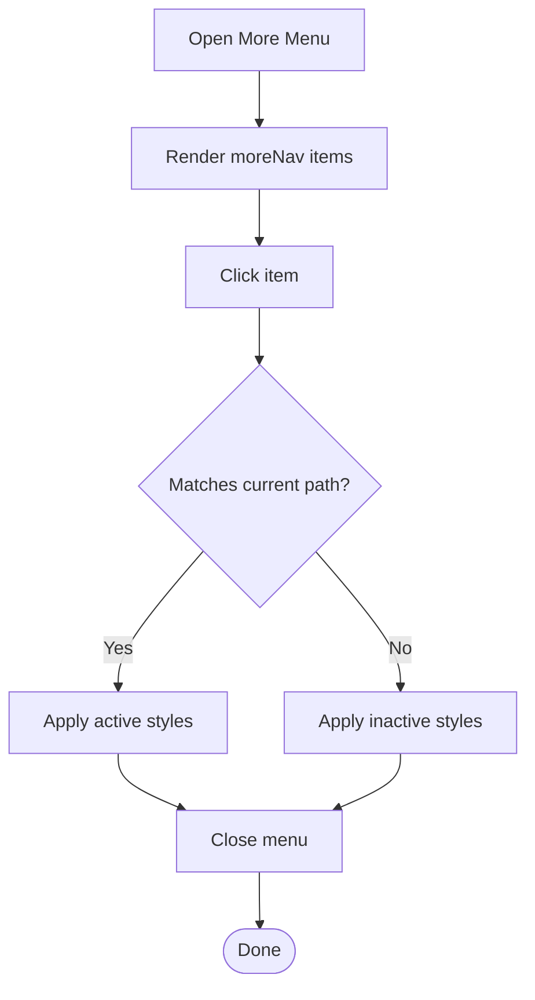
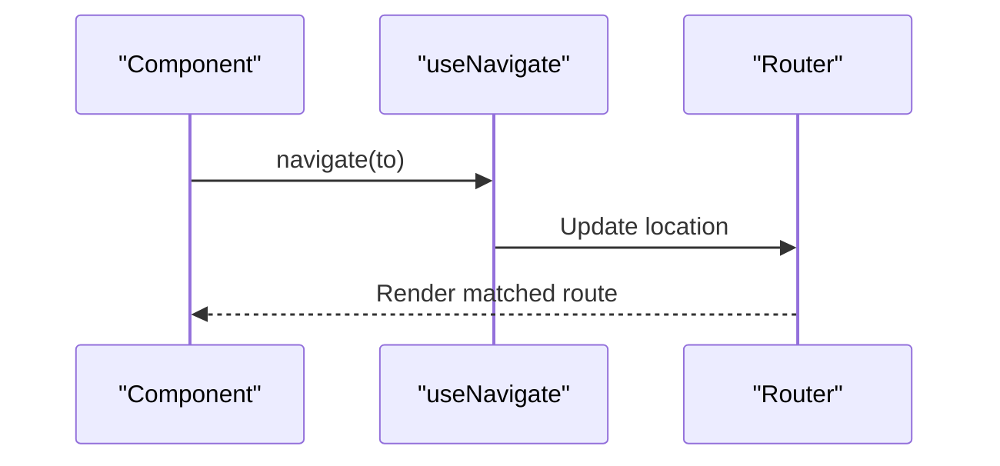
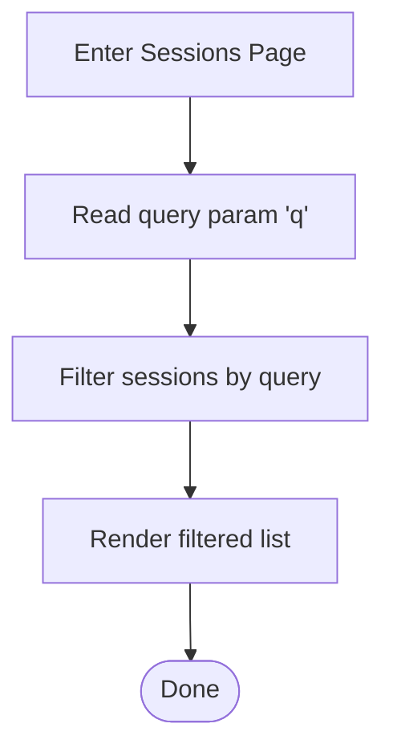
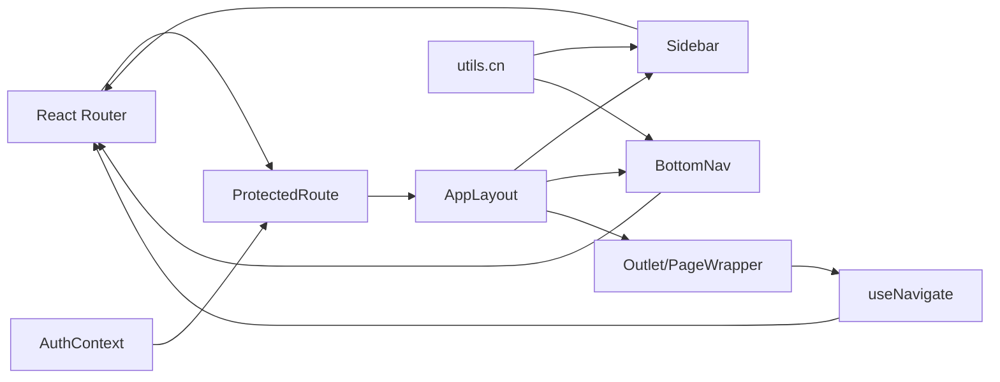

# Routing & Navigation

<cite>
**Referenced Files in This Document**
- [App.tsx](file://examguard-pro/src/App.tsx)
- [main.tsx](file://examguard-pro/src/main.tsx)
- [AuthContext.tsx](file://examguard-pro/src/context/AuthContext.tsx)
- [AppContext.tsx](file://examguard-pro/src/context/AppContext.tsx)
- [Sidebar.tsx](file://examguard-pro/src/components/Sidebar.tsx)
- [BottomNav.tsx](file://examguard-pro/src/components/BottomNav.tsx)
- [Header.tsx](file://examguard-pro/src/components/Header.tsx)
- [Login.tsx](file://examguard-pro/src/components/Login.tsx)
- [Dashboard.tsx](file://examguard-pro/src/components/Dashboard.tsx)
- [Sessions.tsx](file://examguard-pro/src/components/Sessions.tsx)
- [useWebSocket.ts](file://examguard-pro/src/hooks/useWebSocket.ts)
- [utils.ts](file://examguard-pro/src/utils.ts)
- [config.ts](file://examguard-pro/src/config.ts)
</cite>

## Table of Contents
1. [Introduction](#introduction)
2. [Project Structure](#project-structure)
3. [Core Components](#core-components)
4. [Architecture Overview](#architecture-overview)
5. [Detailed Component Analysis](#detailed-component-analysis)
6. [Dependency Analysis](#dependency-analysis)
7. [Performance Considerations](#performance-considerations)
8. [Troubleshooting Guide](#troubleshooting-guide)
9. [Conclusion](#conclusion)

## Introduction
This document explains the routing and navigation system of the ExamGuard Pro React application. It covers React Router configuration, protected routes, nested routing, route guards, navigation patterns, active link highlighting, sidebar and bottom navigation, programmatic navigation, route parameters, query string handling, accessibility features, keyboard shortcuts, and focus management. It also documents how to conditionally render content based on authentication state and manage navigation state.

## Project Structure
The routing and navigation logic is centered around a single-page application built with React Router v6. The app wraps the entire UI in a browser router and defines both public and protected routes. Authentication state is managed via a dedicated provider, and navigation components (sidebar and bottom navigation) highlight active links based on the current location. Programmatic navigation is performed using React Router’s navigation hooks.

**Diagram sources**
- [App.tsx:67-91](file://examguard-pro/src/App.tsx#L67-L91)
- [Sidebar.tsx:25-93](file://examguard-pro/src/components/Sidebar.tsx#L25-L93)
- [BottomNav.tsx:20-123](file://examguard-pro/src/components/BottomNav.tsx#L20-L123)
- [Header.tsx:7-203](file://examguard-pro/src/components/Header.tsx#L7-L203)

**Section sources**
- [App.tsx:67-91](file://examguard-pro/src/App.tsx#L67-L91)
- [main.tsx:1-11](file://examguard-pro/src/main.tsx#L1-L11)

## Core Components
- ProtectedRoute: A route guard that checks authentication and redirects unauthenticated users to the login page.
- AppLayout: The main layout that composes Sidebar, Header, Outlet (with animated transitions), BottomNav, and ToastContainer.
- AuthProvider: Provides authentication state and login/logout actions, including navigation after successful login.
- Sidebar and BottomNav: Desktop and mobile-first navigations respectively, with active link highlighting and logout integration.
- Header: Contains profile and notification dropdowns, plus programmatic navigation to alerts and session detail.
- Programmatic navigation: Implemented via useNavigate in multiple components for internal navigation and external API calls.

**Section sources**
- [App.tsx:28-49](file://examguard-pro/src/App.tsx#L28-L49)
- [App.tsx:51-65](file://examguard-pro/src/App.tsx#L51-L65)
- [AuthContext.tsx:13-50](file://examguard-pro/src/context/AuthContext.tsx#L13-L50)
- [Sidebar.tsx:25-93](file://examguard-pro/src/components/Sidebar.tsx#L25-L93)
- [BottomNav.tsx:20-123](file://examguard-pro/src/components/BottomNav.tsx#L20-L123)
- [Header.tsx:7-203](file://examguard-pro/src/components/Header.tsx#L7-L203)

## Architecture Overview
The routing architecture enforces authentication for the main application area while exposing public routes for login and registration. ProtectedRoute ensures that only authenticated users can access the AppLayout and its nested pages. The layout integrates Sidebar and BottomNav for primary navigation, and uses animated transitions for smooth page changes.

**Diagram sources**
- [App.tsx:28-31](file://examguard-pro/src/App.tsx#L28-L31)
- [App.tsx:75-85](file://examguard-pro/src/App.tsx#L75-L85)
- [AuthContext.tsx:53-57](file://examguard-pro/src/context/AuthContext.tsx#L53-L57)

## Detailed Component Analysis

### Protected Routes and Route Guards
- ProtectedRoute reads authentication state from AuthContext and either renders children or redirects to /login.
- AppLayout is wrapped by ProtectedRoute so that all nested routes under "/" require authentication.
- AuthProvider sets isAuthenticated to true upon successful login and navigates to the home route.

**Diagram sources**
- [App.tsx:28-31](file://examguard-pro/src/App.tsx#L28-L31)
- [AuthContext.tsx:17-38](file://examguard-pro/src/context/AuthContext.tsx#L17-L38)

**Section sources**
- [App.tsx:28-31](file://examguard-pro/src/App.tsx#L28-L31)
- [App.tsx:75-85](file://examguard-pro/src/App.tsx#L75-L85)
- [AuthContext.tsx:13-50](file://examguard-pro/src/context/AuthContext.tsx#L13-L50)

### Nested Routing and Page Transitions
- AppLayout composes Sidebar, Header, Outlet, BottomNav, and ToastContainer.
- PageWrapper uses useLocation and AnimatePresence/motion for smooth page transitions keyed by pathname.
- Nested routes define the main application pages and dynamic segments (e.g., sessions/:sessionId, student/:studentId).

**Diagram sources**
- [App.tsx:33-49](file://examguard-pro/src/App.tsx#L33-L49)
- [App.tsx:75-85](file://examguard-pro/src/App.tsx#L75-L85)

**Section sources**
- [App.tsx:33-49](file://examguard-pro/src/App.tsx#L33-L49)
- [App.tsx:75-85](file://examguard-pro/src/App.tsx#L75-L85)

### Sidebar Navigation
- Navigation items are defined as a static array and rendered with Link.
- Active state is determined by exact match or prefix match for nested routes (e.g., sessions/*).
- Logout action triggers navigation to /login and clears authentication state.

**Diagram sources**
- [Sidebar.tsx:41-64](file://examguard-pro/src/components/Sidebar.tsx#L41-L64)

**Section sources**
- [Sidebar.tsx:16-23](file://examguard-pro/src/components/Sidebar.tsx#L16-L23)
- [Sidebar.tsx:41-64](file://examguard-pro/src/components/Sidebar.tsx#L41-L64)
- [Sidebar.tsx:67-90](file://examguard-pro/src/components/Sidebar.tsx#L67-L90)

### Bottom Navigation (Mobile)
- Two-level navigation: mainNav for core areas and a More menu (moreNav) revealed by a floating button.
- Active state computed similarly to Sidebar.
- Menu auto-closes on route change; logout closes menu and triggers logout.

**Diagram sources**
- [BottomNav.tsx:64-120](file://examguard-pro/src/components/BottomNav.tsx#L64-L120)

**Section sources**
- [BottomNav.tsx:8-18](file://examguard-pro/src/components/BottomNav.tsx#L8-L18)
- [BottomNav.tsx:36-61](file://examguard-pro/src/components/BottomNav.tsx#L36-L61)
- [BottomNav.tsx:77-95](file://examguard-pro/src/components/BottomNav.tsx#L77-L95)
- [BottomNav.tsx:25-28](file://examguard-pro/src/components/BottomNav.tsx#L25-L28)

### Programmatic Navigation
- useNavigate is used extensively for internal navigation:
  - Login form submits credentials and navigates on success.
  - Notifications and recent alerts trigger navigation to alerts or session detail.
  - Dashboard creates a new session and navigates to sessions list.
  - Sessions list navigates to a specific session detail on click.
- Dynamic parameters:
  - sessions/:sessionId for session detail.
  - student/:studentId for student detail.

**Diagram sources**
- [Login.tsx:12-19](file://examguard-pro/src/components/Login.tsx#L12-L19)
- [Header.tsx:117-118](file://examguard-pro/src/components/Header.tsx#L117-L118)
- [Dashboard.tsx:94-94](file://examguard-pro/src/components/Dashboard.tsx#L94-L94)
- [Sessions.tsx:174-175](file://examguard-pro/src/components/Sessions.tsx#L174-L175)
- [App.tsx:78-80](file://examguard-pro/src/App.tsx#L78-L80)

**Section sources**
- [Login.tsx:12-19](file://examguard-pro/src/components/Login.tsx#L12-L19)
- [Header.tsx:117-118](file://examguard-pro/src/components/Header.tsx#L117-L118)
- [Dashboard.tsx:77-101](file://examguard-pro/src/components/Dashboard.tsx#L77-L101)
- [Sessions.tsx:172-175](file://examguard-pro/src/components/Sessions.tsx#L172-L175)
- [App.tsx:78-80](file://examguard-pro/src/App.tsx#L78-L80)

### Route Parameters and Query Strings
- Route parameters:
  - sessions/:sessionId is defined for session detail.
  - student/:studentId is defined for student detail.
- Query strings:
  - Sessions page accepts a search query via URL query parameter and filters results accordingly.
  - The code demonstrates reading and applying a query parameter for filtering.

**Diagram sources**
- [Sessions.tsx:32-50](file://examguard-pro/src/components/Sessions.tsx#L32-L50)
- [Sessions.tsx:98-104](file://examguard-pro/src/components/Sessions.tsx#L98-L104)

**Section sources**
- [App.tsx:78-80](file://examguard-pro/src/App.tsx#L78-L80)
- [Sessions.tsx:32-50](file://examguard-pro/src/components/Sessions.tsx#L32-L50)
- [Sessions.tsx:98-104](file://examguard-pro/src/components/Sessions.tsx#L98-L104)

### Active Link Highlighting
- Both Sidebar and BottomNav compute active state based on exact or prefix matches against the current pathname.
- Active styles are applied via a shared utility function for class merging.

**Section sources**
- [Sidebar.tsx:42-42](file://examguard-pro/src/components/Sidebar.tsx#L42-L42)
- [BottomNav.tsx:37-37](file://examguard-pro/src/components/BottomNav.tsx#L37-L37)
- [utils.ts:4-6](file://examguard-pro/src/utils.ts#L4-L6)

### Accessibility Features, Keyboard Shortcuts, and Focus Management
- Keyboard shortcut hint shown in the header search bar for discoverability.
- Dropdowns (notifications and profile) use focus management patterns:
  - Click outside to close.
  - Escape or clicking close button dismisses the panel.
- Links and buttons use semantic markup and appropriate focus states for keyboard navigation.
- Bottom navigation uses visible icons and labels for touch targets.

**Section sources**
- [Header.tsx:50-61](file://examguard-pro/src/components/Header.tsx#L50-L61)
- [Header.tsx:84-153](file://examguard-pro/src/components/Header.tsx#L84-L153)
- [Header.tsx:173-198](file://examguard-pro/src/components/Header.tsx#L173-L198)
- [BottomNav.tsx:30-62](file://examguard-pro/src/components/BottomNav.tsx#L30-L62)

### Conditional Rendering Based on Authentication
- ProtectedRoute conditionally renders content based on isAuthenticated.
- AuthProvider exposes login and logout to components for conditional UI and navigation.

**Section sources**
- [App.tsx:28-31](file://examguard-pro/src/App.tsx#L28-L31)
- [AuthContext.tsx:53-57](file://examguard-pro/src/context/AuthContext.tsx#L53-L57)

### Navigation State Management
- AppContext provides a settings object and setter for global app state (e.g., theme or preferences).
- While not directly managing routing state, it complements the navigation system by centralizing app-wide preferences.

**Section sources**
- [AppContext.tsx:10-16](file://examguard-pro/src/context/AppContext.tsx#L10-L16)

## Dependency Analysis
The routing system depends on React Router for declarative routing and navigation, and on AuthContext for authentication state. Sidebar and BottomNav depend on react-router-dom for Link and useLocation. Programmatic navigation is centralized through useNavigate. Utility functions support class composition for active states.

**Diagram sources**
- [App.tsx:28-31](file://examguard-pro/src/App.tsx#L28-L31)
- [Sidebar.tsx:25-93](file://examguard-pro/src/components/Sidebar.tsx#L25-L93)
- [BottomNav.tsx:20-123](file://examguard-pro/src/components/BottomNav.tsx#L20-L123)
- [utils.ts:4-6](file://examguard-pro/src/utils.ts#L4-L6)

**Section sources**
- [App.tsx:28-31](file://examguard-pro/src/App.tsx#L28-L31)
- [Sidebar.tsx:25-93](file://examguard-pro/src/components/Sidebar.tsx#L25-L93)
- [BottomNav.tsx:20-123](file://examguard-pro/src/components/BottomNav.tsx#L20-L123)
- [utils.ts:4-6](file://examguard-pro/src/utils.ts#L4-L6)

## Performance Considerations
- Animated page transitions use AnimatePresence with a wait mode keyed by pathname, ensuring smooth but lightweight transitions.
- Sidebar and BottomNav compute active states based on shallow comparisons of pathname, minimizing re-renders.
- useWebSocket maintains a singleton connection and subscribes to rooms efficiently; avoid unnecessary subscriptions by leveraging room-based logic.

[No sources needed since this section provides general guidance]

## Troubleshooting Guide
- Login failures: The AuthProvider’s login function returns false on non-OK responses. Verify network connectivity and backend endpoint availability.
- Redirect loops: Ensure ProtectedRoute is wrapping AppLayout and that isAuthenticated is persisted appropriately.
- Active link not highlighting: Confirm pathname matching logic and that the utility function for class merging is applied consistently.
- Bottom menu not closing: Verify the effect that resets isMenuOpen on location changes is firing.

**Section sources**
- [AuthContext.tsx:17-38](file://examguard-pro/src/context/AuthContext.tsx#L17-L38)
- [App.tsx:28-31](file://examguard-pro/src/App.tsx#L28-L31)
- [BottomNav.tsx:25-28](file://examguard-pro/src/components/BottomNav.tsx#L25-L28)

## Conclusion
The routing and navigation system of ExamGuard Pro is structured around React Router with a robust authentication guard, a responsive layout combining desktop and mobile navigation, and consistent active-state highlighting. Programmatic navigation is used strategically across components for a seamless user experience. The system leverages utility functions for styling and maintains accessibility through focus management and keyboard hints.