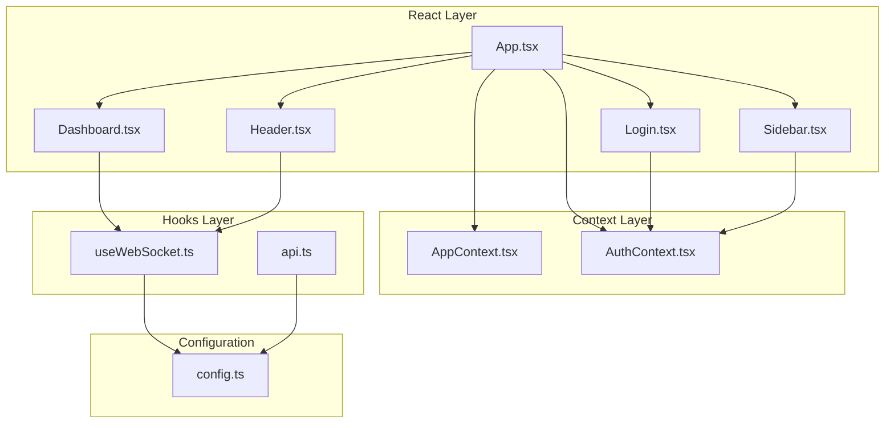
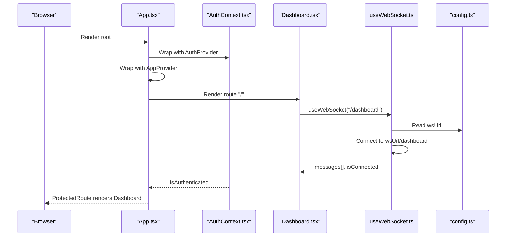
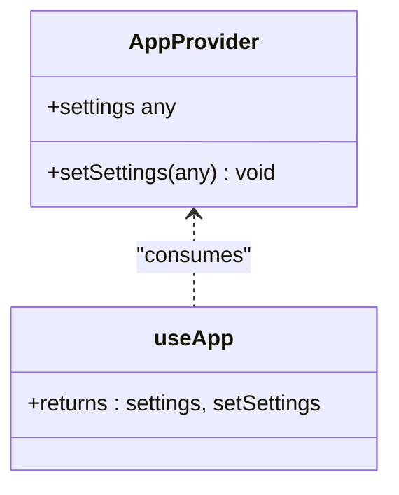
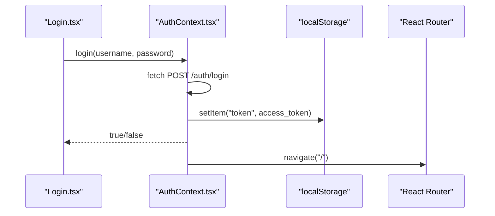
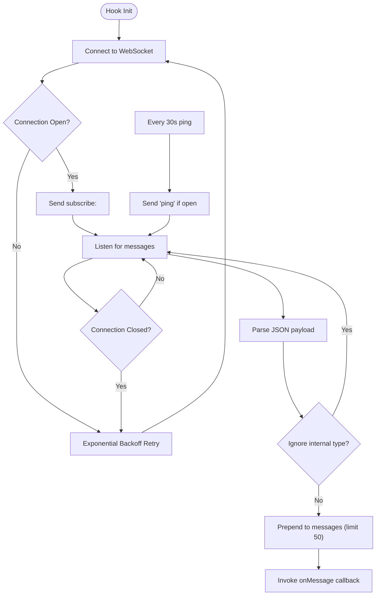
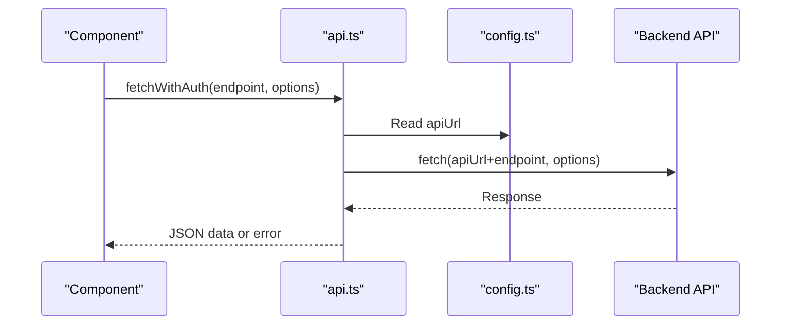
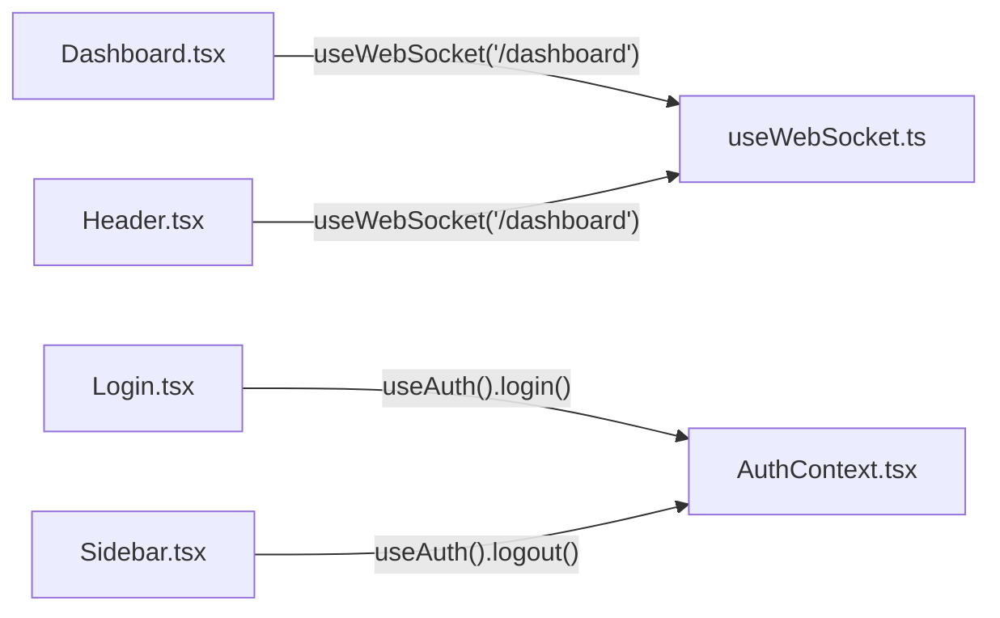
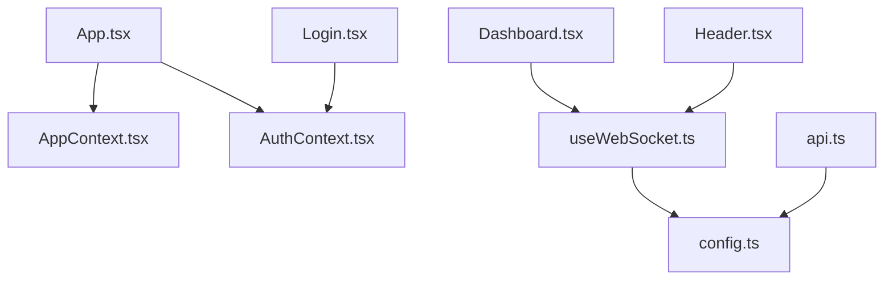

# State Management

<cite>
**Referenced Files in This Document**
- [AppContext.tsx](file://examguard-pro/src/context/AppContext.tsx)
- [AuthContext.tsx](file://examguard-pro/src/context/AuthContext.tsx)
- [useWebSocket.ts](file://examguard-pro/src/hooks/useWebSocket.ts)
- [api.ts](file://examguard-pro/src/hooks/api.ts)
- [App.tsx](file://examguard-pro/src/App.tsx)
- [config.ts](file://examguard-pro/src/config.ts)
- [Dashboard.tsx](file://examguard-pro/src/components/Dashboard.tsx)
- [Header.tsx](file://examguard-pro/src/components/Header.tsx)
- [Login.tsx](file://examguard-pro/src/components/Login.tsx)
- [Sidebar.tsx](file://examguard-pro/src/components/Sidebar.tsx)
</cite>

## Table of Contents
1. [Introduction](#introduction)
2. [Project Structure](#project-structure)
3. [Core Components](#core-components)
4. [Architecture Overview](#architecture-overview)
5. [Detailed Component Analysis](#detailed-component-analysis)
6. [Dependency Analysis](#dependency-analysis)
7. [Performance Considerations](#performance-considerations)
8. [Troubleshooting Guide](#troubleshooting-guide)
9. [Conclusion](#conclusion)

## Introduction
This document explains the state management architecture of the ExamGuard Pro React application. It focuses on:
- Context API usage for global application state (AppContext) and authentication state (AuthContext)
- Real-time state via WebSocket with the useWebSocket hook
- Data fetching patterns and API integration
- State persistence strategies, memory management, and performance considerations for real-time updates
- Best practices to avoid unnecessary re-renders and maintain responsive UIs

## Project Structure
The state management is organized around two primary contexts and a reusable WebSocket hook:
- AppContext: Provides global application settings state
- AuthContext: Manages authentication lifecycle and persisted tokens
- useWebSocket: Encapsulates WebSocket connection, subscription, reconnection, and message handling
- api.ts: Provides a typed wrapper for authenticated API requests
- config.ts: Centralized configuration for API and WebSocket URLs
- Components consume these contexts and hooks to manage UI state and synchronize with backend services

**Diagram sources**
- [App.tsx:67-91](file://examguard-pro/src/App.tsx#L67-L91)
- [AppContext.tsx:10-23](file://examguard-pro/src/context/AppContext.tsx#L10-L23)
- [AuthContext.tsx:13-50](file://examguard-pro/src/context/AuthContext.tsx#L13-L50)
- [useWebSocket.ts:4-109](file://examguard-pro/src/hooks/useWebSocket.ts#L4-L109)
- [api.ts:3-17](file://examguard-pro/src/hooks/api.ts#L3-L17)
- [config.ts:9-12](file://examguard-pro/src/config.ts#L9-L12)

**Section sources**
- [App.tsx:67-91](file://examguard-pro/src/App.tsx#L67-L91)
- [config.ts:9-12](file://examguard-pro/src/config.ts#L9-L12)

## Core Components
- AppContext: Exposes a settings object and setter to consumers. It is a lightweight provider suitable for small-scale global settings.
- AuthContext: Manages authentication state, login/logout actions, and persists tokens in local storage. It integrates with routing to protect pages.
- useWebSocket: Provides connection state, message buffer, and send capabilities with exponential backoff reconnection and heartbeat.
- api.ts: Thin wrapper around fetch for authenticated endpoints with consistent error handling.

**Section sources**
- [AppContext.tsx:3-23](file://examguard-pro/src/context/AppContext.tsx#L3-L23)
- [AuthContext.tsx:5-57](file://examguard-pro/src/context/AuthContext.tsx#L5-L57)
- [useWebSocket.ts:4-109](file://examguard-pro/src/hooks/useWebSocket.ts#L4-L109)
- [api.ts:3-17](file://examguard-pro/src/hooks/api.ts#L3-L17)

## Architecture Overview
The app composes providers at the root and exposes hooks to components. Authentication guards protected routes, while WebSocket feeds real-time data to multiple views.

**Diagram sources**
- [App.tsx:67-91](file://examguard-pro/src/App.tsx#L67-L91)
- [AuthContext.tsx:13-50](file://examguard-pro/src/context/AuthContext.tsx#L13-L50)
- [Dashboard.tsx:30-55](file://examguard-pro/src/components/Dashboard.tsx#L30-L55)
- [useWebSocket.ts:18-78](file://examguard-pro/src/hooks/useWebSocket.ts#L18-L78)
- [config.ts:9-12](file://examguard-pro/src/config.ts#L9-L12)

## Detailed Component Analysis

### AppContext: Global Application Settings
- Purpose: Provide a shared settings object and setter to the whole app tree.
- Pattern: Standard Context + Provider pattern with a single state slice.
- Consumers: Any component needing to read or update global settings.

**Diagram sources**
- [AppContext.tsx:10-23](file://examguard-pro/src/context/AppContext.tsx#L10-L23)

**Section sources**
- [AppContext.tsx:3-23](file://examguard-pro/src/context/AppContext.tsx#L3-L23)

### AuthContext: Authentication State and Lifecycle
- State: isAuthenticated boolean managed locally.
- Actions: login performs a network request, stores token in local storage, sets authenticated state, and navigates; logout clears state and navigates to login.
- Persistence: Token stored in localStorage; authentication survives tab reloads until logout.
- Routing protection: ProtectedRoute enforces authentication.

**Diagram sources**
- [Login.tsx:12-19](file://examguard-pro/src/components/Login.tsx#L12-L19)
- [AuthContext.tsx:17-38](file://examguard-pro/src/context/AuthContext.tsx#L17-L38)

**Section sources**
- [AuthContext.tsx:5-57](file://examguard-pro/src/context/AuthContext.tsx#L5-L57)
- [Login.tsx:6-19](file://examguard-pro/src/components/Login.tsx#L6-L19)
- [App.tsx:28-31](file://examguard-pro/src/App.tsx#L28-L31)

### useWebSocket: Real-Time State Management
- Responsibilities:
  - Establish WebSocket connection to a configurable endpoint
  - Subscribe to a room/topic when provided
  - Maintain connection state and a capped recent message buffer
  - Send custom messages
  - Implement exponential backoff reconnection and heartbeat
  - Clean up timers and connections on unmount
- Message filtering: Ignores internal event types; buffers latest N messages
- Subscription: Sends a subscribe command with normalized room ID

**Diagram sources**
- [useWebSocket.ts:18-109](file://examguard-pro/src/hooks/useWebSocket.ts#L18-L109)

**Section sources**
- [useWebSocket.ts:4-109](file://examguard-pro/src/hooks/useWebSocket.ts#L4-L109)
- [config.ts:9-12](file://examguard-pro/src/config.ts#L9-L12)

### API Fetching Patterns
- useApi: Provides a fetchWithAuth function that attaches JSON headers and throws on non-ok responses.
- Usage: Components call useApi to perform authenticated requests to backend endpoints.

**Diagram sources**
- [api.ts:3-17](file://examguard-pro/src/hooks/api.ts#L3-L17)
- [config.ts:9-12](file://examguard-pro/src/config.ts#L9-L12)

**Section sources**
- [api.ts:3-17](file://examguard-pro/src/hooks/api.ts#L3-L17)

### State Consumption Patterns in Components
- Dashboard: Uses useWebSocket("/dashboard") to receive live alerts and stats; maintains local UI state for modal and form fields.
- Header: Uses useWebSocket("/dashboard") to compute unread alerts and notification badge; uses AuthContext for logout.
- Sidebar: Uses AuthContext for logout action.
- Login: Uses AuthContext for login flow and error messaging.

**Diagram sources**
- [Dashboard.tsx:30-55](file://examguard-pro/src/components/Dashboard.tsx#L30-L55)
- [Header.tsx:12-19](file://examguard-pro/src/components/Header.tsx#L12-L19)
- [Login.tsx:10](file://examguard-pro/src/components/Login.tsx#L10)
- [Sidebar.tsx:27](file://examguard-pro/src/components/Sidebar.tsx#L27)
- [AuthContext.tsx:13-50](file://examguard-pro/src/context/AuthContext.tsx#L13-L50)
- [useWebSocket.ts:4-109](file://examguard-pro/src/hooks/useWebSocket.ts#L4-L109)

**Section sources**
- [Dashboard.tsx:30-55](file://examguard-pro/src/components/Dashboard.tsx#L30-L55)
- [Header.tsx:12-19](file://examguard-pro/src/components/Header.tsx#L12-L19)
- [Sidebar.tsx:27](file://examguard-pro/src/components/Sidebar.tsx#L27)
- [Login.tsx:10](file://examguard-pro/src/components/Login.tsx#L10)

## Dependency Analysis
- Providers are declared at the root and consumed by components deep in the tree.
- useWebSocket depends on config for URL resolution and manages its own lifecycle.
- api.ts depends on config for base URL and centralizes request headers.
- AuthContext persists tokens in localStorage and coordinates navigation.

**Diagram sources**
- [App.tsx:67-91](file://examguard-pro/src/App.tsx#L67-L91)
- [useWebSocket.ts:23](file://examguard-pro/src/hooks/useWebSocket.ts#L23)
- [api.ts:5](file://examguard-pro/src/hooks/api.ts#L5)
- [config.ts:9-12](file://examguard-pro/src/config.ts#L9-L12)

**Section sources**
- [App.tsx:67-91](file://examguard-pro/src/App.tsx#L67-L91)
- [useWebSocket.ts:23](file://examguard-pro/src/hooks/useWebSocket.ts#L23)
- [api.ts:5](file://examguard-pro/src/hooks/api.ts#L5)
- [config.ts:9-12](file://examguard-pro/src/config.ts#L9-L12)

## Performance Considerations
- WebSocket message buffer: The hook maintains a capped list of recent messages to limit rendering overhead. Prefer consuming only the subset of messages needed per view.
- Reconnection strategy: Exponential backoff with a maximum number of attempts prevents resource thrashing during extended outages.
- Heartbeat: Periodic ping keeps the connection alive and helps detect stale connections promptly.
- Local state vs. global context: Keep AppContext minimal to reduce unnecessary re-renders across the tree.
- Avoid heavy computations in render: Memoize derived data (e.g., filtered alerts) outside of render or use useMemo to prevent repeated recalculations.
- Efficient polling: For periodic stats, reuse intervals and cancel them on unmount to avoid leaks.

[No sources needed since this section provides general guidance]

## Troubleshooting Guide
- Authentication failures:
  - Verify token presence in localStorage after login.
  - Confirm login endpoint and response shape match expectations.
  - Check navigation behavior after login and logout.
- WebSocket connectivity:
  - Inspect console logs for connection and subscription steps.
  - Validate wsUrl configuration in development vs. production environments.
  - Ensure rooms are subscribed to with normalized IDs.
- Memory and cleanup:
  - Confirm timers and intervals are cleared on unmount.
  - Ensure callbacks are updated via refs to avoid stale closures.
- API errors:
  - useApi throws on non-ok responses; wrap calls in try/catch and surface user-friendly errors.

**Section sources**
- [AuthContext.tsx:17-43](file://examguard-pro/src/context/AuthContext.tsx#L17-L43)
- [useWebSocket.ts:18-109](file://examguard-pro/src/hooks/useWebSocket.ts#L18-L109)
- [api.ts:12](file://examguard-pro/src/hooks/api.ts#L12)

## Conclusion
The ExamGuard Pro application employs a straightforward and effective state management strategy:
- Context API for global settings and authentication
- A dedicated WebSocket hook for real-time updates with robust reconnection and heartbeat
- A simple API hook for authenticated requests
- Clear separation of concerns and predictable data flow across components

Adhering to the best practices outlined here will help maintain responsiveness, reliability, and scalability as the application evolves.