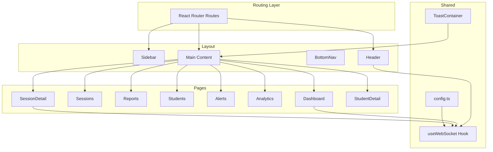
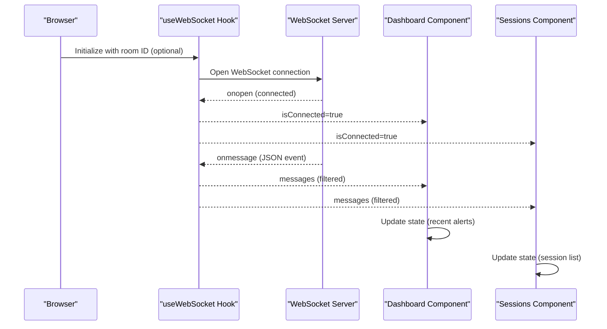
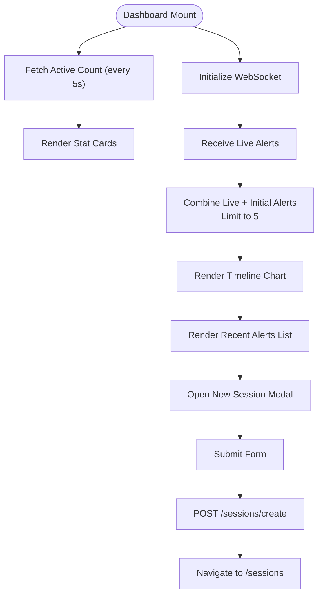
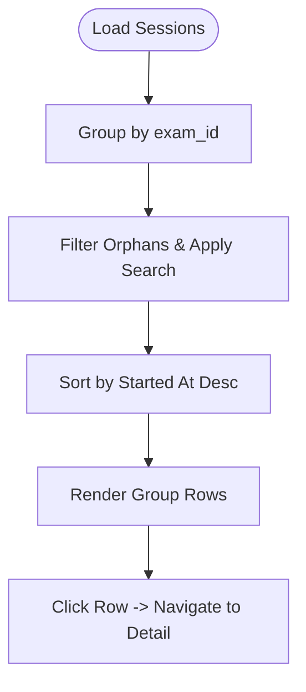
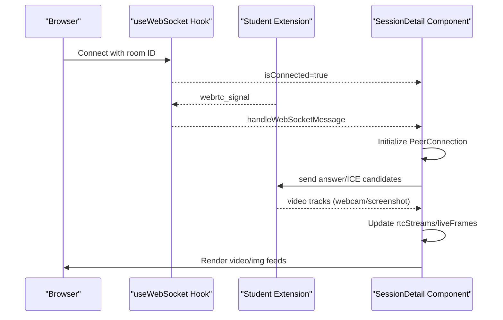
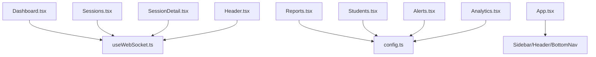

# UI Components

<cite>
**Referenced Files in This Document**
- [Dashboard.tsx](file://examguard-pro/src/components/Dashboard.tsx)
- [Sessions.tsx](file://examguard-pro/src/components/Sessions.tsx)
- [Reports.tsx](file://examguard-pro/src/components/Reports.tsx)
- [Students.tsx](file://examguard-pro/src/components/Students.tsx)
- [Alerts.tsx](file://examguard-pro/src/components/Alerts.tsx)
- [Analytics.tsx](file://examguard-pro/src/components/Analytics.tsx)
- [Header.tsx](file://examguard-pro/src/components/Header.tsx)
- [Sidebar.tsx](file://examguard-pro/src/components/Sidebar.tsx)
- [BottomNav.tsx](file://examguard-pro/src/components/BottomNav.tsx)
- [StudentModal.tsx](file://examguard-pro/src/components/StudentModal.tsx)
- [ToastContainer.tsx](file://examguard-pro/src/components/ToastContainer.tsx)
- [SessionDetail.tsx](file://examguard-pro/src/components/SessionDetail.tsx)
- [StudentDetail.tsx](file://examguard-pro/src/components/StudentDetail.tsx)
- [useWebSocket.ts](file://examguard-pro/src/hooks/useWebSocket.ts)
- [config.ts](file://examguard-pro/src/config.ts)
- [App.tsx](file://examguard-pro/src/App.tsx)
- [index.css](file://examguard-pro/src/index.css)
- [utils.ts](file://examguard-pro/src/utils.ts)
</cite>

## Table of Contents
1. [Introduction](#introduction)
2. [Project Structure](#project-structure)
3. [Core Components](#core-components)
4. [Architecture Overview](#architecture-overview)
5. [Detailed Component Analysis](#detailed-component-analysis)
6. [Dependency Analysis](#dependency-analysis)
7. [Performance Considerations](#performance-considerations)
8. [Troubleshooting Guide](#troubleshooting-guide)
9. [Conclusion](#conclusion)
10. [Appendices](#appendices)

## Introduction
This document provides comprehensive UI component documentation for the ExamGuard Pro dashboard interface. It covers major components including Dashboard, Sessions, Reports, Students, and Alerts, detailing their props, events, styling, responsive design, real-time data patterns, forms/modals, notifications, and accessibility. It also explains integration with backend APIs and WebSockets, along with composition patterns and customization options.

## Project Structure
The dashboard is a React application using Vite, Tailwind CSS, and Motion for animations. Routing is handled by React Router, and global state is provided via React Context. The UI follows a consistent layout with a sidebar, header, main content area, and a bottom navigation for mobile.

**Diagram sources**
- [App.tsx:51-65](file://examguard-pro/src/App.tsx#L51-L65)
- [Sidebar.tsx:25-94](file://examguard-pro/src/components/Sidebar.tsx#L25-L94)
- [Header.tsx:7-204](file://examguard-pro/src/components/Header.tsx#L7-L204)
- [BottomNav.tsx:20-124](file://examguard-pro/src/components/BottomNav.tsx#L20-L124)
- [Dashboard.tsx:30-427](file://examguard-pro/src/components/Dashboard.tsx#L30-L427)
- [Sessions.tsx:29-271](file://examguard-pro/src/components/Sessions.tsx#L29-L271)
- [Reports.tsx:16-229](file://examguard-pro/src/components/Reports.tsx#L16-L229)
- [Students.tsx:10-192](file://examguard-pro/src/components/Students.tsx#L10-L192)
- [Alerts.tsx:7-286](file://examguard-pro/src/components/Alerts.tsx#L7-L286)
- [Analytics.tsx:6-72](file://examguard-pro/src/components/Analytics.tsx#L6-L72)
- [SessionDetail.tsx:22-690](file://examguard-pro/src/components/SessionDetail.tsx#L22-L690)
- [StudentDetail.tsx:16-187](file://examguard-pro/src/components/StudentDetail.tsx#L16-L187)
- [useWebSocket.ts:4-110](file://examguard-pro/src/hooks/useWebSocket.ts#L4-L110)
- [config.ts:1-13](file://examguard-pro/src/config.ts#L1-L13)

**Section sources**
- [App.tsx:51-65](file://examguard-pro/src/App.tsx#L51-L65)
- [Sidebar.tsx:25-94](file://examguard-pro/src/components/Sidebar.tsx#L25-L94)
- [Header.tsx:7-204](file://examguard-pro/src/components/Header.tsx#L7-L204)
- [BottomNav.tsx:20-124](file://examguard-pro/src/components/BottomNav.tsx#L20-L124)

## Core Components
This section documents the primary UI components and their roles.

- Dashboard
  - Purpose: Real-time overview of active sessions, recent alerts, and quick actions.
  - Props: None (consumes config and WebSocket).
  - Events: Form submission for creating a new session; navigation to sessions/alerts.
  - Key behaviors: Live alert timeline, recent alerts list, new session modal, periodic stats refresh.
  - Styling: Tailwind utility classes for cards, grids, and responsive layouts; Recharts for visualization.
  - Accessibility: Buttons and inputs have visible focus states; tooltips and charts include accessible labels.

- Sessions
  - Purpose: List and manage exam sessions, grouped by exam ID with risk statistics.
  - Props: None.
  - Events: Search/filter; click to navigate to session detail.
  - Key behaviors: Grouping by exam_id, filtering by status, sorting by start time, search across exam and student fields.
  - Styling: Card-based layout with hover states; animated rows; responsive grid for stats.

- Reports
  - Purpose: Generate and download session reports (PDF/JSON).
  - Props: None.
  - Events: Search; refresh; download buttons per session.
  - Key behaviors: Fetch sessions, filter by search, generate downloadable artifacts.
  - Styling: Table with hover states; loading/error states; responsive container.

- Students
  - Purpose: Directory of enrolled students with risk profiles and actions.
  - Props: None.
  - Events: Sorting by column; search; open student modal.
  - Key behaviors: Sortable columns, search, risk score bars, modal preview.
  - Styling: Table with progress bars; hover-triggered action opacity.

- Alerts
  - Purpose: Review and manage AI-detected anomalies with evidence modals.
  - Props: None.
  - Events: Search/filter; resolve alerts; view evidence modal.
  - Key behaviors: Status badges, severity indicators, evidence gallery, modal actions.
  - Styling: Animated rows; modal with dual-column evidence; responsive layout.

- Analytics
  - Purpose: Visualize alert types and risk distribution.
  - Props: None.
  - Events: None.
  - Key behaviors: Bar and pie charts with tooltips.
  - Styling: Responsive containers for charts; legend and labels.

- SessionDetail
  - Purpose: Live student feeds, risk/effort metrics, and session controls.
  - Props: None.
  - Events: Toggle feed mode; end session; download report; navigate to related views.
  - Key behaviors: WebRTC integration, live frames, dynamic stats, performance table.
  - Styling: Grid of video/image feeds; gradient overlays; risk/effort bars.

- StudentDetail
  - Purpose: Per-student profile and session history.
  - Props: None.
  - Events: Navigate back; view session details.
  - Key behaviors: Stats summary; session history table; risk level badges.
  - Styling: Stat cards; table with status badges.

- Shared Components
  - Header: Global search, notification bell with live alerts, user profile dropdown.
  - Sidebar: Navigation links; active state highlighting.
  - BottomNav: Mobile-first navigation with expandable menu.
  - StudentModal: Detailed student view with media captures, risk scores, and actions.
  - ToastContainer: Fixed-position toast area.

**Section sources**
- [Dashboard.tsx:30-427](file://examguard-pro/src/components/Dashboard.tsx#L30-L427)
- [Sessions.tsx:29-271](file://examguard-pro/src/components/Sessions.tsx#L29-L271)
- [Reports.tsx:16-229](file://examguard-pro/src/components/Reports.tsx#L16-L229)
- [Students.tsx:10-192](file://examguard-pro/src/components/Students.tsx#L10-L192)
- [Alerts.tsx:7-286](file://examguard-pro/src/components/Alerts.tsx#L7-L286)
- [Analytics.tsx:6-72](file://examguard-pro/src/components/Analytics.tsx#L6-L72)
- [SessionDetail.tsx:22-690](file://examguard-pro/src/components/SessionDetail.tsx#L22-L690)
- [StudentDetail.tsx:16-187](file://examguard-pro/src/components/StudentDetail.tsx#L16-L187)
- [Header.tsx:7-204](file://examguard-pro/src/components/Header.tsx#L7-L204)
- [Sidebar.tsx:25-94](file://examguard-pro/src/components/Sidebar.tsx#L25-L94)
- [BottomNav.tsx:20-124](file://examguard-pro/src/components/BottomNav.tsx#L20-L124)
- [StudentModal.tsx:5-250](file://examguard-pro/src/components/StudentModal.tsx#L5-L250)
- [ToastContainer.tsx:1-8](file://examguard-pro/src/components/ToastContainer.tsx#L1-L8)

## Architecture Overview
The UI integrates with backend APIs and WebSockets for real-time updates. The routing layer wraps pages in a shared layout. The WebSocket hook centralizes connection management and message handling.

**Diagram sources**
- [useWebSocket.ts:4-110](file://examguard-pro/src/hooks/useWebSocket.ts#L4-L110)
- [Dashboard.tsx:33-112](file://examguard-pro/src/components/Dashboard.tsx#L33-L112)
- [Sessions.tsx:35-50](file://examguard-pro/src/components/Sessions.tsx#L35-L50)

**Section sources**
- [useWebSocket.ts:4-110](file://examguard-pro/src/hooks/useWebSocket.ts#L4-L110)
- [config.ts:1-13](file://examguard-pro/src/config.ts#L1-L13)
- [Dashboard.tsx:33-112](file://examguard-pro/src/components/Dashboard.tsx#L33-L112)
- [Sessions.tsx:35-50](file://examguard-pro/src/components/Sessions.tsx#L35-L50)

## Detailed Component Analysis

### Dashboard
- Props: None.
- Events: Form submit (create session), button clicks (clear, new session), navigation.
- Key behaviors:
  - Live alerts via WebSocket; combines with initial alerts and limits to top 5.
  - Periodic stats fetch for active count.
  - New session modal with generated exam code, copy/regenerate, and creation flow.
  - Recharts area chart for activity and alerts timeline.
- Styling and responsiveness:
  - Grid of stat cards with animated entrance; responsive chart container.
  - Tailwind utilities for spacing, shadows, and color scales.
- Accessibility:
  - Focus-visible outlines on interactive elements; semantic headings and labels.

**Diagram sources**
- [Dashboard.tsx:40-101](file://examguard-pro/src/components/Dashboard.tsx#L40-L101)
- [useWebSocket.ts:4-110](file://examguard-pro/src/hooks/useWebSocket.ts#L4-L110)

**Section sources**
- [Dashboard.tsx:30-427](file://examguard-pro/src/components/Dashboard.tsx#L30-L427)
- [useWebSocket.ts:4-110](file://examguard-pro/src/hooks/useWebSocket.ts#L4-L110)

### Sessions
- Props: None.
- Events: Search input; clear all sessions; row click navigates to session detail.
- Key behaviors:
  - Groups sessions by exam_id; calculates average risk and flagged counts.
  - Filters out orphan groups; supports search across exam and student fields.
  - Sorts by most recent start time.
- Styling and responsiveness:
  - Animated rows; responsive stats and avatar previews; hover effects.

**Diagram sources**
- [Sessions.tsx:53-105](file://examguard-pro/src/components/Sessions.tsx#L53-L105)

**Section sources**
- [Sessions.tsx:29-271](file://examguard-pro/src/components/Sessions.tsx#L29-L271)

### Reports
- Props: None.
- Events: Search input; refresh sessions; download PDF/JSON per session.
- Key behaviors:
  - Fetch sessions with optional Bearer token; filter by search.
  - Generate downloadable PDF/JSON via backend endpoints.
- Styling and responsiveness:
  - Loading/error states; responsive table; badge-based risk display.

**Section sources**
- [Reports.tsx:16-229](file://examguard-pro/src/components/Reports.tsx#L16-L229)

### Students
- Props: None.
- Events: Column sort; search; open student modal.
- Key behaviors:
  - Sortable columns with ascending/descending toggles.
  - Risk score progress bars; status badges; hover-triggered actions.
- Styling and responsiveness:
  - Hover-triggered action opacity; responsive table.

**Section sources**
- [Students.tsx:10-192](file://examguard-pro/src/components/Students.tsx#L10-L192)

### Alerts
- Props: None.
- Events: Search/filter; resolve alerts; view evidence modal.
- Key behaviors:
  - Filtered list with status badges; evidence modal with camera/screen captures.
  - Animated rows and modal transitions.
- Styling and responsiveness:
  - Severity-based color schemes; modal with dual-column layout.

**Section sources**
- [Alerts.tsx:7-286](file://examguard-pro/src/components/Alerts.tsx#L7-L286)

### Analytics
- Props: None.
- Events: None.
- Key behaviors:
  - Bar chart for alert types; pie chart for risk distribution.
- Styling and responsiveness:
  - Responsive containers; tooltips and legends.

**Section sources**
- [Analytics.tsx:6-72](file://examguard-pro/src/components/Analytics.tsx#L6-L72)

### SessionDetail
- Props: None.
- Events: Toggle feed mode; end session; download report; navigate.
- Key behaviors:
  - WebRTC signaling and media handling; live frame fallbacks; dynamic stats.
  - Performance table when session ends.
- Styling and responsiveness:
  - Grid of feeds with gradient overlays; risk/effort bars; responsive layout.

**Diagram sources**
- [SessionDetail.tsx:115-177](file://examguard-pro/src/components/SessionDetail.tsx#L115-L177)
- [useWebSocket.ts:46-98](file://examguard-pro/src/hooks/useWebSocket.ts#L46-L98)

**Section sources**
- [SessionDetail.tsx:22-690](file://examguard-pro/src/components/SessionDetail.tsx#L22-L690)
- [useWebSocket.ts:4-110](file://examguard-pro/src/hooks/useWebSocket.ts#L4-L110)

### StudentDetail
- Props: None.
- Events: Back navigation; view session details.
- Key behaviors:
  - Stats summary cards; session history table with risk badges.
- Styling and responsiveness:
  - Stat cards; table with status indicators.

**Section sources**
- [StudentDetail.tsx:16-187](file://examguard-pro/src/components/StudentDetail.tsx#L16-L187)

### Shared Components
- Header
  - Displays system status, global search, notifications, and user profile.
  - Live alerts from WebSocket; notification count badge.
- Sidebar
  - Navigation links; active state based on location.
- BottomNav
  - Mobile navigation with expandable menu; logout action.
- StudentModal
  - Detailed student view with media captures, risk scores, and actions.
- ToastContainer
  - Fixed-position container for toasts.

**Section sources**
- [Header.tsx:7-204](file://examguard-pro/src/components/Header.tsx#L7-L204)
- [Sidebar.tsx:25-94](file://examguard-pro/src/components/Sidebar.tsx#L25-L94)
- [BottomNav.tsx:20-124](file://examguard-pro/src/components/BottomNav.tsx#L20-L124)
- [StudentModal.tsx:5-250](file://examguard-pro/src/components/StudentModal.tsx#L5-L250)
- [ToastContainer.tsx:1-8](file://examguard-pro/src/components/ToastContainer.tsx#L1-L8)

## Dependency Analysis
- Component coupling:
  - Dashboard and Sessions depend on the useWebSocket hook for live data.
  - SessionDetail depends on useWebSocket for WebRTC signaling and live frames.
  - Reports and Students consume REST endpoints via fetch.
- External dependencies:
  - Recharts for data visualization.
  - Motion for animations.
  - Lucide icons for UI symbols.
- Configuration:
  - config.ts defines API and WebSocket URLs, adapting to dev/prod environments.

**Diagram sources**
- [Dashboard.tsx:25-33](file://examguard-pro/src/components/Dashboard.tsx#L25-L33)
- [Sessions.tsx:5-31](file://examguard-pro/src/components/Sessions.tsx#L5-L31)
- [SessionDetail.tsx:5-24](file://examguard-pro/src/components/SessionDetail.tsx#L5-L24)
- [Reports.tsx:3-21](file://examguard-pro/src/components/Reports.tsx#L3-L21)
- [Students.tsx:1-6](file://examguard-pro/src/components/Students.tsx#L1-L6)
- [Alerts.tsx:1-5](file://examguard-pro/src/components/Alerts.tsx#L1-L5)
- [Analytics.tsx:1-4](file://examguard-pro/src/components/Analytics.tsx#L1-L4)
- [Header.tsx:4-12](file://examguard-pro/src/components/Header.tsx#L4-L12)
- [useWebSocket.ts:2-4](file://examguard-pro/src/hooks/useWebSocket.ts#L2-L4)
- [config.ts:9-12](file://examguard-pro/src/config.ts#L9-L12)
- [App.tsx:10-25](file://examguard-pro/src/App.tsx#L10-L25)

**Section sources**
- [useWebSocket.ts:4-110](file://examguard-pro/src/hooks/useWebSocket.ts#L4-L110)
- [config.ts:1-13](file://examguard-pro/src/config.ts#L1-L13)
- [App.tsx:51-65](file://examguard-pro/src/App.tsx#L51-L65)

## Performance Considerations
- WebSocket lifecycle:
  - Reconnection with exponential backoff; heartbeat ping keeps connection alive.
  - Message filtering to avoid rendering ignored event types.
- Rendering optimizations:
  - Memoized grouping and sorting in Sessions.
  - Animations gated behind presence checks.
  - Responsive containers for charts to minimize layout thrashing.
- Network efficiency:
  - Debounced or limited polling intervals.
  - Conditional rendering of heavy modals and tables.

[No sources needed since this section provides general guidance]

## Troubleshooting Guide
- WebSocket connectivity:
  - Verify wsUrl resolution in config; check dev vs prod host logic.
  - Inspect reconnection attempts and console logs.
- Live data not updating:
  - Confirm room subscription messages are sent after connection.
  - Ensure message filtering excludes heartbeat/connection events.
- SessionDetail WebRTC:
  - Validate ICE servers and signaling flow.
  - Check browser permissions for media devices.
- Reports downloads:
  - Ensure Authorization header is present when token exists.
- Styling issues:
  - Confirm Tailwind theme and fonts are loaded.
  - Use cn utility for conditional class merging.

**Section sources**
- [useWebSocket.ts:18-106](file://examguard-pro/src/hooks/useWebSocket.ts#L18-L106)
- [config.ts:1-13](file://examguard-pro/src/config.ts#L1-L13)
- [SessionDetail.tsx:115-177](file://examguard-pro/src/components/SessionDetail.tsx#L115-L177)
- [Reports.tsx:27-85](file://examguard-pro/src/components/Reports.tsx#L27-L85)
- [index.css:1-34](file://examguard-pro/src/index.css#L1-L34)
- [utils.ts:4-6](file://examguard-pro/src/utils.ts#L4-L6)

## Conclusion
The ExamGuard Pro dashboard leverages a modular React architecture with Tailwind CSS for styling, Motion for smooth animations, and Recharts for data visualization. Real-time updates are powered by a dedicated WebSocket hook, while REST endpoints serve historical data and artifacts. The layout adapts seamlessly across desktop and mobile, with accessible patterns and clear visual hierarchy.

[No sources needed since this section summarizes without analyzing specific files]

## Appendices

### Styling and Responsive Design Patterns
- Tailwind utilities:
  - Spacing: p, m utilities for padding/margins.
  - Colors: semantic scales (indigo, emerald, rose, amber) with borders and backgrounds.
  - Typography: Inter font stack; JetBrains Mono for monospaced elements.
  - Shadows and borders: consistent card and panel styling.
- Responsive breakpoints:
  - Grids adapt from 1 to 4 columns on larger screens.
  - Modals and tables adjust to viewport constraints.
- Mobile adaptation:
  - BottomNav replaces sidebar on small screens.
  - Safe area insets considered for bottom navigation.

**Section sources**
- [index.css:1-34](file://examguard-pro/src/index.css#L1-L34)
- [BottomNav.tsx:32-34](file://examguard-pro/src/components/BottomNav.tsx#L32-L34)
- [Dashboard.tsx:151-244](file://examguard-pro/src/components/Dashboard.tsx#L151-L244)

### Accessibility Compliance and Keyboard Navigation
- Focus management:
  - Visible focus rings on interactive elements.
  - Keyboard operable modals and dropdowns.
- Screen reader support:
  - Semantic headings and labels.
  - Descriptive alt attributes for images.
  - ARIA-friendly icon usage.

**Section sources**
- [Header.tsx:113-138](file://examguard-pro/src/components/Header.tsx#L113-L138)
- [StudentModal.tsx:48-245](file://examguard-pro/src/components/StudentModal.tsx#L48-L245)

### Integration Guidelines with Backend APIs
- Base URLs:
  - apiUrl and wsUrl configured via environment variables and runtime detection.
- Endpoints used:
  - Sessions: list, create, clear, end.
  - Reports: PDF/JSON generation per session.
  - Uploads: latest webcam/screenshot frames.
- Authentication:
  - Bearer token included in headers when available.

**Section sources**
- [config.ts:1-13](file://examguard-pro/src/config.ts#L1-L13)
- [Dashboard.tsx:83-91](file://examguard-pro/src/components/Dashboard.tsx#L83-L91)
- [Reports.tsx:49-85](file://examguard-pro/src/components/Reports.tsx#L49-L85)
- [SessionDetail.tsx:261-286](file://examguard-pro/src/components/SessionDetail.tsx#L261-L286)