# Getting Started

<cite>
**Referenced Files in This Document**
- [README.md](file://README.md)
- [requirements.txt](file://requirements.txt)
- [server/requirements.txt](file://server/requirements.txt)
- [server/main.py](file://server/main.py)
- [server/config.py](file://server/config.py)
- [server/supabase_client.py](file://server/supabase_client.py)
- [server/requirements-deploy.txt](file://server/requirements-deploy.txt)
- [Dockerfile](file://Dockerfile)
- [render.yaml](file://render.yaml)
- [build.sh](file://build.sh)
- [start.sh](file://start.sh)
- [examguard-pro/package.json](file://examguard-pro/package.json)
- [examguard-pro/src/config.ts](file://examguard-pro/src/config.ts)
- [extension/manifest.json](file://extension/manifest.json)
- [extension/background.js](file://extension/background.js)
</cite>

## Table of Contents
1. [Introduction](#introduction)
2. [Project Structure](#project-structure)
3. [Prerequisites](#prerequisites)
4. [Installation](#installation)
5. [Environment Configuration](#environment-configuration)
6. [Deployment Options](#deployment-options)
7. [Verification and Basic Usage](#verification-and-basic-usage)
8. [Architecture Overview](#architecture-overview)
9. [Detailed Component Analysis](#detailed-component-analysis)
10. [Dependency Analysis](#dependency-analysis)
11. [Performance Considerations](#performance-considerations)
12. [Troubleshooting Guide](#troubleshooting-guide)
13. [Conclusion](#conclusion)

## Introduction
ExamGuard Pro is an AI-powered proctoring system that monitors exams in real time using multiple modalities: face detection, gaze tracking, OCR-based content monitoring, object detection, and NLP-based similarity analysis. It provides a unified backend (FastAPI), a React dashboard, and a Chrome extension for seamless administration, proctoring, and student participation.

## Project Structure
The repository is organized into four primary areas:
- server/: FastAPI backend with authentication, AI services, and WebSocket endpoints
- examguard-pro/: React dashboard (Vite) with real-time updates and analytics
- extension/: Chrome Extension (Manifest V3) for session control, event capture, and live streaming
- deployment/: Containerization and Render configuration scripts

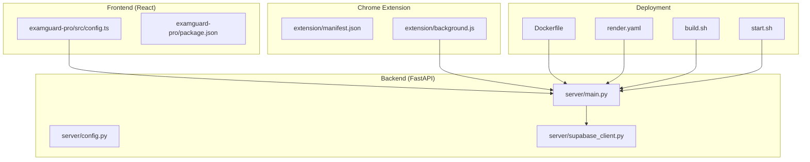

**Diagram sources**
- [server/main.py:1-647](file://server/main.py#L1-L647)
- [server/config.py:1-205](file://server/config.py#L1-L205)
- [server/supabase_client.py:1-22](file://server/supabase_client.py#L1-L22)
- [examguard-pro/src/config.ts:1-13](file://examguard-pro/src/config.ts#L1-L13)
- [extension/manifest.json:1-73](file://extension/manifest.json#L1-L73)
- [extension/background.js:1-800](file://extension/background.js#L1-L800)
- [Dockerfile:1-55](file://Dockerfile#L1-L55)
- [render.yaml:1-36](file://render.yaml#L1-L36)
- [build.sh:1-45](file://build.sh#L1-L45)
- [start.sh:1-24](file://start.sh#L1-L24)

**Section sources**
- [README.md:29-46](file://README.md#L29-L46)

## Prerequisites
- Python 3.10+ for the backend
- Node.js 18+ for the React dashboard
- Supabase account with a project URL and API keys
- Tesseract OCR installed locally for development

These requirements are documented in the project’s setup guide.

**Section sources**
- [README.md:50-54](file://README.md#L50-L54)

## Installation
Follow these step-by-step instructions to install all components.

### Backend (FastAPI)
1. Navigate to the server directory and create a virtual environment.
2. Activate the virtual environment.
3. Install Python dependencies from the requirements file.
4. Create a .env file with your Supabase credentials.
5. Start the backend server.

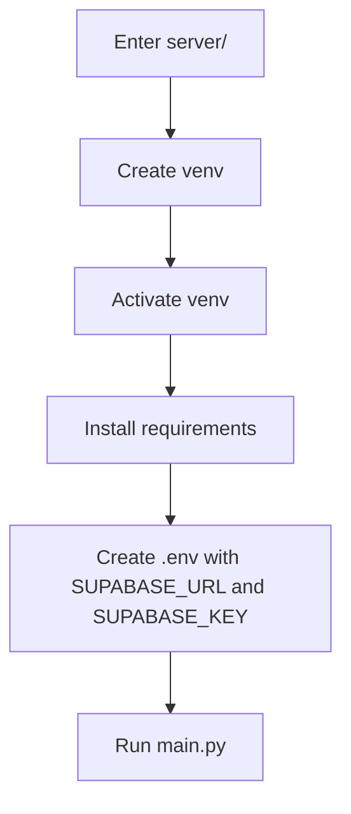

**Diagram sources**
- [README.md:56-64](file://README.md#L56-L64)
- [server/requirements.txt:1-34](file://server/requirements.txt#L1-L34)

**Section sources**
- [README.md:56-64](file://README.md#L56-L64)
- [server/requirements.txt:1-34](file://server/requirements.txt#L1-L34)

### Frontend (React)
1. Navigate to the React dashboard directory.
2. Install Node dependencies.
3. Start the development server.

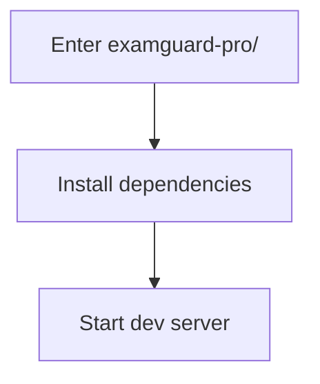

**Diagram sources**
- [README.md:66-71](file://README.md#L66-L71)
- [examguard-pro/package.json:1-40](file://examguard-pro/package.json#L1-L40)

**Section sources**
- [README.md:66-71](file://README.md#L66-L71)
- [examguard-pro/package.json:1-40](file://examguard-pro/package.json#L1-L40)

### Chrome Extension
1. Open chrome://extensions in your browser.
2. Enable Developer mode.
3. Load the extension from the extension/ directory.
4. Configure the backend URL in the extension’s background script if needed.

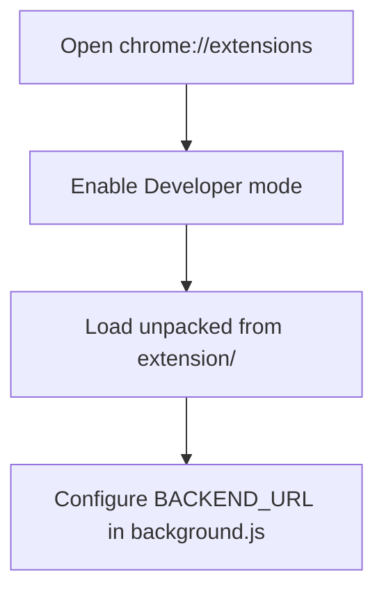

**Diagram sources**
- [README.md:73-77](file://README.md#L73-L77)
- [extension/manifest.json:1-73](file://extension/manifest.json#L1-L73)
- [extension/background.js:1-20](file://extension/background.js#L1-L20)

**Section sources**
- [README.md:73-77](file://README.md#L73-L77)
- [extension/manifest.json:1-73](file://extension/manifest.json#L1-L73)
- [extension/background.js:1-20](file://extension/background.js#L1-L20)

## Environment Configuration
Set the following environment variables for the backend:
- SUPABASE_URL: Your Supabase project URL
- SUPABASE_KEY: Your Supabase service key
- SECRET_KEY: Random secret for JWT signing
- Optional: CORS_ORIGINS for frontend origins

The backend reads these from environment variables and configures database connections accordingly.

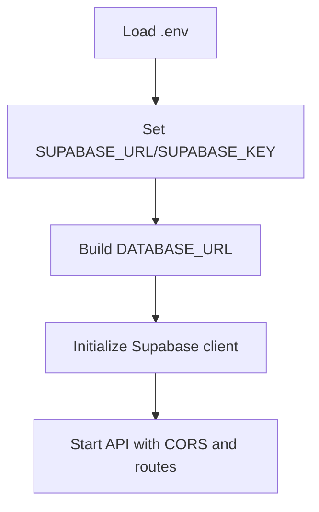

**Diagram sources**
- [server/main.py:14-15](file://server/main.py#L14-L15)
- [server/config.py:17-42](file://server/config.py#L17-L42)
- [server/supabase_client.py:10-21](file://server/supabase_client.py#L10-L21)

**Section sources**
- [server/config.py:17-42](file://server/config.py#L17-L42)
- [server/supabase_client.py:10-21](file://server/supabase_client.py#L10-L21)
- [server/main.py:192-222](file://server/main.py#L192-L222)

## Deployment Options
Choose one of the following deployment approaches:

### Local Development
- Run the backend with uvicorn and the React dashboard with Vite.
- Ensure environment variables are configured in your shell or .env file.

**Section sources**
- [README.md:56-64](file://README.md#L56-L64)
- [README.md:66-71](file://README.md#L66-L71)

### Docker Containerization
- Build a multi-stage image that compiles the React dashboard and runs the FastAPI backend.
- Installs system-level dependencies for computer vision and OCR.
- Exposes the API port and serves the built frontend from the backend.

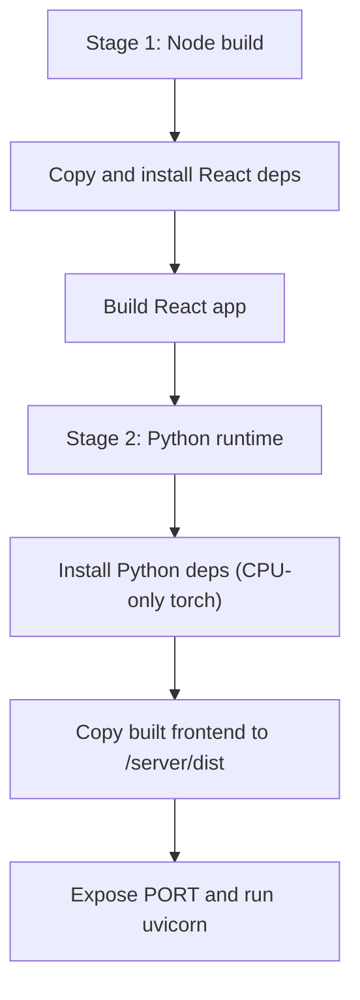

**Diagram sources**
- [Dockerfile:1-55](file://Dockerfile#L1-L55)

**Section sources**
- [Dockerfile:1-55](file://Dockerfile#L1-L55)

### Render Cloud Deployment
- Use the provided Render configuration to build and start the application.
- Build script installs dependencies and pre-downloads model weights.
- Start script sets environment variables and launches the server.

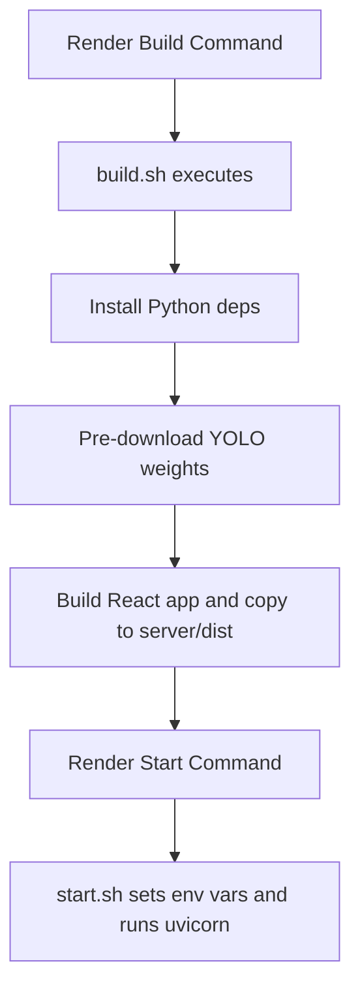

**Diagram sources**
- [render.yaml:1-36](file://render.yaml#L1-L36)
- [build.sh:1-45](file://build.sh#L1-L45)
- [start.sh:1-24](file://start.sh#L1-L24)

**Section sources**
- [render.yaml:1-36](file://render.yaml#L1-L36)
- [build.sh:1-45](file://build.sh#L1-L45)
- [start.sh:1-24](file://start.sh#L1-L24)

## Verification and Basic Usage
After deployment, verify the system is operational and test basic workflows for administrators, proctors, and students.

### Health Checks
- Backend health endpoint: Confirm the API responds and indicates service status.
- WebSocket stats: Verify real-time connection counts and pipeline stats.

**Section sources**
- [server/main.py:548-584](file://server/main.py#L548-L584)
- [server/main.py:503-507](file://server/main.py#L503-L507)

### Administrator Tasks
- Access the dashboard served by the backend.
- Monitor sessions, manage users, and review analytics.

**Section sources**
- [server/main.py:611-634](file://server/main.py#L611-L634)

### Proctor Tasks
- Connect via the proctor WebSocket to monitor a specific session.
- Send commands and alerts to students.

**Section sources**
- [server/main.py:344-391](file://server/main.py#L344-L391)

### Student Tasks
- Use the Chrome extension to start a proctoring session.
- Allow camera/microphone access and share the screen as required.
- Receive real-time feedback and alerts through the extension and dashboard.

**Section sources**
- [extension/background.js:751-800](file://extension/background.js#L751-L800)
- [extension/manifest.json:1-73](file://extension/manifest.json#L1-L73)

## Architecture Overview
The system integrates a FastAPI backend, a React dashboard, and a Chrome extension. The backend manages authentication, real-time WebSocket communication, AI analysis services, and Supabase integration. The React dashboard displays live metrics and session timelines. The Chrome extension captures events, screenshots, webcam frames, and relays them to the backend.

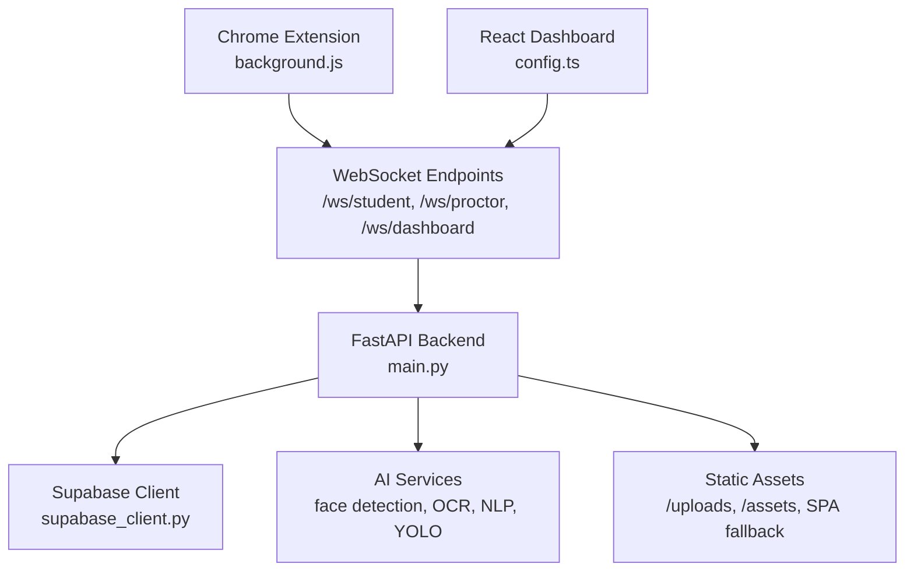

**Diagram sources**
- [extension/background.js:1-20](file://extension/background.js#L1-L20)
- [examguard-pro/src/config.ts:1-13](file://examguard-pro/src/config.ts#L1-L13)
- [server/main.py:1-647](file://server/main.py#L1-L647)
- [server/supabase_client.py:1-22](file://server/supabase_client.py#L1-L22)

## Detailed Component Analysis

### Backend (FastAPI)
Key responsibilities:
- Application lifecycle management and startup/shutdown routines
- CORS configuration and middleware
- WebSocket endpoints for dashboard, proctor, and student communications
- Static file serving for uploads and SPA fallback
- Health checks and pipeline statistics

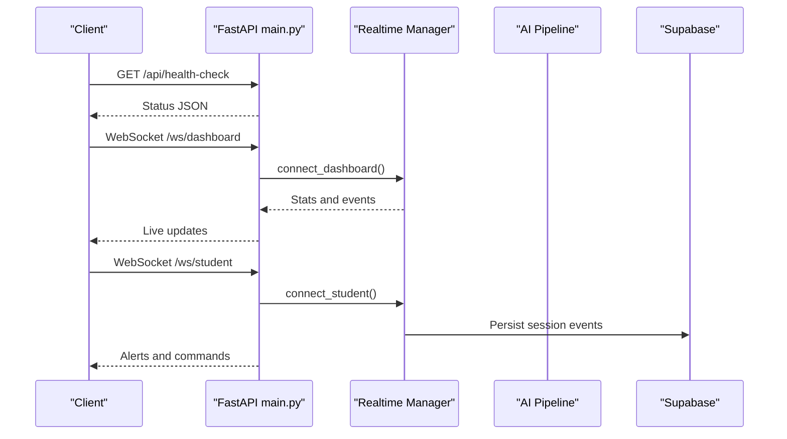

**Diagram sources**
- [server/main.py:228-237](file://server/main.py#L228-L237)
- [server/main.py:274-342](file://server/main.py#L274-L342)
- [server/main.py:393-474](file://server/main.py#L393-L474)
- [server/main.py:548-584](file://server/main.py#L548-L584)

**Section sources**
- [server/main.py:109-165](file://server/main.py#L109-L165)
- [server/main.py:192-222](file://server/main.py#L192-L222)
- [server/main.py:228-237](file://server/main.py#L228-L237)
- [server/main.py:274-342](file://server/main.py#L274-L342)
- [server/main.py:393-474](file://server/main.py#L393-L474)
- [server/main.py:548-584](file://server/main.py#L548-L584)

### Frontend (React)
Key responsibilities:
- Dynamic API and WebSocket URLs based on environment
- SPA routing with fallback to index.html
- Real-time updates via WebSocket connections

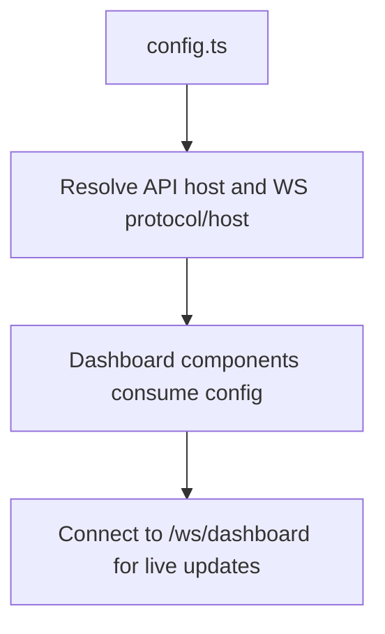

**Diagram sources**
- [examguard-pro/src/config.ts:1-13](file://examguard-pro/src/config.ts#L1-L13)
- [server/main.py:611-634](file://server/main.py#L611-L634)

**Section sources**
- [examguard-pro/src/config.ts:1-13](file://examguard-pro/src/config.ts#L1-L13)
- [server/main.py:611-634](file://server/main.py#L611-L634)

### Chrome Extension
Key responsibilities:
- Session lifecycle: start, stop, and sync events
- Event capture: tab switches, copy/paste, DOM snapshots, webcam frames
- Real-time communication: WebSocket signaling and binary stream relay
- URL classification and risk scoring

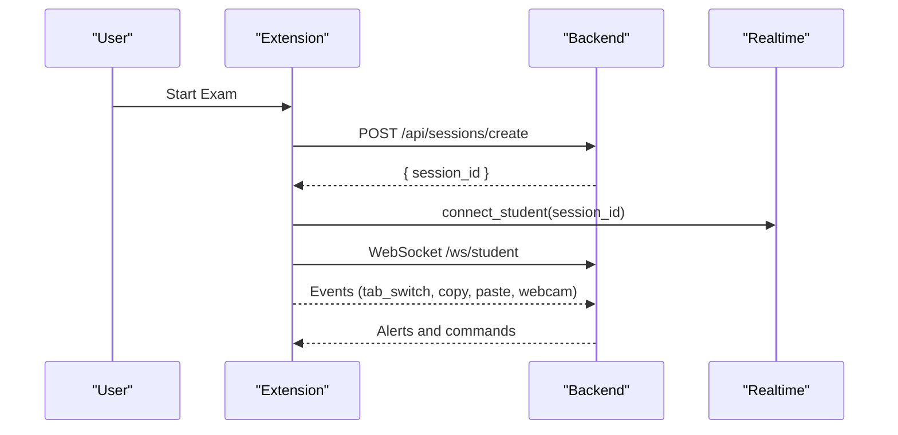

**Diagram sources**
- [extension/background.js:751-800](file://extension/background.js#L751-L800)
- [extension/background.js:1-20](file://extension/background.js#L1-L20)
- [server/main.py:393-474](file://server/main.py#L393-L474)

**Section sources**
- [extension/manifest.json:1-73](file://extension/manifest.json#L1-L73)
- [extension/background.js:1-20](file://extension/background.js#L1-L20)
- [extension/background.js:751-800](file://extension/background.js#L751-L800)
- [server/main.py:393-474](file://server/main.py#L393-L474)

## Dependency Analysis
Runtime dependencies are declared in the backend requirements and enforced during builds.

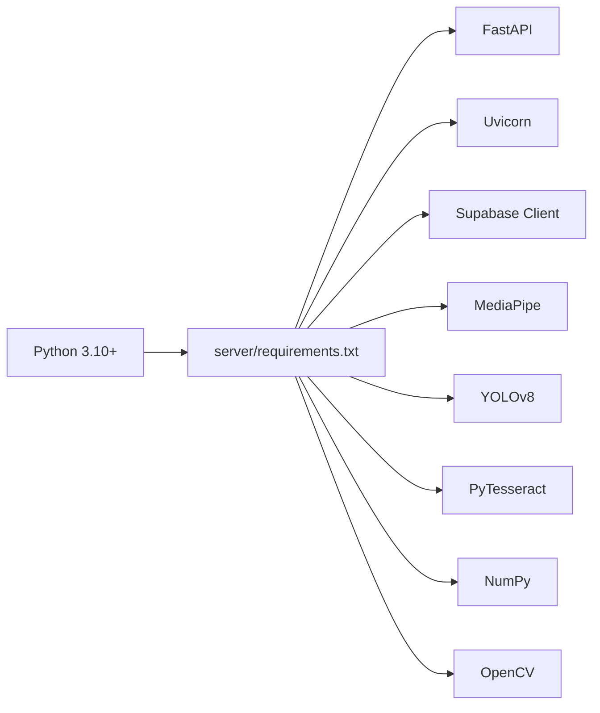

**Diagram sources**
- [server/requirements.txt:1-34](file://server/requirements.txt#L1-L34)

**Section sources**
- [server/requirements.txt:1-34](file://server/requirements.txt#L1-L34)
- [requirements.txt:1-2](file://requirements.txt#L1-L2)

## Performance Considerations
- Use Docker or Render for consistent environments and pre-downloaded model weights.
- Ensure adequate compute resources for AI modules (face detection, OCR, YOLO).
- Optimize WebSocket intervals and binary streaming sizes to balance fidelity and bandwidth.

## Troubleshooting Guide
Common setup issues and resolutions:
- Missing Supabase credentials: Ensure SUPABASE_URL and SUPABASE_KEY are set in the environment.
- CORS errors: Verify CORS_ORIGINS includes the frontend origin.
- WebSocket connection failures: Confirm the backend is reachable and ports are exposed.
- OCR not working in development: Install Tesseract as per prerequisites.
- Render build failures: Confirm build.sh completes and model weights are downloaded.
- Extension not connecting: Check BACKEND_URL in the extension and permissions in manifest.json.

**Section sources**
- [server/config.py:17-42](file://server/config.py#L17-L42)
- [server/main.py:192-222](file://server/main.py#L192-L222)
- [README.md:50-54](file://README.md#L50-L54)
- [render.yaml:8-9](file://render.yaml#L8-L9)
- [extension/background.js:7-10](file://extension/background.js#L7-L10)
- [extension/manifest.json:1-73](file://extension/manifest.json#L1-L73)

## Conclusion
You now have the essential steps to deploy ExamGuard Pro locally, containerized, or on Render, configure environment variables, and verify operation across administrator, proctor, and student roles. Use the troubleshooting section to resolve typical first-time setup issues and ensure reliable real-time monitoring.