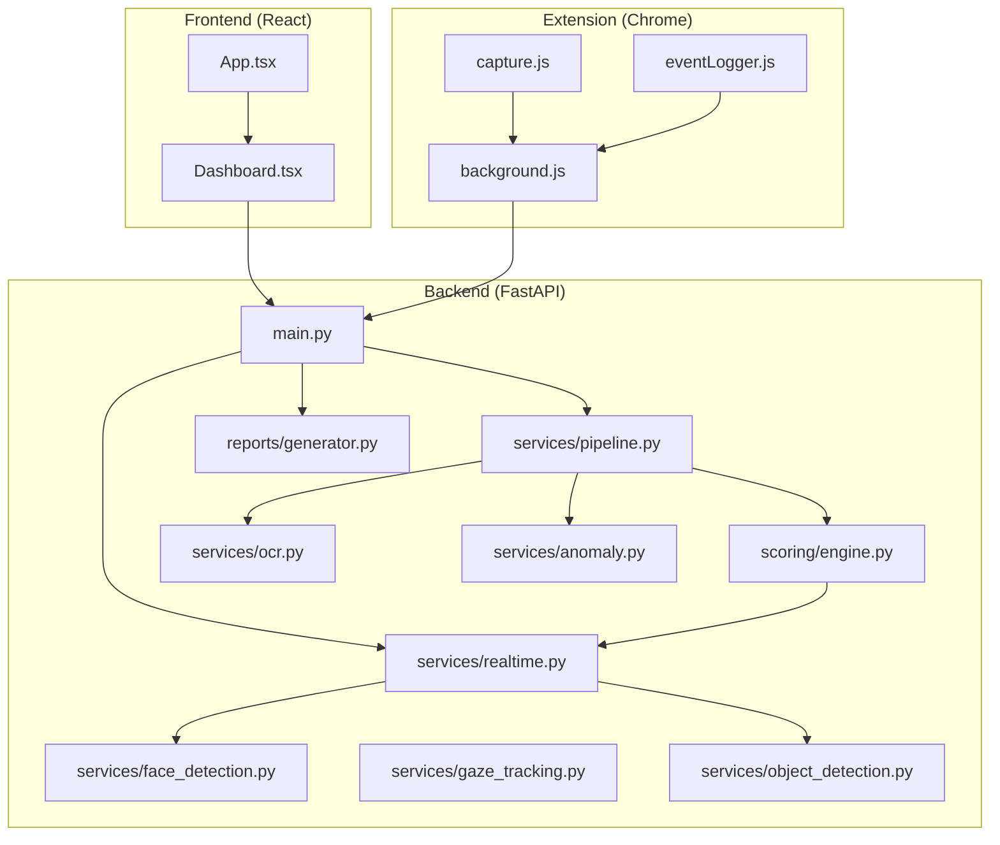
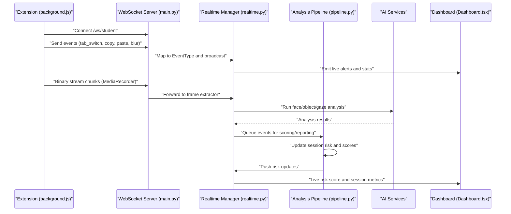
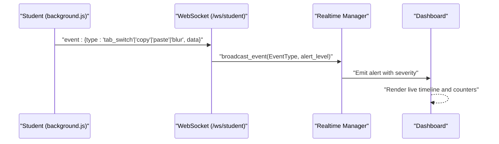
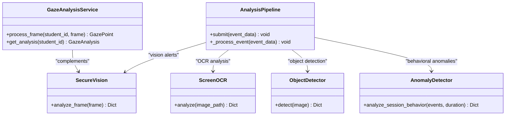
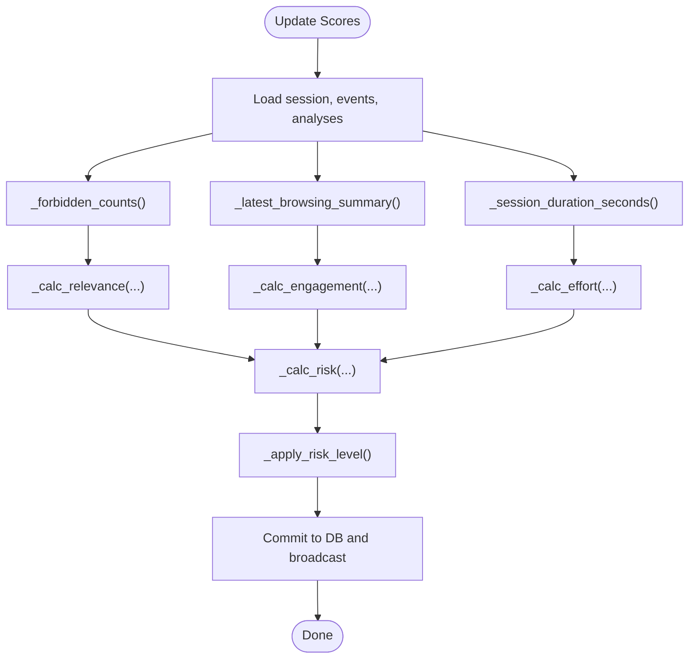
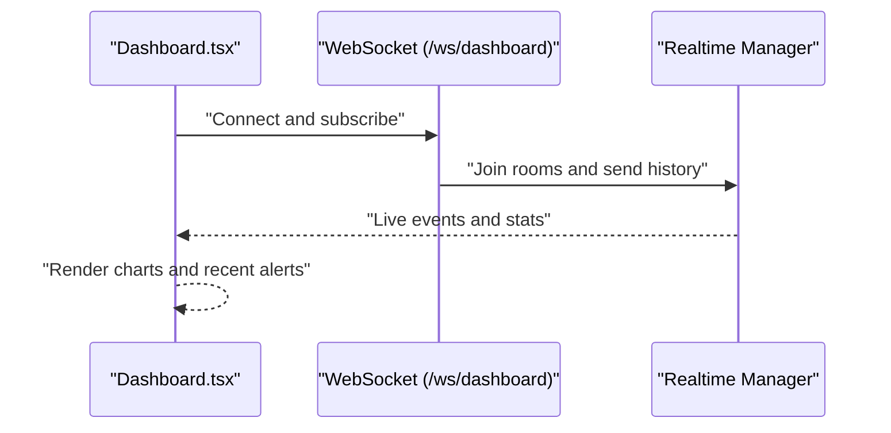
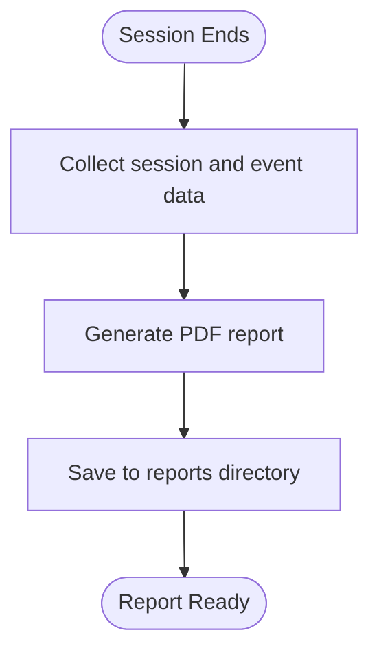
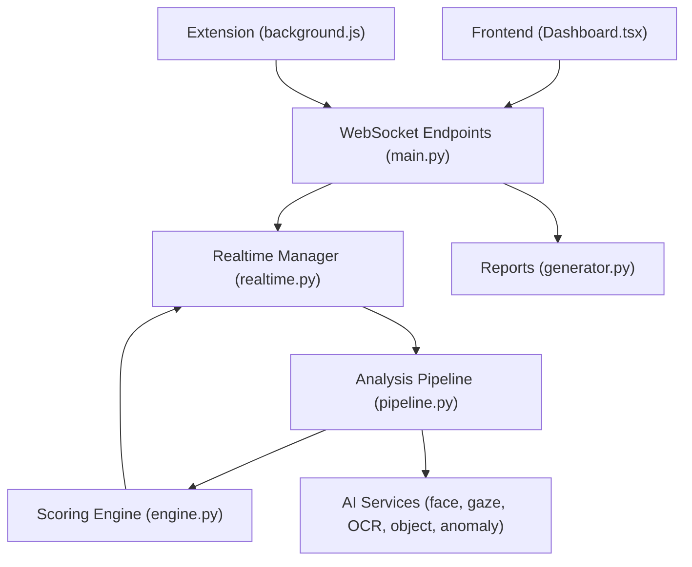

# Core Features

<cite>
**Referenced Files in This Document**
- [App.tsx](file://examguard-pro/src/App.tsx)
- [Dashboard.tsx](file://examguard-pro/src/components/Dashboard.tsx)
- [main.py](file://server/main.py)
- [realtime.py](file://server/services/realtime.py)
- [engine.py](file://server/scoring/engine.py)
- [face_detection.py](file://server/services/face_detection.py)
- [gaze_tracking.py](file://server/services/gaze_tracking.py)
- [ocr.py](file://server/services/ocr.py)
- [object_detection.py](file://server/services/object_detection.py)
- [anomaly.py](file://server/services/anomaly.py)
- [generator.py](file://server/reports/generator.py)
- [pipeline.py](file://server/services/pipeline.py)
- [background.js](file://extension/background.js)
- [capture.js](file://extension/capture.js)
- [eventLogger.js](file://extension/eventLogger.js)
</cite>

## Table of Contents
1. [Introduction](#introduction)
2. [Project Structure](#project-structure)
3. [Core Components](#core-components)
4. [Architecture Overview](#architecture-overview)
5. [Detailed Component Analysis](#detailed-component-analysis)
6. [Dependency Analysis](#dependency-analysis)
7. [Performance Considerations](#performance-considerations)
8. [Troubleshooting Guide](#troubleshooting-guide)
9. [Conclusion](#conclusion)

## Introduction
This document details the core features of ExamGuard Pro that ensure academic integrity. It covers real-time monitoring (tab switching detection, window blurring, copy/paste tracking), AI-driven analysis (face detection, gaze tracking, OCR, object detection, text similarity), dynamic risk scoring, interactive dashboard with live updates, and robust reporting with automated PDF generation and violation logging. Practical examples illustrate how these features integrate across the React frontend, Chrome extension, and FastAPI backend.

## Project Structure
The system comprises three major parts:
- Frontend (React): Routing, dashboard, and UI components.
- Extension (Chrome): Capture, event logging, and communication with the backend.
- Backend (FastAPI): Real-time WebSocket management, AI analysis, scoring, and reporting.

**Diagram sources**
- [App.tsx:67-91](file://examguard-pro/src/App.tsx#L67-L91)
- [Dashboard.tsx:30-113](file://examguard-pro/src/components/Dashboard.tsx#L30-L113)
- [main.py:170-186](file://server/main.py#L170-L186)
- [realtime.py:102-138](file://server/services/realtime.py#L102-L138)
- [pipeline.py:9-33](file://server/services/pipeline.py#L9-L33)
- [engine.py:373-444](file://server/scoring/engine.py#L373-L444)
- [face_detection.py:27-109](file://server/services/face_detection.py#L27-L109)
- [gaze_tracking.py:471-611](file://server/services/gaze_tracking.py#L471-L611)
- [ocr.py:20-121](file://server/services/ocr.py#L20-L121)
- [object_detection.py:16-147](file://server/services/object_detection.py#L16-L147)
- [anomaly.py:11-221](file://server/services/anomaly.py#L11-L221)
- [generator.py:422-534](file://server/reports/generator.py#L422-L534)
- [background.js:52-166](file://extension/background.js#L52-L166)
- [capture.js:6-203](file://extension/capture.js#L6-L203)
- [eventLogger.js:1-111](file://extension/eventLogger.js#L1-L111)

**Section sources**
- [App.tsx:67-91](file://examguard-pro/src/App.tsx#L67-L91)
- [main.py:170-186](file://server/main.py#L170-L186)

## Core Components
- Real-time monitoring and WebSocket orchestration: Manages connections, rooms, and broadcasts events across dashboard, proctor, and student contexts.
- AI analysis services: Face detection, gaze tracking, OCR, object detection, anomaly detection, and pipeline orchestration.
- Dynamic risk scoring: Computes engagement, relevance, effort, and risk metrics with weighted contributions and live updates.
- Interactive dashboard: Live alerts, session timelines, and controls for session creation and clearing.
- Reporting: Automated PDF generation with KPIs, event statistics, and timelines.

**Section sources**
- [realtime.py:102-138](file://server/services/realtime.py#L102-L138)
- [engine.py:373-444](file://server/scoring/engine.py#L373-L444)
- [Dashboard.tsx:30-113](file://examguard-pro/src/components/Dashboard.tsx#L30-L113)
- [generator.py:422-534](file://server/reports/generator.py#L422-L534)

## Architecture Overview
The system uses FastAPI with WebSocket endpoints for real-time updates and a background pipeline for asynchronous analysis. The Chrome extension captures screen/webcam streams, logs user events, and communicates with the backend via WebSocket and message passing. The backend orchestrates AI services, updates session scores, and pushes live events to the dashboard.

**Diagram sources**
- [main.py:393-473](file://server/main.py#L393-L473)
- [realtime.py:334-377](file://server/services/realtime.py#L334-L377)
- [pipeline.py:74-96](file://server/services/pipeline.py#L74-L96)
- [background.js:52-166](file://extension/background.js#L52-L166)
- [Dashboard.tsx:30-113](file://examguard-pro/src/components/Dashboard.tsx#L30-L113)

## Detailed Component Analysis

### Real-Time Monitoring and WebSocket Updates
- WebSocket endpoints:
  - /ws/student: Student event reporting and live stream relay.
  - /ws/dashboard: Global dashboard updates and subscription management.
  - /ws/proctor/{session_id}: Proctor session-specific monitoring.
  - /ws/alerts: Legacy endpoint maintained for compatibility.
- Event mapping includes tab switching, copy/paste, and window blur.
- Realtime manager supports rooms, history, and heartbeat monitoring.

**Diagram sources**
- [main.py:432-473](file://server/main.py#L432-L473)
- [realtime.py:334-377](file://server/services/realtime.py#L334-L377)

**Section sources**
- [main.py:274-391](file://server/main.py#L274-L391)
- [realtime.py:102-138](file://server/services/realtime.py#L102-L138)

### AI-Driven Analysis Capabilities
- Face detection with MediaPipe Tasks and fallback to Haar cascades; detects multiple faces and face absence.
- Gaze tracking using MediaPipe FaceMesh to compute attention metrics and anomalies.
- OCR analysis for screenshots to detect forbidden keywords and compute risk.
- Object detection using YOLO to identify phones, books, watches, and other unauthorized devices.
- Anomaly detection for behavioral patterns (tab switches, copy/paste rates, face absence).
- Pipeline integrates these services and updates session risk and scores.

**Diagram sources**
- [face_detection.py:27-109](file://server/services/face_detection.py#L27-L109)
- [gaze_tracking.py:471-611](file://server/services/gaze_tracking.py#L471-L611)
- [ocr.py:20-121](file://server/services/ocr.py#L20-L121)
- [object_detection.py:16-147](file://server/services/object_detection.py#L16-L147)
- [anomaly.py:11-221](file://server/services/anomaly.py#L11-L221)
- [pipeline.py:74-96](file://server/services/pipeline.py#L74-L96)

**Section sources**
- [face_detection.py:27-109](file://server/services/face_detection.py#L27-L109)
- [gaze_tracking.py:471-611](file://server/services/gaze_tracking.py#L471-L611)
- [ocr.py:20-121](file://server/services/ocr.py#L20-L121)
- [object_detection.py:16-147](file://server/services/object_detection.py#L16-L147)
- [anomaly.py:11-221](file://server/services/anomaly.py#L11-L221)
- [pipeline.py:74-96](file://server/services/pipeline.py#L74-L96)

### Dynamic Risk Scoring System
- Engagement: Penalizes tab switches, window blurs, excessive distraction time, and flagged open tabs.
- Content relevance: Penalizes forbidden site visits and OCR forbidden keyword hits; rewards exam-platform time.
- Effort alignment: Blends browsing effort with extension’s own effort estimate; penalizes excessive copy/paste and forbidden categories.
- Risk aggregation: Weighted combination of vision impact, OCR risk, anomaly score, and browsing risk; capped bonuses for forbidden sites and flagged tabs.
- Risk levels: Safe (<30), Review (<60), Suspicious (≥70).

**Diagram sources**
- [engine.py:382-444](file://server/scoring/engine.py#L382-L444)

**Section sources**
- [engine.py:27-93](file://server/scoring/engine.py#L27-L93)
- [engine.py:195-354](file://server/scoring/engine.py#L195-L354)
- [engine.py:357-369](file://server/scoring/engine.py#L357-L369)

### Interactive Dashboard Features
- Live alerts and session metrics rendered in real-time via WebSocket.
- Charts for activity and alerts timeline.
- Controls to create new sessions and clear data.
- Integration with WebSocket endpoints for live stats and subscriptions.

**Diagram sources**
- [Dashboard.tsx:30-113](file://examguard-pro/src/components/Dashboard.tsx#L30-L113)
- [main.py:274-342](file://server/main.py#L274-L342)
- [realtime.py:213-274](file://server/services/realtime.py#L213-L274)

**Section sources**
- [Dashboard.tsx:30-113](file://examguard-pro/src/components/Dashboard.tsx#L30-L113)
- [main.py:274-342](file://server/main.py#L274-L342)

### Reporting and Violation Logging
- Automated PDF generation with session info, risk assessment, KPIs, event statistics, and timelines.
- Fallback plain-text report when ReportLab is unavailable.
- Violation logging integrated into the analysis pipeline and stored in Supabase.

**Diagram sources**
- [generator.py:422-534](file://server/reports/generator.py#L422-L534)

**Section sources**
- [generator.py:422-534](file://server/reports/generator.py#L422-L534)

### Practical Examples in Action
- Tab switching detection:
  - Extension logs tab_switch events and sends them to the backend.
  - Backend maps to EventType and broadcasts to dashboard and proctors.
  - Scoring engine applies penalties to engagement and effort.
- Window blurring events:
  - Visibility change triggers blur events; backend maps and broadcasts warnings.
  - Scoring engine reduces engagement and effort accordingly.
- Copy/paste tracking:
  - Clipboard text is captured and sent to the pipeline for similarity analysis.
  - OCR analysis on screenshots detects forbidden keywords and increases risk.
- Face detection and object detection:
  - Live webcam frames are processed; multiple faces or phones trigger critical alerts.
  - Results broadcast to dashboard and extension for immediate feedback.
- Gaze tracking:
  - Continuous attention metrics computed; prolonged off-screen time flags anomalies.
- Dynamic risk scoring:
  - Real-time updates reflected in dashboard with live risk levels (Safe, Review, Suspicious).
- Reporting:
  - PDF reports generated summarizing risk, events, and timelines for review.

**Section sources**
- [main.py:432-473](file://server/main.py#L432-L473)
- [pipeline.py:74-96](file://server/services/pipeline.py#L74-L96)
- [engine.py:311-354](file://server/scoring/engine.py#L311-L354)
- [generator.py:422-534](file://server/reports/generator.py#L422-L534)

## Dependency Analysis
The system exhibits clear separation of concerns:
- Frontend depends on WebSocket hooks and configuration to consume real-time updates.
- Extension depends on background scripts for session lifecycle, capture, and event logging.
- Backend orchestrates AI services and pipelines; realtime manager coordinates WebSocket communications.

**Diagram sources**
- [Dashboard.tsx:30-113](file://examguard-pro/src/components/Dashboard.tsx#L30-L113)
- [main.py:274-391](file://server/main.py#L274-L391)
- [realtime.py:102-138](file://server/services/realtime.py#L102-L138)
- [pipeline.py:9-33](file://server/services/pipeline.py#L9-L33)
- [engine.py:373-444](file://server/scoring/engine.py#L373-L444)
- [generator.py:422-534](file://server/reports/generator.py#L422-L534)

**Section sources**
- [main.py:170-186](file://server/main.py#L170-L186)
- [realtime.py:102-138](file://server/services/realtime.py#L102-L138)
- [pipeline.py:9-33](file://server/services/pipeline.py#L9-L33)

## Performance Considerations
- WebSocket broadcasting is optimized with room-based subscriptions and binary streaming for live video.
- AI analysis callbacks throttle processing and cache results to reduce overhead.
- Scoring engine uses pure functions and batch updates to minimize I/O contention.
- OCR and object detection include fallbacks and throttling to maintain responsiveness.

[No sources needed since this section provides general guidance]

## Troubleshooting Guide
- WebSocket connectivity issues:
  - Verify endpoint reachability and connection acceptance paths.
  - Use heartbeat messages to confirm liveness.
- AI service failures:
  - MediaPipe Tasks availability and model downloads; fallback to Haar cascades.
  - Object detection requires YOLO weights; ensure installation and paths.
- OCR limitations:
  - Tesseract must be installed; otherwise, fallback mode is used.
- Extension capture problems:
  - Screen/webcam permissions and stream termination events.
  - MediaRecorder configuration and WebRTC signaling.

**Section sources**
- [main.py:274-391](file://server/main.py#L274-L391)
- [face_detection.py:11-26](file://server/services/face_detection.py#L11-L26)
- [object_detection.py:17-26](file://server/services/object_detection.py#L17-L26)
- [ocr.py:10-17](file://server/services/ocr.py#L10-L17)
- [capture.js:28-64](file://extension/capture.js#L28-L64)

## Conclusion
ExamGuard Pro delivers a comprehensive academic integrity solution by combining robust real-time monitoring, advanced AI analysis, dynamic risk scoring, interactive dashboards, and automated reporting. Its modular architecture ensures scalability, resilience, and seamless integration across the frontend, extension, and backend.