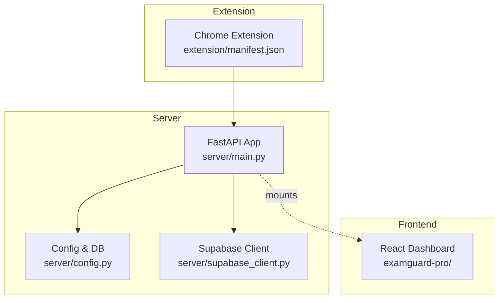

# Getting Started

<cite>
**Referenced Files in This Document**
- [README.md](file://README.md)
- [requirements.txt](file://requirements.txt)
- [server/requirements.txt](file://server/requirements.txt)
- [server/config.py](file://server/config.py)
- [server/supabase_client.py](file://server/supabase_client.py)
- [server/main.py](file://server/main.py)
- [render.yaml](file://render.yaml)
- [Dockerfile](file://Dockerfile)
- [docker-compose.yml](file://docker-compose.yml)
- [build.sh](file://build.sh)
- [start.sh](file://start.sh)
- [examguard-pro/package.json](file://examguard-pro/package.json)
- [extension/manifest.json](file://extension/manifest.json)
- [examguard-pro/.env.example](file://examguard-pro/.env.example)
</cite>

## Table of Contents
1. [Introduction](#introduction)
2. [Project Structure](#project-structure)
3. [Prerequisites](#prerequisites)
4. [Quick Setup](#quick-setup)
5. [Environment Variables](#environment-variables)
6. [Database Setup with Supabase](#database-setup-with-supabase)
7. [First-Time Deployment](#first-time-deployment)
8. [Running Locally](#running-locally)
9. [Verification Commands](#verification-commands)
10. [Troubleshooting Guide](#troubleshooting-guide)
11. [Conclusion](#conclusion)

## Introduction
ExamGuard Pro is an AI-powered proctoring system that monitors exams in real time using computer vision, OCR, and behavioral analytics. It consists of:
- Backend: FastAPI server with Supabase integration
- Frontend: React dashboard (Vite)
- Chrome Extension: Manifest V3 for page capture and event logging

The system supports local development, containerized environments, and cloud deployment via Render.

## Project Structure
High-level layout of the repository:
- server/: FastAPI backend with API endpoints, authentication, services, and AI pipelines
- examguard-pro/: React dashboard built with Vite
- extension/: Chrome extension (Manifest V3)
- transformer/: Optional transformer models and training utilities
- deployment/: Docker and configuration files for unified builds

**Diagram sources**
- [server/main.py:1-647](file://server/main.py#L1-L647)
- [server/config.py:1-205](file://server/config.py#L1-L205)
- [server/supabase_client.py:1-22](file://server/supabase_client.py#L1-L22)
- [examguard-pro/package.json:1-40](file://examguard-pro/package.json#L1-L40)
- [extension/manifest.json:1-73](file://extension/manifest.json#L1-L73)

**Section sources**
- [README.md:29-46](file://README.md#L29-L46)

## Prerequisites
Ensure your environment meets the following requirements before proceeding:
- Python 3.10+
- Node.js 18+
- Supabase account with a project URL and API keys
- Tesseract OCR installed locally for development (screen capture OCR)

Notes:
- The backend uses Python packages including FastAPI, Supabase client, MediaPipe, YOLOv8, and Tesseract OCR.
- The Dockerfile installs system-level dependencies such as tesseract-ocr and ffmpeg for CV/OCR tasks.

**Section sources**
- [README.md:50-54](file://README.md#L50-L54)
- [server/requirements.txt:1-34](file://server/requirements.txt#L1-L34)
- [Dockerfile:29-35](file://Dockerfile#L29-L35)

## Quick Setup
Follow these steps to set up and run the system locally.

Step 1: Backend (FastAPI)
- Navigate to the server directory and create a virtual environment
- Install Python dependencies
- Create a .env file with Supabase credentials
- Start the backend server

Step 2: Frontend (React)
- Navigate to the React dashboard directory
- Install Node dependencies
- Start the development server

Step 3: Chrome Extension
- Load the unpacked extension from the extension/ directory
- Configure the backend URL if needed

Step 4: Verify Installation
- Access the backend health endpoint
- Confirm the dashboard loads
- Test WebSocket connections

**Section sources**
- [README.md:48-78](file://README.md#L48-L78)

## Environment Variables
Configure the backend using environment variables. The server reads these from the environment and constructs database URLs and CORS policies.

Key variables:
- SUPABASE_URL: Supabase project URL
- SUPABASE_KEY: Supabase API key
- SUPABASE_DB_PASSWORD: Optional database password override
- PG_HOST, PG_PORT, PG_USER, PG_DB: PostgreSQL connection parameters
- DATABASE_URL: Alternative single-source database URL (supports postgres:// or postgresql+asyncpg://)
- SECRET_KEY: Secret for JWT signing
- CORS_ORIGINS: Comma-separated list or "*" for all origins
- API_HOST, API_PORT: Host and port for the API server
- USE_SQLITE: Toggle to use SQLite when DATABASE_URL and PG_* are not set
- PORT: Container/runtime port (Render sets this dynamically)

Notes:
- The server initializes a Supabase client only if both SUPABASE_URL and SUPABASE_KEY are present.
- The React dashboard expects an API base URL configured in its environment.

**Section sources**
- [server/config.py:16-42](file://server/config.py#L16-L42)
- [server/config.py:44-49](file://server/config.py#L44-L49)
- [server/supabase_client.py:10-17](file://server/supabase_client.py#L10-L17)
- [render.yaml:13-35](file://render.yaml#L13-L35)
- [docker-compose.yml:10-26](file://docker-compose.yml#L10-L26)
- [examguard-pro/.env.example:1-10](file://examguard-pro/.env.example#L1-L10)

## Database Setup with Supabase
ExamGuard Pro integrates with Supabase for authentication, real-time subscriptions, and relational data. The backend connects using the Supabase client and SQLAlchemy with asyncpg for PostgreSQL.

Steps:
- Provision a Supabase project and note the project URL and API keys
- Set SUPABASE_URL and SUPABASE_KEY in your environment
- Optionally set PG_* variables if using a direct PostgreSQL connection
- The server will mount the React build and serve static assets from the backend

Important behaviors:
- If DATABASE_URL is set, the server normalizes it to the asyncpg dialect when applicable
- If neither DATABASE_URL nor PG_HOST is set, the server falls back to a local SQLite database
- The Supabase client is initialized only when credentials are present

**Section sources**
- [server/config.py:16-42](file://server/config.py#L16-L42)
- [server/supabase_client.py:10-17](file://server/supabase_client.py#L10-L17)
- [server/main.py:522-531](file://server/main.py#L522-L531)

## First-Time Deployment
Deploy ExamGuard Pro using Render with a unified build and start script.

Build and start scripts:
- build.sh: Installs Python dependencies, pre-downloads YOLO weights, builds the React dashboard, and copies assets to server/dist
- start.sh: Sets environment variables for Matplotlib and uploads directories, then starts Uvicorn

Render configuration:
- Runtime: Python 3.11
- Root directory: project root
- Build command: bash build.sh
- Start command: bash start.sh
- Environment variables include SUPABASE_URL, SUPABASE_KEY, PG_* for database connectivity, SECRET_KEY, and CORS_ORIGINS

Docker option:
- A multi-stage Dockerfile builds the React frontend and runs the FastAPI server
- System dependencies include tesseract-ocr and ffmpeg
- The container exposes the API port and serves the built React assets

**Section sources**
- [build.sh:1-45](file://build.sh#L1-L45)
- [start.sh:1-24](file://start.sh#L1-L24)
- [render.yaml:1-36](file://render.yaml#L1-L36)
- [Dockerfile:1-55](file://Dockerfile#L1-L55)

## Running Locally
Local development requires three components: backend, frontend, and the Chrome extension.

Backend:
- Activate your Python virtual environment
- Install dependencies from server/requirements.txt
- Create a .env file with SUPABASE_URL and SUPABASE_KEY
- Start the server

Frontend:
- Install Node dependencies
- Start the Vite dev server

Chrome Extension:
- Open chrome://extensions
- Enable Developer mode
- Load unpacked from the extension/ directory
- Adjust BACKEND_URL in the extension’s background script if targeting a non-default backend

Optional Docker Compose:
- Use docker-compose.yml to run the backend with optional local Postgres
- Health checks are configured to probe /health

**Section sources**
- [README.md:56-78](file://README.md#L56-L78)
- [docker-compose.yml:28-32](file://docker-compose.yml#L28-L32)

## Verification Commands
Confirm your installation by running these checks:

Backend health:
- Endpoint: GET /health
- Expected: Status healthy with database, WebSocket, pipeline, and AI module statuses
- Example curl: curl http://localhost:8000/health

Dashboard availability:
- Visit the root path (/) to serve the React SPA
- Assets are served from mounted static directories

WebSocket connectivity:
- Connect to /ws/dashboard and send ping to receive pong
- Connect to /ws/student and send ping to receive pong

Extension configuration:
- Ensure permissions and host permissions in manifest.json allow communication with your backend
- Verify the extension icon appears and can toggle session controls

**Section sources**
- [server/main.py:548-584](file://server/main.py#L548-L584)
- [server/main.py:274-342](file://server/main.py#L274-L342)
- [server/main.py:393-474](file://server/main.py#L393-L474)
- [extension/manifest.json:18-24](file://extension/manifest.json#L18-L24)

## Troubleshooting Guide
Common issues and resolutions:

Missing Supabase credentials:
- Symptom: Warning about missing Supabase credentials during startup
- Resolution: Set SUPABASE_URL and SUPABASE_KEY in your environment

Database connection failures:
- Symptom: Errors connecting to PostgreSQL or fallback to SQLite
- Resolution: Ensure DATABASE_URL or PG_* variables are set correctly; verify asyncpg dialect normalization

Matplotlib backend errors on headless servers:
- Symptom: Font cache or X11-related errors
- Resolution: The server sets MPLBACKEND=Agg and MPLCONFIGDIR; ensure these environment variables are applied

React build not found:
- Symptom: Dashboard not served or SPA fallback returns Not Found
- Resolution: Build the React app so dist/index.html exists; the server attempts multiple locations for the build directory

Extension cannot reach backend:
- Symptom: Extension shows connection errors
- Resolution: Confirm host permissions in manifest.json and BACKEND_URL in the extension matches your deployed or local backend URL

Permission denied for uploads:
- Symptom: Cannot write screenshots or webcam frames
- Resolution: Ensure server/uploads and subdirectories exist and are writable

Render-specific:
- Symptom: Torch installation fails on free tier
- Resolution: Optional dependency; build continues without it

**Section sources**
- [server/supabase_client.py:12-17](file://server/supabase_client.py#L12-L17)
- [server/config.py:29-42](file://server/config.py#L29-L42)
- [server/main.py:10-12](file://server/main.py#L10-L12)
- [server/main.py:611-634](file://server/main.py#L611-L634)
- [extension/manifest.json:18-24](file://extension/manifest.json#L18-L24)
- [build.sh:15-16](file://build.sh#L15-L16)

## Conclusion
You now have the essential steps to install, configure, and deploy ExamGuard Pro. Use the backend, frontend, and extension components together for a complete proctoring solution. For production, leverage Render with the provided build and start scripts, and ensure all environment variables are properly configured for Supabase and database connectivity.