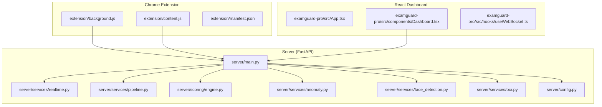
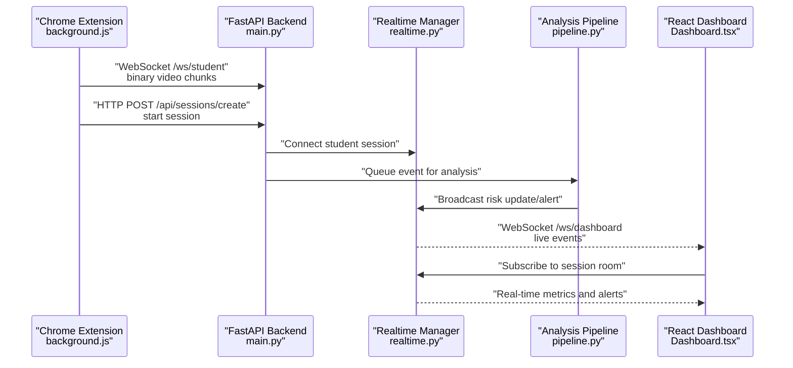
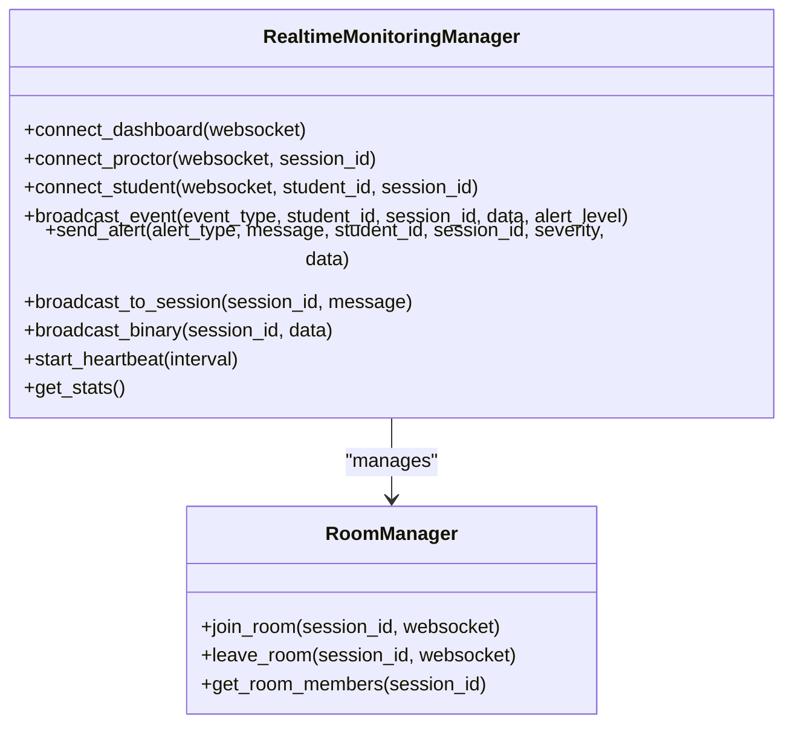
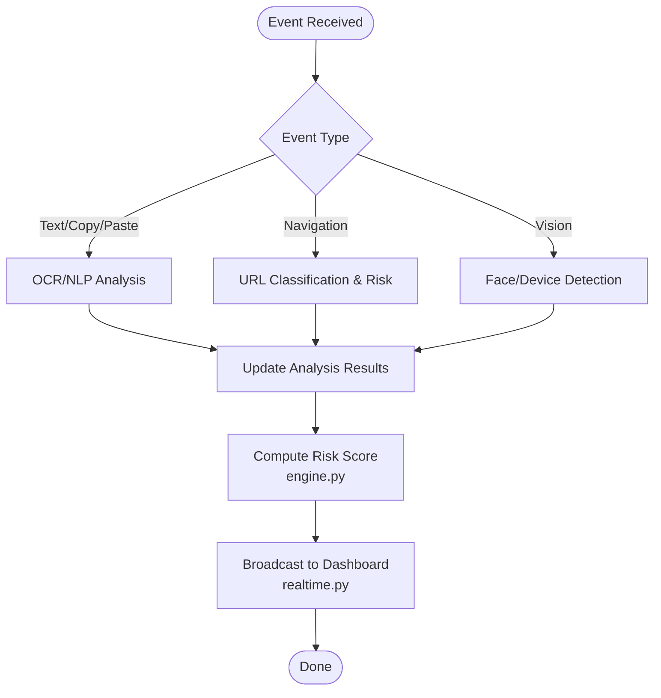
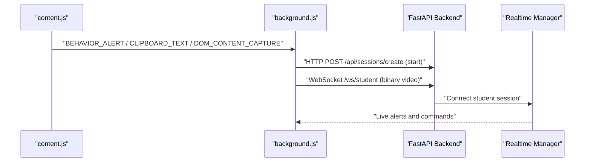
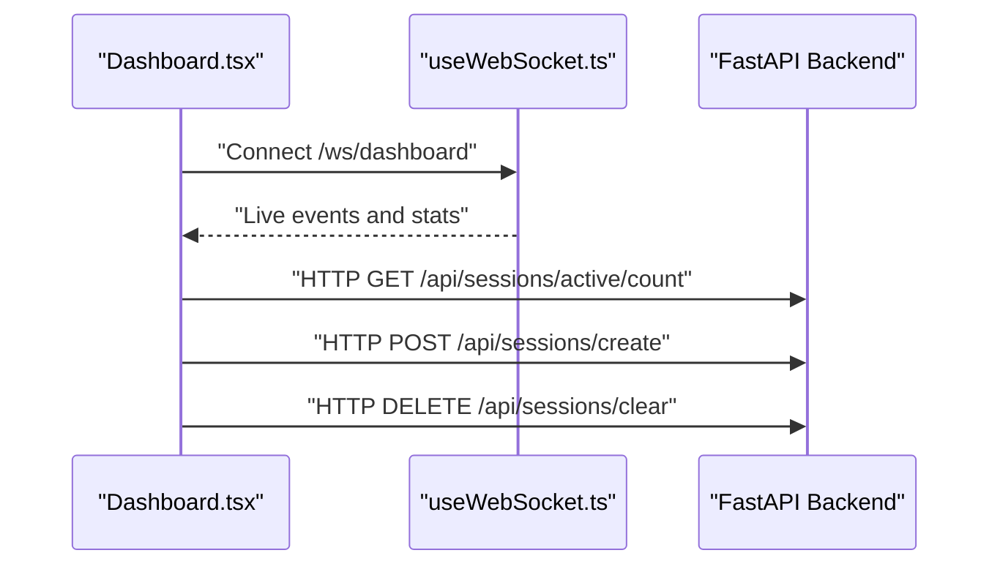
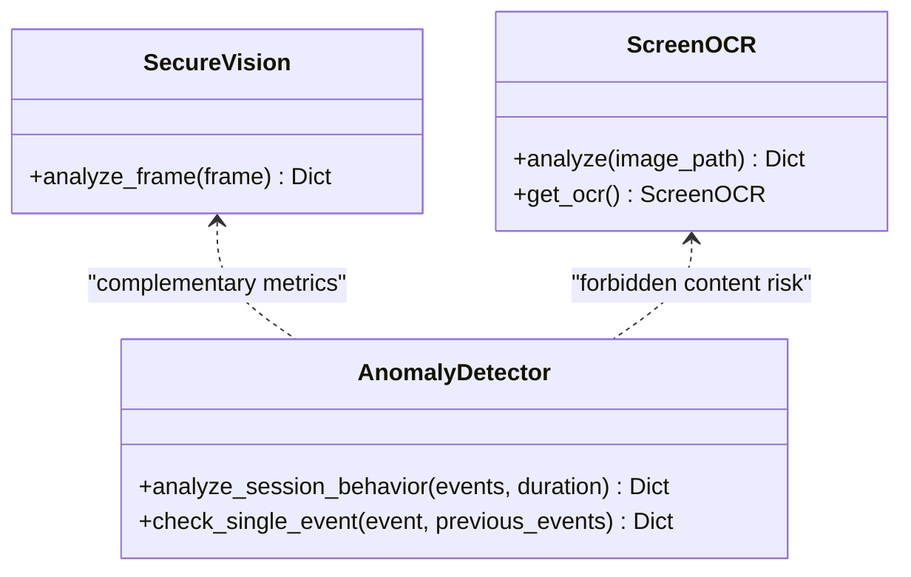
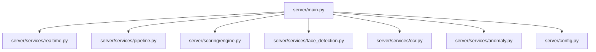

# Project Overview

<cite>
**Referenced Files in This Document**
- [README.md](file://README.md)
- [main.py](file://server/main.py)
- [realtime.py](file://server/services/realtime.py)
- [pipeline.py](file://server/services/pipeline.py)
- [engine.py](file://server/scoring/engine.py)
- [anomaly.py](file://server/services/anomaly.py)
- [face_detection.py](file://server/services/face_detection.py)
- [ocr.py](file://server/services/ocr.py)
- [config.py](file://server/config.py)
- [background.js](file://extension/background.js)
- [content.js](file://extension/content.js)
- [manifest.json](file://extension/manifest.json)
- [App.tsx](file://examguard-pro/src/App.tsx)
- [Dashboard.tsx](file://examguard-pro/src/components/Dashboard.tsx)
- [useWebSocket.ts](file://examguard-pro/src/hooks/useWebSocket.ts)
</cite>

## Table of Contents
1. [Introduction](#introduction)
2. [Project Structure](#project-structure)
3. [Core Components](#core-components)
4. [Architecture Overview](#architecture-overview)
5. [Detailed Component Analysis](#detailed-component-analysis)
6. [Dependency Analysis](#dependency-analysis)
7. [Performance Considerations](#performance-considerations)
8. [Troubleshooting Guide](#troubleshooting-guide)
9. [Conclusion](#conclusion)

## Introduction
ExamGuard Pro is an AI-powered exam proctoring system designed to ensure academic integrity through multi-modal real-time analysis. It monitors students during online exams using a combination of face detection, eye-gaze behavior tracking, OCR-based content monitoring, and NLP-based plagiarism detection. The system continuously evaluates session metrics to compute dynamic risk scoring and triggers alerts when suspicious activities are detected. The solution integrates a FastAPI backend, a React dashboard, a Chrome extension, and AI/ML components to deliver a comprehensive proctoring experience.

## Project Structure
The repository is organized into four primary areas:
- server: FastAPI backend with AI/ML services, WebSocket real-time monitoring, and scoring logic
- extension: Chrome Extension (Manifest V3) for session control, behavior monitoring, and data capture
- examguard-pro: React dashboard (Vite) for real-time monitoring, alerts, analytics, and administration
- transformer: A standalone Transformer implementation used for NLP analysis

**Diagram sources**
- [main.py:170-186](file://server/main.py#L170-L186)
- [realtime.py:102-138](file://server/services/realtime.py#L102-L138)
- [pipeline.py:9-33](file://server/services/pipeline.py#L9-L33)
- [engine.py:373-444](file://server/scoring/engine.py#L373-L444)
- [anomaly.py:11-22](file://server/services/anomaly.py#L11-L22)
- [face_detection.py:27-48](file://server/services/face_detection.py#L27-L48)
- [ocr.py:20-28](file://server/services/ocr.py#L20-L28)
- [config.py:1-205](file://server/config.py#L1-L205)
- [background.js:1-19](file://extension/background.js#L1-L19)
- [content.js:34-73](file://extension/content.js#L34-L73)
- [manifest.json:1-73](file://extension/manifest.json#L1-L73)
- [App.tsx:67-91](file://examguard-pro/src/App.tsx#L67-L91)
- [Dashboard.tsx:30-55](file://examguard-pro/src/components/Dashboard.tsx#L30-L55)
- [useWebSocket.ts:4-78](file://examguard-pro/src/hooks/useWebSocket.ts#L4-L78)

**Section sources**
- [README.md:29-46](file://README.md#L29-L46)
- [main.py:170-186](file://server/main.py#L170-L186)

## Core Components
- Real-time monitoring and WebSocket orchestration: Manages multi-room broadcasting, event history, and live alerts across dashboard, proctor, and student connections.
- Analysis pipeline: Processes events asynchronously, performs OCR/NLP analysis, and updates session risk scores.
- Scoring engine: Computes engagement, relevance, effort alignment, and risk metrics using weighted rules and anomaly detection.
- Chrome extension: Captures screenshots, webcam frames, clipboard text, and behavioral events; synchronizes with the backend via WebSocket.
- React dashboard: Provides real-time session monitoring, alert feeds, analytics charts, and administrative controls.

Key concepts:
- Risk scoring: Dynamic aggregation of weighted event impacts and anomaly detection results.
- Session monitoring: Continuous evaluation of tab switches, copy/paste, window blur, forbidden site visits, OCR violations, and device presence.
- Anomaly detection: Rule-based checks for excessive tab switching, copy rate, face absence, rapid event bursts, and forbidden access.

**Section sources**
- [realtime.py:102-138](file://server/services/realtime.py#L102-L138)
- [pipeline.py:74-96](file://server/services/pipeline.py#L74-L96)
- [engine.py:311-354](file://server/scoring/engine.py#L311-L354)
- [anomaly.py:23-42](file://server/services/anomaly.py#L23-L42)
- [background.js:22-50](file://extension/background.js#L22-L50)
- [Dashboard.tsx:30-55](file://examguard-pro/src/components/Dashboard.tsx#L30-L55)

## Architecture Overview
The system architecture connects the Chrome extension, backend, and dashboard through a layered design:
- Extension captures events and media, sends them to the backend via WebSocket and HTTP endpoints.
- Backend processes events through the analysis pipeline, computes risk scores, and broadcasts real-time updates.
- Dashboard subscribes to WebSocket channels to visualize live session metrics and alerts.

**Diagram sources**
- [background.js:140-160](file://extension/background.js#L140-L160)
- [main.py:393-473](file://server/main.py#L393-L473)
- [realtime.py:213-273](file://server/services/realtime.py#L213-L273)
- [pipeline.py:74-96](file://server/services/pipeline.py#L74-L96)
- [Dashboard.tsx:33-55](file://examguard-pro/src/components/Dashboard.tsx#L33-L55)

## Detailed Component Analysis

### Real-Time Monitoring and WebSocket Orchestration
The RealtimeMonitoringManager coordinates:
- Multi-room rooms per session for targeted event delivery
- Event broadcasting to dashboards, proctors, and students
- AI-driven callbacks for live frame analysis
- Heartbeat and connection statistics

**Diagram sources**
- [realtime.py:102-138](file://server/services/realtime.py#L102-L138)
- [realtime.py:81-100](file://server/services/realtime.py#L81-L100)

**Section sources**
- [realtime.py:102-138](file://server/services/realtime.py#L102-L138)
- [realtime.py:334-378](file://server/services/realtime.py#L334-L378)

### Analysis Pipeline and Dynamic Risk Assessment
The AnalysisPipeline processes events asynchronously and updates session risk:
- Text events trigger OCR and NLP analysis
- Navigation events categorize URLs and adjust risk
- Vision events (face absence, phone detection) increase risk
- Risk updates propagate to the dashboard and session records

**Diagram sources**
- [pipeline.py:74-96](file://server/services/pipeline.py#L74-L96)
- [pipeline.py:97-148](file://server/services/pipeline.py#L97-L148)
- [pipeline.py:149-224](file://server/services/pipeline.py#L149-L224)
- [pipeline.py:246-277](file://server/services/pipeline.py#L246-L277)
- [engine.py:311-354](file://server/scoring/engine.py#L311-L354)
- [realtime.py:334-378](file://server/services/realtime.py#L334-L378)

**Section sources**
- [pipeline.py:74-96](file://server/services/pipeline.py#L74-L96)
- [pipeline.py:278-304](file://server/services/pipeline.py#L278-L304)
- [engine.py:311-354](file://server/scoring/engine.py#L311-L354)

### Chrome Extension: Behavior Monitoring and Data Capture
The extension performs:
- Behavior monitoring (keystroke dynamics, copy/paste detection, mouse movement entropy)
- Visual overlays and iframe detection for cheating tools
- Webcam and screenshot capture scheduling
- Browsing behavior classification and effort/risk scoring
- Real-time communication with the backend via WebSocket

**Diagram sources**
- [content.js:332-343](file://extension/content.js#L332-L343)
- [background.js:52-166](file://extension/background.js#L52-L166)
- [background.js:751-800](file://extension/background.js#L751-L800)
- [main.py:393-473](file://server/main.py#L393-L473)
- [realtime.py:213-273](file://server/services/realtime.py#L213-L273)

**Section sources**
- [content.js:34-73](file://extension/content.js#L34-L73)
- [content.js:169-224](file://extension/content.js#L169-L224)
- [background.js:22-50](file://extension/background.js#L22-L50)
- [background.js:751-800](file://extension/background.js#L751-L800)

### React Dashboard: Real-Time Monitoring and Controls
The React dashboard:
- Subscribes to WebSocket channels for live updates
- Displays active sessions, alerts, and analytics
- Provides controls to create/manage sessions and clear data
- Integrates with the backend for session lifecycle operations

**Diagram sources**
- [Dashboard.tsx:33-55](file://examguard-pro/src/components/Dashboard.tsx#L33-L55)
- [useWebSocket.ts:18-78](file://examguard-pro/src/hooks/useWebSocket.ts#L18-L78)
- [main.py:228-237](file://server/main.py#L228-L237)

**Section sources**
- [Dashboard.tsx:30-55](file://examguard-pro/src/components/Dashboard.tsx#L30-L55)
- [useWebSocket.ts:4-78](file://examguard-pro/src/hooks/useWebSocket.ts#L4-L78)
- [App.tsx:67-91](file://examguard-pro/src/App.tsx#L67-L91)

### AI/ML Services: Face Detection, OCR, and Plagiarism Detection
- Face detection: MediaPipe-based presence verification with fallback to Haar cascades; detects multiple faces and prolonged absence.
- OCR: Tesseract-based text extraction and forbidden keyword detection; calculates risk impact.
- Anomaly detection: Rule-based scoring for tab switches, copy rate, face absence, rapid bursts, and forbidden access.

**Diagram sources**
- [face_detection.py:27-48](file://server/services/face_detection.py#L27-L48)
- [face_detection.py:50-109](file://server/services/face_detection.py#L50-L109)
- [ocr.py:20-28](file://server/services/ocr.py#L20-L28)
- [ocr.py:99-121](file://server/services/ocr.py#L99-L121)
- [anomaly.py:11-22](file://server/services/anomaly.py#L11-L22)
- [anomaly.py:23-42](file://server/services/anomaly.py#L23-L42)

**Section sources**
- [face_detection.py:27-48](file://server/services/face_detection.py#L27-L48)
- [ocr.py:20-28](file://server/services/ocr.py#L20-L28)
- [anomaly.py:23-42](file://server/services/anomaly.py#L23-L42)

## Dependency Analysis
The backend orchestrates AI/ML services and WebSocket real-time updates:
- Startup initializes AI engines and the analysis pipeline
- WebSocket endpoints connect dashboards, proctors, and students
- Pipeline consumes events and updates session risk
- Scoring engine aggregates metrics and applies thresholds

**Diagram sources**
- [main.py:110-132](file://server/main.py#L110-L132)
- [realtime.py:102-138](file://server/services/realtime.py#L102-L138)
- [pipeline.py:9-33](file://server/services/pipeline.py#L9-L33)
- [engine.py:373-444](file://server/scoring/engine.py#L373-L444)
- [face_detection.py:27-48](file://server/services/face_detection.py#L27-L48)
- [ocr.py:20-28](file://server/services/ocr.py#L20-L28)
- [anomaly.py:11-22](file://server/services/anomaly.py#L11-L22)
- [config.py:1-205](file://server/config.py#L1-L205)

**Section sources**
- [main.py:110-132](file://server/main.py#L110-L132)
- [config.py:164-196](file://server/config.py#L164-L196)

## Performance Considerations
- Asynchronous processing: The analysis pipeline runs in the background to avoid blocking WebSocket handlers.
- Efficient event routing: Room-based broadcasting minimizes unnecessary message propagation.
- Threshold-based anomaly detection: Reduces false positives by applying configurable thresholds.
- Resource constraints: MediaPipe fallback and Tesseract availability checks ensure graceful degradation.

## Troubleshooting Guide
Common issues and resolutions:
- WebSocket connectivity: The dashboard uses exponential backoff and heartbeat to maintain connections.
- Extension session start failures: Retries with bounded attempts and user feedback.
- OCR not available: Fallback mode disables OCR analysis with a warning.
- Risk score thresholds: Adjust thresholds in configuration to tune sensitivity.

**Section sources**
- [useWebSocket.ts:64-70](file://examguard-pro/src/hooks/useWebSocket.ts#L64-L70)
- [background.js:757-797](file://extension/background.js#L757-L797)
- [ocr.py:75-84](file://server/services/ocr.py#L75-L84)
- [config.py:191-196](file://server/config.py#L191-L196)

## Conclusion
ExamGuard Pro delivers a robust, multi-modal proctoring solution that combines real-time behavioral monitoring, AI/ML analysis, and dynamic risk scoring. Its modular architecture enables scalable deployment across diverse environments, while the React dashboard and Chrome extension provide intuitive controls and comprehensive visibility for administrators and proctors.