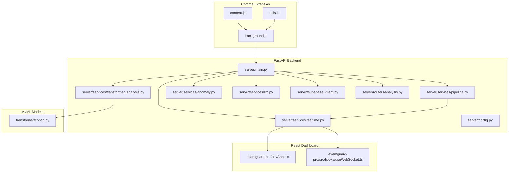
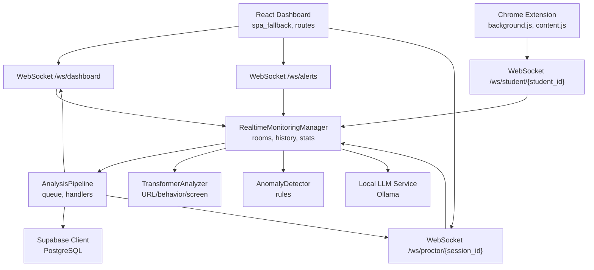
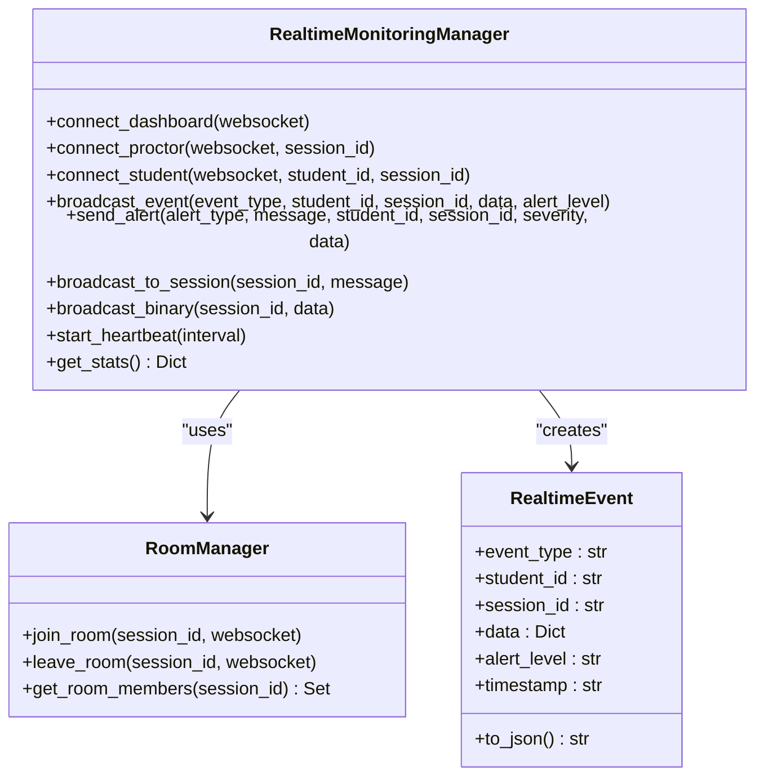
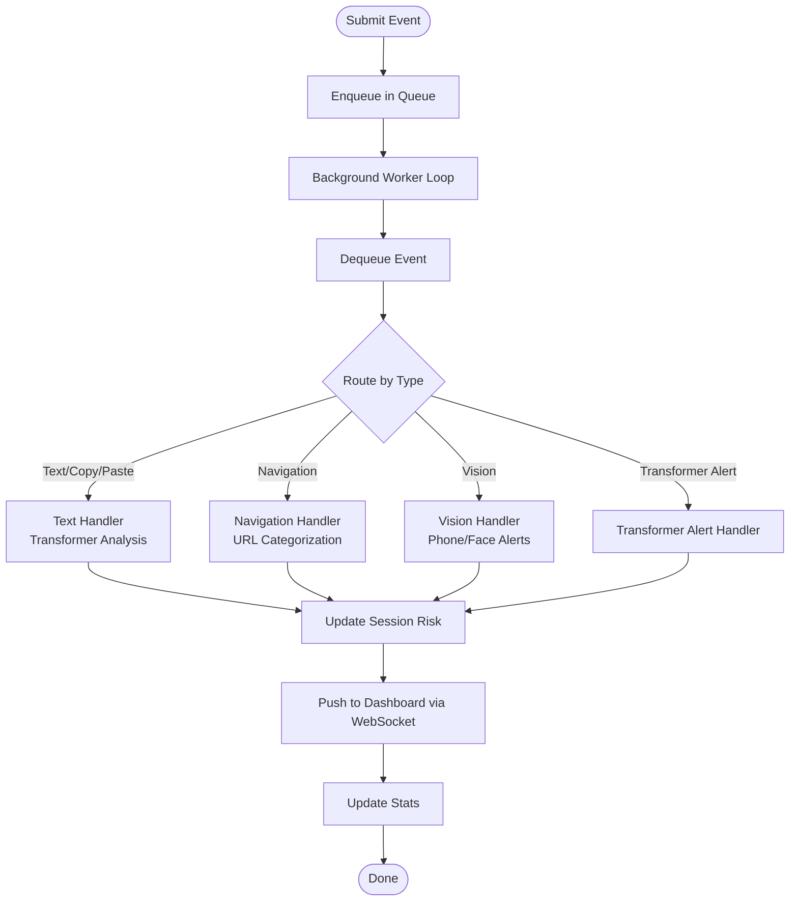
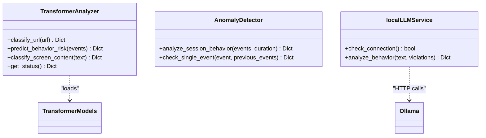
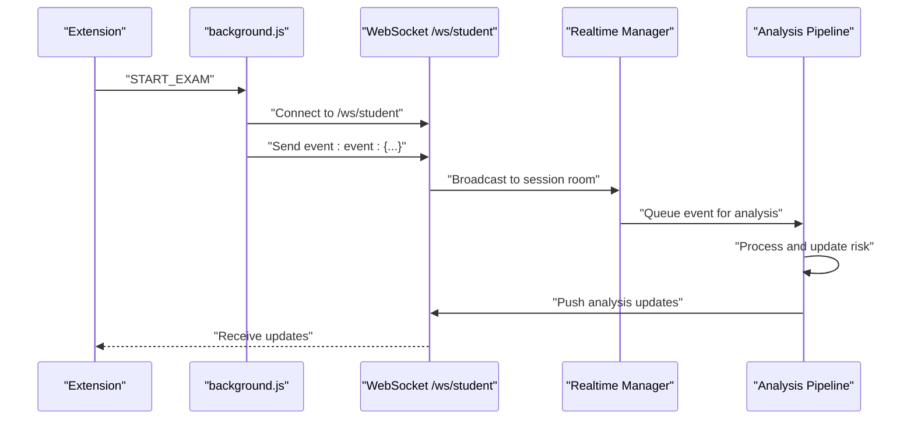
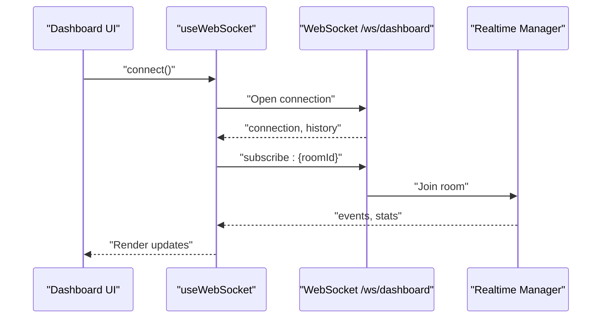
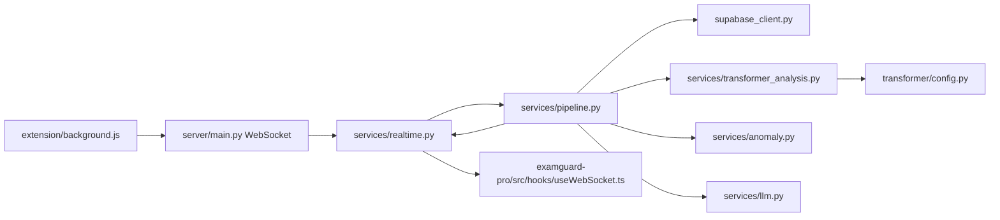

# System Architecture

<cite>
**Referenced Files in This Document**
- [server/main.py](file://server/main.py)
- [server/config.py](file://server/config.py)
- [server/services/realtime.py](file://server/services/realtime.py)
- [server/services/pipeline.py](file://server/services/pipeline.py)
- [server/services/transformer_analysis.py](file://server/services/transformer_analysis.py)
- [server/services/anomaly.py](file://server/services/anomaly.py)
- [server/services/llm.py](file://server/services/llm.py)
- [server/routers/analysis.py](file://server/routers/analysis.py)
- [server/supabase_client.py](file://server/supabase_client.py)
- [extension/background.js](file://extension/background.js)
- [extension/content.js](file://extension/content.js)
- [extension/utils.js](file://extension/utils.js)
- [examguard-pro/src/App.tsx](file://examguard-pro/src/App.tsx)
- [examguard-pro/src/hooks/useWebSocket.ts](file://examguard-pro/src/hooks/useWebSocket.ts)
- [transformer/config.py](file://transformer/config.py)
</cite>

## Table of Contents
1. [Introduction](#introduction)
2. [Project Structure](#project-structure)
3. [Core Components](#core-components)
4. [Architecture Overview](#architecture-overview)
5. [Detailed Component Analysis](#detailed-component-analysis)
6. [Dependency Analysis](#dependency-analysis)
7. [Performance Considerations](#performance-considerations)
8. [Troubleshooting Guide](#troubleshooting-guide)
9. [Conclusion](#conclusion)
10. [Appendices](#appendices)

## Introduction
ExamGuard Pro is a multi-layered exam proctoring system integrating a React dashboard, a Chrome extension, a FastAPI backend, and AI/ML services. It captures user events in the browser, streams media and telemetry to the backend via WebSocket, runs real-time analysis through a pipeline, and visualizes results in the dashboard. The system emphasizes real-time monitoring, scalable WebSocket broadcasting, and modular AI services.

## Project Structure
The system is organized into four primary layers:
- Chrome Extension: Captures user behavior, screenshots, webcam frames, and browser telemetry; relays events to the backend via WebSocket and HTTP.
- FastAPI Backend: Exposes REST APIs, manages WebSocket connections, orchestrates real-time monitoring, and coordinates AI/ML analysis.
- AI/ML Services: Transformer-based classifiers, anomaly detectors, object detectors, and optional local LLM reasoning.
- React Dashboard: Provides real-time monitoring, alerts, analytics, and session insights.

**Diagram sources**
- [server/main.py:1-647](file://server/main.py#L1-L647)
- [server/services/realtime.py:1-642](file://server/services/realtime.py#L1-L642)
- [server/services/pipeline.py:1-342](file://server/services/pipeline.py#L1-L342)
- [server/services/transformer_analysis.py:1-549](file://server/services/transformer_analysis.py#L1-L549)
- [server/services/anomaly.py:1-221](file://server/services/anomaly.py#L1-L221)
- [server/services/llm.py:1-78](file://server/services/llm.py#L1-L78)
- [server/routers/analysis.py:1-418](file://server/routers/analysis.py#L1-L418)
- [server/config.py:1-205](file://server/config.py#L1-L205)
- [server/supabase_client.py:1-22](file://server/supabase_client.py#L1-L22)
- [extension/background.js:1-1998](file://extension/background.js#L1-L1998)
- [extension/content.js:1-473](file://extension/content.js#L1-L473)
- [extension/utils.js:1-35](file://extension/utils.js#L1-L35)
- [examguard-pro/src/App.tsx:1-92](file://examguard-pro/src/App.tsx#L1-L92)
- [examguard-pro/src/hooks/useWebSocket.ts:1-110](file://examguard-pro/src/hooks/useWebSocket.ts#L1-L110)
- [transformer/config.py:1-75](file://transformer/config.py#L1-L75)

**Section sources**
- [server/main.py:1-647](file://server/main.py#L1-L647)
- [server/config.py:1-205](file://server/config.py#L1-L205)

## Core Components
- Real-time Monitoring Manager: Central WebSocket hub managing dashboard, proctor, and student connections; supports room-based broadcasting, binary video streaming, and event history.
- Analysis Pipeline: Asynchronous queue-driven processor that routes events to specialized handlers, updates session risk, and pushes updates to the dashboard.
- AI/ML Services:
  - Transformer Analyzer: URL classification, behavioral anomaly detection, and screen content classification.
  - Anomaly Detector: Rule-based anomaly detection for session behavior.
  - Local LLM Service: Optional Ollama-backed reasoning for behavior analysis.
- Chrome Extension: Behavior monitoring, clipboard/text capture, webcam capture, and WebSocket relay to backend.
- React Dashboard: SPA with WebSocket-based real-time updates and routing.

**Section sources**
- [server/services/realtime.py:102-642](file://server/services/realtime.py#L102-L642)
- [server/services/pipeline.py:9-342](file://server/services/pipeline.py#L9-L342)
- [server/services/transformer_analysis.py:178-549](file://server/services/transformer_analysis.py#L178-L549)
- [server/services/anomaly.py:11-221](file://server/services/anomaly.py#L11-L221)
- [server/services/llm.py:10-78](file://server/services/llm.py#L10-L78)
- [extension/background.js:1-1998](file://extension/background.js#L1-L1998)
- [examguard-pro/src/App.tsx:1-92](file://examguard-pro/src/App.tsx#L1-L92)

## Architecture Overview
The system follows a layered architecture:
- Presentation Layer: React dashboard with WebSocket-driven UI updates.
- Integration Layer: FastAPI REST and WebSocket endpoints.
- Domain Layer: Real-time monitoring, analysis pipeline, and AI/ML services.
- Persistence Layer: Supabase-managed PostgreSQL for session, analysis, and student data.
- External Integrations: Optional local LLM via Ollama and transformer models.

**Diagram sources**
- [server/main.py:248-501](file://server/main.py#L248-L501)
- [server/services/realtime.py:102-642](file://server/services/realtime.py#L102-L642)
- [server/services/pipeline.py:9-342](file://server/services/pipeline.py#L9-L342)
- [server/supabase_client.py:19-22](file://server/supabase_client.py#L19-L22)
- [server/services/transformer_analysis.py:178-549](file://server/services/transformer_analysis.py#L178-L549)
- [server/services/anomaly.py:11-221](file://server/services/anomaly.py#L11-L221)
- [server/services/llm.py:10-78](file://server/services/llm.py#L10-L78)

## Detailed Component Analysis

### Real-time Monitoring Manager
The RealtimeMonitoringManager centralizes WebSocket connections and event broadcasting:
- Manages dashboard, proctor, and student connections.
- Supports room-based subscriptions and binary video streaming.
- Maintains event history and statistics.
- Bridges AI callbacks to live streams for real-time analysis.

**Diagram sources**
- [server/services/realtime.py:102-642](file://server/services/realtime.py#L102-L642)

**Section sources**
- [server/services/realtime.py:102-642](file://server/services/realtime.py#L102-L642)

### Analysis Pipeline
The AnalysisPipeline processes events asynchronously:
- Starts/stops a background worker.
- Routes events to handlers (text, navigation, vision, transformer alerts).
- Updates session risk and pushes updates to the dashboard.

**Diagram sources**
- [server/services/pipeline.py:55-342](file://server/services/pipeline.py#L55-L342)

**Section sources**
- [server/services/pipeline.py:9-342](file://server/services/pipeline.py#L9-L342)

### AI/ML Services
- Transformer Analyzer: Loads URL, behavioral, and screen content models; provides classification and risk scores.
- Anomaly Detector: Rule-based anomaly detection for session behavior.
- Local LLM Service: Optional Ollama integration for behavior reasoning.

**Diagram sources**
- [server/services/transformer_analysis.py:178-549](file://server/services/transformer_analysis.py#L178-L549)
- [server/services/anomaly.py:11-221](file://server/services/anomaly.py#L11-L221)
- [server/services/llm.py:10-78](file://server/services/llm.py#L10-L78)

**Section sources**
- [server/services/transformer_analysis.py:178-549](file://server/services/transformer_analysis.py#L178-L549)
- [server/services/anomaly.py:11-221](file://server/services/anomaly.py#L11-L221)
- [server/services/llm.py:10-78](file://server/services/llm.py#L10-L78)

### Chrome Extension Layer
The extension monitors behavior, captures screenshots/webcam frames, and relays data to the backend:
- Behavior monitoring: keystroke dynamics, mouse movement, clipboard events, audio anomaly detection.
- Capture and upload: DOM snapshots, webcam frames, periodic summaries.
- WebSocket relay: binary video chunks and event messages to the backend.

**Diagram sources**
- [extension/background.js:52-166](file://extension/background.js#L52-L166)
- [server/main.py:393-474](file://server/main.py#L393-L474)
- [server/services/realtime.py:334-416](file://server/services/realtime.py#L334-L416)
- [server/services/pipeline.py:74-148](file://server/services/pipeline.py#L74-L148)

**Section sources**
- [extension/background.js:1-1998](file://extension/background.js#L1-L1998)
- [extension/content.js:1-473](file://extension/content.js#L1-L473)
- [extension/utils.js:1-35](file://extension/utils.js#L1-L35)

### React Dashboard Frontend
The React SPA integrates routing, authentication, and WebSocket-driven real-time updates:
- Routing with protected routes and sidebar layout.
- WebSocket hook for dashboard connections and subscriptions.
- Real-time event rendering and statistics.

**Diagram sources**
- [examguard-pro/src/App.tsx:1-92](file://examguard-pro/src/App.tsx#L1-L92)
- [examguard-pro/src/hooks/useWebSocket.ts:18-109](file://examguard-pro/src/hooks/useWebSocket.ts#L18-L109)
- [server/main.py:274-342](file://server/main.py#L274-L342)
- [server/services/realtime.py:213-274](file://server/services/realtime.py#L213-L274)

**Section sources**
- [examguard-pro/src/App.tsx:1-92](file://examguard-pro/src/App.tsx#L1-L92)
- [examguard-pro/src/hooks/useWebSocket.ts:1-110](file://examguard-pro/src/hooks/useWebSocket.ts#L1-L110)

## Dependency Analysis
- Real-time Monitoring Manager depends on WebSocket connections and the Analysis Pipeline for event propagation.
- Analysis Pipeline depends on Supabase for database operations and Realtime Manager for broadcasting updates.
- Transformer Analyzer dynamically loads models from the transformer module and uses tokenizers.
- Chrome Extension depends on background script for orchestration and WebSocket for real-time communication.
- React Dashboard depends on WebSocket hook for connectivity and SPA fallback for routing.

**Diagram sources**
- [server/main.py:248-501](file://server/main.py#L248-L501)
- [server/services/realtime.py:102-642](file://server/services/realtime.py#L102-L642)
- [server/services/pipeline.py:9-342](file://server/services/pipeline.py#L9-L342)
- [server/supabase_client.py:19-22](file://server/supabase_client.py#L19-L22)
- [server/services/transformer_analysis.py:178-549](file://server/services/transformer_analysis.py#L178-L549)
- [transformer/config.py:1-75](file://transformer/config.py#L1-L75)
- [server/services/anomaly.py:11-221](file://server/services/anomaly.py#L11-L221)
- [server/services/llm.py:10-78](file://server/services/llm.py#L10-L78)
- [extension/background.js:1-1998](file://extension/background.js#L1-1998)
- [examguard-pro/src/hooks/useWebSocket.ts:1-110](file://examguard-pro/src/hooks/useWebSocket.ts#L1-L110)

**Section sources**
- [server/main.py:1-647](file://server/main.py#L1-L647)
- [server/services/realtime.py:102-642](file://server/services/realtime.py#L102-L642)
- [server/services/pipeline.py:9-342](file://server/services/pipeline.py#L9-L342)
- [server/services/transformer_analysis.py:178-549](file://server/services/transformer_analysis.py#L178-L549)
- [server/services/anomaly.py:11-221](file://server/services/anomaly.py#L11-L221)
- [server/services/llm.py:10-78](file://server/services/llm.py#L10-L78)
- [server/supabase_client.py:19-22](file://server/supabase_client.py#L19-L22)
- [extension/background.js:1-1998](file://extension/background.js#L1-L1998)
- [examguard-pro/src/hooks/useWebSocket.ts:1-110](file://examguard-pro/src/hooks/useWebSocket.ts#L1-L110)
- [transformer/config.py:1-75](file://transformer/config.py#L1-L75)

## Performance Considerations
- WebSocket Binary Streaming: Efficiently forwards live webcam chunks to dashboards and proctors; ensure client-side buffering and backpressure handling.
- Queue-based Pipeline: Asynchronous processing prevents blocking; tune queue sizes and worker concurrency for throughput.
- Model Loading: Transformer models are loaded on-demand; consider warm-up strategies and GPU utilization for inference latency.
- Supabase Operations: Batch updates and judicious use of indexes improve write/read performance.
- CORS and Middleware: Wildcard origins simplify development but should be restricted in production environments.

[No sources needed since this section provides general guidance]

## Troubleshooting Guide
- WebSocket Disconnections: The dashboard hook implements exponential backoff; verify server heartbeat and room subscriptions.
- Extension Context Issues: The extension handles "context invalidated" errors and stops monitoring gracefully.
- AI/ML Availability: Transformer analyzer and local LLM availability are checked before use; fallbacks are applied when unavailable.
- Supabase Credentials: Ensure environment variables are configured; otherwise, the Supabase client initialization logs warnings.

**Section sources**
- [examguard-pro/src/hooks/useWebSocket.ts:18-109](file://examguard-pro/src/hooks/useWebSocket.ts#L18-L109)
- [extension/background.js:52-166](file://extension/background.js#L52-L166)
- [server/services/transformer_analysis.py:525-549](file://server/services/transformer_analysis.py#L525-L549)
- [server/services/llm.py:16-33](file://server/services/llm.py#L16-L33)
- [server/supabase_client.py:12-17](file://server/supabase_client.py#L12-L17)

## Conclusion
ExamGuard Pro integrates a Chrome extension, FastAPI backend, and AI/ML services to deliver real-time proctoring. The Realtime Monitoring Manager and Analysis Pipeline form the core of event processing, while the React dashboard provides responsive visualization. Design patterns such as Singleton for AI services, Observer-like WebSocket updates, and factory-style service retrieval enable modularity and scalability. Security boundaries include CORS configuration, environment-based Supabase credentials, and optional local LLM integration.

[No sources needed since this section summarizes without analyzing specific files]

## Appendices
- Data Persistence: Supabase-managed PostgreSQL tables for sessions, analysis results, and students.
- Configuration: Environment-driven settings for database, CORS, capture intervals, and risk thresholds.
- Transformer Models: Configurable architectures and checkpoints for URL, behavior, and screen content classification.

**Section sources**
- [server/config.py:16-205](file://server/config.py#L16-L205)
- [transformer/config.py:10-75](file://transformer/config.py#L10-L75)
- [server/supabase_client.py:19-22](file://server/supabase_client.py#L19-L22)