# Technology Stack

<cite>
**Referenced Files in This Document**
- [Dockerfile](file://Dockerfile)
- [render.yaml](file://render.yaml)
- [server/main.py](file://server/main.py)
- [server/config.py](file://server/config.py)
- [server/requirements.txt](file://server/requirements.txt)
- [server/supabase_client.py](file://server/supabase_client.py)
- [server/services/face_detection.py](file://server/services/face_detection.py)
- [server/services/object_detection.py](file://server/services/object_detection.py)
- [server/services/ocr.py](file://server/services/ocr.py)
- [server/services/transformer_analysis.py](file://server/services/transformer_analysis.py)
- [transformer/requirements.txt](file://transformer/requirements.txt)
- [transformer/config.py](file://transformer/config.py)
- [examguard-pro/package.json](file://examguard-pro/package.json)
- [examguard-pro/src/main.tsx](file://examguard-pro/src/main.tsx)
- [extension/manifest.json](file://extension/manifest.json)
- [extension/background.js](file://extension/background.js)
- [extension/content.js](file://extension/content.js)
- [extension/capture.js](file://extension/capture.js)
</cite>

## Table of Contents
1. [Introduction](#introduction)
2. [Project Structure](#project-structure)
3. [Core Components](#core-components)
4. [Architecture Overview](#architecture-overview)
5. [Detailed Component Analysis](#detailed-component-analysis)
6. [Dependency Analysis](#dependency-analysis)
7. [Performance Considerations](#performance-considerations)
8. [Troubleshooting Guide](#troubleshooting-guide)
9. [Conclusion](#conclusion)

## Introduction
This document provides a comprehensive technology stack overview for ExamGuard Pro. It covers backend technologies (FastAPI, Python 3.10+, Supabase/PostgreSQL, asyncpg), frontend technologies (React 19, Vite, Tailwind CSS, Lucide Icons), AI/ML technologies (MediaPipe, YOLOv8, Tesseract OCR, Sentence-transformers-style Transformers), Chrome extension technologies (Manifest V3, WebRTC, background scripts), and deployment technologies (Docker, Render). It also includes version compatibility information and rationale for technology choices.

## Project Structure
The repository is organized into modular components:
- server: FastAPI backend with routers, services, and AI/ML modules
- examguard-pro: React 19 dashboard built with Vite
- extension: Chrome extension (Manifest V3) with background and content scripts
- transformer: Custom Transformer models and training utilities
- deployment: Docker and Render configuration

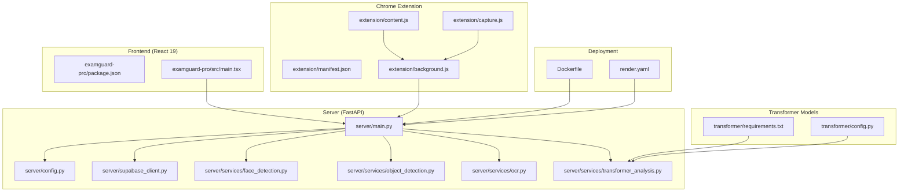

**Diagram sources**
- [server/main.py:1-647](file://server/main.py#L1-L647)
- [server/config.py:1-205](file://server/config.py#L1-L205)
- [server/supabase_client.py:1-22](file://server/supabase_client.py#L1-L22)
- [server/services/face_detection.py:1-109](file://server/services/face_detection.py#L1-L109)
- [server/services/object_detection.py:1-147](file://server/services/object_detection.py#L1-L147)
- [server/services/ocr.py:1-121](file://server/services/ocr.py#L1-L121)
- [server/services/transformer_analysis.py:1-549](file://server/services/transformer_analysis.py#L1-L549)
- [transformer/requirements.txt:1-8](file://transformer/requirements.txt#L1-L8)
- [transformer/config.py:1-75](file://transformer/config.py#L1-L75)
- [examguard-pro/package.json:1-40](file://examguard-pro/package.json#L1-L40)
- [examguard-pro/src/main.tsx:1-11](file://examguard-pro/src/main.tsx#L1-L11)
- [extension/manifest.json:1-73](file://extension/manifest.json#L1-L73)
- [extension/background.js:1-1998](file://extension/background.js#L1-L1998)
- [extension/content.js:1-473](file://extension/content.js#L1-L473)
- [extension/capture.js:1-352](file://extension/capture.js#L1-L352)
- [Dockerfile:1-55](file://Dockerfile#L1-L55)
- [render.yaml:1-36](file://render.yaml#L1-L36)

**Section sources**
- [Dockerfile:1-55](file://Dockerfile#L1-L55)
- [render.yaml:1-36](file://render.yaml#L1-L36)
- [server/main.py:1-647](file://server/main.py#L1-L647)
- [server/config.py:1-205](file://server/config.py#L1-L205)
- [server/requirements.txt:1-34](file://server/requirements.txt#L1-L34)
- [server/supabase_client.py:1-22](file://server/supabase_client.py#L1-L22)
- [server/services/face_detection.py:1-109](file://server/services/face_detection.py#L1-L109)
- [server/services/object_detection.py:1-147](file://server/services/object_detection.py#L1-L147)
- [server/services/ocr.py:1-121](file://server/services/ocr.py#L1-L121)
- [server/services/transformer_analysis.py:1-549](file://server/services/transformer_analysis.py#L1-L549)
- [transformer/requirements.txt:1-8](file://transformer/requirements.txt#L1-L8)
- [transformer/config.py:1-75](file://transformer/config.py#L1-L75)
- [examguard-pro/package.json:1-40](file://examguard-pro/package.json#L1-L40)
- [examguard-pro/src/main.tsx:1-11](file://examguard-pro/src/main.tsx#L1-L11)
- [extension/manifest.json:1-73](file://extension/manifest.json#L1-L73)
- [extension/background.js:1-1998](file://extension/background.js#L1-L1998)
- [extension/content.js:1-473](file://extension/content.js#L1-L473)
- [extension/capture.js:1-352](file://extension/capture.js#L1-L352)

## Core Components
- Backend (FastAPI): Provides REST APIs, WebSocket endpoints, real-time monitoring, and integrates AI/ML services. It mounts the React build and serves it as a SPA.
- Frontend (React 19): Dashboard UI with routing, charts, and UI components.
- Chrome Extension (Manifest V3): Monitors behavior, captures screen/webcam, performs WebRTC signaling, and communicates with the backend via WebSocket and HTTP.
- AI/ML Services: Face detection (MediaPipe), object detection (YOLOv8), OCR (Tesseract), and custom Transformer models for URL classification, behavioral anomaly detection, and screen content classification.
- Database: Supabase-managed PostgreSQL with asyncpg for Python connections.
- Deployment: Docker multi-stage build and Render configuration.

**Section sources**
- [server/main.py:170-186](file://server/main.py#L170-L186)
- [server/config.py:16-42](file://server/config.py#L16-L42)
- [server/requirements.txt:1-34](file://server/requirements.txt#L1-L34)
- [server/services/face_detection.py:27-109](file://server/services/face_detection.py#L27-L109)
- [server/services/object_detection.py:16-147](file://server/services/object_detection.py#L16-L147)
- [server/services/ocr.py:20-121](file://server/services/ocr.py#L20-L121)
- [server/services/transformer_analysis.py:178-549](file://server/services/transformer_analysis.py#L178-L549)
- [transformer/requirements.txt:1-8](file://transformer/requirements.txt#L1-L8)
- [transformer/config.py:10-75](file://transformer/config.py#L10-L75)
- [examguard-pro/package.json:13-28](file://examguard-pro/package.json#L13-L28)
- [extension/manifest.json:1-73](file://extension/manifest.json#L1-L73)
- [Dockerfile:1-55](file://Dockerfile#L1-L55)
- [render.yaml:1-36](file://render.yaml#L1-L36)

## Architecture Overview
The system comprises three primary layers:
- Frontend: React SPA served by the backend
- Backend: FastAPI with WebSocket real-time channels and REST endpoints
- Extension: Chrome extension performing client-side monitoring and live streaming

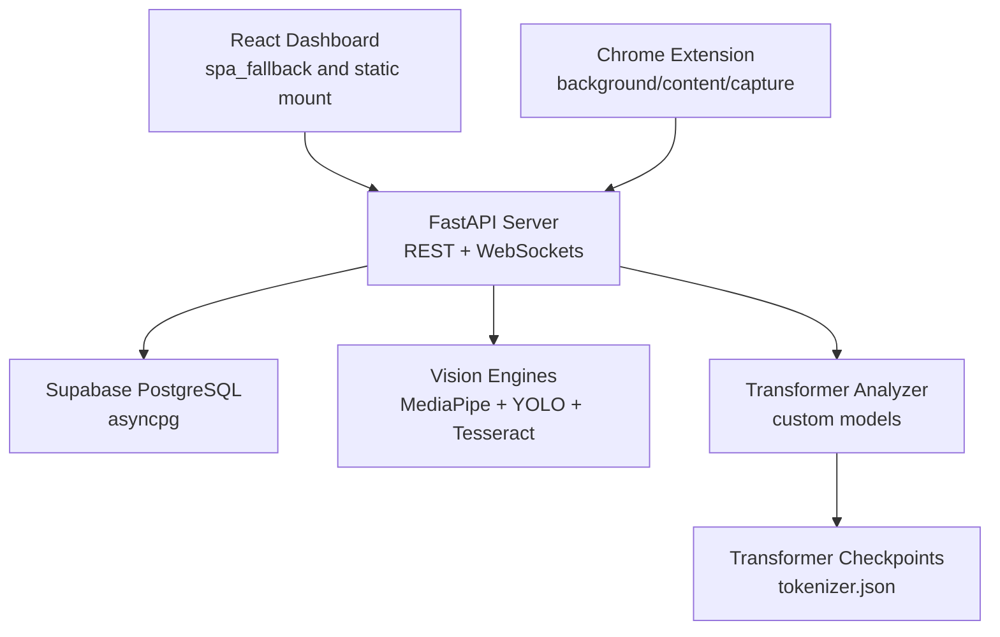

**Diagram sources**
- [server/main.py:510-634](file://server/main.py#L510-L634)
- [server/config.py:16-42](file://server/config.py#L16-L42)
- [server/services/face_detection.py:27-109](file://server/services/face_detection.py#L27-L109)
- [server/services/object_detection.py:16-147](file://server/services/object_detection.py#L16-L147)
- [server/services/ocr.py:20-121](file://server/services/ocr.py#L20-L121)
- [server/services/transformer_analysis.py:178-549](file://server/services/transformer_analysis.py#L178-L549)
- [transformer/config.py:10-75](file://transformer/config.py#L10-L75)

## Detailed Component Analysis

### Backend (FastAPI)
- Application lifecycle manages vision engines, real-time manager, and analysis pipeline.
- CORS middleware configured for broad compatibility during development and extension support.
- WebSocket endpoints for dashboard, proctor, and student communication.
- SPA fallback for React Router compatibility.
- Health and stats endpoints expose pipeline and AI module status.

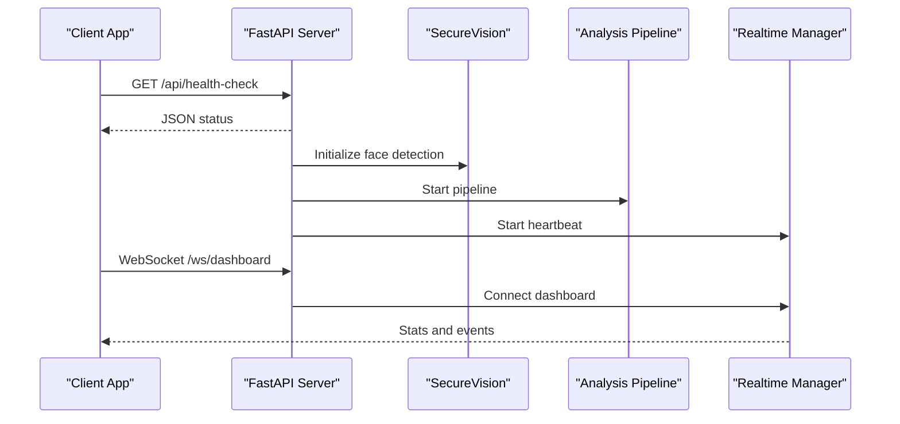

**Diagram sources**
- [server/main.py:109-165](file://server/main.py#L109-L165)
- [server/main.py:228-237](file://server/main.py#L228-L237)
- [server/main.py:274-342](file://server/main.py#L274-L342)
- [server/main.py:548-584](file://server/main.py#L548-L584)

**Section sources**
- [server/main.py:109-165](file://server/main.py#L109-L165)
- [server/main.py:192-222](file://server/main.py#L192-L222)
- [server/main.py:248-474](file://server/main.py#L248-L474)
- [server/main.py:548-584](file://server/main.py#L548-L584)

### Database and ORM (Supabase/asyncpg)
- Database URL resolution supports DATABASE_URL, Supabase config, or SQLite fallback.
- Environment-driven configuration for host, port, user, and password.
- Supabase client initialization and retrieval utility.

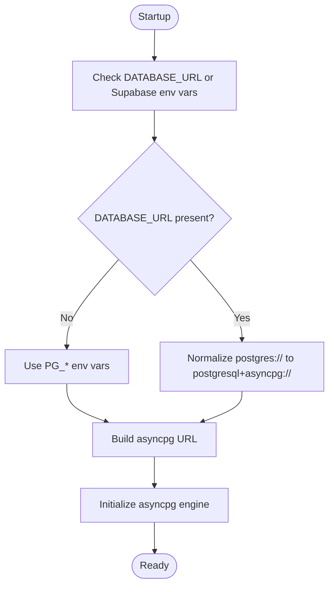

**Diagram sources**
- [server/config.py:29-42](file://server/config.py#L29-L42)
- [server/supabase_client.py:10-21](file://server/supabase_client.py#L10-L21)

**Section sources**
- [server/config.py:16-42](file://server/config.py#L16-L42)
- [server/supabase_client.py:1-22](file://server/supabase_client.py#L1-L22)

### AI/ML Services

#### Face Detection (MediaPipe)
- Uses MediaPipe Tasks API with a downloaded face landmarker model if available; falls back to Haar cascades.
- Detects multiple faces, absent face violations, and pose-related anomalies.

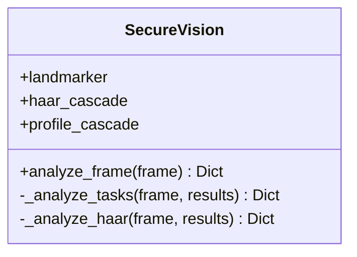

**Diagram sources**
- [server/services/face_detection.py:27-109](file://server/services/face_detection.py#L27-L109)

**Section sources**
- [server/services/face_detection.py:1-109](file://server/services/face_detection.py#L1-L109)

#### Object Detection (YOLOv8)
- Loads a YOLO model and detects forbidden objects (phone, book, laptop, watch, remote, TV, mouse, keyboard).
- Applies CLAHE for low-light enhancement and throttles processing for stability.

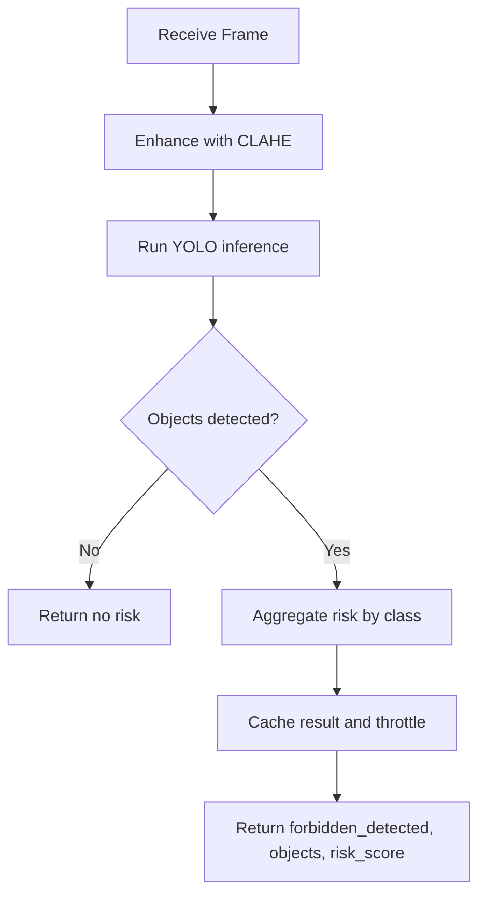

**Diagram sources**
- [server/services/object_detection.py:65-137](file://server/services/object_detection.py#L65-L137)

**Section sources**
- [server/services/object_detection.py:1-147](file://server/services/object_detection.py#L1-L147)

#### OCR (Tesseract)
- Extracts text from screenshots and flags forbidden keywords.
- Provides a fallback when Tesseract is unavailable.

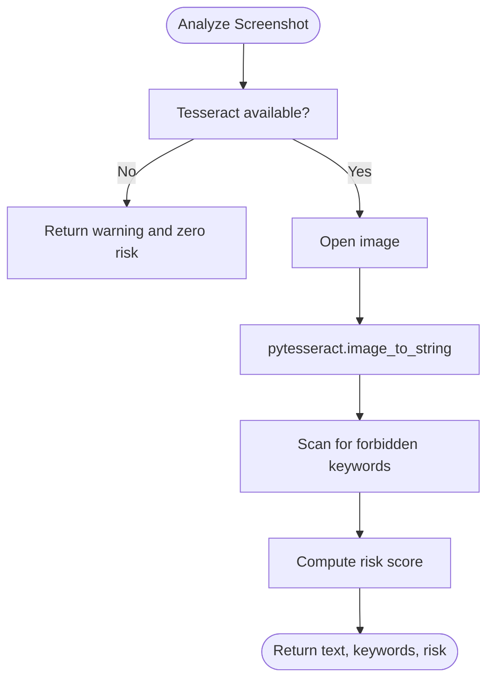

**Diagram sources**
- [server/services/ocr.py:29-84](file://server/services/ocr.py#L29-L84)

**Section sources**
- [server/services/ocr.py:1-121](file://server/services/ocr.py#L1-L121)

#### Transformer-based Analysis
- Loads three models: URL classifier, behavioral anomaly detector, and screen content classifier.
- Tokenizers are loaded from checkpoint directories; models run on GPU if available.
- Provides risk scores mapped to categories.

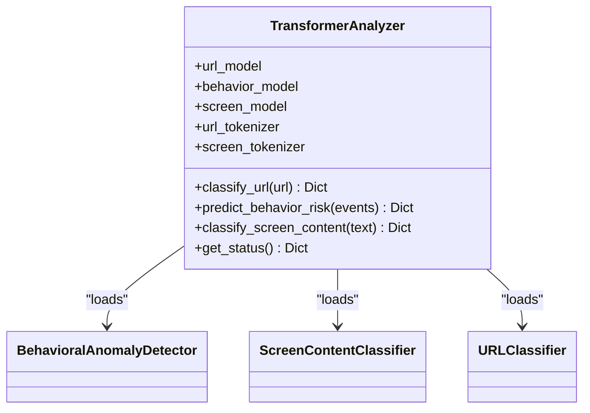

**Diagram sources**
- [server/services/transformer_analysis.py:178-549](file://server/services/transformer_analysis.py#L178-L549)

**Section sources**
- [server/services/transformer_analysis.py:1-549](file://server/services/transformer_analysis.py#L1-L549)
- [transformer/requirements.txt:1-8](file://transformer/requirements.txt#L1-L8)
- [transformer/config.py:10-75](file://transformer/config.py#L10-L75)

### Chrome Extension (Manifest V3)
- Background script manages session lifecycle, retries, WebRTC signaling, and periodic sync.
- Content script monitors behavior, detects overlays/iframes, and sends alerts.
- Capture script handles screen/webcam capture, MediaRecorder streaming, and WebRTC offer/answer.

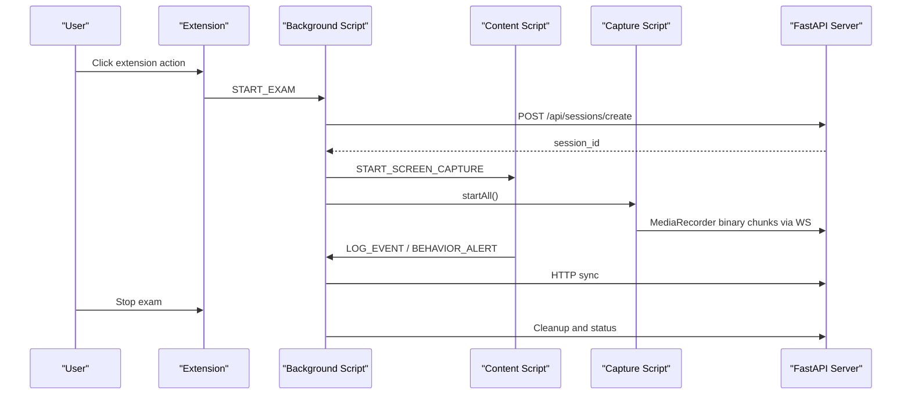

**Diagram sources**
- [extension/background.js:683-747](file://extension/background.js#L683-L747)
- [extension/content.js:367-381](file://extension/content.js#L367-L381)
- [extension/capture.js:175-203](file://extension/capture.js#L175-L203)
- [server/main.py:393-474](file://server/main.py#L393-L474)

**Section sources**
- [extension/manifest.json:1-73](file://extension/manifest.json#L1-L73)
- [extension/background.js:1-1998](file://extension/background.js#L1-L1998)
- [extension/content.js:1-473](file://extension/content.js#L1-L473)
- [extension/capture.js:1-352](file://extension/capture.js#L1-L352)

### Frontend (React 19 + Vite)
- React 19 with strict mode and root rendering.
- Vite build pipeline with TypeScript and Tailwind CSS integration.
- UI components under src/components and routing via react-router-dom.

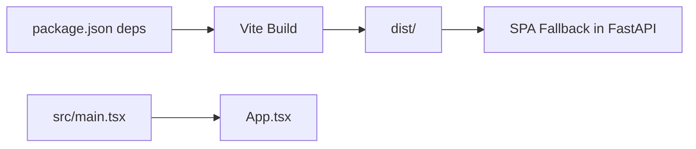

**Diagram sources**
- [examguard-pro/src/main.tsx:1-11](file://examguard-pro/src/main.tsx#L1-L11)
- [examguard-pro/package.json:1-40](file://examguard-pro/package.json#L1-L40)
- [server/main.py:611-634](file://server/main.py#L611-L634)

**Section sources**
- [examguard-pro/src/main.tsx:1-11](file://examguard-pro/src/main.tsx#L1-L11)
- [examguard-pro/package.json:1-40](file://examguard-pro/package.json#L1-L40)

### Deployment (Docker + Render)
- Docker multi-stage build:
  - Node stage builds the React frontend
  - Python stage installs system dependencies (Tesseract, FFmpeg), Python packages, and copies built frontend assets
  - Uvicorn runs the FastAPI app
- Render configuration sets Python 3.11, environment variables for Supabase and PostgreSQL, and start/build commands.

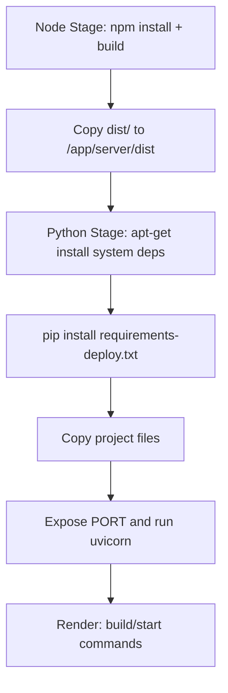

**Diagram sources**
- [Dockerfile:1-55](file://Dockerfile#L1-L55)
- [render.yaml:1-36](file://render.yaml#L1-L36)

**Section sources**
- [Dockerfile:1-55](file://Dockerfile#L1-L55)
- [render.yaml:1-36](file://render.yaml#L1-L36)

## Dependency Analysis
- Backend depends on:
  - FastAPI for routing and ASGI server
  - asyncpg for async PostgreSQL connectivity
  - Supabase client for managed database access
  - MediaPipe, Ultralytics YOLO, Tesseract for AI/ML
  - Transformers analyzer module for NLP tasks
- Frontend depends on:
  - React 19, Vite, Tailwind CSS, Lucide Icons
- Extension depends on:
  - Manifest V3 permissions and service worker
  - WebRTC for peer-to-peer streaming
  - MediaRecorder for live streaming

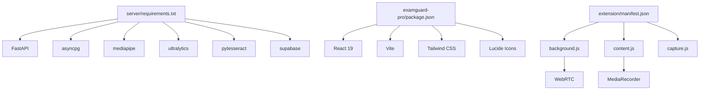

**Diagram sources**
- [server/requirements.txt:1-34](file://server/requirements.txt#L1-L34)
- [examguard-pro/package.json:13-28](file://examguard-pro/package.json#L13-L28)
- [extension/manifest.json:1-73](file://extension/manifest.json#L1-L73)

**Section sources**
- [server/requirements.txt:1-34](file://server/requirements.txt#L1-L34)
- [examguard-pro/package.json:13-28](file://examguard-pro/package.json#L13-L28)
- [extension/manifest.json:1-73](file://extension/manifest.json#L1-L73)

## Performance Considerations
- Vision engines:
  - MediaPipe Tasks API preferred; fallback to Haar cascades for environments without the Tasks model
  - YOLO inference throttled to ~10 FPS to maintain stability
  - CLAHE preprocessing improves low-light detection
- OCR:
  - Tesseract path configured for Windows; fallback mode when unavailable
- Transformer models:
  - CUDA-capable device preferred; otherwise CPU inference
  - Tokenizers loaded from checkpoints to avoid dynamic vocab generation overhead
- Extension:
  - MediaRecorder configured for VP8 and moderate bitrate to balance quality and bandwidth
  - WebRTC ICE candidates and SDP exchange for efficient streaming
- Backend:
  - Matplotlib backend set to Agg to avoid GUI/X11 issues in containers
  - SPA fallback ensures efficient asset serving

[No sources needed since this section provides general guidance]

## Troubleshooting Guide
- Missing Tesseract:
  - Symptom: OCR returns a warning and zero risk
  - Resolution: Install Tesseract and configure the path
- MediaPipe Tasks model download failure:
  - Symptom: Falls back to Haar cascade
  - Resolution: Ensure network access and disk space for model download
- YOLO model not found:
  - Symptom: Object detection disabled
  - Resolution: Place the YOLO weights file at the expected path
- Supabase credentials missing:
  - Symptom: Warning printed and client remains None
  - Resolution: Set SUPABASE_URL and SUPABASE_KEY environment variables
- Render WebSocket timeouts:
  - Symptom: Periodic ping/pong required; heartbeat task scheduled
  - Resolution: Keep Render alive with periodic messages; verify CORS settings

**Section sources**
- [server/services/ocr.py:75-84](file://server/services/ocr.py#L75-L84)
- [server/services/face_detection.py:16-26](file://server/services/face_detection.py#L16-L26)
- [server/services/object_detection.py:23-26](file://server/services/object_detection.py#L23-L26)
- [server/supabase_client.py:12-17](file://server/supabase_client.py#L12-L17)
- [server/main.py:134-137](file://server/main.py#L134-L137)

## Conclusion
ExamGuard Pro leverages a modern, modular stack combining FastAPI, React 19, and a Chrome extension to deliver a comprehensive proctoring solution. Backend services integrate MediaPipe, YOLO, Tesseract, and custom Transformers for robust AI/ML capabilities. The system is containerized and deployable on Render with environment-driven configuration for Supabase and PostgreSQL. The architecture balances performance, scalability, and developer experience across frontend, backend, and extension layers.